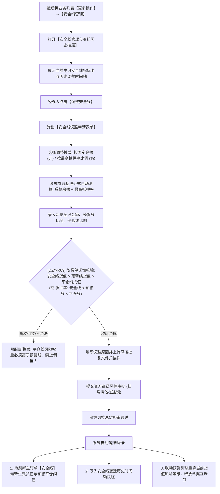

# 安全线管理主PRD

> **文档层级**：核心主 PRD（SSOT 真源）  
> **所属模块**：03-融资监管 / 07-抵质押业务-抵质押业务管理  
> **功能定位**：订单级质押风险红线设定 · 预警线/平仓线阶梯控制 · 动态风控安全货值测算引擎  
> **版本**：V1.0 定稿版 | **更新时间**：2026-09-11 | **责任人**：产品团队

---

## 1. 业务背景与业务目标

### 1.1 业务背景
在存货抵质押融资监管中，“安全线”是金融机构确保信贷资金安全的生命线。当大宗商品市场价格波动导致在押存货价值下跌时，若总货值跌破安全线，抵押率将突破约定的风险敞口，直接威胁资金安全。系统需要支持针对单个抵质押订单查看当前生效的安全线、预警线、平仓线，并在市场波动或授信调整时，经资方严格风控审批后进行动态调整。

### 1.2 业务目标
1. **多级阶梯风险防线**：构建“安全线（基准货值） $\rightarrow$ 预警线（补仓缓冲） $\rightarrow$ 平仓线（质权实现）”三道阶梯防线；
2. **科学测算模型**：支持固定金额调整与比例测算联动，基准公式为 $\text{基准安全货值} = \text{贷款余额} \div \text{最高质押率}$；
3. **调整留痕与热生效**：安全线调整需经过资方高级风控审批，审批通过后热刷新订单安全线指标，并驱动 02/02 预警中心实时比对。

---

## 2. 总体架构与业务流转图

---

## 3. 页面功能说明与界面骨架

### 3.1 安全线管理抽屉 (Drawer)
1. **顶部指标看板卡片**：
   * 当前在押货物总估值、当前贷款余额、当前实时抵质押率；
   * **当前生效安全线总货值**（元）、**当前预警线**（% 或 元）、**当前平仓线**（% 或 元）；
   * 安全垫状态（如：`安全货值盈余 ￥2,800,000.00，抵押率处于绿区安全范围`）。
2. **操作区**：
   * `[ 调整安全线 ]`：弹出调整表单弹窗。
3. **安全线变迁历史时间轴**：
   * 记录每一次调整的变更时间、审批单号、调整前安全线、调整后安全线、操作人、审批批复文件。

### 3.2 调整安全线弹窗 (Modal)
* **调整模式选择**：单选 `按固定货值金额 (元)` 或 `按最高质押率联动比例 (%)`；
* **基准测算参考**：系统自动提示 $\text{建议基准货值} = \text{贷款余额} \div \text{最高抵押率}$；
* **调整后安全线货值**（必填金额）；
* **调整后预警线比例**（必填百分比，如 `70.00%`）；
* **调整后平仓线比例**（必填百分比，如 `75.00%`）；
* **调整原因**（必填下拉：`市场行情剧烈波动`、`借款人追加保证金`、`授信额度调降`、`资方风控政策收紧`）；
* **风控批复文件**（必传附件，PDF/JPG/PNG，单个 $\le 20\text{MB}$）；
* **调整情况陈述**（必填文本，$\ge 10$ 且 $\le 200$ 字符）。

---

## 4. 关联三件套索引

* **字段清单**：[安全线管理字段清单.md](./安全线管理字段清单.md)
* **业务规则规格**：[安全线管理业务规则规格.md](./安全线管理业务规则规格.md)
