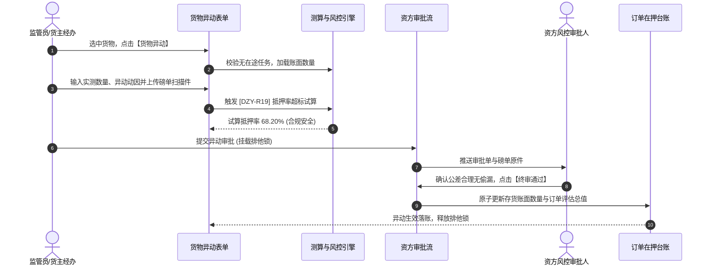

# 货物异动业务规则规格

> **适用功能**：抵质押业务管理 · 19-货物异动  
> **版本**：V1.0 定稿版 | **更新时间**：2026-09-11 | **责任人**：风控策略团队

---

## 1. 业务规则 (Business Rules)

### 1.1 [DZY-R19] 异动调减与抵押率超标联动校验
当异动调整导致在押存货净减少时，系统实时根据最新评估单价测算调整后的订单总货值与新抵押率：
- 若新抵押率未突破约定的【最高抵质押率】：正常流转资方审批；
- 若新抵押率突破最高质押率或触及预警线：系统在表单高亮红色告警，且提交后强制路由至资方高级风控总监特批，并提示借款人准备加补仓。

### 1.2 [DZY-R19a] 排他在途锁与原子落账
提交异动申请瞬间施加单据排他在途锁，审批通过前冻结该批货物的出库与置换；终审批准后原子扣减账面数量并更新在押明细。

---

## 2. 货物异动交互时序图

