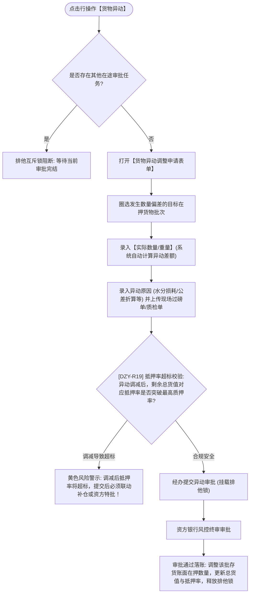

# 货物异动主PRD

> **版本**：V1.0 | 2026-09-11  
> **所属模块**：03-融资监管 / 07-抵质押业务-抵质押业务管理 / 19-货物异动  
> **入口路径**：  
> • PC 端：`融资监管 → 抵质押业务 → 抵质押业务管理 → 行操作【更多操作 ▾】→ 【货物异动】`  
> • H5 移动端：`抵押/质押列表卡片 → 【更多操作】抽屉 → 【货物异动】`  
> **配套文档**：[货物异动字段清单](./货物异动字段清单.md) · [货物异动业务规则规格](./货物异动业务规则规格.md)

---

## 1. 业务背景与功能定位

动产抵质押监管存续期内，因大宗商品天然属性（如水分挥发、自然氧化损耗、运输称重公差）或现场不可抗力，可能发生实际在库数量与系统账面数量产生微幅偏差。**【货物异动】**功能为现场监管员与货主企业提供标准化的数量调整申报渠道。页面提示“当货物与实际不符时，可通过申请变动调整货物实际数量”，输入实际测量数、差额及异动原因，并强制上传磅单或检验凭证，经资方风控审批通过后核准调整账面台账，防止账实悬空。

---

## 2. 业务全景流转架构

---

## 3. 页面功能说明与界面骨架

### 3.1 货物异动表单骨架
1. **警示提示栏**：`ℹ️ 温馨提示：当货物因自然损耗、水分散失或称重公差导致账实不符时，可通过本申请调整实际在押数量。敏感调整须经资方风控终审确认。`；
2. **异动货物选择**：目标存货识别码、品名规格、所在货位、当前账面在押数量（只读）；
3. **调整测算**：
   - **实际数量/重量**（必填数字，3 位小数）；
   - **异动差额**（系统只读自动算：$\text{实际数} - \text{账面数}$，负数高亮警示）；
   - **调整后订单预计抵押率**（系统动态试算）；
4. **证明材料**：异动动因分类（自然损耗/复磅公差/事故受损）、原因陈述（$\ge 10$ 字）、现场过磅单或第三方检验报告原件上传。
