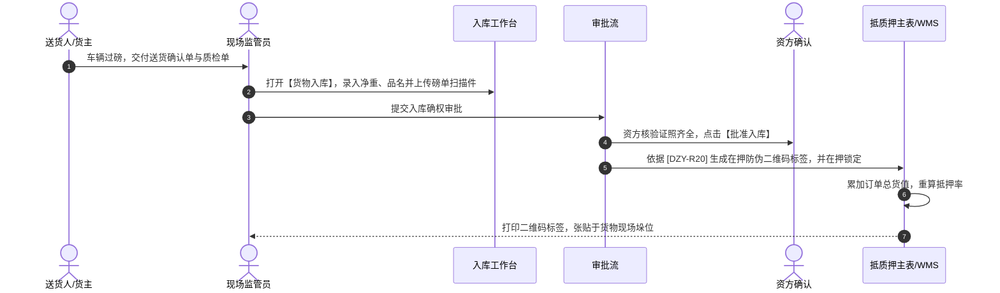

# 货物入库（抵质押入库）业务规则规格

> **适用功能**：抵质押业务管理 · 20-抵质押入库 (货物入库)  
> **版本**：V1.0 定稿版 | **更新时间**：2026-09-11 | **责任人**：仓储与质权确权团队

---

## 1. 业务规则 (Business Rules)

### 1.1 [DZY-R20] 赋码确权与在押锁定原子落账
入库审核通过瞬间，系统触发以下原子事务：
1. 自动为每个货位上的存货生成全局唯一资产码（如 `CH-20260911-01`）与加密防伪二维码；
2. 货物状态直接标记为【已在押锁定】，禁止任何未经审批的移位或领料；
3. 将入库总货值累加至主订单【货物评估价值总额】，并自动联动压降订单抵质押率。

---

## 2. 货物入库交互时序图

