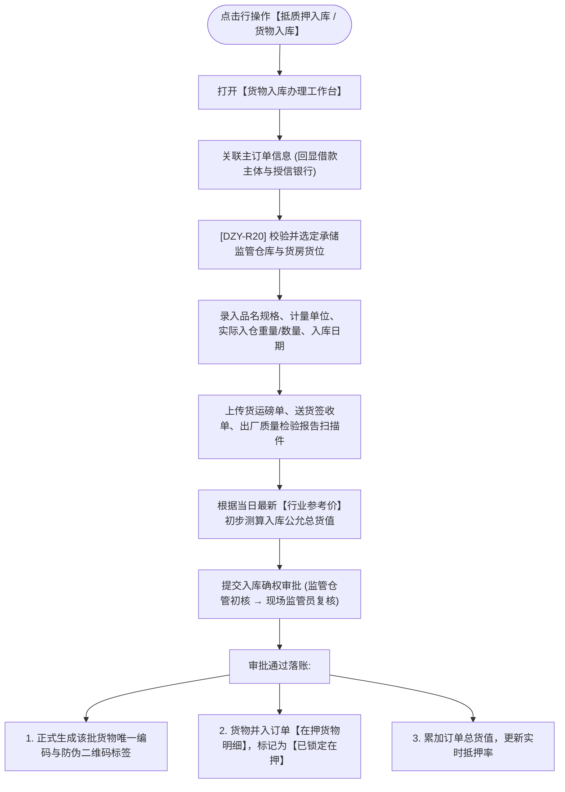

# 货物入库（抵质押入库）主PRD

> **版本**：V1.0 | 2026-09-11  
> **所属模块**：03-融资监管 / 07-抵质押业务-抵质押业务管理 / 20-抵质押入库  
> **入口路径**：  
> • PC 端：`融资监管 → 抵质押业务 → 抵质押业务管理 → 行操作【更多操作 ▾】→ 【抵质押入库】(展示为【货物入库】)`  
> • H5 移动端：`抵押/质押列表卡片 → 【更多操作】抽屉 → 【抵/质押入库】`  
> **配套文档**：[货物入库字段清单](./货物入库字段清单.md) · [货物入库业务规则规格](./货物入库业务规则规格.md)

---

## 1. 业务背景与功能定位

**【抵质押入库】**（实操场景文案常称【货物入库】）是质押在押资产建立法定控货与物理交割的入口环节。货主企业将大宗存货运输进入指定监管仓库后，监管员在系统中核验送货运单、地磅单、质检单，录入品名规格、实际入库数量、堆放库房货位，自动为每一件/垛货物生成全局唯一的【存货在押防伪二维码】，并完成物理锁定，为后续出具仓单、抵押确权与放款奠定资产基石。

---

## 2. 业务全景流转架构

---

## 3. 页面功能说明与界面骨架

### 3.1 货物入库表单骨架
1. **关联订单概况**：订单编号、借款主体全称、质权银行名称；
2. **入仓基本属性**：
   - 入库仓库全称（下拉选择授权仓库）；
   - 存放库房与货位编号（必填，如 `A-01-01`）；
   - 入库起息日期（日期选择）；
3. **入库货物明细录入**：
   - 品名、规格、材质牌号（必填文本）；
   - 入库重量/数量（必填数字，3位小数）；
   - 包装规格与件数；
   - 系统自动匹配行业参考价，计算整批入库总货值；
4. **单据凭证上传**：
   - 现场地磅单扫描件（必传）；
   - 货主送货确认单原件扫描件（必传）。
