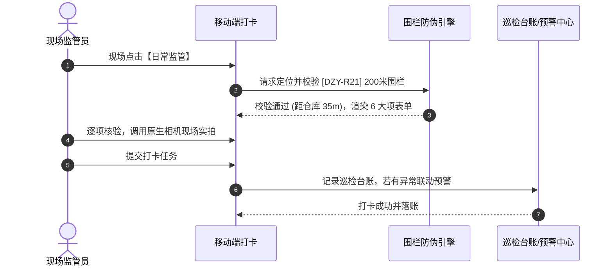

# 日常监管业务规则规格

> **适用功能**：抵质押业务管理 · 21-日常监管  
> **版本**：V1.0 定稿版 | **更新时间**：2026-09-11 | **责任人**：现场合规团队

---

## 1. 业务规则 (Business Rules)

### 1.1 [DZY-R21] GPS 电子围栏 200 米强校验
监管员打卡时获取物理经纬度与仓库中心点坐标，直线距离测算必须 $\le 200$ 米；超出 200 米强阻断打卡并弹窗警告，严禁脱岗虚假巡检。

### 1.2 [DZY-R21a] 原生硬件相机调用与时空水印
禁止从手机相册选取旧图，必须调用原生相机现场实拍；照片底层自动压印不可篡改的精确时间戳、GPS 坐标、仓库名称与工号水印。

### 1.3 [DZY-R21b] 巡检异常联动 02/02 押品预警
6 大项 Checklist 中只要存在 1 项异常，系统强制将综合结论置为【巡检异常】，并自动向 02/02 预警中心生成押品巡检告警流水，主订单点亮红标。

---

## 2. 日常监管交互时序图

