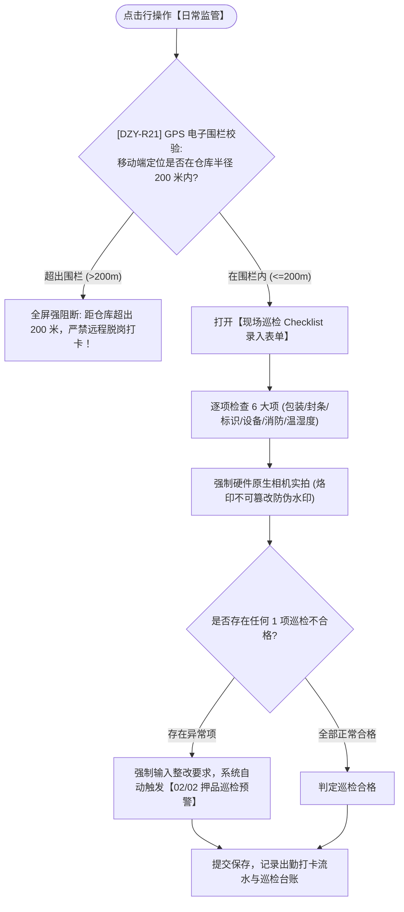

# 日常监管主PRD

> **版本**：V1.0 | 2026-09-11  
> **所属模块**：03-融资监管 / 07-抵质押业务-抵质押业务管理 / 21-日常监管  
> **入口路径**：  
> • PC 端：`融资监管 → 抵质押业务 → 抵质押业务管理 → 行操作【更多操作 ▾】→ 【日常监管】`  
> • H5 移动端：`抵押/质押列表卡片 → 【日常监管】`  
> **配套文档**：[日常监管字段清单](./日常监管字段清单.md) · [日常监管业务规则规格](./日常监管业务规则规格.md)

---

## 1. 业务背景与功能定位

**【日常监管】**功能是现场监管员在岗履职的核心操作入口。严格落地防伪三大铁律：调用移动底层 GPS 芯片强校验 $\le 200$ 米电子围栏、强制调用系统硬件原生相机禁用本地相册、自动在像素图层烙印包含时间戳/经纬度/仓库名/账号的时空防伪水印，并逐一核验 6 大项标准 Checklist（包装/封条/标识/IoT/消防/温湿度），异常项自动触发押品巡检预警。

---

## 2. 业务全景流转架构

---

## 3. 页面功能说明与界面骨架

### 3.1 巡检打卡表单骨架
1. **围栏状态条**：仓库坐标、当前手机经纬度、直线距离测算（绿色合规 / 红色超距）；
2. **6 大项标准核验表单**：
   - 包装完整性、封签封条、标识标牌、IoT 运行、消防通道、温湿度实测录入；
3. **现场防伪实拍图集**：直接调用原生相机拍摄实况照，每项至少 1 张；
4. **结论与提交**：综合巡检结论、异常说明输入框、监管员电子签名。
