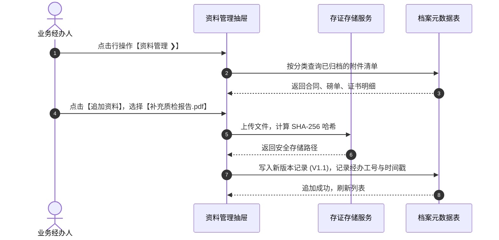

# 资料管理业务规则规格

> **适用功能**：抵质押业务管理 · 22-资料管理  
> **版本**：V1.0 定稿版 | **更新时间**：2026-09-11 | **责任人**：合规架构团队

---

## 1. 业务规则 (Business Rules)

### 1.1 [DZY-R22] 版本不可逆追加机制 (Append-Only Versioning)
为维护金融担保法律证据链的严肃性，系统内所有归档的合同与业务单据**严禁直接物理删除或就地修改**。用户如需纠偏或补充材料，必须通过【追加版本】（如 `V1.1`），系统保存完整新老版本链路。

### 1.2 [DZY-R22a] 在线安全只读预览防泄密
在客户端在线预览 PDF 或图片格式时，系统自动动态压印当前登录用户姓名、工号、当前查看时间的半透明斜向水印，防范截屏泄密。

---

## 2. 资料管理交互时序图

