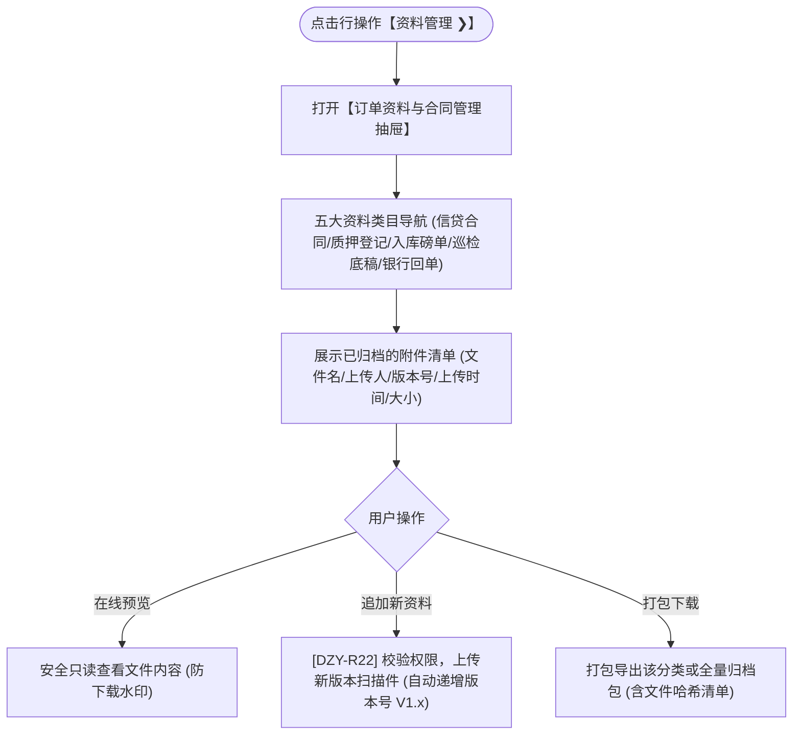

# 资料管理主PRD

> **版本**：V1.0 | 2026-09-11  
> **所属模块**：03-融资监管 / 07-抵质押业务-抵质押业务管理 / 22-资料管理  
> **入口路径**：  
> • PC 端：`融资监管 → 抵质押业务 → 抵质押业务管理 → 行操作【更多操作 ▾】→ 【资料管理 ❯】`  
> • H5 移动端：`抵押/质押列表卡片 → 【更多操作】抽屉 → 【资料管理】`  
> **配套文档**：[资料管理字段清单](./资料管理字段清单.md) · [资料管理业务规则规格](./资料管理业务规则规格.md)

---

## 1. 业务背景与功能定位

动产质押与供应链金融监管业务链条长、涉企合同与凭据繁多。**【资料管理】**功能为订单提供集约化的电子档案库。分类归档信贷主合同、质押担保协议、中仓登登记证书、货运磅单、质检报告、日常巡库双签底稿、银行放款借据及结清证明，支持版本追加、在线预览、批量打包下载及数字签名验真，满足司法存证全链路可溯。

---

## 2. 业务全景流转架构

---

## 3. 页面功能说明与界面骨架

### 3.1 资料管理抽屉骨架
1. **分类侧边栏/Tab**：
   - ① 主合同与协议（借款合同、监管协议）；
   - ② 权属与注销登记（中仓登动产质押登记书、注销证明）；
   - ③ 物流与质检凭据（地磅单、质检单、送货回单）；
   - ④ 巡检与监管报告（定期盘点报告、巡检打卡底稿）；
   - ⑤ 资金与还款凭证（银行借据、还款流水回执、结清函）。
2. **操作与清单**：右上角 `[ + 追加资料附件 ]`、`[ 批量打包下载 ]`，列表展示文件名、类目、上传时间、操作项（`[预览]`、`[下载]`、`[版本历史]`）。
