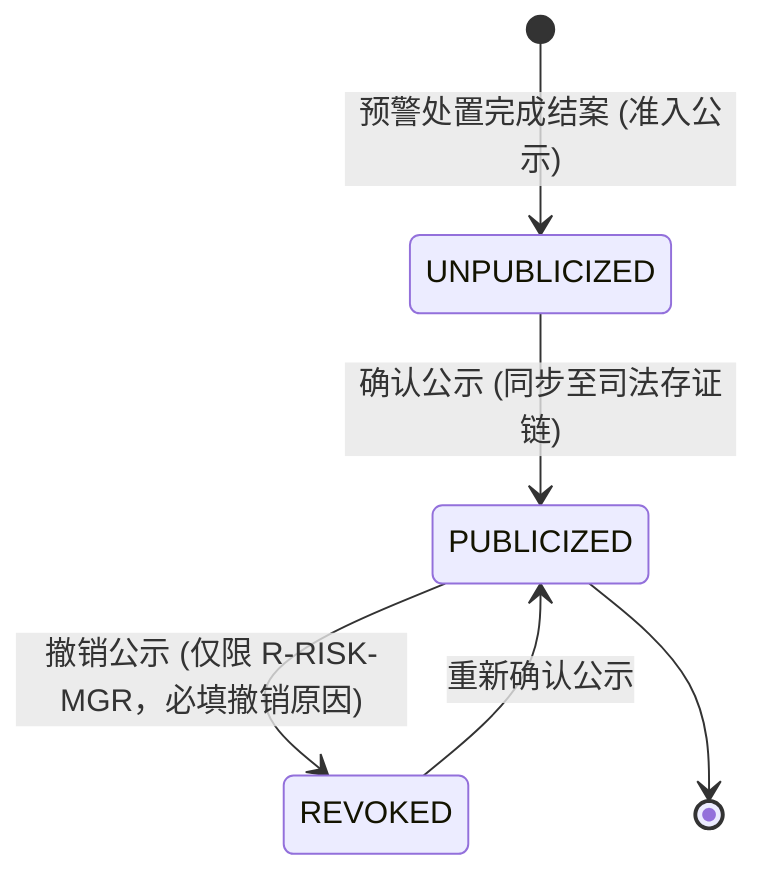
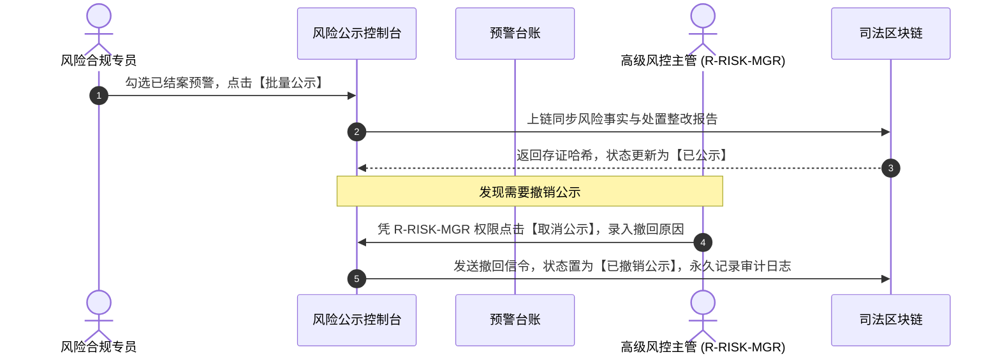

# 风险公示业务规则规格

> **适用功能**：抵质押业务管理 · 23-风险公示  
> **版本**：V1.0 定稿版 | **更新时间**：2026-09-11 | **责任人**：合规与法务团队

---

## 1. 状态机模型与流转表

---

## 2. 核心业务规则 (Business Rules)

### 2.1 [DZY-R23] 仅限已结案风险事件准入公示 (Resolved-Only Guard)
严禁对未结案、处于核查中的在途预警发起对外公示，防止因事实不清对借款企业商誉造成侵权。

### 2.2 [DZY-R23a] 取消公示权限与审计留痕 (Revocation Audit)
取消公示仅对具备 `R-RISK-MGR` 角色用户开放；弹窗强制录入 $\ge 10$ 字撤回原因；撤销前后数据快照写入不可变存证链。

---

## 3. 风险公示交互时序图

