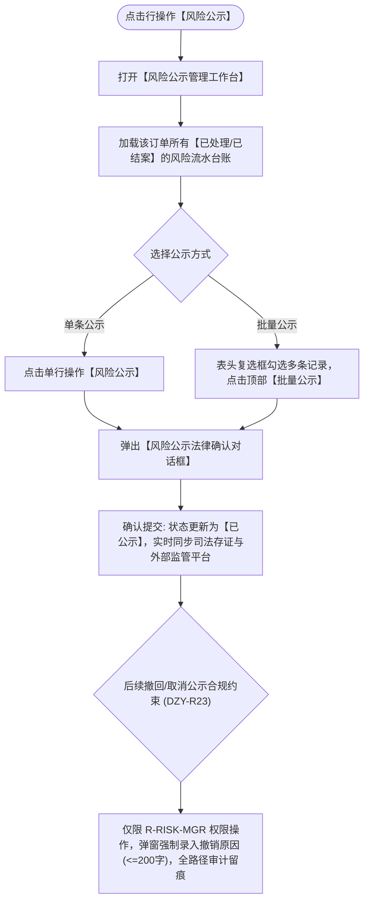

# 风险公示主PRD

> **版本**：V1.0 | 2026-09-11  
> **所属模块**：03-融资监管 / 07-抵质押业务-抵质押业务管理 / 23-风险公示  
> **入口路径**：  
> • PC 端：`融资监管 → 抵质押业务 → 抵质押业务管理 → 行操作【更多操作 ▾】→ 【风险公示】`  
> • H5 移动端：`抵押/质押列表卡片 → 【更多操作】抽屉 → 【风险公示】`  
> **配套文档**：[风险公示字段清单](./风险公示字段清单.md) · [风险公示业务规则规格](./风险公示业务规则规格.md)

---

## 1. 业务背景与功能定位

**【风险公示】**功能是动产抵质押融资监管中面向监管方、司法区块链及外部征信平台合规信息披露的法定操作入口。仅允许对**已处置结案（已闭环解除）**的重大风险事件（如严重跌价、盘亏核销、异常移库）发起单条或批量对外公示披露；若存在公示差错需要撤销，系统具备极其严格的权限控制，仅限高级风控主管（`R-RISK-MGR`）操作并强制录入撤销理由。

---

## 2. 业务全景流转架构

---

## 3. 页面功能说明与界面骨架

### 3.1 风险公示工作台骨架
1. **顶部控制条**：批量公示按钮 `[ 批量公示 (已选 N 条) ]`；
2. **已结案风险列表**：复选框、预警流水号、预警类型、严重级别、触发时间、处置完成时间、处置结果描述、**公示状态**（`未公示` / `已公示`）；
3. **行操作**：
   - 未公示行：展示 `[ 风险公示 ]` 按钮；
   - 已公示行：展示 `[ 取消公示 ]` 按钮（仅高权限可见）；
4. **取消公示弹窗**：展示风险编号，强制录入撤销理由文本域（必填 $\ge 10$ 字）。
