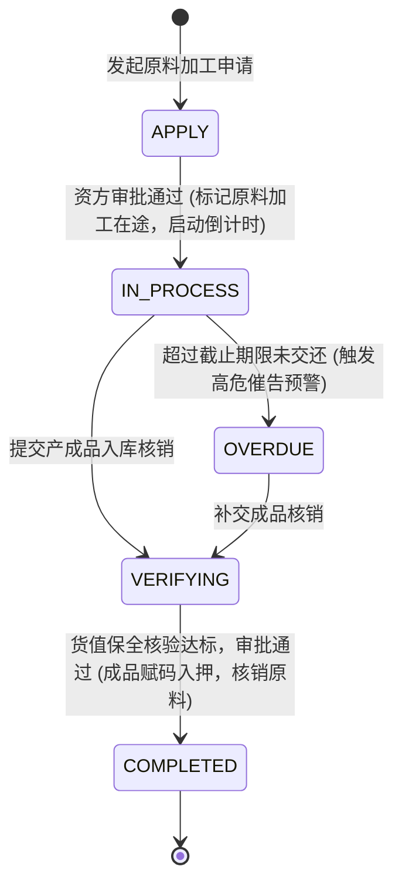
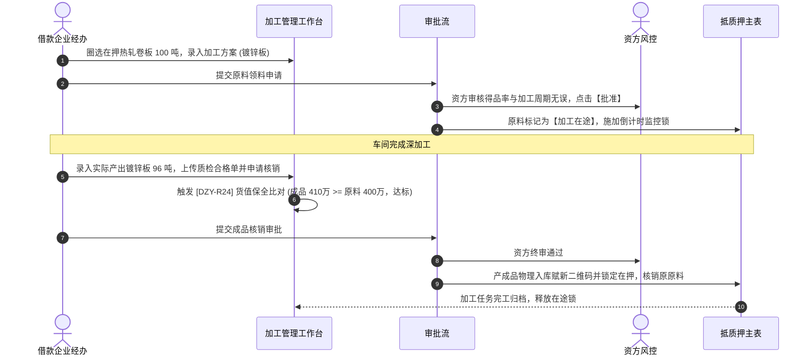

# 加工管理业务规则规格

> **适用功能**：抵质押业务管理 · 24-加工管理  
> **版本**：V1.0 定稿版 | **更新时间**：2026-09-11 | **责任人**：风控与大宗商品业务团队

---

## 1. 状态机模型与流转表

---

## 2. 核心业务规则 (Business Rules)

### 2.1 [DZY-R24] 产成品货值保全强阻断红线 (Value Conservation Guard)
核销入库时，系统强制比对：
$$\text{新产成品公允总估值} \ge \text{原领用原材料抵押货值}$$
若由于废品率超标或行情暴跌导致 $\text{成品总值} < \text{原材料账面值}$，系统触发强阻断拦截，要求借款人必须以现金归还差额部分贷款，或向仓库追加等额合法质物，否则严禁核销领料单据。

### 2.2 [DZY-R24a] 加工期限倒计时监控
加工在途默认期限 $\le 15$ 天；系统设立 T-3 天黄色预警与逾期红色严重报警，防止质押原料被借款企业在车间私自倒卖。

---

## 3. 加工管理交互时序图

