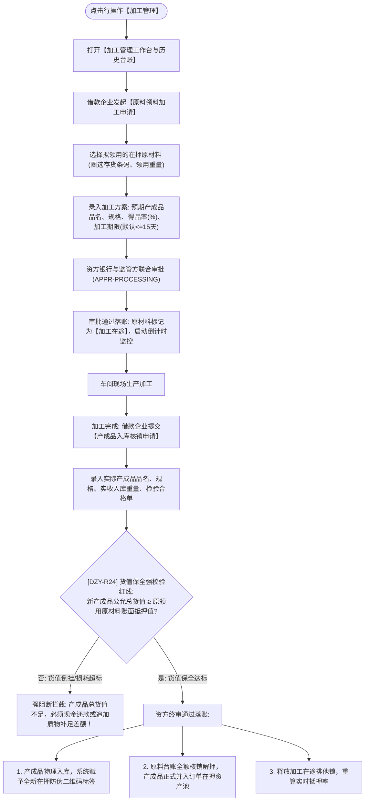

# 加工管理主PRD

> **版本**：V1.0 | 2026-09-11  
> **所属模块**：03-融资监管 / 07-抵质押业务-抵质押业务管理 / 24-加工管理  
> **入口路径**：  
> • PC 端：`融资监管 → 抵质押业务 → 抵质押业务管理 → 行操作【更多操作 ▾】→ 【加工管理】`  
> • H5 移动端：`抵押/质押列表卡片 → 【更多操作】抽屉 → 【加工管理】`  
> **配套文档**：[加工管理字段清单](./加工管理字段清单.md) · [加工管理业务规则规格](./加工管理业务规则规格.md)

---

## 1. 业务背景与功能定位

大宗商品供应链金融中，借款企业常为实体制造或深加工企业（如钢材剪切加工、铜线拉丝、铝棒挤压）。在押原材料在监管期内需要领出投入生产加工。为防止质押资产脱管空仓或货值贬损，系统推出**【加工管理】**全闭环功能：贯穿“原料领用申报 $\rightarrow$ 加工方案与得品率审核 $\rightarrow$ 在押原料标记加工在途与倒计时监控 $\rightarrow$ 产成品二次验收入库 $\rightarrow$ 货值保全红线强校验 $\rightarrow$ 原料核销与成品赋码并入在押资产包”，保障信贷质押物权全程不断档。

---

## 2. 业务全景流转架构

---

## 3. 页面功能说明与界面骨架

### 3.1 加工管理工作台骨架
1. **在押与在途概况卡片**：在押总货值、当前加工在途批次、预计回仓货值；
2. **两阶段操作入口**：`[ + 发起原料加工申请 ]`、`[ 产成品入库核销 ]`；
3. **加工任务跟踪列表**：加工单号、领用原料（品名/数量/货值）、预期成品、加工期限倒计时（红黄预警）、状态（加工在途/已完工核销/逾期未归还）、操作项（`[去核销]`、`[详情]`）。
