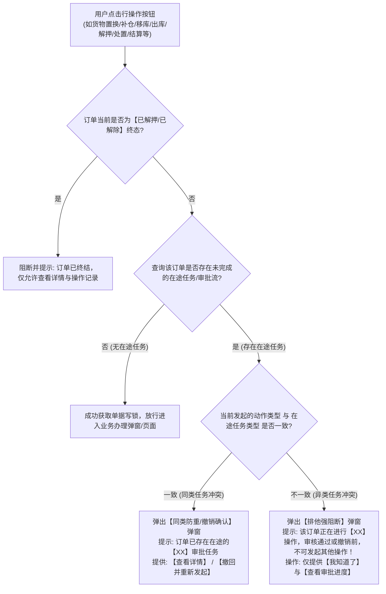

# 01 - 流程发起互斥锁与全生命周期数据变更矩阵

> **归档位置**：`02-PRD文档/🌟🌟🌟-最新基准版/B端PC/03-融资监管/07-抵质押业务-抵质押业务管理/采集的资料/`  
> **模块定位**：抵质押业务管理 · 单据级并发控制与审批生命周期核心规范  
> **核心使命**：杜绝一货多办、资产状态撕裂与数据倒挂，保障资金、货权与物联设备强一致性。

---

## 1. 单据级排他互斥锁机制 (Exclusive Mutex Lock)

在押资产流转涉及核心货权变更与物联监控换绑。系统在订单行发起任何业务操作时，必须强校验该订单是否存在**未完结的在途任务**。

### 1.1 互斥锁总体判定流程图



### 1.2 互斥锁拦截交互规范

#### 1) 跨类排他强阻断弹窗 (Cross-Operation Block Modal)
* **触发场景**：订单已有【移库】审批在途，操作人点击【货物出库】或【货物置换】等其他操作。
* **弹窗 UI 结构**：
  ```
  +--------------------------------------------------------+
  |  提示                                              [X] |
  +--------------------------------------------------------+
  |  ⚠️ 该订单正在进行【货物移库】操作，在当前操作审核通过      |
  |     或终止前，不可发起其他操作业务！                     |
  |                                                        |
  |  在途任务单号：APPR-20260911-0089                       |
  |  发起人：张伟 (现场监管员)  发起时间：2026-09-11 10:15     |
  +--------------------------------------------------------+
  |                 [查看审批进度]    [我知道了]           |
  +--------------------------------------------------------+
  ```
* **拦截逻辑**：后端接口直接抛出 `ORDER_IN_OPERATION_MUTEX_ERROR`，前端统一捕获渲染此 Modal，不可绕过。

#### 2) 同类任务防重与撤回弹窗 (Same-Operation Conflict Modal)
* **触发场景**：订单已有待审批的【加/补仓】申请，操作人再次点击【加/补仓】。
* **弹窗 UI 结构**：
  ```
  +--------------------------------------------------------+
  |  在途任务提示                                      [X] |
  +--------------------------------------------------------+
  |  该订单已有待处理的【加/补仓】申请，请勿重复提交！           |
  |                                                        |
  |  当前审批状态：银行客户经理审批中                        |
  |  若需修改补仓货物，请先撤回原申请。                     |
  +--------------------------------------------------------+
  |                 [撤回并重新发起]    [查看审批详情]      |
  +--------------------------------------------------------+
  ```
* **撤回权限**：仅允许原发起人或具备 `R-ORDER-ADMIN` 超级权限者操作撤回；撤回后状态置为 `CANCELLED`，订单互斥锁立即释放。

---

## 2. 7 大审批流全生命周期数据变更矩阵

系统支持 7 项需要线上流转审批的核心操作：
1. **货物置换** (REPLACEMENT)
2. **加/补仓** (REPLENISHMENT)
3. **货物出库** (OUTBOUND)
4. **货物移库** (TRANSFER)
5. **解除抵/质押** (RELEASE)
6. **风险处置/平仓** (DISPOSAL)
7. **部分结清/还款** (REPAYMENT)

### 2.1 数据状态变迁对比矩阵

| 操作业务 | 审批发起中（冻结态） | 审批被驳回 / 主动撤回（回滚态） | 审批终审通过（落账态） | 中仓登 1.3.2 接口联动 |
| :--- | :--- | :--- | :--- | :--- |
| **货物置换** | 锁定拟置换老货物（打上出库在途标签，禁止移库/出库）；锁定拟入库新货物（打上在押锁定标签，禁止其他单据选用） | 释放拟置换老货物在途锁；释放拟入库新货物锁定，退回自由可用存货池 | 彻底核销老货物出库（解除抵质押标签）；新货物正式归属该订单；重新计算订单总货值、抵押率 | 调用【仓单/货物权属变更备案】接口更新质物清单 |
| **加/补仓** | 锁定拟补入的新存货/仓单（标记补仓在途，排他占用） | 释放补仓拟入货物，还原为普通可用存货/仓单 | 新货物并入订单资产明细；订单评估货值累加；抵押率相应下降；生成补仓批次记录 | 调用【质物补充/增加备案】接口，上报新增仓单及资产凭据 |
| **货物出库** | 拟出库货物打上【出库申请中】标签，锁定对应数量/二维码，禁止移库与重复出库 | 释放货物出库锁定，恢复在押正常监控状态 | 货物状态由【在押】变为【已出库核销】；扣减订单在押数量与评估总货值；抵押率分子不变、分母变小（重新校验安全线） | 调用【部分解押/货物出库解保】接口，注销或变更仓单码 |
| **货物移库** | 移出货位标记【移库在途】；移入目标货位标记【预占用】；自动调用抓拍相机留存起始位快照 | 解除两端货位临时标记，维持原库位监控绑定不变 | 货物库位物理更新为目标货位；系统自动解绑原货位关联 IoT 设备，绑定新货位 IoT 监控；生成移库记录与存证轨迹 | 调用【仓单存储货位变更备案】接口 |
| **解除抵/质押** | 锁定全单全部货物（禁止任何置换、补仓、出库、移库等并发操作） | 解除全单锁定，恢复在押正常监管状态 | 订单状态更新为【已解除】（终态）；全部在押存货/仓单彻底解除抵质押锁定；全部关联 IoT 监控解绑 | 调用【仓单质权注销/全面解质备案】接口，注销中仓登质押登记 |
| **风险处置/平仓** | 锁定待处置货物；生成处置在途单据；禁止原货主任何操作 | 释放处置锁定，恢复监管风险挂牌状态 | 货物权属正式过户至受让人或处置买受人；所得款项回写充抵贷款余额；核销处置资产 | 调用【司法处置/质物过户清偿备案】接口 |
| **部分结清** | 锁定还款额度，生成还款结算审批流水 | 作废该笔还款流水，贷款余额维持不变 | 扣减系统登记的贷款余额；重新计算订单实时抵押率（抵押率下降）；写入还款结算对账单 | 不涉及物理仓单变更，仅写回资金台账 |

---

## 3. 已解押终态订单的熔断保护规则

当订单通过【解除抵押】、【解除质押】或【全部处置平仓】后，订单状态流转至 **终态 (TERMINATED)**；历史监管订单不提供当前解除写操作：

1. **行操作按钮熔断收缩**：
   * 隐藏所有业务办理类按钮：【货物置换】、【加/补仓】、【货物出库】、【移库】、【解除】、【风险处置】、【结算管理】、【安全线管理】、【货物估值】、【货物盘点】、【设备管理】；
   * 仅保留纯只读操作：**【查看详情】**、**【操作记录】**、**【查看风险】**（只读历史快照）。
2. **IoT 物联监控生命周期终结**：
   * 终审通过生效瞬间，系统自动通知 IoT 边缘网关与中台，解除该订单对库位摄像头、温湿度计、电子围栏的租户级独占订阅；
   * 释放门禁临时通行密码与蓝牙锁授权。
3. **不可变快照司法存证归档**：
   * 终结时刻固化全套资产凭据、历史操作轨迹、视频抓拍切片与各方电子签章协议；
   * 存证哈希写入系统审计链，防止篡改。
