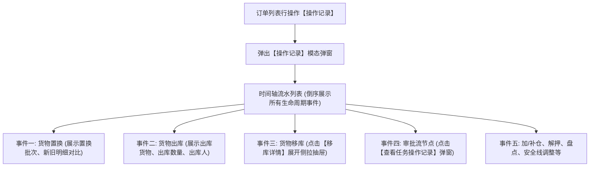

# 03 - 操作记录

> **归档位置**：`02-PRD文档/🌟🌟🌟-最新基准版/B端PC/03-融资监管/07-抵质押业务-抵质押业务管理/采集的资料/`  
> **模块定位**：抵质押业务管理 · 订单行操作【操作记录】详尽规约  
> **核心使命**：提供订单自开立至终结的全生命周期审计日志追踪，还原每一次资产变更的操作人、时间、证据快照与时空存证。

---

## 1. 总体架构与进入路径



---

## 2. 操作记录主弹窗 UI 结构与交互

### 2.1 ASCII 界面原型

```
+------------------------------------------------------------------------------------+
|  操作记录 - 订单号：ZY-20260818-0021                                           [X] |
+------------------------------------------------------------------------------------+
|                                                                                    |
|  ● 2026-09-10 16:30:22  【货物移库】                                                |
|    操作人：李四 (仓储主管)   所属机构：无锡众捷物流园                              |
|    移出货位：A区-01架-02位   ==>   移入货位：A区-03架-01位                         |
|    移库品名：电解铜 (50.000 吨)   移库原因：仓库库位检修维护                       |
|    [查看移库详情]                                                                  |
|    ------------------------------------------------------------------------------  |
|                                                                                    |
|  ● 2026-09-08 11:20:15  【加/补仓审批通过】                                        |
|    操作人：王建国 (风控经理)   所属机构：江苏银行无锡分行                           |
|    审批单号：APPR-20260908-0012   补仓件数：2 件   新增货值：￥1,500,000.00         |
|    [查看任务操作记录]                                                              |
|    ------------------------------------------------------------------------------  |
|                                                                                    |
|  ● 2026-09-05 14:10:00  【货物出库】                                                |
|    操作人：张伟 (现场监管员)   提货人：刘明 (江苏大宗物资有限公司)                  |
|    出库货物：热轧卷板 (100.000 吨)   关联出库单：CK-20260905-003                   |
|    ------------------------------------------------------------------------------  |
|                                                                                    |
|  ● 2026-08-18 09:00:00  【订单开立 / 质押办理生效】                                |
|    操作人：赵敏 (业务经办)   所属机构：江苏银行无锡分行                             |
|    初始质押总值：￥12,800,000.00   初始质押率：65.00%                              |
|                                                                                    |
+------------------------------------------------------------------------------------+
|                                                                         [关 闭]    |
+------------------------------------------------------------------------------------+
```

---

## 3. 各业务事件核心展示字段字典

| 事件类型 | 触发源 | 关键展示字段 | 特殊操作/跳转 |
| :--- | :--- | :--- | :--- |
| **订单开立** | 抵质押业务办理生效 | 操作人、机构、开立时间、初始评估价值、初始质押率、初始货物总件数/重量 | 无 |
| **货物置换** | 置换终审通过 | 操作人、审批单号、置换时间、拟换出货物品名/规格/数量/货值、拟换入货物品名/规格/数量/货值、置换前后订单总货值 | 支持点击展开查看货物明细 |
| **加/补仓** | 补仓终审通过 | 操作人、审批单号、补仓时间、补入品名/件数/重量/补仓货值、补仓后总货值及新抵押率 | 【查看任务操作记录】 |
| **货物出库** | 出库终审通过 | 操作人、提货人、出库时间、出库单号、出库货物明细、出库数量/重量、出库后剩余在押价值 | 无 |
| **货物移库** | 移库终审通过 | 操作人、移库时间、移出仓位、移入仓位、移库数量、移库原因说明 | **【查看移库详情】**（打开抽屉） |
| **解除抵/质押** | 解除终审通过 | 操作人、终审时间、解押原因、解押前贷款余额、中仓登注销备案回执单号 | 无 |
| **风险处置/平仓** | 处置终审通过 | 操作人、受让人/买受方名称、处置变现金额、冲抵贷款金额、处置时间 | 无 |
| **安全线调整** | 调整审批通过 | 操作人、调整时间、原安全线、新安全线、预警线、平仓线、调整依据说明 | 无 |
| **部分结清** | 财务还款录入审核通过 | 操作人、录入时间、还款金额、冲减后贷款余额、还款凭证号 | 无 |
| **货物盘点** | 盘点报告提交完成 | 盘点人、盘点时间、账面数量、实盘数量、盘盈/盘亏情况、现场照片缩略图 | 点击查看盘点报告 |

---

## 4. 关键子弹窗与侧拉抽屉交互规范

### 4.1 【任务操作记录】子弹窗 (审批流履历)
* **设计原则**：清晰展示多级审批节点的流转轨迹，已完成节点标绿高亮，待处理节点展示候选人。
* **ASCII 结构**：
  ```
  +-------------------------------------------------------------+
  |  任务操作记录 - APPR-20260908-0012                      [X] |
  +-------------------------------------------------------------+
  |                                                             |
  |  [✔ 已完成] 发起申请                                        |
  |  操作人：张伟 (现场监管员)   2026-09-08 09:30:12            |
  |  意见：货物已完成现场初验，符合补仓标准，申请入库并补充质押。|
  |                                                             |
  |  [✔ 已完成] 仓库主管核验                                    |
  |  操作人：李四 (仓储主管)   2026-09-08 10:15:40              |
  |  意见：库位已锁定，仓位安全，同意入库。                     |
  |                                                             |
  |  [✔ 已完成] 银行风控终审                                    |
  |  操作人：王建国 (风控经理)   2026-09-08 11:20:15            |
  |  意见：补仓货值测算合规，准予入账并更新质押登记。           |
  |                                                             |
  +-------------------------------------------------------------+
  |                                                  [关 闭]    |
  +-------------------------------------------------------------+
  ```

### 4.2 【移库详情】侧拉时空存证抽屉 (Transfer Trace Drawer)
* **设计原则**：严格还原物理移库现场，包含时空防伪水印与摄像头抓拍对比。
* **核心内容项**：
  1. **基本参数**：移库单号、操作时间、经办人及所属仓储公司；
  2. **货位变迁**：源库位（仓、排、架、位） $\rightarrow$ 目标库位（仓、排、架、位）；
  3. **存证快照比对**：
     * **移库前监控抓拍图**（含摄像头唯一硬件编号、拍摄时间戳、现场货物堆叠形态）；
     * **移库后监控抓拍图**（目标库位对应球机自动转向并抓拍的定位存证图）；
  4. **现场监管签认**：现场监管员与仓库管理员双人手写电子签名板留痕。
