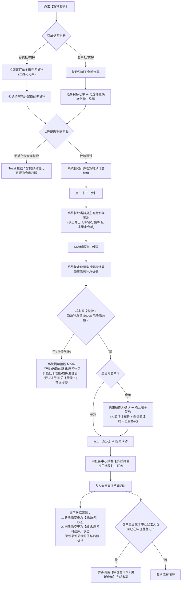

# 04 - 抵质押业务管理 · 货物置换规范

> **所属模块**：融资/监管 / 抵质押业务 / 抵质押业务管理  
> **入口定位**：PC 列表行操作【更多操作 ▾】 ➔ 【货物置换】 / H5 卡片【更多操作】 ➔ 【货物置换】  
> **文档定位**：定义质物置换总体流转架构、存货置换三步流、仓单置换四步流、新旧货值倒挂强阻断、电子签章合规及外部中仓登联动。

---

## 一、 货物置换总体流转架构

货物置换允许出质人在质押履约存续期内，以等值或超值的自由存货换回在押存货（或仓单内货物）。

---

## 二、 核心风控红线与排他拦截

### 1. 经办人仓库数据权限校验（Toast 强拦截）
* 在勾选老货物点击【下一步】时，系统逐条比对当前经办人账号的数据权限；
* **拦截提示**：若勾选了无权限货品，系统立即弹窗阻断：  
  `“您的账号暂无该货物（{品名规格}/{仓库-库房-分区}）仓库权限，请开启该仓库权限后再进行操作”`。

### 2. 新旧货值倒挂强校验（核心风控底线 · 阻断提交）
* **计算公式**：
  $$\text{新抵/质押物总价值} \ge \text{老抵/质押物总价值}$$
* **行情单价取值源**：取值逻辑完全基于当前订单关联总流程中配置的**“定价对象机构”价格行情表**；
* **倒挂阻断弹窗 (Modal)**：
  * **弹窗标题**：`系统提示`
  * **正文文案**：`当前选取的新抵/质押物总价值低于老抵/质押总价值，无法进行抵/质押置换！`
  * **操作按钮**：【我知道了】（禁止提交申请，必须增选新质物直到货值满足要求）。

---

## 三、 分支一：存货货物置换原型与交互（三步走）

### Step 1：选取待解质老货物 (`< 置换抵/质押物`)
* **列表呈现**：系统拉取该订单在押全部存货（按二维码分条展示），展示：品名、规格型号、数量、计量单位、存放货位；
* 每条数据提供 **【查看二维码详情 >】** 链接（查看保质期、生产批次等信息）；
* **多选勾选**：支持复选多条老货物；
* **动态货值显示**：根据勾选货物，实时累加展示：  
  `当前勾选的抵/质押预计价值约为：50000元`；
* 点击【下一步】（触发仓库权限校验）。

### Step 2：选取置换新货物 (`< 置换抵/质押物`)
* **新质物准入池条件**：
  1. 必须属于当前订单的**同一货主**；
  2. 货物物理状态必须处于 **【已入库】** 或 **【部分出库】**；
  3. 必须处于 **【未抵/质押】** 且 **【未绑定仓单】** 状态；
  4. 操作人必须拥有对应仓库数据权限；
* **列表呈现**：按二维码分条列出符合准入条件的新存货，勾选新货物；
* **动态货值展示**：系统动态计算并呈现：  
  `当前勾选的货物预计价值约为：52111元`；
* 点击【提交】。

### Step 3：提交结果页 (`< 抵/质押物置换申请提交结果`)
* 若新货值 $\ge$ 老货值，系统提交成功，展示成功插画与文案：`抵/质押物置换申请提交成功！`；
* 自动派发任务中心子流程，订单上排他互斥锁。

---

## 四、 分支二：仓单货物置换原型与交互（四步走）

### Step 1：选择原仓单与待置换货物
* 提供下拉框：`请选择仓单：[下拉选择订单下仓单]` + 【查询】按钮；
* 查询出该仓单项下的货物二维码明细列表，勾选需要置换的老货物；
* 底部动态展示老货物预计价值；点击【下一步】。

### Step 2：选取同仓可用新货物
* **选货准入池**：根据所选仓单所在仓库，系统仅筛选出该仓单存货人在此**同一仓库**下，状态为【已入库/部分出库】且【未绑定仓单】的存货；
* 勾选新货物二维码，系统展示新货物总价值；点击【下一步】。

### Step 3：货主经办人信息确认与合规电子签章 (`< 置换抵/质押物`)
* **货主与经办人信息档案**：
  * 企业货主：展示企业名称、统一社会信用代码、经办人姓名、手机号、身份证；
  * **【更换经办人】**：支持点击更换经办人，录入新经办人三要素（置换成功后仓单档案中的经办人信息联动覆写）；
  * 个人货主：展示姓名、手机号、身份证；
* **置换货证明细比对**：卡片式对照列出【被置换货物信息】与【新置换货物信息】；
* **合规电子签章模块（法律存证级）**：
  * `*签约方式`：线上；
  * `*人脸识别`：**强制调用活体人脸识别采集核验**；
  * `*短信验证码`：下发验证码并录入校验；
  * `协议勾选`：☑ `已阅读并同意《CD53531534545412112》`（本次置换新质物的仓单合同）；
  * **合同文本动态变更与签章**：
    * 文本域 **位置 6 变更为新置换货物的明细内容**，其他文本域内容不变；
    * 签名域：存货人、持有人盖章位系统自动加盖货主电子公章/个人签名。

### Step 4：终审落账与中仓登备案更新
* 审批通过后，若仓单所在仓库为中仓登准入仓且原单在中仓登登记成功，系统自动调用 **中仓登 1.3.2 接口** 更新备案。
