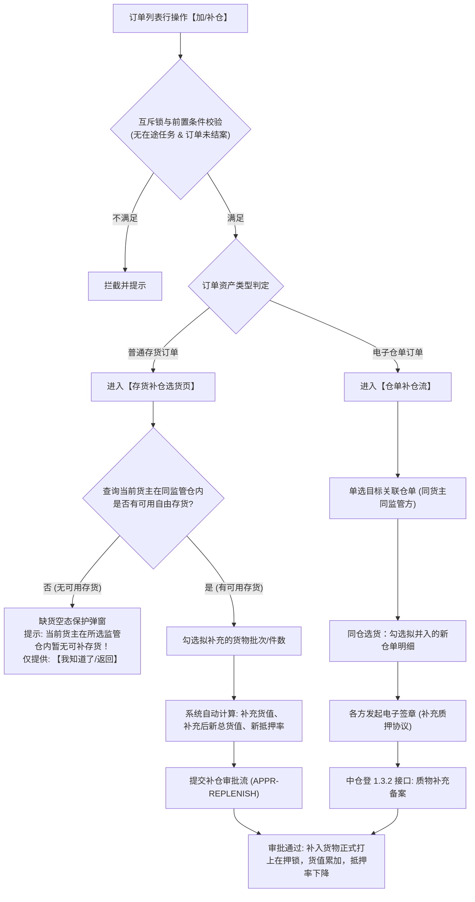

# 05 - 加/补仓 (货物补仓)

> **归档位置**：`02-PRD文档/🌟🌟🌟-最新基准版/B端PC/03-融资监管/07-抵质押业务-抵质押业务管理/采集的资料/`  
> **模块定位**：抵质押业务管理 · 订单行操作【加/补仓】详尽规约  
> **核心使命**：支持在押存货价值跌破预警线/安全线或客户主动增信时，补充新存货或新电子仓单并入在押池，提升总评估货值，压降风险质押率。

---

## 1. 总体业务流程图



---

## 2. 存货补仓流程与界面原型

### 2.1 存货补仓操作步骤
1. **核验资格**：订单当前抵押率大于等于预警线（或主动增信）；
2. **选择存货**：列表仅拉取属于**同一借款主体/货主**且存储在**同一监管仓库**的“自由在库、未抵押、无查封”的合规普通存货；
3. **录入补仓数量**：支持整批勾选或部分数量录入；
4. **动态货值预演**：
   $$\text{新抵押率} = \frac{\text{当前贷款余额}}{\text{原货物总估值} + \text{本次补充货物总估值}} \times 100\%$$
   若新抵押率仍处于平仓线或警戒线以上，给予黄色风险提示，但不阻断提交；
5. **审批生效**：终审通过后，所选存货打上【在押】标记，生成补仓批次。

### 2.2 缺货空态保护弹窗 (Empty Inventory Guard Modal)
* **设计意图**：防止用户盲目进入空白页面导致误解。
* **ASCII 结构**：
  ```
  +-------------------------------------------------------------+
  |  提示                                                   [X] |
  +-------------------------------------------------------------+
  |                                                             |
  |  ⚠️ 当前货主【江苏大宗物资有限公司】在【无锡众捷物流园】内    |
  |     暂无可用于加/补仓的自由在库普通存货！                   |
  |                                                             |
  |  请先指导货主办理货物入库或解押其他存货后再行发起补仓。     |
  |                                                             |
  +-------------------------------------------------------------+
  |                                                  [返 回]    |
  +-------------------------------------------------------------+
  ```

### 2.3 存货补仓表单界面原型

```
+----------------------------------------------------------------------------------------------------+
|  加/补仓办理 - 订单号：ZY-20260818-0021                                                        [X] |
+----------------------------------------------------------------------------------------------------+
|  【当前订单概况】                                                                                  |
|  借款人：江苏大宗物资有限公司   监管仓：无锡众捷物流园   贷款余额：￥8,320,000.00                   |
|  当前货值：￥12,800,000.00   当前抵押率：65.00% (安全线: 70.00%)                                   |
+----------------------------------------------------------------------------------------------------+
|  【选择拟补入存货】 (同货主 · 同仓库 · 自由可用存货)                                              |
|  [ ] 存货编码        品名/规格       仓库货位        可用数量/重量     评估单价       拟补入数量   |
|  [✔] CH-20260901-01  电解铜 A级      A-02-01         30.000 吨        ￥65,000/吨    [ 20.000 ] 吨|
|  [ ] CH-20260901-02  电解铜 A级      A-02-02         50.000 吨        ￥65,000/吨    [ 0.000  ] 吨|
+----------------------------------------------------------------------------------------------------+
|  【补仓效果测算】                                                                                  |
|  本次补充货值：￥1,300,000.00   补仓后预计总货值：￥14,100,000.00   预计新抵押率：59.00% (↓ 6.00%) |
|                                                                                                    |
|  补仓原因说明 (必填，<=200字)：                                                                     |
|  [因大宗商品市场价格轻微波动，货主主动追加质物以维持充裕安全垫。_________________]                 |
|                                                                                                    |
|  现场查验附件：[ + 上传查验报告/货物现场实拍 (支持pdf/jpg/png) ]                                  |
+----------------------------------------------------------------------------------------------------+
|                                                                      [取 消]    [提 交 审 批]      |
+----------------------------------------------------------------------------------------------------+
```

---

## 3. 仓单补仓流程规范 (Warehouse Receipt Replenishment)

仓单补仓具备更严格的物权法律效力：
1. **仓单筛选**：仅能选取“未质押、未冻结、在保有效”且由中仓登已登记确认的标准电子仓单；
2. **同仓约束**：若业务模式为同仓打包质押，系统自动锁定与原订单相同仓储服务商签发的电子仓单；
3. **线上签署补充协议**：
   * 自动生成《质押担保合同补充协议（追加质押物）》；
   * 资方法定代表人/代理人与借款企业通过 CA 机构进行实名刷脸与电子签章；
4. **中仓登同步（1.3.2 接口）**：
   * 审批通过后自动上报 `REPLENISH_PLEDGE_RECEIPT` 报文；
   * 登记成功回写中仓登业务单号，补入仓单状态同步置为【质押中】。

---

## 4. 字段字典与校验规则

| 字段名称 | 字段编码 | 类型 | 必填 | 校验与业务约束 |
| :--- | :--- | :--- | :---: | :--- |
| **本次补充货值** | `replenish_value` | Decimal(16,2) | 是 | 系统根据勾选数量/重量 $\times$ 货物单价自动计算，只读，必须 $> 0$ |
| **预计新总货值** | `new_total_value` | Decimal(16,2) | 是 | 原总估值 + 本次补充货值，只读 |
| **预计新抵押率** | `new_pledge_rate` | Decimal(5,2) | 是 | $(\text{贷款余额} \div \text{新总货值}) \times 100\%$，若大于当前抵押率则强报错拦截 |
| **补仓原因说明** | `replenish_reason`| String | 是 | 文本录入，长度 $1 \sim 200$ 字符 |
| **现场查验附件** | `inspection_files`| Array | 否 | 支持多附件上传，单文件最大 20MB，支持格式：PDF/JPG/PNG |
