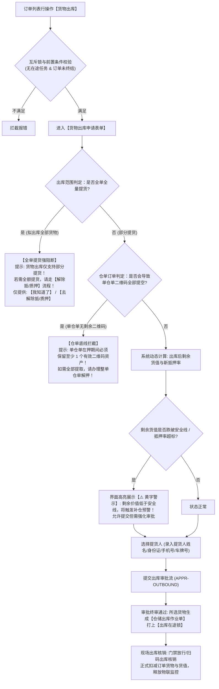

# 06 - 货物出库 (原提货管理)

> **归档位置**：`02-PRD文档/🌟🌟🌟-最新基准版/B端PC/03-融资监管/07-抵质押业务-抵质押业务管理/采集的资料/`  
> **模块定位**：抵质押业务管理 · 订单行操作【货物出库】(历史称“提货”)详尽规约  
> **核心使命**：支持借款主体按偿还贷款进度分批提取部分在押货物，实现资产解控与物理出库的严密风控闭环。

---

## 1. 总体业务流程图



---

## 2. 核心风控红线与拦截机制

### 2.1 全单提货强阻断 (Full Outbound Guard)
* **业务红线**：【货物出库】仅适用于“部分出库”，**绝不允许通过出库将订单全部货物提空**。全额提货在法律上属于抵质押关系终止，必须走规范的【解除抵押】或【解除质押】流程，进行全额还款清偿核验与中仓登解押备案；历史监管订单不提供当前出库或解除写操作。
* **拦截 UI 结构**：
  ```
  +-------------------------------------------------------------+
  |  提示                                                   [X] |
  +-------------------------------------------------------------+
  |                                                             |
  |  ⚠️ 货物出库仅支持部分提取货物！                           |
  |     若本次需提取订单项下全部在押货物，请通过【解除质押】     |
  |     功能办理贷款结清与全面解质手续。                         |
  |                                                             |
  +-------------------------------------------------------------+
  |             [我知道了]    [去办理解除质押]                  |
  +-------------------------------------------------------------+
  ```

### 2.2 单仓单保留至少 1 个二维码底线 (Receipt Residual QR Guard)
* **业务红线**：若订单基于标准电子仓单开立，一张电子仓单对应多个物理二维码资产包时，**单张仓单内必须至少保留 1 个在押二维码**。
* **原因**：若仓单内二维码全部被出库，将导致电子仓单项下物理资产为零，造成仓单“空心化”而产生法律合规风险。

### 2.3 单二维码在途锁机制 (In-Transit QR Lock)
* **锁控制**：一旦某件货物（特定二维码）被纳入审批通过的出库单，系统立即给该二维码加设【出库在途锁】；
* **排他性**：在现场监管员与仓库管理员扫码进行“物理出库核销完成”之前，该二维码严禁参与任何【移库】、【置换】、【补仓】、【平仓处置】或【二次出库】。

---

## 3. 存货出库 vs 仓单出库差异

| 维度 | 普通存货出库 (Inventory Outbound) | 电子仓单出库 (Receipt Outbound) |
| :--- | :--- | :--- |
| **颗粒度** | 支持按件数、重量输入部分提取（如 50 吨提取 10 吨） | 严格按二维码整包提取，不支持单二维码分拆重量 |
| **核销方式** | 扣减在押台账数量，剩余数量继续处于在押状态 | 所选二维码直接注销，仓单清单内标记该二维码【已出库】 |
| **协议变更** | 生成标准出库发货单与监管放行通知书 | 仓单协议项下【质押位置5】状态由“质押”变更为“已出库核销” |
| **中仓登接口** | 调用 1.3.2 质物部分解保备案接口 | 调用 1.3.2 仓单解质核销/部分注销备案接口 |

---

## 4. 界面原型设计 (PC 表单)

```
+----------------------------------------------------------------------------------------------------+
|  货物出库申请 - 订单号：ZY-20260818-0021                                                       [X] |
+----------------------------------------------------------------------------------------------------+
|  【订单概况】                                                                                      |
|  借款主体：江苏大宗物资有限公司   当前总货值：￥12,800,000.00   贷款余额：￥5,000,000.00            |
|  当前抵押率：39.06%   预警安全线：70.00%   当前状态：正常监控中                                    |
+----------------------------------------------------------------------------------------------------+
|  【选择拟出库货物】                                                                                |
|  [ ] 存货编码        品名/规格       所在货位     在押数量/重量     评估单价       拟出库数量      |
|  [✔] CH-20260818-01  电解铜 A级      A-01-01      100.000 吨       ￥64,000/吨    [ 20.000 ] 吨   |
|  [ ] CH-20260818-02  电解铜 A级      A-01-02      100.000 吨       ￥64,000/吨    [  0.000 ] 吨   |
+----------------------------------------------------------------------------------------------------+
|  【出库货值测算】                                                                                  |
|  本次出库货值：￥1,280,000.00                                                                      |
|  出库后剩余货值：￥11,520,000.00                                                                   |
|  出库后预计抵押率：43.40%  (安全垫充足，未突破 70.00% 安全线)                                      |
|  *(注：若预计抵押率超过 70.00%，此处将展示高亮黄字：⚠️ 预计抵押率将突破安全线，需追加保证金或补仓)*|
+----------------------------------------------------------------------------------------------------+
|  【提货信息录入】 (必填)                                                                           |
|  提货人员姓名：[ 张三            ]   提货人身份证号：[ 32028219900101XXXX  ]                       |
|  提货人联系电话：[ 13800000000     ]   提货车辆车牌：[ 苏B·88888             ]                       |
|  计划提货时间：[ 2026-09-12 10:00 ]   出库提货用途：[ 货主下游销售交付提取  ]                       |
+----------------------------------------------------------------------------------------------------+
|                                                                      [取 消]    [提 交 出 库]      |
+----------------------------------------------------------------------------------------------------+
```
