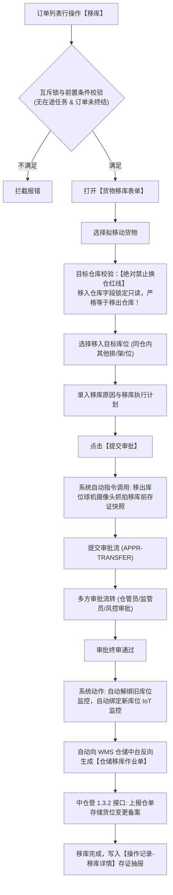

# 07 - 货物移库

> **归档位置**：`02-PRD文档/🌟🌟🌟-最新基准版/B端PC/03-融资监管/07-抵质押业务-抵质押业务管理/采集的资料/`  
> **模块定位**：抵质押业务管理 · 订单行操作【移库】/【货物移库】详尽规约  
> **核心使命**：规范在押监管期内的库内物理库位移动，确保移库全程防脱管、IoT 视频联动监控不断链。

---

## 1. 总体业务流程图



---

## 2. 核心风控红线与业务约束

### 2.1 绝对禁止跨仓移库红线 (Strict Intra-Warehouse Only)
* **业务红线**：抵质押业务下的移库**仅限同仓库内部货位变动**（如从 A区-01架 移至 A区-03架）。
* **原因**：跨仓库移动涉及公路长途运输、监管责任脱节、运输途中货权丧失与路途中无法实时物联监控等重大法律和风控隐患。
* **系统控制**：移入仓库字段完全锁定置灰，前端只读，后端强校验 `target_warehouse_id === source_warehouse_id`，不相等直接抛异常阻断。

### 2.2 自动摄像头抓拍取证机制 (Auto Camera Snapshot)
* **联动机制**：在经办人点击【提交审批】的瞬间，系统后台自动向负责监管该移出库位的智能云台球机下发拍照指令；
* **防伪留痕**：摄像头抓拍的高清画面（包含时间水印与货位编码）作为不可篡改证据，自动依附于移库申请单；
* **审批呈现**：各级审批人在审批中心审核时，可直接查阅移库前的现场货物实况图片。

### 2.3 终审通过后 IoT 监控自动换绑 (Automatic IoT Rebinding)
* **换绑逻辑**：在押货物的风控监控与库位强绑定。移库终审生效时刻，系统自动解除该批货物与旧库位传感器的订阅关系，并将新目标货位的所有智能设备（球机、枪机、温湿度传感器）自动挂载至该订单项下；
* **无缝衔接**：实现“货物走到哪里，眼睛就盯到哪里”，杜绝移库后库位空置导致的视频监控“看空”漏洞。

---

## 3. 界面原型设计 (PC 移库表单)

```
+----------------------------------------------------------------------------------------------------+
|  货物移库申请 - 订单号：ZY-20260818-0021                                                       [X] |
+----------------------------------------------------------------------------------------------------+
|  【移库基础信息】                                                                                  |
|  移出仓库：无锡众捷物流园 1 号监管仓 (只读)                                                        |
|  移入仓库：无锡众捷物流园 1 号监管仓 (系统强锁定，不可更改)                                         |
+----------------------------------------------------------------------------------------------------+
|  【选择拟移库货物】                                                                                |
|  [ ] 存货编码        品名/规格       当前货位        在押数量/重量     拟移库数量    目标货位 (必选)|
|  [✔] CH-20260818-01  电解铜 A级      A-01-01         100.000 吨       100.000 吨    [ A-03-02  ▼ ]|
|  [ ] CH-20260818-02  电解铜 A级      A-01-02         100.000 吨         0.000 吨    [ 请选择货位 ▼ ]|
+----------------------------------------------------------------------------------------------------+
|  【移库原因与说明】 (必填)                                                                         |
|  移库类型：[ 仓库库位维修/保养 ▼ ]                                                                 |
|  移库原因说明 (<=200字)：                                                                          |
|  [原 A-01-01 货位上方消防喷淋管道需停水检修，为防受潮，临时倒仓移库至 A-03-02 货位。___________]   |
|                                                                                                    |
|  计划移库开始时间：[ 2026-09-12 14:00 ]   预计完成时间：[ 2026-09-12 17:00 ]                        |
|                                                                                                    |
|  现场抓拍联动提示：                                                                                |
|  📷 提交时系统将自动联动 A-01-01 球机抓拍现场实况，无需手动上传。                                   |
+----------------------------------------------------------------------------------------------------+
|                                                                      [取 消]    [提 交 移 库]      |
+----------------------------------------------------------------------------------------------------+
```

---

## 4. 仓单移库特殊处理 (Receipt Transfer)

若当前订单为电子仓单质押：
1. 移库审批终审通过后，仓单项下货位记录自动变更；
2. 系统自动签署仓单变更附录，仓单防伪协议中【质押货位记录】同步刷新；
3. 自动向中仓登 1.3.2 接口发送 `RECEIPT_STORAGE_LOCATION_UPDATE` 报文，完成全国性登记系统的货位数据同步。
