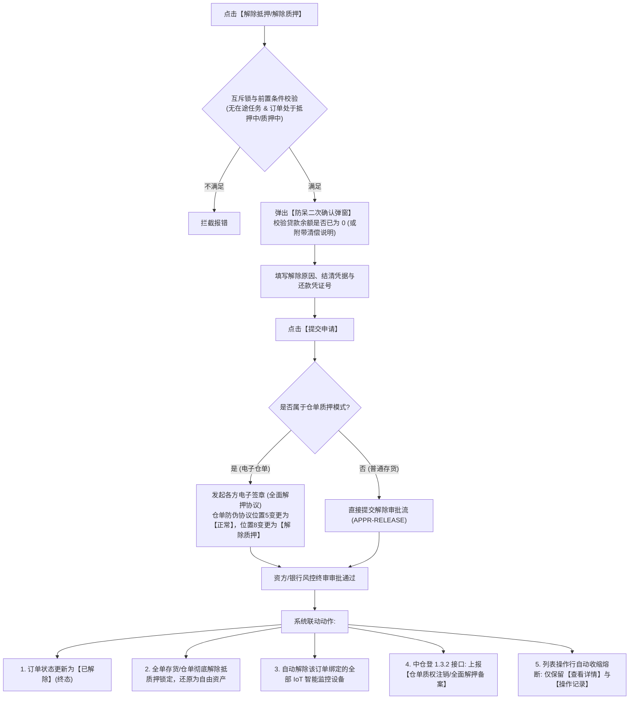

# 08 - 解除抵押 / 解除质押（历史文件名含“监管”）

> **归档位置**：`02-PRD文档/🌟🌟🌟-最新基准版/B端PC/03-融资监管/07-抵质押业务-抵质押业务管理/采集的资料/`  
> **模块定位**：抵质押业务管理 · 当前订单行操作【解除抵押】/【解除质押】详尽规约  
> **核心使命**：借款人全部清偿贷款本息后，对抵押或质押订单办理全面解除风控手续，物权彻底归还借款主体。历史监管订单当前关闭，不提供“解除监管”写操作。

---

## 1. 动态文案绑定与入口规范

行操作按钮文案依据订单所属业务类型（当前所选 Tab）严格动态映射：
* 在 **【抵押订单】** Tab 下，按钮文案固定为：**【解除抵押】**；
* 在 **【质押订单】** Tab 下，按钮文案固定为：**【解除质押】**；
* 历史监管订单不形成当前 Tab，也不展示【解除监管】按钮；旧链接仅允许查看详情、审计和资料。

---

## 2. 总体业务流程图



---

## 3. 防呆二次确认弹窗 UI 原型

```
+------------------------------------------------------------------------------------+
|  解除质押确认 - 订单号：ZY-20260818-0021                                       [X] |
+------------------------------------------------------------------------------------+
|                                                                                    |
|  ⚠️ 警告：办理解除质押后，该订单项下所有在押货物将彻底解控并归还货主！             |
|     订单将流转至终结状态，后续不可再对该订单发起任何加补仓或置换操作！             |
|                                                                                    |
|  【当前结清状态核验】                                                              |
|  借款人：江苏大宗物资有限公司                                                      |
|  登记贷款余额：￥0.00 (已结清)                                                     |
|  当前在押货值：￥12,800,000.00   在押货物总量：200.000 吨                          |
|                                                                                    |
|  解除原因 (必选)：[ 贷款全额到期正常还本结清 ▼ ]                                    |
|  还款凭证编号 (必填)：[ HK-20260910-8899201           ]                            |
|  结清证明文件 (必填)：[ + 上传银行还款结清证明 (PDF/JPG) ]                         |
|                                                                                    |
|  情况说明 (选填，<=200字)：                                                        |
|  [借款企业已结清最后一笔银行贷款本息，质权人出具解质函，申请全面解押。___________] |
|                                                                                    |
+------------------------------------------------------------------------------------+
|                                                  [取 消]    [确 认 解 除 质 押]    |
+------------------------------------------------------------------------------------+
```

---

## 4. 存货解押 vs 仓单解押机制对比

| 维度 | 普通存货解押 (Inventory Release) | 电子仓单解押 (Receipt Release) |
| :--- | :--- | :--- |
| **法律文本** | 监管方出具《抵质押货物解保放行通知书》 | 资方、借款方、监管方、仓储方四方签署《仓单质押解除协议书》 |
| **签章模式** | 系统管理员/风控经办提交，经办人盖章 | 各方法定代表人/受权代理人通过 CA 进行**全量打包电子签约** |
| **仓单状态机** | 不涉及仓单防伪协议字段 | 仓单防伪协议**位置5**（质押状态）变更为【正常】；**位置8**（最新业务动作）记录为【解除质押】 |
| **中仓登备案** | 上报解押通知回执 | 实时调用中仓登 1.3.2 质权注销接口，获取《全国电子仓单质权注销登记证明》 |
| **设备处置** | 解绑摄像头、温湿度、门禁权限 | 解绑设备并清空智能门锁开锁授权 |

---

## 5. 终态熔断机制与审计归档

1. **订单终态冻结**：订单状态变更置为 `RELEASED`（已解除）；
2. **操作按钮收缩**：除了【查看详情】、【操作记录】与【查看风险】（历史只读）之外，所有的业务办理类按钮全部熔断隐藏，防止误操作；
3. **不可变快照**：固化包含结清证明、电子签约哈希、中仓登注销回执等全部司法存证文件，永久存档留痕。
