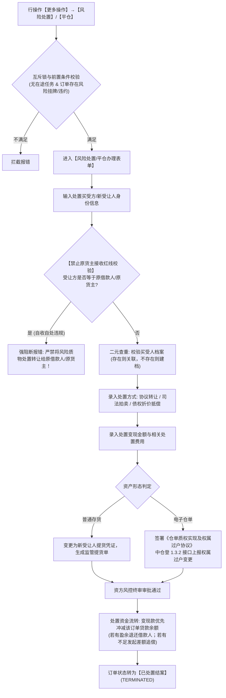

# 09 - 风险处置与平仓

> **归档位置**：`02-PRD文档/🌟🌟🌟-最新基准版/B端PC/03-融资监管/07-抵质押业务-抵质押业务管理/采集的资料/`  
> **模块定位**：抵质押业务管理 · 订单行操作【更多操作 → 风险处置】/【平仓】详尽规约  
> **核心使命**：当质押物跌破平仓线且借款人无力补仓，或借款人实质性违约时，资方依法行使质权，进行资产变现处置或法定权属过户清偿。

---

## 1. 总体业务流程图



---

## 2. 核心风控红线与业务约束

### 2.1 禁止原借款人/货主自收自处红线 (Self-Disposal Ban)
* **业务红线**：风险处置的买受方/受让人，**严禁与当前订单的原借款企业、原货主法人代表、原担保人存在关联关系或为同一主体**。
* **原因**：防止借款人通过违规关联交易自导自演“低价平仓”，恶意逃废银行金融债务；
* **校验逻辑**：系统在录入买受人统一社会信用代码、企业名称、法定代表人身份证时，强校验 `buyer_credit_code !== borrower_credit_code`。命中直接拦截报错。

### 2.2 二元查重与自动建档机制 (Dual Deduplication)
* **设计意图**：对于长期承接不良资产变现的买受人（机构或个人），系统建立买受人资产档案库；
* **查重规则**：通过【统一社会信用代码】（企业）或【身份证号码 + 手机号】（个人）进行唯一性索引查重。若已存在，自动回填历史签约资质；若为首次承接，经风控审批后自动录入合格买受人库。

### 2.3 平仓所得冲减抵押借款资金闭环 (Disposal Proceeds Closed-Loop)
* **资金分配原则**：
  1. 第一顺序：支付法定处置税费与监管仓储保管费用；
  2. 第二顺序：全额冲抵该订单当前的未还贷款本金与利息（贷款余额扣减至 0）；
  3. 第三顺序：
     * 若 $\text{处置净额} > \text{待清偿本息}$，结余款项转入借款企业专用结算账户退还；
     * 若 $\text{处置净额} < \text{待清偿本息}$，订单记录处置亏损差额，自动转入法务追偿系统，保留对借款人的连带追索权。

---

## 3. 界面原型设计 (PC 表单)

```
+----------------------------------------------------------------------------------------------------+
|  风险处置与平仓办理 - 订单号：ZY-20260818-0021                                                 [X] |
+----------------------------------------------------------------------------------------------------+
|  【在押资产现状】                                                                                  |
|  借款人：江苏大宗物资有限公司 (逾期违约)   在押货值：￥12,800,000.00   贷款余额：￥9,000,000.00     |
|  预警状态：[ 🔴 严重平仓预警 ] (当前抵押率 70.31%，已击穿平仓线 70.00%)                            |
+----------------------------------------------------------------------------------------------------+
|  【买受受让方信息】 (系统自动校验关联方，严禁原货主接收)                                          |
|  买受主体类型：(●) 机构买受方    ( ) 个人买受方                                                    |
|  机构买受方全称 (必填)：[ 上海大宗资产管理有限责任公司        ]                                     |
|  统一社会信用代码 (必填)：[ 91310000MA1FLXXXXX                ] [系统核验通过: 非关联方]            |
|  受让法定代表人：[ 陈宏伟 ]   受让经办联系电话：[ 13911112222 ]                                    |
+----------------------------------------------------------------------------------------------------+
|  【处置方案与对价录入】                                                                            |
|  处置方式 (必选)：[ 司法拍卖成交 / 变现过户 ▼ ]                                                    |
|  变现成交总价 (必填)：[ ￥ 8,800,000.00 ]                                                          |
|  处置清算费用 (必填)：[ ￥   100,000.00 ] (仓储杂费、评估费等)                                     |
|  冲抵贷款本息金额：[ ￥ 8,700,000.00 ] (冲抵后尚欠贷款余额：￥300,000.00 将转入法务追偿)           |
|                                                                                                    |
|  法律依据与司法文书 (必填)：                                                                       |
|  文书类型：[ 法院执行裁定书 / 拍卖成交确认书 ▼ ]                                                    |
|  执行案号：[ (2026)苏02执恢88号                       ]                                            |
|  文书原件扫描件：[ + 上传司法文书及拍卖确认书 (PDF/JPG) ]                                          |
+----------------------------------------------------------------------------------------------------+
|                                                                      [取 消]    [提 交 处 置]      |
+----------------------------------------------------------------------------------------------------+
```
