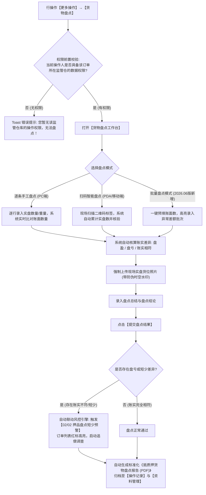

# 10 - 货物盘点与盘点报告

> **归档位置**：`02-PRD文档/🌟🌟🌟-最新基准版/B端PC/03-融资监管/07-抵质押业务-抵质押业务管理/采集的资料/`  
> **模块定位**：抵质押业务管理 · 订单行操作【更多操作 → 货物盘点】/【盘点报告】详尽规约  
> **核心使命**：实现定期与动态账实核对，防范押品虚报、短少与空仓风险，生成具备法律存证效力的盘点审计报告。

---

## 1. 总体业务流程图



---

## 2. 核心规约与权限控制

### 2.1 仓库数据权限强校验 (Warehouse RBAC Guard)
* **安全红线**：用户虽然具备抵质押业务管理菜单权限，但若其数据权限中**未分配该订单货物所在的具体物理监管仓库**，点击【货物盘点】时系统强拦截；
* **提示交互**：弹出 Toast 红色警告信息：`您当前账号未被授予【无锡众捷物流园 1 号仓】的数据操作权限，无法进行现场盘点！`，防止异地虚假盘点。

### 2.2 账实差异自动核算模型
* **账面在押数量**：$Q_{\text{book}}$；
* **现场实盘数量**：$Q_{\text{actual}}$；
* **数量差异**：$\Delta Q = Q_{\text{actual}} - Q_{\text{book}}$；
  * 若 $\Delta Q = 0$：展示绿色文字【账实相符】；
  * 若 $\Delta Q > 0$：展示蓝色文字【盘盈 +XX】；
  * 若 $\Delta Q < 0$：展示高亮红色粗体【🔴 盘亏 -XX】。系统立即强制弹出红色风险提示框，要求录入亏损原因分析，并强制要求监管员与仓管员双人手写签字确认。

### 2.3 批量盘点模式 (Batch Inventory Count - 2026.06 优化)
针对大宗商品大件整托资产，系统支持【一键全部账实一致】：
* 点击右上角【置为账实相符】，系统自动将所有存货明细的“实盘数量”默认填入“账面数量”；
* 盘点员仅需针对有损耗或个别抽检差异的行进行修正，大幅提升现场盘点工作效率。

---

## 3. 界面原型设计 (PC 盘点工作台)

```
+----------------------------------------------------------------------------------------------------+
|  货物现场盘点 - 订单号：ZY-20260818-0021                                                       [X] |
+----------------------------------------------------------------------------------------------------+
|  【盘点任务信息】                                                                                  |
|  监管仓库：无锡众捷物流园 1 号仓   盘点人员：张伟 (现场监管员)   盘点日期：2026-09-11 11:30        |
|  [ 一键设为账实相符 ]   [ 开启批量录入模式 ]                                                       |
+----------------------------------------------------------------------------------------------------+
|  【盘点明细清单】                                                                                  |
|  存货编码        品名/规格       货位    账面数量/重量    实盘数量/重量    差异情况    现场拍照 (必传) |
|  CH-20260818-01  电解铜 A级      A-01-01 100.000 吨      [ 100.000 ] 吨   账实相符    [已传 2 张 🔍]  |
|  CH-20260818-02  电解铜 A级      A-01-02 100.000 吨      [  98.500 ] 吨   🔴盘亏-1.5t [已传 3 张 🔍]  |
+----------------------------------------------------------------------------------------------------+
|  【盘点结论与总结】                                                                                |
|  综合盘点结果：[ 存在盘亏异常 (已标红)                                                    ]        |
|  盘点异常说明 (必填，<=200字)：                                                                    |
|  [抽检 A-01-02 货位，因包装封条轻微破损发现氧化皮脱落损耗 1.5 吨，已责令仓库出具情况说明。_______] |
|                                                                                                    |
|  盘点附件：[ + 上传盘点纸质底稿及现场监管员双签确认单 (PDF/JPG) ]                                  |
+----------------------------------------------------------------------------------------------------+
|                                                                      [取 消]    [提 交 盘 点]      |
+----------------------------------------------------------------------------------------------------+
```

---

## 4. 盘点报告生成与风险闭环

1. **自动生成 PDF 报告**：
   * 包含：报告唯一编号、盘点时间、企业名称、仓库、盘点明细表、现场带水印实拍图、监管员电子签名；
2. **风险联动**：
   * 一旦提交存在“盘亏”记录，系统后台自动向【02-预警中心/02-押品预警信息】写入一条 `warn_type=INVENTORY_LOSS` 的严重风险流水；
   * 订单列表页该订单右上角立即点亮红色预警角标。
