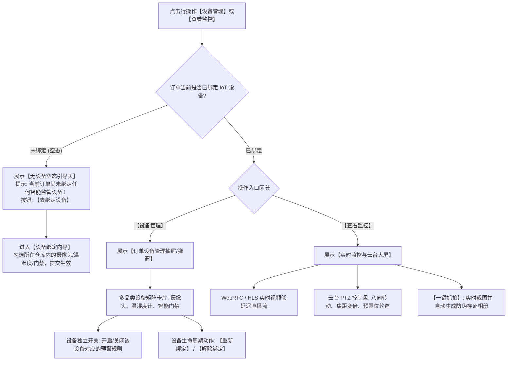

# 11 - 设备管理与查看监控

> **归档位置**：`02-PRD文档/🌟🌟🌟-最新基准版/B端PC/03-融资监管/07-抵质押业务-抵质押业务管理/采集的资料/`  
> **模块定位**：抵质押业务管理 · 订单行操作【设备管理】与【查看监控】详尽规约  
> **核心使命**：提供订单项下物联监控设备（摄像头、温湿度、门禁）的全生命周期管理、远程实时视频监控、云台控制与现场抓拍。

---

## 1. 总体业务流程图



---

## 2. 无设备空态保护机制 (Empty State Guard)

* **设计背景**：新开立的订单或尚未分配固定库位的订单，往往暂无绑定硬件。若直接打开空白监控大屏会引起操作误解。
* **空态界面原型**：
  ```
  +-------------------------------------------------------------+
  |  查看监控 - 订单号：ZY-20260818-0021                    [X] |
  +-------------------------------------------------------------+
  |                                                             |
  |                        [ 📷 无设备图标 ]                    |
  |                                                             |
  |              当前订单暂未绑定任何智能监控设备！              |
  |     为了保障质押物安全，建议立即前往关联库位绑定监控设备。   |
  |                                                             |
  |                      [ 立即去绑定设备 ]                     |
  |                                                             |
  +-------------------------------------------------------------+
  ```

---

## 3. 设备管理抽屉 UI 结构与功能

### 3.1 界面原型 (PC 侧拉抽屉)

```
+------------------------------------------------------------------------------------+
|  设备管理 - 订单号：ZY-20260818-0021                                           [X] |
+------------------------------------------------------------------------------------+
|  【已绑定设备矩阵】 (共 3 台设备在线)                               [ + 绑定新设备 ] |
|                                                                                    |
|  [📷 智能高清球机]                                                                  |
|  设备编码：CAM-WX-01-088    品牌型号：海康威视 400万星光球机                         |
|  安装位置：无锡 1 号仓 A-01 货位上方    运行状态：● 在线 (延迟 120ms)                |
|  预警监控开关：[ ON  ] (异常移库与电子围栏布防中)                                  |
|  [查看实时流]   [重新绑定]   [解绑]                                                 |
|  --------------------------------------------------------------------------------  |
|                                                                                    |
|  [🌡️ 工业温湿度传感器]                                                              |
|  设备编码：TH-WX-01-0024    实时数据：温度 24.5℃ | 湿度 52%RH (正常)                 |
|  预警监控开关：[ ON  ] (超温超湿告警中)                                             |
|  [历史曲线]   [参数校准]   [解绑]                                                   |
|  --------------------------------------------------------------------------------  |
|                                                                                    |
|  [🚪 库区人脸智能门禁]                                                              |
|  设备编码：DR-WX-01-M01     今日通行记录：14 人次                                   |
|  预警监控开关：[ OFF ] (夜间防闯入未布防)                                           |
|  [获取临时密码]   [查看出入流水]   [解绑]                                           |
|                                                                                    |
+------------------------------------------------------------------------------------+
|                                                                         [关 闭]    |
+------------------------------------------------------------------------------------+
```

---

## 4. 查看监控与云台 PTZ 控制大屏

### 4.1 界面原型

```
+----------------------------------------------------------------------------------------------------+
|  实时视频监控 - 订单号：ZY-20260818-0021                                                       [X] |
+----------------------------------------------------------------------------------------------------+
|  [ 当前播放: CAM-WX-01-088 (A-01-01 货位直视) ▼ ]   [ 标清 / 高清 / 超清 ]   [ 码率: 2048 kbps ]   |
+------------------------------------------------------------------+---------------------------------+
|                                                                  | 【云台 PTZ 控制台】             |
|                                                                  |            [ 向上 ▲ ]           |
|                                                                  |   [ 向左 ◀ ]  [ 复位 ● ] [ 向右 ▶ ] |
|                                                                  |            [ 向下 ▼ ]           |
|                                                                  |                                 |
|                      [ 实时视频流播放画面 ]                      | 焦距控制：                      |
|                                                                  | [ 放大 🔍+ ]     [ 缩小 🔍- ]    |
|               2026-09-11 11:35:20 CST  ● 录制中                  | 转向步长：[ 5度  ▼ ]             |
|                                                                  |                                 |
|                                                                  | 【监控抓拍存证】                 |
|                                                                  | [ 📷 立即抓拍当前画面 ]         |
|                                                                  | (抓拍将自动添加防伪水印并归档)  |
|                                                                  |                                 |
|                                                                  | 【常用预置位】                  |
|                                                                  | [ 1. 全景俯视 ]  [ 2. 货卡特写 ]|
|                                                                  | [ 3. 仓位封条 ]  [ 4. 出入通道 ]|
+------------------------------------------------------------------+---------------------------------+
|                                                                                          [关 闭]   |
+----------------------------------------------------------------------------------------------------+
```

### 4.2 抓拍存证规范
* **水印字段**：订单编号、摄像头编号、货位编号、抓拍时间戳（精确到毫秒）、GPS 经纬度、操作人账号；
* **存储归档**：抓拍图片自动上传至云端私有存储，并在【查看详情-资产明细】与【资料管理】中实时展示。
