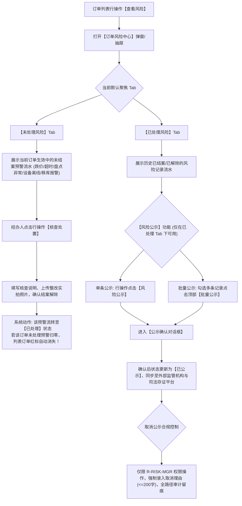

# 12 - 查看风险与风险公示 (原查看预警)

> **归档位置**：`02-PRD文档/🌟🌟🌟-最新基准版/B端PC/03-融资监管/07-抵质押业务-抵质押业务管理/采集的资料/`  
> **模块定位**：抵质押业务管理 · 订单行操作【查看风险】(历史称“查看预警”)与【风险公示】详尽规约  
> **核心使命**：集中呈现与该订单在押物、借款主体相关联的 IoT 物联网预警、行情跌价预警与贷中风控事件，实现风险排查、解除闭环与合规对外公示。

---

## 1. 总体业务流程图



---

## 2. 订单红标联动与消除规则 (Red Badge Closed-Loop)

1. **红标点亮规则**：
   * 只要该订单项下存在**任意 1 条及以上**处于【未处理】（`PENDING`）状态的风险流水（不论是设备预警穿透还是订单跌价预警）；
   * 订单列表页中的订单编号旁边立即展示红色高亮警示标签：`🔴 存在未处理风险`；
2. **红标自动消除规则**：
   * 必须在【查看风险】或【预警中心】将所有未处理告警逐条处置完毕（状态变为【已处理】`RESOLVED`）；
   * 当未处理数量严格等于 0 时，系统自动抹除列表页红标，订单恢复正常绿标监控状态。

---

## 3. 风险公示与取消公示规范

### 3.1 风险公示准入条件
* **严格限制**：**仅允许对【已处理】（已闭环核销）的风险事件发起公示**，未查清事实、处于处理中的在途风险严禁对外公示；
* **支持单条与批量**：在【已处理风险】Tab 列表中，支持单条行点击【公示】，也支持表头复选框多选后点击【批量公示】。

### 3.2 取消公示合规约束 (Revoke Publicity Guard)
* **权限控制**：取消公示涉及司法信披合规，普通业务员与监管员无权撤销，仅授予高级风控主管（`R-RISK-MGR`）；
* **原因留痕**：弹窗强制录入 `revoke_reason`（$1 \sim 200$ 字符）；
* **存证留底**：系统记录撤回人、撤回时间、前后镜像版本，不可物理删除。

---

## 4. 界面原型设计 (PC 查看风险抽屉)

```
+----------------------------------------------------------------------------------------------------+
|  订单风险中心 - 订单号：ZY-20260818-0021                                                       [X] |
+----------------------------------------------------------------------------------------------------+
|  [ 未处理风险 ( 1 ) ]             [ 已处理风险 ( 3 ) ]                                             |
+----------------------------------------------------------------------------------------------------+
|  (当前处于【已处理风险】Tab)                                          [ 批量公示 (已选 2 条) ]     |
|                                                                                                    |
|  [ ] 预警单号         预警类型      预警级别    预警触发时间       处置完成时间      公示状态  操作   |
|  [✔] WRN-20260908-01  跌价预警      🔴 严重     2026-09-08 09:12   2026-09-08 14:00  未公示   [公示] |
|      - 触发原因：电解铜市场参考价下跌 5.2%，导致抵押率突破 70.00% 警戒线                             |
|      - 处置结果：借款企业补仓 20 吨电解铜，抵押率已恢复至 59.00% 安全线                             |
|                                                                                                    |
|  [✔] WRN-20260905-02  设备离线      🟡 中度     2026-09-05 10:00   2026-09-05 10:30  已公示   [撤销] |
|      - 触发原因：A-01-01 球机网络中断 30 分钟                                                       |
|      - 处置结果：仓库网络交换机重启恢复，录像无断点                                                 |
|                                                                                                    |
|  [ ] WRN-20260901-05  盘点短少      🔴 严重     2026-09-01 16:20   2026-09-02 09:00  未公示   [公示] |
+----------------------------------------------------------------------------------------------------+
|                                                                                          [关 闭]   |
+----------------------------------------------------------------------------------------------------+
```

---

## 5. 取消公示弹窗 UI 原型

```
+-------------------------------------------------------------+
|  取消风险公示确认                                       [X] |
+-------------------------------------------------------------+
|                                                             |
|  您正在申请取消预警【WRN-20260905-02】的对外公示记录！       |
|  取消公示后，该风险事件将不再对外披露，但全程保留审计日志。 |
|                                                             |
|  取消公示原因 (必填，<=200字)：                              |
|  [经核实，该设备离线系电信骨干光缆市政施工挖断所致，非仓库   |
|   人为断电破坏，且有冗余 4G 备用抓拍存证，准予撤销公示。___] |
|                                                             |
+-------------------------------------------------------------+
|                                            [取 消]   [确 定] |
+-------------------------------------------------------------+
```
