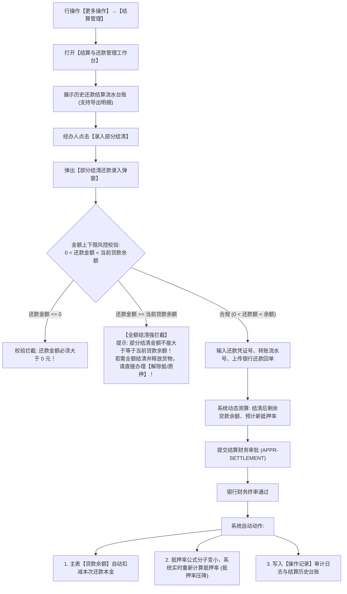

# 13 - 结算管理与部分结清

> **归档位置**：`02-PRD文档/🌟🌟🌟-最新基准版/B端PC/03-融资监管/07-抵质押业务-抵质押业务管理/采集的资料/`  
> **模块定位**：抵质押业务管理 · 订单行操作【更多操作 → 结算管理】/【部分结清】详尽规约  
> **核心使命**：记录借款企业在授信监管期内的分期还本付息流水，支持部分提前还款结算，动态调减贷款本金并实时压降风险抵押率。

---

## 1. 总体业务流程图



---

## 2. 核心风控规则与校验红线

### 2.1 部分结清金额严格开区间红线 (Strict Open Interval Guard)
* **业务红线**：【部分结清】仅支持部分本金偿还，其录入金额 $A_{\text{repay}}$ 必须严格满足：
  $$0 < A_{\text{repay}} < A_{\text{balance}}$$
* **拦截逻辑**：
  * 若用户录入 $A_{\text{repay}} \ge A_{\text{balance}}$，系统强制拦截，禁止提交，并引导操作人走【解除抵/质押】业务流；
  * **原因**：若全额结清贷款本息，意味着质押担保的债权已灭失，资方必须依法释放全部在押物并办理解质登记，不能仅作为一笔部分还款记录简单处理。

### 2.2 抵押率实时联动重算模型
* **原抵押率**：
  $$\text{原抵押率} = \frac{\text{当前贷款余额}}{\text{评估总货值}} \times 100\%$$
* **还款后新抵押率**：
  $$\text{新抵押率} = \frac{\text{当前贷款余额} - \text{本次还款本金}}{\text{评估总货值}} \times 100\%$$
* **业务价值**：在货物价值不变的前提下，通过归还部分借款本金，可以有效拉低订单抵押率，自动解除跌价预警警报。

---

## 3. 界面原型设计 (PC 结算工作台与还款弹窗)

### 3.1 结算管理工作台 (台账视图)

```
+----------------------------------------------------------------------------------------------------+
|  结算管理 - 订单号：ZY-20260818-0021                                                           [X] |
+----------------------------------------------------------------------------------------------------+
|  【当前贷款与结算状态】                                                                            |
|  初始放款金额：￥10,000,000.00   累计已还本金：￥1,680,000.00   当前贷款余额：￥8,320,000.00        |
|  当前在押总货值：￥12,800,000.00  当前实时抵押率：65.00%                                           |
|                                                                                                    |
|  [ + 录入部分结清还款 ]               [ 导出还款对账单 (Excel) ]                                   |
+----------------------------------------------------------------------------------------------------+
|  【还款流水明细】                                                                                  |
|  流水单号           还款日期       还款类型    还款金额 (元)     冲减后余额 (元)    银行流水号  状态|
|  HK-20260905-001    2026-09-05     部分还本    ￥ 1,000,000.00   ￥ 8,320,000.00    990182318   成功|
|  HK-20260825-002    2026-08-25     部分还本    ￥   680,000.00   ￥ 9,320,000.00    990112903   成功|
+----------------------------------------------------------------------------------------------------+
|                                                                                          [关 闭]   |
+----------------------------------------------------------------------------------------------------+
```

### 3.2 部分结清录入弹窗 UI 原型

```
+------------------------------------------------------------------------------------+
|  录入部分结清还款                                                              [X] |
+------------------------------------------------------------------------------------+
|  借款人全称：江苏大宗物资有限公司                                                  |
|  当前贷款余额：￥ 8,320,000.00 (只读)                                              |
|                                                                                    |
|  本次还款本金 (必填)：[ ￥ 1,500,000.00                                   ]        |
|  *(校验规则：必须大于 0 且小于 ￥8,320,000.00)*                                    |
|                                                                                    |
|  还款后预计贷款余额：￥ 6,820,000.00                                               |
|  预计新抵押率：53.28%  (↓ 11.72%，风险进一步降低)                                  |
|                                                                                    |
|  还款到账日期 (必填)：[ 2026-09-11           ]                                     |
|  银行转账流水号 (必填)：[ 20260911998810290123 ]                                   |
|  还款回单电子凭证 (必传)：[ + 上传银行电子回单 (PDF/JPG/PNG) ]                     |
|                                                                                    |
|  经办备注 (选填)：[ 客户销售回款资金到位，主动提前归还部分流动资金贷款。_________] |
+------------------------------------------------------------------------------------+
|                                                  [取 消]    [确 认 提 交]          |
+------------------------------------------------------------------------------------+
```
