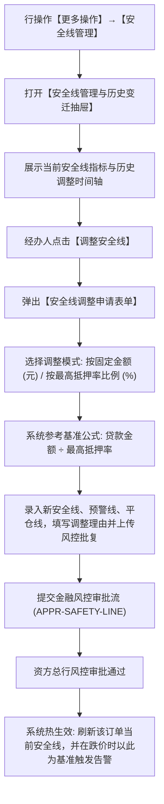

# 14 - 安全线管理与贷款结果录入

> **归档位置**：`02-PRD文档/🌟🌟🌟-最新基准版/B端PC/03-融资监管/07-抵质押业务-抵质押业务管理/采集的资料/`  
> **模块定位**：抵质押业务管理 · 订单行操作【更多操作 → 安全线管理】与【贷款结果录入】详尽规约  
> **核心使命**：确立风险红线底线、规范放款数据确权录入，激活抵押率分子与动态风控预警引擎。

---

## 1. 安全线管理 (Safety Line Management)

### 1.1 总体业务流程图



### 1.2 核心业务规则与计算模型
1. **基准安全线公式**：
   $$\text{基准安全货值} = \frac{\text{当前贷款本金余额}}{\text{授信最高抵押率}}$$
   *例如：贷款余额为 700 万元，授信最高抵押率为 70%，则基准安全货值为 $700 \div 70\% = 1000$ 万元。当市场货值跌破 1000 万元时，质押率即超标。*
2. **多级阶梯线规范**：
   * **安全线**：正常维持线；
   * **预警线**（通常为最高质押率 $+ 5\%$）：触发黄色预警，通知货主准备补仓或还款；
   * **平仓线**（通常为最高质押率 $+ 10\%$ 或 $\ge 80\%$）：触发红色高危预警，启动法律催收并准备资产处置平仓。
3. **安全线调整时间轴追溯**：抽屉内完整记录每一次安全线变更的调整人、审批单号、调整前数值、调整后数值与批复文书。

---

## 2. 贷款结果录入 (Loan Result Confirmation)

### 2.1 业务背景与激活逻辑
* **前置痛点**：在供应链金融实际运作中，往往是“先办押、后放款”——企业先在监管仓完成选货并办理质押登记，拿到中仓登登记证明后，银行才启动放款出账；
* **字段激活机制**：
  * 在未录入贷款结果前，订单的【贷款金额】与【贷款余额】为空或 0，列表的【抵押率】一律展示占位符 `--`；
  * 操作人通过行操作【贷款结果录入】提交真实的银行放款信息；
  * 审批通过后，系统正式反写主表【贷款金额】、【贷款余额】与【放款日期】，**正式激活列表【抵押率】的实时计算引擎**。

### 2.2 界面原型 (PC 贷款结果录入弹窗)

```
+------------------------------------------------------------------------------------+
|  贷款结果录入 - 订单号：ZY-20260818-0021                                       [X] |
+------------------------------------------------------------------------------------+
|  借款企业名称：江苏大宗物资有限公司                                                |
|  当前质押资产总值：￥ 12,800,000.00 (已完成质押确权)                               |
+------------------------------------------------------------------------------------+
|  【银行实际放款信息】 (必填)                                                       |
|  实际放款金额 (必填)：[ ￥ 8,000,000.00                                   ]        |
|  *(系统测算：录入后初始抵押率将为 62.50%，安全垫充足)*                             |
|                                                                                    |
|  实际放款日期 (必填)：[ 2026-09-11           ]                                     |
|  贷款到期日期 (必填)：[ 2027-09-10           ]                                     |
|  借款合同编号 (必填)：[ JK-20260901-8890     ]                                     |
|  放款借据单号 (必填)：[ JJ-20260911-0012     ]                                     |
|                                                                                    |
|  放款银行机构：[ 江苏银行无锡分行营业部                                   ]        |
|  银行出账借据凭证 (必传)：[ + 上传银行放款出账借据 (PDF/JPG) ]                     |
|                                                                                    |
|  业务备注 (选填)：[ 银行信贷审批已放款，首期授信出账完成。_______________________] |
+------------------------------------------------------------------------------------+
|                                                  [取 消]    [确 认 录 入]          |
+------------------------------------------------------------------------------------+
```
