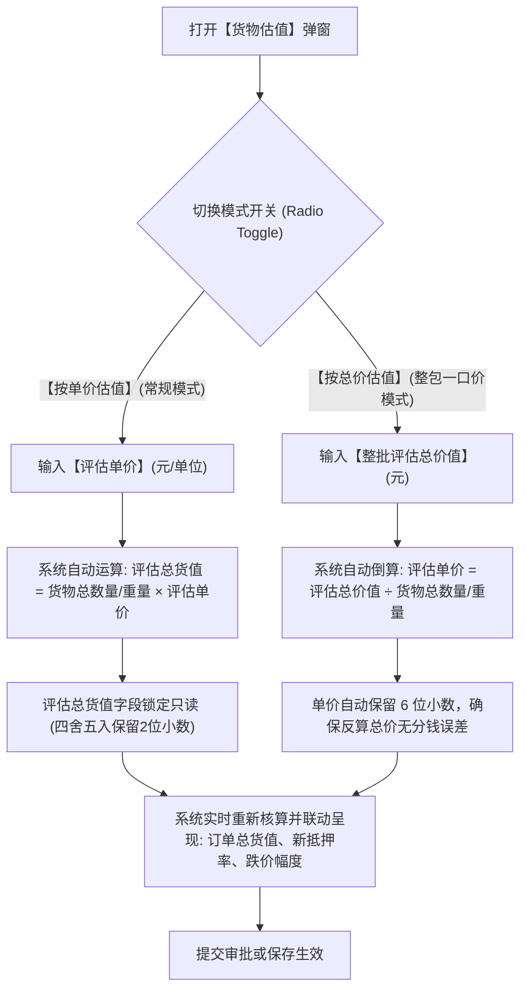

# 15 - 行业参考价与货物估值组件

> **归档位置**：`02-PRD文档/🌟🌟🌟-最新基准版/B端PC/03-融资监管/07-抵质押业务-抵质押业务管理/采集的资料/`  
> **模块定位**：抵质押业务管理 · 基础行情底座与货物估值组件详尽规约  
> **核心使命**：规范大宗商品公允价值参考源，消除未定价盲区，提供单价/总价灵活切换的货物价值测算与热重算工具。

---

## 1. 行业参考价基准规范

### 1.1 概念统一与数据路由
* **统一命名**：全系统各模块统一称谓为**【行业参考价】**（禁用“市场价”、“行情价”、“参考市价”等混淆表述）；
* **专业行情接入路由**：
  * 有色金属（电解铜、铝锭、锌锭）：对接【上海有色网 (SMM)】与【长江有色金属现货】；
  * 黑色系（热轧卷板、螺纹钢、铁矿石）：对接【我的钢铁网 (Mysteel)】；
  * 化工/橡塑/能源：对接【生意社 (100ppi)】；
* **定时抓取机制**：工作日每个交易日 11:30、15:30 自动调用爬虫及 API 获取基准指导价，并写入全局行业参考价台账。

### 1.2 未定价 ⚠️ 风险警示机制
* **触发场景**：若某批在押货物所对应的品名、规格、材质，在系统价格库中未匹配到当日有效行情报价，或第三方接口中断；
* **前端呈现**：
  * 列表页与详情页该货物单价字段高亮展示：`未定价 ⚠️`（琥珀色告警徽标）；
  * 鼠标悬停 Tooltip 提示：`该商品规格暂未匹配到今日第三方公允行业参考价，当前抵押率可能失真，请前往【行业参考价维护】补充报价或人工重新估值！`；
  * 列表顶部看板【未定价订单】指标计数加 1。

### 1.3 7天 / 30天行情走势折线图
在货物明细行点击【行情趋势】，弹出轻量级 Chart 弹窗，呈现该规格商品近 7 天与近 30 天的历史均价走势，标注最高点、最低点与跌幅百分比。

---

## 2. 货物估值组件深度优化 (2026.05 优化基准)

### 2.1 业务优化背景
* **历史痛点**：过去系统只支持“输入单价 $\rightarrow$ 计算总价”。但在一线大宗质押或司法抵债处置中，经常遇到双方协议按照整批资产一口价评估（如“这一堆钢材打包估值 800 万元”），经办人必须手动拿计算器倒除单价，极易因无限循环小数产生“分钱精度倒挂”而无法平账；
* **解决方案**：2026.05 版正式推出【单价模式】与【总价模式】双轨自由切换。

### 2.2 估值组件双模式交互逻辑



### 2.3 界面原型 (PC 货物估值弹窗)

```
+------------------------------------------------------------------------------------+
|  货物价值评估与调整 - 订单号：ZY-20260818-0021                                 [X] |
+------------------------------------------------------------------------------------+
|  货物明细：CH-20260818-01 | 电解铜 A级 | 所在货位：A-01-01                         |
|  当前在押数量：100.000 吨   第三方最新行业参考价：￥ 64,500.00 / 吨 [查看走势图]   |
+------------------------------------------------------------------------------------+
|  【估值模式切换】                                                                  |
|  模式选择：( ) 按单价估值        (●) 按整批总价估值 (支持一口价打包)               |
|                                                                                    |
|  整批评估总价值 (必填)：[ ￥ 6,400,000.00                                  ]       |
|  系统自动倒算评估单价：￥ 64,000.000000 / 吨 (保留6位精度，精准无损)              |
|                                                                                    |
|  【调整效果测算】                                                                  |
|  原评估价值：￥ 6,500,000.00   本次调整差额：- ￥ 100,000.00 (跌价 1.54%)          |
|  调整后订单总货值：￥ 12,700,000.00   调整后抵押率：65.51% (仍在安全线内)          |
|                                                                                    |
|  估值依据说明 (必填)：                                                             |
|  [根据 2026-09-11 SMM 下午盘均价并扣除 500 元/吨交割贴水进行审慎估值。___________] |
+------------------------------------------------------------------------------------+
|                                                  [取 消]    [确 认 保 存]          |
+------------------------------------------------------------------------------------+
```
