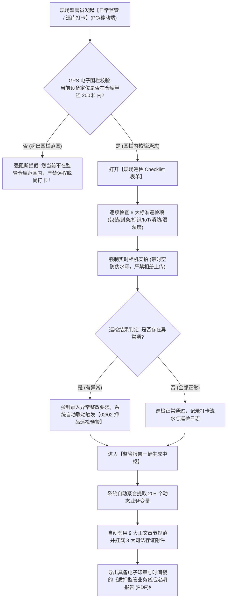

# 16 - 日常监管与监管报告

> **归档位置**：`02-PRD文档/🌟🌟🌟-最新基准版/B端PC/03-融资监管/07-抵质押业务-抵质押业务管理/采集的资料/`  
> **模块定位**：抵质押业务管理 · 订单行操作【更多操作 → 日常监管】与【生成监管报告】详尽规约  
> **核心使命**：规范现场监管员现场打卡巡检动作，杜绝脱岗虚假巡库，自动化生成满足商业银行贷后合规审计的专业监管报告。

---

## 1. 总体业务流程图

---

## 2. 日常监管防伪三大铁律

1. **GPS 电子围栏防脱岗打卡**：
   * 仓库档案预设高德/腾讯地图精准中心坐标 $(lat, lng)$ 与允许打卡半径（默认 200 米）；
   * 监管员在手机端点击【打卡】时，调用底层定位芯片核算直线距离。距离大于 200 米直接弹窗报错，杜绝“人在家中坐，卡在系统打”；
2. **强制调用系统相机，禁用本地相册**：
   * 巡检拍照组件直接调用硬件摄像头原生接口；
   * 代码层面设置 `capture="camera"` 并拦截本地相册读取权限，杜绝使用历史图片或网上截图造假；
3. **时空防伪防篡改水印**：
   * 照片拍摄瞬间，在像素层直接合成不可擦除的水印：【拍摄时间精确到秒】、【实时经纬度】、【监管仓库名称】、【监管员账号】、【网络 IP】。

---

## 3. 六大标准巡检项 Checklist 字典

| 巡检项目 | 检查要点与判定标准 | 正常状态 | 异常处置 |
| :--- | :--- | :---: | :--- |
| **1. 货物包装与形态** | 包装无破损、锈蚀、受潮、倾斜、倒塌迹象 | 合格 | 拍照并标记异常，录入受损件数 |
| **2. 物理与电子封条** | 库位警戒线、物理封条或电子封签完好无撕毁 | 完好 | 立即排查是否发生非法移库，触发高危预警 |
| **3. 货位与押品标识牌** | 质押监管公示标牌悬挂规范、二维码清晰可扫 | 完好 | 现场重新打印并张贴新标牌 |
| **4. IoT 监控设备工况** | 球机镜头清洁无遮挡、红外夜视正常、网络在线 | 正常 | 通知工程运维排查交换机/电源 |
| **5. 库内消防与通道** | 消防通道畅通无杂物堆放、灭火器在检验期内 | 达标 | 责令仓库立即搬离通道杂物 |
| **6. 库区温湿度环境** | 温湿度处于大宗商品允许安全阈值范围内 | 达标 | 开启库内除湿机或排风系统 |

---

## 4. 监管报告标准结构与变量字典

生成的《质押监管贷后定期报告》严格遵循商业银行信贷审计规范，包含 **9 大正文章节** 与 **3 大司法存证附件**：

### 4.1 报告正文九大章节
1. **第一章：监管项目基本情况**（订单号、借款主体、资方、监管期限、授信额度）；
2. **第二章：质权人与监管方主体信息**（主体资质、监管人员名单、派驻记录）；
3. **第三章：在押存货资产与价值评估现状**（品类明细、最新行业参考价、当前评估总值、实时抵押率）；
4. **第四章：IoT 智能物联设备运行状况**（设备在线率、视频轮巡正常率、门禁通行次数）；
5. **第五章：监管期内资产流转记录**（本周期内发生的置换、加补仓、部分出库、移库事件明细）；
6. **第六章：日常巡库与环境监测结论**（周期内打卡频次、Checklist 汇总、温湿度均值）；
7. **第七章：风险事件与处置核销记录**（发生的预警次数、处置闭环结果、公示情况）；
8. **第八章：综合风控评价与后续监管建议**（风控评级、是否存在潜在跌价风险、下阶段监管重点）；
9. **第九章：签字盖章区**（监管公司公章、项目负责人签字、现场监管员手写签章）。

### 4.2 三大司法存证附件
* **附件一**：《在押质押货物资产明细与二维码清单》
* **附件二**：《周期内日常巡检打卡与记录汇总表》
* **附件三**：《现场全景与重点货物监控定时抓拍存证照片集》
