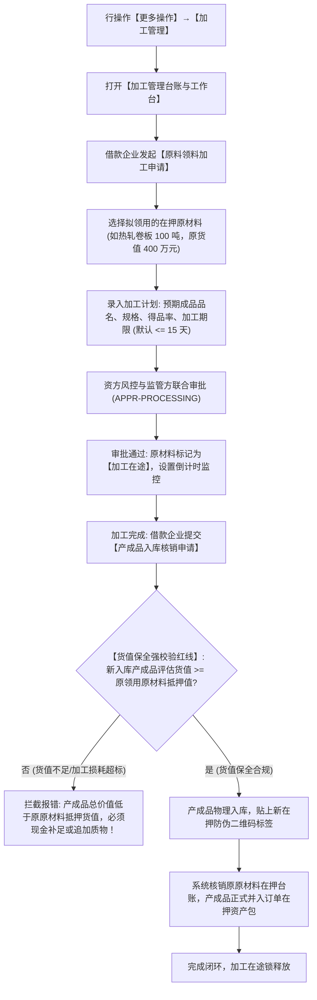

# 17 - 抵质押率维护与加工管理

> **归档位置**：`02-PRD文档/🌟🌟🌟-最新基准版/B端PC/03-融资监管/07-抵质押业务-抵质押业务管理/采集的资料/`  
> **模块定位**：抵质押业务管理 · 【抵/质押率维护】与【更多操作 → 加工管理】详尽规约  
> **核心使命**：提供移动端/PC 端抵质押率参数的敏捷维护入口，并针对大宗商品动态加工监管场景，实现原料领用与产成品二次入库的货值闭环保全。

---

## 1. 抵/质押率敏捷维护机制

### 1.1 维护入口与呈现
* **PC 端**：在订单列表【抵押率】列，展示当前实时计算数值，当鼠标悬停时展示计算公式 Tooltip；若订单具备自定义参数调整权限，提供行级【调整质押率】快捷操作；
* **移动端 (H5)**：在订单卡片右上角提供【编辑/维护抵押率】图标，点击唤起轻量级修改弹窗。

### 1.2 维护弹窗 UI 原型 (移动端/PC)

```
+-------------------------------------------------------------+
|  维护抵/质押率参数 - ZY-20260818-0021                   [X] |
+-------------------------------------------------------------+
|  借款主体：江苏大宗物资有限公司                             |
|  当前贷款余额：￥8,320,000.00   当前评估货值：￥12,800,000.00|
|  当前实际计算抵押率：65.00% (只读)                          |
+-------------------------------------------------------------+
|  【风控阈值参数调整】                                       |
|  授信基准质押率上限 (%)：[ 70.00 % ] (合同约定最高质押率)   |
|  补仓预警线阈值 (%)：    [ 75.00 % ] (突破将触发黄色跌价预警)|
|  平仓处置线阈值 (%)：    [ 80.00 % ] (突破将触发红色高危平仓)|
|                                                             |
|  调整依据说明 (必填)：                                      |
|  [根据资方银行最新下发的中期授信批复，微调预警平仓阈值。___] |
+-------------------------------------------------------------+
|                                            [取 消]   [保 存] |
+-------------------------------------------------------------+
```

---

## 2. 加工管理业务流转与风控规约 (Processing Management)

### 2.1 总体业务流程图



---

## 3. 核心风控红线与业务约束

### 3.1 货值保全不倒挂红线 (Value Conservation Rule)
* **业务红线**：在大宗商品深加工监管过程中，不论加工过程产生何种损耗，**新入库产成品的公允评估总值 $V_{\text{product}}$ 必须大于等于领用出库原材料的原抵押评估值 $V_{\text{raw}}$**：
  $$V_{\text{product}} \ge V_{\text{raw}}$$
* **超期阻断与异常预警**：若加工周期超过经审批的“最迟入库截止日期”（通常为 7~15 天），系统自动触发【02/02 押品加工超期预警】，并限制该订单的其他提货与置换动作。

### 3.2 界面原型 (PC 加工入库核销表单)

```
+----------------------------------------------------------------------------------------------------+
|  加工成品入库核销 - 订单号：ZY-20260818-0021                                                   [X] |
+----------------------------------------------------------------------------------------------------+
|  【原领料加工单概况】                                                                              |
|  加工任务编号：JG-20260901-001   加工企业：无锡精密钢管制造厂                                      |
|  原领用原材料：热轧卷板 (100.000 吨)   原领料抵押价值：￥ 4,000,000.00                              |
+----------------------------------------------------------------------------------------------------+
|  【产成品入库清单录入】                                                                            |
|  成品品名/规格       所在货位     入库件数/重量     评估单价       成品总评估价值   入库检验报告   |
|  冷轧精密钢管 Φ50    B-01-01      95.000 吨        ￥ 4,500/吨    ￥ 4,275,000.00  [已上传 🔍]    |
+----------------------------------------------------------------------------------------------------+
|  【货值保全核验结果】                                                                              |
|  原原材料价值：￥ 4,000,000.00   产成品总价值：￥ 4,275,000.00                                     |
|  货值保全增益：+ ￥ 275,000.00  (✔ 货值充足，符合保全红线要求)                                      |
|                                                                                                    |
|  质检与入库附件 (必填)：[ + 上传成品合格质检证书及入库防伪标签 (PDF/JPG) ]                        |
+----------------------------------------------------------------------------------------------------+
|                                                                      [取 消]    [提 交 核 销]      |
+----------------------------------------------------------------------------------------------------+
```
