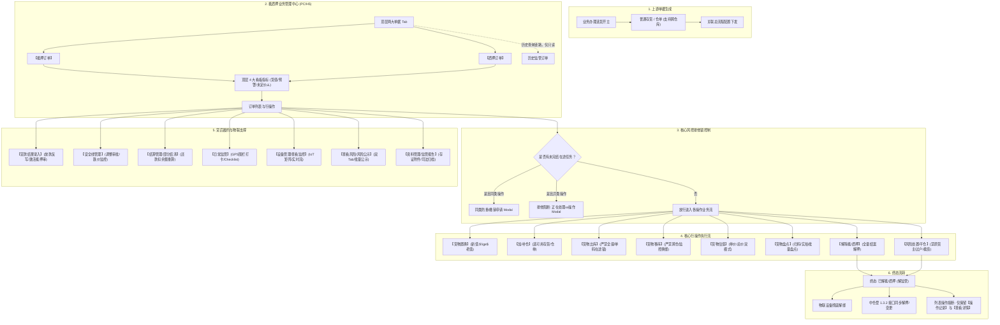

# 抵质押业务管理 · 采集资料全集与业务规约总览

> **归档位置**：`02-PRD文档/🌟🌟🌟-最新基准版/B端PC/03-融资监管/07-抵质押业务-抵质押业务管理/采集的资料/`  
> **整理时间**：2026年9月  
> **数据来源**：业务一线最新实操截图、系统历史业务规则规格、PC/H5 原型走查成果、流程引擎与 IoT 联动矩阵。  
> **文档定位**：本目录为【07-抵质押业务-抵质押业务管理】全量业务事实、交互原型、风控红线与流程流转的**详尽无遗漏原始采集中枢**，按操作按钮与功能主题高度解耦、独立建档，完整重现所有界面要素、表单字段、状态机变迁与流程图。
>
> **档案属性与最新口径**：本目录保留历史采集、规划设计和不同时间点的页面记录，不作为当前实现的唯一真源。正式交付以同目录上级的[抵质押业务管理主PRD](../抵质押业务管理主PRD.md)、[字段清单](../抵质押业务管理字段清单.md)和[业务规则规格](../抵质押业务管理业务规则规格.md)为准；正式三件套已经对本目录与 2026-09-11 PC/H5 实测差异做了标注，历史内容不直接覆盖。

> **当前开关**：监管订单当前关闭。历史资料中出现的“监管订单”“解除监管”等内容仅作为历史/规划档案保留；当前不得展示监管订单入口、创建新单或发起业务写操作，历史数据如需保留仅允许按权限只读查询、审计和资料查看。

---

## 🗂️ 采集资料分项文件索引

| 序号 | 文档名称 | 对应功能 / 操作按钮 | 核心规约与流转说明 |
| :---: | :--- | :--- | :--- |
| **00** | [00-列表与看板基准.md](./00-列表与看板基准.md) | 列表页、顶层看板、筛选区 | 三 Tab 架构、顶部 4 大看板指标及未定价 ⚠️ 预警、筛选字段字典、PC 表格列与 H5 卡片、抵押率计算公式、订单开立前置规则 |
| **01** | [01-流程发起互斥锁与全生命周期数据变更矩阵.md](./01-流程发起互斥锁与全生命周期数据变更矩阵.md) | 全局风控、并发控制 | 单据级排他互斥锁机制（同类防重/撤销与跨类阻断）、7 大审批业务流全生命周期数据变更矩阵、已解押终态订单规则 |
| **02** | [02-查看详情.md](./02-查看详情.md) | 【查看详情】 | PC 端详情全景五大板块（基础信息、资产明细、设备绑定、风险预警、流程时间轴）、H5 详情与二维码追溯抽屉 |
| **03** | [03-操作记录.md](./03-操作记录.md) | 【操作记录】 | 全生命周期操作事件倒序时间轴、经办人规范、各事件展示字段、子弹窗【任务操作记录】、侧拉抽屉【移库详情】（时空存证） |
| **04** | [04-货物置换.md](./04-货物置换.md) | 【货物置换】 | 总体流转流程图、选老货物、选新货物准入池、仓库权限校验、新旧货值比对与倒挂强阻断（新 $\ge$ 老）、存货置换 vs 仓单置换（电子签章与中仓登联动） |
| **05** | [05-加补仓.md](./05-加补仓.md) | 【补仓】 / 【加/补仓】 | 总体流转流程图、选货池准入、缺货空态保护、存货补仓流、仓单补仓流（单选仓单、同仓选货、电子签章与中仓登联动） |
| **06** | [06-货物出库.md](./06-货物出库.md) | 【货物出库】*(历史称提货)* | 总体流转流程图、全单提货强拦截（引导解抵押）、单仓单保留底线、跌破最低价值黄字警示、单二维码在途锁、存货部分出库 vs 仓单整提注销 |
| **07** | [07-货物移库.md](./07-货物移库.md) | 【移库】 / 【货物移库】 | 总体流转流程图、绝对禁止换仓红线、监控自动抓拍取证、终审自动换绑库位设备、仓储移库单反向联动、存货移库 vs 仓单移库 |
| **08** | [08-解除抵质押监管.md](./08-解除抵质押监管.md) | 【解除抵押】/【解除质押】（文件名保留历史兼容） | 总体流转流程图、动态文案绑定、二次确认弹窗、存货解押 vs 仓单解押（全单批量电子签章）、终审后设备彻底解绑与资产释放；历史监管记录仅只读 |
| **09** | [09-风险处置与平仓.md](./09-风险处置与平仓.md) | 【风险处置】 / 【平仓】 | 风险处置流程图、禁止原货主接收红线、接收人二元查重、仓单法定权属过户；平仓变现流、平仓对价录入、平仓款冲抵贷款余额与差额追偿 |
| **10** | [10-货物盘点与盘点报告.md](./10-货物盘点与盘点报告.md) | 【货物盘点】 / 【盘点报告】 | 盘点人仓库权限校验、逐条盘点 vs 扫码盘点、实盘数量录入、账实差异（盈/亏）自动核算、批量盘点模式、盘点报告生成与押品预警联动 |
| **11** | [11-设备管理与查看监控.md](./11-设备管理与查看监控.md) | 【设备管理】 / 【查看监控】 | 无设备空态引导、多品类硬件矩阵（监控/温湿度/门禁）、各设备独立预警开关、重绑与解绑；实时视频流播放、云台 PTZ 控制与现场抓拍 |
| **12** | [12-查看风险与风险公示.md](./12-查看风险与风险公示.md) | 【查看风险】 / 【风险公示】 | 未处理/已处理双 Tab、行级风险处置动作、订单红标消除；单条公示 vs 批量公示、公示台账、合规取消公示与审计留痕 |
| **13** | [13-结算管理与部分结清.md](./13-结算管理与部分结清.md) | 【结算管理】 / 【部分结清】 | 贷款偿还闭环、部分结清金额严格约束（$0 < 额度 < 余额$）、防呆二次确认、还款后贷款余额扣减与抵押率实时重算、结算流水凭证台账 |
| **14** | [14-安全线管理与贷款结果录入.md](./14-安全线管理与贷款结果录入.md) | 【安全线管理】 / 【贷款结果录入】 | 货值安全线模型（金额 vs 比例）、安全线调整金融审批流、安全线历史变迁时间轴、跌价告警；放款结果确权录入、贷款信息反写主表、激活抵押率计算 |
| **15** | [15-行业参考价与货物估值组件.md](./15-行业参考价与货物估值组件.md) | 行情参考、货物评估价值 | 行业参考价命名归一、定价机构动态路由、未定价 ⚠️ 警示、7/30天价格走势折线图；货物估值组件优化（单价模式 vs 总价倒算模式） |
| **16** | [16-日常监管与监管报告.md](./16-日常监管与监管报告.md) | 【日常监管】 / 监管报告生成 | 电子围栏 GPS 防脱岗打卡、强制相机实时取证（时空防伪水印）、6 大项标准 Checklist、异常上报触发押品预警；监管报告正文 9 章与三大司法存证附件 |
| **17** | [17-抵质押率维护与加工管理.md](./17-抵质押率维护与加工管理.md) | 抵/质押率维护、【加工管理】 | 移动端卡片快捷修改抵/质押率弹窗、PC 表格列呈现；加工管理业务场景、原料领用与成品产出锁定、货值保全强校验 |

---

## 🧭 总体业务架构与流转全景图

