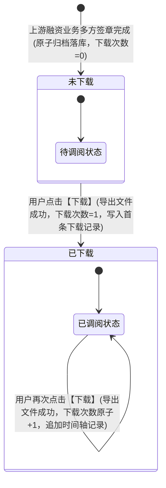

# 融资合同管理业务规则规格

> **文档定位**：融资监管 / 合同管理 / 融资合同管理模块单据定位、多方签约履约判定模型、签约方式双轨规范、关联流程只读高亮展示口径、下载状态双态流转、下载计数原子累加、多文件压缩打包下载以及【下载记录】时间轴倒序审计留痕的**唯一定义来源**。主 PRD 与字段清单只引用本文件规则名称与编号，不重复定义规则本体。
>
> **模块类型**：业务单据 / 融资已生效合同归档与下载审计台账（不可手工编辑、多方签约完成自动归档、全路径下载审计）
>
> **参考文档**：[《融资合同管理主PRD》](./融资合同管理主PRD.md)、[《融资合同管理字段清单》](./融资合同管理字段清单.md)、[《仓储合同管理业务规则规格》](../../02-仓储/23-合同管理-仓储合同管理/仓储合同管理业务规则规格.md)、[《合同模板管理业务规则规格》](../../08-配置管理/15-合同模板管理/合同模板管理业务规则规格.md)、[《00-功能与数据权限清单》](../../../01-项目背景/d-功能:权限清单/功能与数据权限清单.csv)
>
> **版本**：V1.5 | **更新时间**：2026-09-22 | **责任人**：森云科技（Senyun Technology）

---

## 一、单据与能力定位

| 项目 | 内容 |
| :--- | :--- |
| **单据层级** | **【第 3 层 - 金融履约与司法存证归档层】**（全系统融资借款、抵质押授信协议及资金监管合同的最终归档台账） |
| **核心职责** | 集中归档已完成签署的融资授信合同、动产质押借款合同与资金监管协议法律文本；全量罗列借款人、商业银行（资金方）及监管方等多方签约主体；清晰呈现发起签署的关联融资审批流程；提供具备金融防伪效力的签章合同原件及打包下载；建立全路径不可篡改的跨机构下载审计时间轴追溯体系。 |
| **单据来源** | **系统流程流转完成自动沉淀生成**：本模块**不提供独立手工新增与编辑入口**。所有融资合同单据均由上游【客户融资尽调办理】、【融资结果/线上抵质押办理】或【业务流程管理 - 抵质押流程发起审批】等流程在完成多方签约审批后，由系统底层原子事务生成并沉淀入库。 |
| **上游依赖** | 1. **合同模板主档**（[15 合同模板管理](../../08-配置管理/15-合同模板管理/)）：继承模板定义类型为 `融资合同` 的合同名称、排版版式及表单域规则； 2. **融资审批流程中心**（[18 抵质押审批](../../08-配置管理/18-业务流程管理-抵质押流程发起审批/)）：提供发起签约的任务/流程实例标识； 3. **电子签章平台**：提供金融级数字证书多方签章、签名时间戳与签署完成事件回调。 |
| **下游影响** | **贷后检查与金融司法存证**：作为资金方银行放款前置核查、贷中风控审查、贷后资产巡检、司法诉讼维权及外部金融监管审计的法定书面合同依据，支持原件调阅与履约下载。 |
| **归档台账边界** | **【仅收录已签署生效融资合同】**：审批驳回、终止或签署中的半成品单据不在本台账呈现；单据一旦沉淀入库，合同内容与签署事实永久不可篡改；列表不提供删除与废弃操作。 |

---

## 二、状态机与流转定义

### 2.1 状态定义

融资合同管理模块聚焦于合同生效后的下载与调阅生命周期管理，单据的核心运行状态为【下载状态】（`download_status`）：

| 状态名称 | 状态编码 (`download_status`) | 初始/流转时机 | 下载次数 (`download_count`) | 业务含义与下载权限说明 |
| :--- | :--- | :--- | :---: | :--- |
| **未下载** | `UN_DOWNLOADED` | 上游完成多方签约，合同首次沉淀归档入库时 | $= 0$ | **初始归档状态**。表明该已生效融资合同自归档以来，尚未被任何用户在系统中下载保存至本地。允许用户点击【下载】。 |
| **已下载** | `DOWNLOADED` | 任一合法权限用户首次点击操作列【下载】并成功导出文件后 | $\ge 1$ | **已调阅留痕状态**。表明该融资合同文件已被导出调阅。用户可继续重复点击【下载】，下载次数随之累加，并在【下载记录】弹窗中持续留痕。 |

### 2.2 状态机流转图

---

## 三、核心业务规则

### 【合同底本与名称继承规则】(R01)
1. **底本与名称继承**：
   - 融资合同的法律文本排版底本及合同名称，完全继承自【配置管理 - 合同模板管理】（`P-PZ-015`）中预设类型为 `融资合同` 的模板主档（`sys_contract_template`）；
   - 列表中【合同名称】列直接展示模板主档录入的标准业务名称（如 `最高额动产质押借款合同`、`资金监管协议`），严禁下游模块私自篡改合同名称。
2. **表单数据填充不可变**：
   - 签署过程中由系统根据模板 AcroForm 文本域自动填充的业务数据（如借款主体、授信额度、质押物明细、监管仓位等），在合同多方盖章生效后固化为只读不可变快照，杜绝篡改。

### 【多方签约主体全量展示规则】(R02)
1. **全签约方平铺罗列**：
   - 供应链金融融资业务涉及借款企业、商业银行/保理商（资金方）、仓储监管企业等多方主体；
   - 列表中【签约人/企业】列必须**全量罗列该份融资合同的所有法定签约方**；
   - 涉及多个人员或企业主体时，采用中文顿号 `、` 进行分隔平铺展示（如 `借款企业、卡皮银行、监管仓`）。
2. **综合模糊检索**：
   - 顶部筛选区【签约人/企业】输入框支持模糊匹配；用户输入任意一个参与签约的主体名称或经办人姓名，均可命中并筛选出该合同。

### 【关联流程高亮展示且不可跳转规则】(R03)
1. **关联任务/流程标识**：
   - 【关联流程】列展示发起并生成该份融资合同的上游审批流程名称或任务名称（例如 `客户融资尽调流程`、`线上抵质押办理流程`、`一个签章`），用于直观追溯该合同产生于哪个业务场景。
2. **视觉高亮与交互边界（关键线上规范）**：
   - **视觉呈现**：文本采用黄色/橙色字体高亮展示，突出其业务关联属性；
   - **交互控制**：**该文本处于只读状态，不可点击跳转**；
   - **设计背景与规范**：系统设计在融资合同列表台账中收敛交互路径，避免业务人员因误触跳转离开当前台账而丢失筛选条件或中断审计下载工作，同时保障不同流程节点的数据权限上下文独立。

### 【签约方式双轨分类与多签时间判定规则】(R04)
1. **签约方式双轨枚举**：
   - 列表中【签约方式】列严格划分为固定枚举池：
     - `线上`：代表各方通过系统对接的第三方数字证书认证中心（CA）与电子签章服务，在线完成数字签名与时间戳加盖；
     - `线下`：代表各方在线下以纸质文件形式完成公章与签字加盖，事后通过系统拍照或扫描上传高清 PDF 归档入库。
2. **多签完成时间戳判定**：
   - 融资合同在多方签署流转过程中存在时间先后顺序（如借款人先签、监管仓复核签、银行终审签章并放款）；
   - 列表中【签约时间】字段严格定义为：**最后一方完成签约盖章并确立合同法律效力的精确时间戳**（格式：`YYYY-MM-DD HH:mm:ss`）；
   - 列表默认主排序以此签约时间倒序排列（最新签署的合同排在首位）。

### 【下载状态双态流转与原子累加规则】(R05)
1. **下载状态计算公式**：
   - 融资合同下载状态仅包含 `未下载` 与 `已下载` 两态，与【下载次数】强联动：
     $$\text{下载状态} = \begin{cases} 
     \text{未下载}, & \text{当且仅当 } \text{下载次数} = 0 \\
     \text{已下载}, & \text{当 } \text{下载次数} \ge 1 
     \end{cases}$$
2. **原子累加与状态翻转**：
   - 用户点击行操作【下载】且服务端成功响应输出文件流后，服务端在同一事务内执行原子累加操作：
     $$\text{下载次数}_{\text{新}} = \text{下载次数}_{\text{原}} + 1$$
   - 若原状态为“未下载”，系统自动将其翻转为“已下载”，并即时刷新前端列表行展示。

### 【下载记录时间轴倒序留痕规则】(R06)
1. **时间轴弹窗展示**：
   - 点击操作列【下载记录】链接按钮，系统弹出【下载记录】模态弹窗（`P-RZ-006-LOG`）；
   - 弹窗内以**倒序垂直时间轴**形式展示该合同全部历史下载流水（最新下载记录排在最顶部，最早的排在最底部）。
2. **严格审计要素格式**：
   - 时间轴每个记录节点必须严格包含两大要素：
     - **下载时间戳**：精确到秒（`YYYY-MM-DD HH:mm:ss`），展示于灰色卡片左上方；
     - **操作人与机构全称**：展示于灰色卡片内部，格式固定为：
       $$\text{操作人：}\text{用户真实姓名}(\text{所属机构全称})$$
       - 真实示例（对齐截图）：
         - `操作人：HK(卡皮银行)`
         - `操作人：温喜华(监管公司2号)`
         - `操作人：卡皮巴拉(四川享宇科技有限公司)`
3. **不可变防篡改要求**：
   - 下载记录流水写入数据库后**严格只读**，不支持任何形式的手工修改、回滚或物理删除，为金融司法存证提供全链路溯源证据链。

### 【合同文件打包下载与防伪验签规则】(R07)
1. **多文件压缩打包下载支持**：
   - 点击【下载】时，若该笔融资合同记录仅包含单一 PDF 主合同，直接调起浏览器下载该 `.pdf` 文件；
   - 若该融资合同包含多份授信附件、抵质押物清单或资金共管补充协议，系统服务端自动将所有关联文件**打包压缩为一个 `.zip` 压缩包文件**供用户一键下载保存；
   - 文件命名规范：`合同名称_签约人_签约日期.pdf` 或 `合同名称_签约人_签约日期.zip`。
2. **防伪验签与安全水印**：
   - 下载的 PDF 合同底本内置不可见数字防伪水印与第三方 CA 机构签名哈希值，防止文件离线篡改。

### 【多租户数据权限隔离与跨机构审计规则】(R08)
1. **多租户与数据范围隔离**：
   - 用户进入融资合同管理时，系统严格依据其所属机构/租户标识（`tenant_id`）过滤数据，仅展示该机构作为资金方、借款方或监管方有权查验的融资合同；
2. **跨机构调阅审计留痕**：
   - 无论银行、核心企业还是仓储监管公司人员，任何一方对合同的调阅下载行为，均会在全系统共享的【下载记录】时间轴中留痕公示，杜绝单方私下导出泄密的风险。

---

## 四、动作能力与流转控制矩阵

| 触发动作 | 操作入口 | 适用角色 | 前置业务校验条件 | 结果状态 | 联动后置影响 | 失败阻断提示 |
| :--- | :--- | :--- | :--- | :--- | :--- | :--- |
| **条件查询** | 筛选区【查询】按钮 | 全体具备融资查看权限人员 | 结束日期 $\ge$ 开始日期 | 状态不发生变迁 | 依据合同名称、签约人、时间区间及状态组合筛选刷新列表 | 「查询失败：开始日期不能晚于结束日期」 |
| **合同文件下载** | 列表操作列【下载】按钮 | 具备融资合同调阅权限人员 | 合同文件有效存储于私有对象存储（OSS） | 未下载 $\to$ 已下载（或已下载维持） | ① 浏览器弹出文件保存对话框（PDF 或 ZIP）； ② 后台下载次数原子 +1； ③ 后台插入一条下载记录审计流水； ④ 列表状态与计数即时刷新。 | 「下载失败：合同源文件不存在或已损坏」 「下载失败：网络异常，请稍后重试」 |
| **查看下载记录** | 列表操作列【下载记录】按钮 | 全体具备融资查看权限人员 | 无特殊前置条件（无记录时展示空态） | 状态不发生变迁 | 弹出模态弹窗，以倒序时间轴渲染该合同所有历史下载操作流水 | 「加载失败：获取下载记录超时」 |
| **关闭弹窗** | 下载记录弹窗右上角 `×` | 全体人员 | 弹窗处于打开状态 | 状态不发生变迁 | 关闭当前模态弹窗，原列表页面无刷新保留 | — |

---

## 五、异常流与边界防错

1. **下载并发冲突防重**：
   - 用户连续快速点击【下载】按钮时，前端执行防抖拦截（按钮进入短暂 Disable/Loading 状态），防止触发重复下载请求及并发脏计数。
2. **合同无下载记录边界处理**：
   - 当融资合同处于“未下载”（下载次数 = 0）时，点击【下载记录】弹窗，时间轴区域居中展示空态文案：「暂无下载记录」。
3. **超长签约人展示自适应**：
   - 当签约方主体超过 3 家时，列表单元格自适应折行展示，保证主体全称完整可读，鼠标悬停时提供气泡完整提示。

---

## 修订记录

| 日期 | 版本 | 变更摘要 | 变更人 |
| :--- | :---: | :--- | :--- |
| 2026-08-03 | V1.0 | 系统采集页面功能与字段归纳（P-RZ-006） | 系统整理工作组 |
| 2026-09-22 | V1.5 | 严格对齐仓储合同与基准版规范全面编制融资合同管理业务规则规格：确立 6 维度单据能力定位；标准化 R01~R08 规则体系；明确关联流程高亮但不可点击关键规范；建立多签时间判定、多文件打包下载与倒序时间轴审计追踪体系。 | 森云科技（Senyun Technology） |
