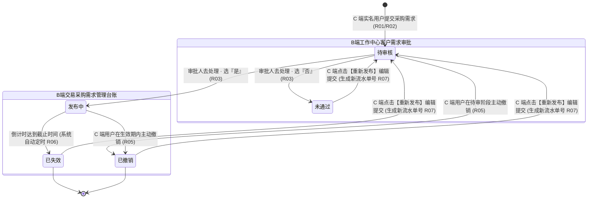
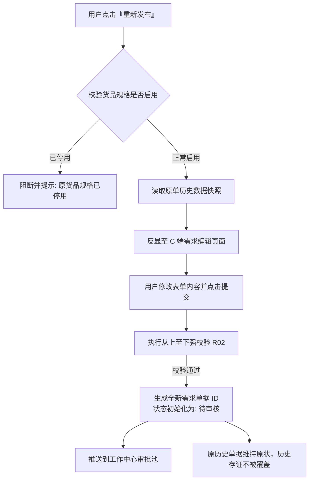

# 采购需求管理业务规则规格

> **文档定位**：交易 / 采购需求管理模块状态机生命周期、业务动作权限矩阵、前置校验规则、跨模块触发驱动机制以及数据合规审计逻辑的**唯一定义真源**。主 PRD、字段清单及端侧原型仅引用本文件规则名称与编号（如 `【规则业务名称】(Rxx)`、`【异常业务名称】(Cxx)`、`【权限业务名称】(Pxx)`），不重复定义规则本体。  
> **模块类型**：交易撮合与采购意向合规监管台账类（承接 C 端个人实名认证用户提报、B 端工作中心审批通过驱动落账、有效期自动到期下架与发布人自主撤销闭环）。  
> **参考文档**：[《采购需求管理主PRD》](./采购需求管理主PRD.md)、[《采购需求管理字段清单》](./采购需求管理字段清单.md)、[《00-功能与数据权限清单》](../../00-功能与数据权限/功能与数据权限清单.csv)。  
> **版本**：V1.2 | **更新时间**：2026-09-22 | **责任人**：森云科技（Senyun Technology）

---

## 一、单据与能力定位

| 项目 | 内容 |
| :--- | :--- |
| **单据层级** | **【第3层-贸易意向与供需台账层】**（全网采购需求真实性存证与监控台账） |
| **核心职责** | 集中收录并监管全平台 C 端个人实名认证用户发起并经平台审核通过的真实物资采购意向；支撑多维度查询、业务明细穿透查验与图片物证调阅；确保全生命周期流转透明留痕，为后续贸易撮合与销售合同履约提供不可伪造的前置业务事实依据。 |
| **单据来源** | **跨端审批通过事件驱动落账**：<br/>1. C 端实名认证用户发起采购需求录入（初始为待审核）；<br/>2. B 端审批中心【工作中心 → 审批中心 → 客户需求审批 → 客户采购需求】审核通过；<br/>3. 系统自动落入本台账，初始状态赋予【发布中】。 |
| **上游依赖** | **个人实名认证系统**：校验发布人真实姓名与身份证件有效性；<br/>**货品主档管理**：提供启用状态的大类、品类、货品、规格及基础计量单位；<br/>**工作中心审批引擎**：提供前置风控与合规审查结论（【审核意见】弹窗及审核记录流水）。 |
| **下游影响** | **C 端交易撮合大厅**：对外展示发布中的采购需求，供潜在供货商联系对接；<br/>**合同管理系统**：作为后续生成采购合同或销售合同的真实贸易意向证据；<br/>**司法审计与风控追溯**：记录提报原貌、撤销记录、审核机构名称与有效期变迁，防止虚构贸易。 |
| **归档台账边界** | **【发布中活跃监管与已失效/已撤销终态归档】**：主列表展示所有已审批通过的需求流水；状态自然失效或用户撤销后永久只读归档，不可逆恢复。 |
| **入口路径** | PC 列表查询：`交易 → 采购需求管理`（`P-JY-001`）；PC 详情查看：列表操作列【详情】（`P-JY-001-DETAIL`）。 |

---

## 二、数量与计算口径隔离表

| 口径名称 | 存在位置 | 业务含义与计算公式 | 约束与边界条件 |
| :--- | :--- | :--- | :--- |
| **需求数量** | C 端录入 / 列表展示 / 详情弹窗 | 客户本次计划采购该货品规格的物理总数量 $Q_{\text{demand}}$ | 数值必须 $> 0$，最大允许保留 3 位小数；列表千分位逗号格式化展示并拼接货品基础计量单位（如 `1,000.000公斤`、`1,888,832.000吨`） |
| **需求有效期天数** | C 端选择 / 列表展示 / 详情弹窗 | 用户指定的采购需求挂牌生效总自然日历天数 $D_{\text{valid}}$ | 严格单选枚举：$D_{\text{valid}} \in \{7, 15, 30\}$ 天；提交后不可修改天数档位 |
| **有效期倒计时绝对截止时间** | 系统服务端计算 / C 端列表展示 | 需求挂牌对外公开展示的最晚截止时刻：<br/>$$T_{\text{expire}} = T_{\text{pass}} + D_{\text{valid}} \times 86400\text{秒}$$ | 以 B 端审批通过时刻 $T_{\text{pass}}$ 为绝对起算点，精确到秒；自然日历时间届满触发自动下架失效 |
| **有效剩余天数** | C 端我的需求列表 | 截至当前时刻需求距离失效的剩余自然日天数：<br/>$$D_{\text{remain}} = \lceil (T_{\text{expire}} - \text{Now}()) / 86400 \rceil$$ | 仅在状态为【发布中】时动态展示，向下取整或显示具体年-月-日 |
| **图片上传数量** | C 端发布页 / 详情弹窗 | 随需求提报的实物样品、规格说明或企业资质图片张数 $N_{\text{img}}$ | 整数范围：$1 \le N_{\text{img}} \le 10$；单张 $\le 10\text{MB}$；格式仅限 JPG/PNG |
| **审核备注字数** | 工作中心【审核意见】弹窗 | 审批人在弹窗内填写的审查理由说明文字长度 $L_{\text{remark}}$ | 整数范围：$1 \le L_{\text{remark}} \le 100$ 字符；必填，禁止全空格 |

---

## 三、单据状态机与流转定义

### 3.1 状态定义

| 状态名称 | 状态编码 | 业务含义 | 是否终态 | B端采购需求管理列表可见性 | 出现与流转说明 |
| :--- | :--- | :--- | :---: | :---: | :--- |
| **待审核** | `PENDING_AUDIT` | C 端用户新增需求提交成功或重新发布提交成功，等待后台审核（旧称审核中） | 否 | **不可见**（仅在工作中心审批流转） | 仅在 C 端我的需求及 B 端工作中心审批池展示 |
| **发布中** | `PUBLISHING` | 审批通过，需求正式在全网大厅展示生效，开启倒计时 | 否 | **可见（台账初始态）** | **【核心定位】审批通过落账后在列表默认呈现** |
| **未通过** | `AUDIT_REJECTED` | 平台审批人审核驳回，单据不合规或信息有误（旧称审核未通过） | **是** | **不可见** | 终态留痕；仅在 C 端我的需求中展示并支持重新发布 |
| **已失效** | `EXPIRED` | 需求运行达到所选有效期天数，系统自动到期下架 | **是** | **可见（归档展示）** | 终态归档；C 端下架，B 端台账永久留痕可查 |
| **已撤销** | `REVOKED` | C 端用户在审核中或发布中主动点击撤销发布 | **是** | **可见（归档展示）** | 终态归档；C 端下架，B 端台账永久留痕可查 |

### 3.2 状态流转图



---

## 四、动作能力与流转控制矩阵

| 触发动作 | 操作入口 | 适用角色 | 前置业务校验条件 | 结果状态 | 联动后置影响 | 失败阻断提示 |
| :--- | :--- | :--- | :--- | :--- | :--- | :--- |
| **提报采购需求** | C 端需求发布页【提交】按钮 | C 端已实名用户 | ① 完成个人实名认证（R01）；<br/>② 从上至下校验必填项与格式（R02）；<br/>③ 图片 1~10 张。 | 待审核 | 生成采购需求记录；推送到 B 端工作中心审批待办池。 | 「提交失败：您尚未完成个人实名认证，请先认证后再发布需求」<br/>「提交失败：[具体字段报错]」 |
| **去处理（审核裁决）** | 工作中心列表【去处理】按钮 | 平台审核岗操作员 | 具备审批操作权限；单据处于【待审核】；呼出【审核意见】弹窗 | - | 呼出审核模态弹窗；处理完成后【去处理】按钮不再展示。 | 「操作失败：单据已被他人处理或状态已变更」 |
| **提交审核意见（通过）** | 【审核意见】弹窗【确认】按钮 | 平台审核岗操作员 | ① 勾选“是否同意”为【是】；<br/>② 录入备注（必填，$\le 100$ 字）；<br/>③ 遵循自审禁止约束。 | 发布中 | ① 首次同步写入 B 端采购需求管理台账；<br/>② C 端撮合大厅上架展示；<br/>③ 锁定有效期绝对截止时间（R04）；<br/>④ 写入审核记录时间轴（处理人账号+归属机构全称）。 | 「请选择审核意见」<br/>「请输入备注，长度不超过100个字符」 |
| **提交审核意见（驳回）** | 【审核意见】弹窗【确认】按钮 | 平台审核岗操作员 | ① 勾选“是否同意”为【否】；<br/>② 录入备注（必填，$\le 100$ 字）。 | 未通过 | ① 单据终止，不流入 B 端采购需求管理台账；<br/>② 写入审核记录时间轴；<br/>③ C 端接收审核未通过通知并支持重新发布。 | 「请选择审核意见」<br/>「请输入备注，长度不超过100个字符」 |
| **撤销发布** | C 端“我的需求”【撤销发布】按钮 | 需求提报人本人 | 单据处于待审核或发布中；用户完成二次确认弹窗 | 已撤销 | ① C 端大厅即刻下架隐藏；<br/>② 若为发布中，B 端台账状态实时刷新为【已撤销】（R05）。 | 「撤销失败：当前状态不允许撤销」 |
| **自动到期失效** | 系统后台分布式定时调度器 | 系统自动调度服务 | 单据处于发布中；当前系统时间 $\ge$ 截止时间戳（$\text{Now}() \ge T_{\text{expire}}$） | 已失效 | ① C 端大厅自动下架；<br/>② B 端台账状态自动变迁为【已失效】并记录定时器审计日志（R06）。 | - |
| **重新发布** | C 端“我的需求”【重新发布】按钮 | 需求提报人本人 | 单据处于未通过、已失效或已撤销；货品规格处于启用状态 | 待审核 | 带出原单据历史数据进入编辑页；提交后生成**全新单据业务流水号**重新进入审批流（R07）。 | 「重新发布失败：原货品规格已停用，请重新选择」 |
| **台账组合查询** | B 端台账列表【查询】按钮 | 平台运营人员 / 业务主管 | 具备 `交易 / 采购需求管理` 菜单与对应机构数据权限 | 维持原状态 | 根据发布人（模糊）、状态（单选）过滤表格数据，页码重置为 1（R08）。 | - |
| **查看详情** | B 端台账列表行操作【详情】文字链接 | 平台运营人员 / 业务主管 | 具备该单据查看权限 | 维持原状态 | 居中呼出需求详情模态弹窗，上半区展示物料及要求，下半区展示【审核记录】时间轴（R09）。 | - |

---

## 五、核心业务规则清单 (R01 ~ R09)

### 5.1 准入与发起规则

#### 5.1.1 【C 端发布主体准入与实名强校验】(R01)
- **规则编号**：`R01`
- **规则名称**：C 端发布主体准入与个人实名强校验
- **详细要求**：
  1. C 端用户进入采购需求发布页面时，系统首先执行 `checkUserPersonalAuth(userId)` 准入检查；
  2. 若用户尚未完成个人实名认证（`personal_auth_status != 'CERTIFIED'`），系统强制阻断发布表单录入，弹出提示框：“您尚未完成个人实名认证，请先认证后再发布需求”，并提供直达个人实名认证页面的操作跳转链接；
  3. 仅当个人实名认证状态为已认证时，方可解锁需求填写表单；
  4. 提交时系统自动绑定该实名认证主体的真实姓名与脱敏手机号，作为单据的【发布人】元数据。

#### 5.1.2 【表单从上至下强校验与字段约束】(R02)
- **规则编号**：`R02`
- **规则名称**：表单从上至下强校验与字段约束
- **详细要求**：
  用户在 C 端点击【提交】按钮时，系统严格按照界面从上至下顺序对输入项进行空值、格式与业务约束校验，**遇到首个未通过项立即阻断提交并弹出对应 Toast 提示，页面光标自动锚定至该异常输入项**：
  1. **需求名称**：必填，1 ~ 10 个字符，禁止全为空格字符。不符合提示：“请输入需求名称，长度不超过10个字符”；
  2. **需求产品**：必选，必须级联选取至已启用的货品规格叶子节点（大类-品类-规格）。未选提示：“请选择需求产品”；
  3. **需求数量**：必填，必须为大于 0 的数值，最多允许保留 3 位小数（如 `1000.000`）。单位自动根据所选货品规格的默认计量单位锁定展示，用户不可篡改。不符合提示：“请输入需求数量，且保留不超过3位小数”；
  4. **送货地区**：必选，省市区三级联动地址选择器，必须选择完整的三级行政区划。未选完整提示：“请选择送货地区（省、市、区）”；
  5. **产品产地**：选填，支持三级联动或文本补充，直辖市展示为市区，未填写时系统默认赋予占位符 `--`；
  6. **采购频率**：必选，严格限制在 `每天采购`、`每周采购`、`每月采购`、`不固定` 四项中单选。未选提示：“请选择采购频率”；
  7. **采购要求**：必填，纯文本，长度限制 1 ~ 200 个字符。不符合提示：“请输入采购要求，长度不超过200个字符”；
  8. **关于我们**：必填，纯文本，长度限制 1 ~ 200 个字符。不符合提示：“请输入关于我们，长度不超过200个字符”；
  9. **图片资料**：必传，上传数量限制为 1 ~ 10 张；单张图片大小 $\le 10\text{MB}$；支持格式为 JPG、JPEG、PNG。未上传或超限提示：“请上传图片资料，最少1张，最多10张”；
  10. **需求有效期**：必选，严格限制在 `7天`、`15天`、`30天` 三档中单选。未选提示：“请选择需求有效期”。

---

### 5.2 审批与流转规则

#### 5.2.1 【工作中心审批裁决与台账联动落账】(R03)
- **规则编号**：`R03`
- **规则名称**：工作中心审批裁决与台账联动落账
- **详细要求**：
  1. C 端提交成功的需求以【待审核】状态推送到【工作中心 → 审批中心 → 客户需求审批 → 客户采购需求】待办列表；
  2. 审批人员点击行操作【去处理】，弹出【审核意见】模态弹窗；
  3. 弹窗内包含两个必填项：
     - `是否同意`：单选框组，选项为【是】、【否】，必选校验；
     - `备注`：多行文本输入框，最多 100 字符，必填校验（禁止全空格）；
  4. **裁决流转分支**：
     - **勾选【是】**：单据状态变迁为【发布中】；系统自动将单据完整数据同步写入【交易 / 采购需求管理】正式台账；C 端撮合大厅上架展示；审批列表中该行操作【去处理】按钮即刻永久隐藏；
     - **勾选【否】**：单据状态变迁为【未通过】；单据终止流转，**绝不同步写入交易管理台账**；审批列表中该行操作【去处理】按钮即刻永久隐藏；C 端我的需求变更为【未通过】并支持重新发布；
  5. 审核人员提交时，系统原子记录审批日志流水：固化审核时间戳、处理人真实姓名账号、**审批人归属机构法定全称**（如 `四川享宇科技有限公司`）、裁决意见与备注说明。

#### 5.2.2 【有效期倒计时绝对截止时间推算规则】(R04)
- **规则编号**：`R04`
- **规则名称**：有效期倒计时绝对截止时间推算规则
- **详细要求**：
  1. 有效期倒计时**严禁以 C 端用户填报时间起算**，必须以工作中心审批人员点击【确认】通过的系统物理时刻 $T_{\text{pass}}$ 作为绝对起算点；
  2. 系统根据所选档位 $D_{\text{valid}} \in \{7, 15, 30\}$，推算并固化绝对过期时间戳：
     $$T_{\text{expire}} = T_{\text{pass}} + D_{\text{valid}} \times 86400\text{秒}$$
  3. 在 C 端我的需求列表中，若需求状态为【发布中】，在有效期列展示所选天数档位，同时拼接展示推算出的截止日期：`格式：年-月-日`，并展示剩余有效自然日天数；
  4. 一旦 $T_{\text{expire}}$ 被计算固化，单据流转全程不可更改。

#### 5.2.3 【发布人主动撤销与台账同步更新规则】(R05)
- **规则编号**：`R05`
- **规则名称**：发布人主动撤销与台账同步更新规则
- **详细要求**：
  1. C 端用户在“我的需求”中，针对状态处于【待审核】或【发布中】的需求，允许点击行操作【撤销发布】；
  2. 点击后弹出二次确认提示窗：“确定撤销该采购需求发布吗？撤销后全网将不再展示”；
  3. 用户确认后，单据状态流转为【已撤销】；
  4. C 端交易撮合大厅立即下架隐藏该需求；
  5. 若该需求此前已处于【发布中】且已同步至交易管理台账，则 B 端交易管理台账状态实时联动刷新为【已撤销】，并永久只读归档；
  6. 状态变迁为【已撤销】后为不可逆终态，不可重新激活原单据。

```mermaid
flowchart TD
    A[用户在 C 端点击『撤销发布』] --> B[弹出二次确认对话框]
    B -->|取消| C[维持原状态不变]
    B -->|确认撤销| D{校验当前单据状态}
    D -->|状态为待审核| E[更新状态为已撤销<br/>审批中心待办移除<br/>不流入交易台账]
    D -->|状态为发布中| F[更新状态为已撤销<br/>C 端大厅立即下架<br/>B 端交易台账刷新为【已撤销】]
    D -->|状态已变迁(如已被驳回/已失效)| G[阻断并提示: 当前状态不允许撤销]
```

#### 5.2.4 【系统定时自动到期失效流转机制】(R06)
- **规则编号**：`R06`
- **规则名称**：系统定时自动到期失效流转机制
- **详细要求**：
  1. 后台部署分布式定时调度引擎（Cron Job / 延迟任务队列），以分钟级频率巡检处于【发布中】状态的采购需求；
  2. 巡检条件：`status == 'PUBLISHING' AND expire_time <= NOW()`；
  3. 满足条件的单据，系统自动执行失效流转事务：
     - 单据状态原子更新为【已失效】；
     - C 端撮合大厅立即下架，前端搜索与列表不可见；
     - B 端【交易 / 采购需求管理】列表该单据状态实时变为【已失效】；
     - 系统写入一条自动化系统操作审计日志：“需求有效期届满，系统自动执行下架失效”；
  4. 【已失效】属于不可逆终态，单据只读归档。

#### 5.2.5 【历史单据一键重新发布与版本物理隔离】(R07)
- **规则编号**：`R07`
- **规则名称**：历史单据一键重新发布与版本物理隔离
- **详细要求**：
  1. 在 C 端“我的需求”列表中，当单据状态为【未通过】、【已失效】或【已撤销】时，行操作提供【重新发布】入口；
  2. 用户点击【重新发布】后，系统自动校验原单据中引用的货品大类、品类、规格是否仍在平台启用：
     - 若已停用，系统阻断跳转并提示：“原货品规格已停用，请重新创建需求”；
     - 若仍启用，系统携带原单据的全量表单字段（名称、产品、数量、产地、送货地、频率、要求、关于我们、图片资料）跳转至发布编辑表单；
  3. 用户可在原数据基础上进行修改调整，点击【提交】后，**系统生成全新的需求业务流水号（如 `REQ202609220002`），生成全新【待审核】单据重新推送到工作中心审批池**；
  4. 原历史单据的未通过/已失效/已撤销状态保持不变，原单据历史审核流水与新单据物理隔离，保障审计追溯链条严密完整。



---

### 5.3 查询、详情与安全审计规则

#### 5.3.1 【交易台账多维检索与只读监管规范】(R08)
- **规则编号**：`R08`
- **规则名称**：交易台账多维检索与只读监管规范
- **详细要求**：
  1. B 端 PC 页面 `交易 / 采购需求管理`（`P-JY-001`）定位为**全网已通过采购意向监管台账**，仅展示审批通过后的单据流水；
  2. **筛选区规则**：
     - `发布人名称`：单行文本输入框，支持输入发布人真实姓名模糊匹配；
     - `状态`：下拉单选框，选项：`全部`、`发布中`、`已失效`、`已撤销`，默认选中全部；
     - 点击【查询】触发检索，当前页码强制重置为 1；
     - 筛选区不设重置按钮（遵循系统整体设计规范）；
  3. **表格区规则**：展示标准 11 列数据（序号、发布人、需求名称、需求产品、需求数量、产品产地、采购频率、状态、需求有效期、需求创建时间、操作）；
  4. **台账只读性**：本页面严禁提供人工新增、编辑、修改、删除等写操作按钮，保障监管大盘数据的严肃性。

#### 5.3.2 【详情穿透调阅与机构留痕时间轴规则】(R09)
- **规则编号**：`R09`
- **规则名称**：详情穿透调阅与机构留痕时间轴规则
- **详细要求**：
  1. 用户在列表行点击【详情】，居中呼出【需求详情】模态弹窗（`P-JY-001-DETAIL`）；
  2. **上半区（物料全要素明细）**：
     - 基础信息：需求名称、发布人、需求产品、需求数量、产品产地、送货地区、采购频率、需求有效期、需求创建时间；
     - 长文本：采购要求（最多 200 字，完整换行展示）、关于我们（最多 200 字，完整换行展示）；
     - 图片资料：展示 96×96 正方形缩略图矩阵，最多 10 张，鼠标悬停显示放大镜，点击呼出全屏无损预览；
  3. **下半区（【审核记录】时间轴）**：
     - 展示历史审核流向节点，按审核时间倒序排列；
     - 必须完整展示**审批人账号及其法定归属机构全称**，格式规范为：`{账号名称}({归属机构法定全称})`，如 `lxy(四川享宇科技有限公司)`；
     - 展示审核意见（`同意` / `不同意`）及说明备注；
  4. **数据脱敏**：列表及详情中的发布人联系电话严格执行中间 4 位脱敏掩码（如 `185****7112`），防止客户敏感隐私外泄。

---

## 六、异常边界与并发控制 (C01 ~ C05)

| 异常编号 | 异常场景 | 系统判定逻辑与并发控制 | 交互表现与阻断提示 |
| :--- | :--- | :--- | :--- |
| **C01** | **撤销发布与审批裁决并发** | 用户在 C 端点击【撤销发布】的同时，审批人在后台提交【审核通过】 | 系统采用基于单据 `version` 的乐观锁机制。先到达的请求更新成功并使版本号递增；后到达的请求发现版本冲突，事务回滚。若是审批落后，提示审批人：“单据已被发布人撤回”；若是撤销落后，提示用户：“单据已审批通过，已进入发布中状态，请再次点击撤销发布”。 |
| **C02** | **到期失效与主动撤销并发** | 定时失效任务执行的瞬间，用户点击【撤销发布】 | 数据库行锁竞争，以绝对时间戳为准。若系统时间已超过 $T_{\text{expire}}$，优先执行自动失效并返回：“单据已到期失效，无需撤销”。 |
| **C03** | **停用货品规格重新发布** | 用户对历史单据点击【重新发布】，但该规格在系统中已被管理员停用 | 系统前置比对货品主档启用状态。若已停用，强行拦截跳转，页面弹出警告框：“原采购货品规格已停用，无法直接重新发布，请在需求大厅重新创建”。 |
| **C04** | **网络异常图片加载失败** | 调阅详情弹窗时，私有云存储 OSS 网络抖动导致图片凭据无法加载 | 缩略图区域展示系统统一的图片加载失败占位图，并提供【点击重试】按钮；若重试仍失败，记录前端异常监控日志，不阻断文本与审核记录展示。 |
| **C05** | **跨越顶级机构越权调阅** | 某操作员篡改 URL 单据 ID，试图调阅非本管辖机构下的采购需求详情 | API 网关结合登录态强制校验 `org_id` 机构层级链路。若无权限，强行阻断并返回 HTTP 403，前端 Toast 提示：“无权访问该单据信息”。 |

---

## 修订记录

| 日期 | 版本 | 变更内容说明 | 影响范围 | 修订人 |
| :--- | :--- | :--- | :--- | :--- |
| 2026-09-22 | V1.0 | 初稿发布交易采购需求管理业务规则规格。 | 全文 | AI PM / 森云科技 |
| 2026-09-22 | V1.1 | 完善工作中心去处理审核弹窗联动与机构全称留痕规则。 | 规则 R03/R09 | AI PM / 森云科技 |
| 2026-09-22 | **V1.2** | **全面对齐仓储基准排版与 Mermaid 流程图补全**：<br/>1. 规范计算口径、单据状态机、动作能力矩阵及核心规则 R01~R09；<br/>2. 深度补全撤销发布并发泳道图、重新发布逆向流程图；<br/>3. 补充 C01~C05 异常边界与并发控制机制；<br/>4. 结构排版与仓储标杆完全对齐。 | 全文规则深化、Mermaid 流程与排版对齐 | AI PM / 森云科技 |
