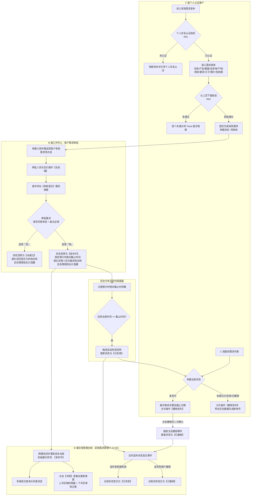
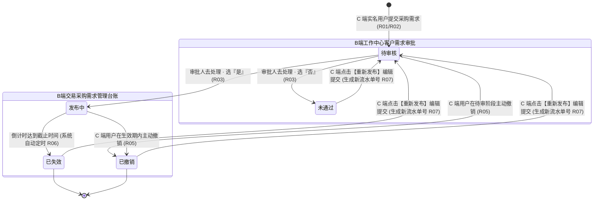
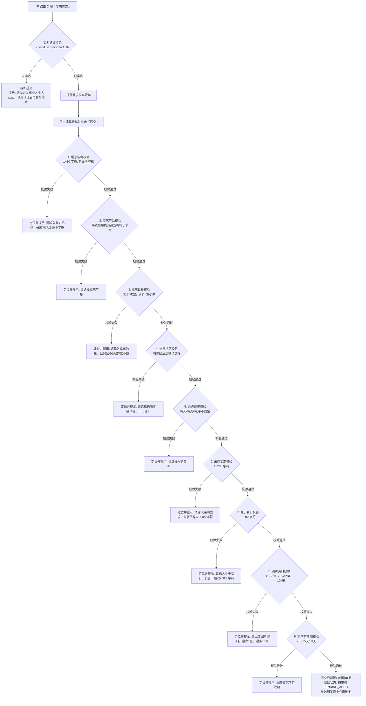
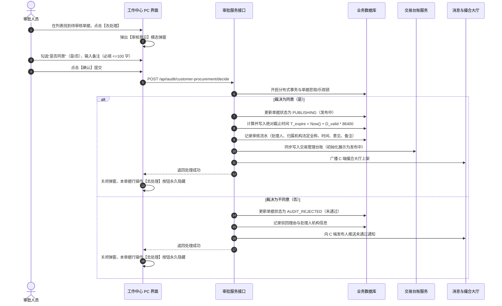
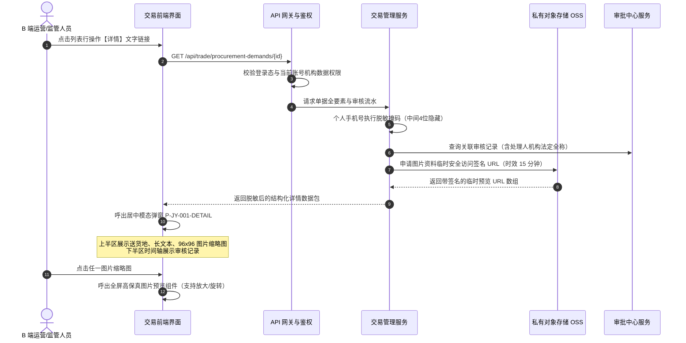

# 采购需求管理主PRD

> **模块定位**：交易 / 采购需求管理是供应链金融与大宗贸易协同场景下，面向平台运营方与监管方的“全网采购需求监控与合规台账中枢”。本模块承接来自 C 端（个人实名认证客户）提报并经平台工作中心审核通过的真实大宗物资/商品采购意向，提供全网采购需求的多维检索、流转监控与全要素明细穿透，为供需撮合、贸易背景真实性核验及后续交易合同生成提供不可变的前序业务凭证。  
> **端侧协同与链路说明**：
> - **需求发布端（C 端）**：完成个人实名认证的客户在前端发起采购需求录入并提交，初始生成【待审核】记录；
> - **审批中心（B 端）**：提交后单据自动推送到【工作中心 → 审批中心 → 客户需求审批 → 客户采购需求】；审批人员通过【去处理】弹出【审核意见】弹窗（选择是否同意、录入 100 字内备注）进行裁决；
> - **交易管理台账（B 端 PC·本模块）**：仅同步展示**审核通过**后的有效采购需求，初始状态为【发布中】，并持续记录该需求的全生命周期状态变迁（【已失效】、【已撤销】）；
> - **数据权限**：所有数据挂靠顶级机构，登录账号具有对应机构数据权限即可查看全量或所辖采购需求。  
> **版本**：V1.2 | **更新时间**：2026-09-22 | **责任人**：森云科技（Senyun Technology）  
> **编写依据**：[采购需求管理字段清单.md](./采购需求管理字段清单.md) 是本模块所有字段定义、枚举与页面展示的唯一基准；[采购需求管理业务规则规格.md](./采购需求管理业务规则规格.md) 是本模块状态机、校验算法、有效期控制、生命周期流转及数据安全的唯一定义来源。

---

## 1. 业务背景与业务痛点

### 1.1 业务背景
在供应链金融动产质押与大宗贸易场景中，真实的贸易背景是资方与监管方防范虚假贸易、自买自卖、循环质押的核心前提。采购需求作为贸易链条的最前端起点，反映了真实的下游采购意向与物资流转预期。

平台通过构建统一的采购需求管理体系：
1. **C 端发起与资质准入**：严格限制必须通过个人实名认证的合规主体方可发起采购意向，防范匿名刷单与垃圾虚假信息；
2. **B 端前置审批穿透**：所有 C 端发起的采购意向必须经过工作中心专业审核，通过【审核意见】弹窗把控合规、录入审核理由并全程留痕；
3. **交易大盘统一纳管**：审核通过后的合规采购需求全量自动汇入本台账，供平台运营团队集中掌握下游市场需求、产地货品偏好与采购频次，为供需两端精准撮合及后续生成销售/采购合同提供事实依据。

### 1.2 核心业务痛点
1. **信息真伪难辨，存在虚假采购意向风险**：传统线下或纯撮合平台缺乏前置准入机制，虚假意向干扰供需匹配；
2. **缺乏生命周期管理，需求过期产生冗余失效干扰**：传统模式下采购意向无固定有效期限与自动下架机制，导致过期失效需求长期驻留前端；
3. **前后台链路割裂，审核与大盘脱节**：前端用户提交、后台风控审批、运营大盘呈现若各自独立，极易产生数据状态不一致与审计追溯断层；
4. **隐私信息裸露风险**：采购意向包含发布人真实姓名与联系电话，若缺乏端到端掩码脱敏机制，极易引发客户商业机密与个人隐私外泄。

---

## 2. 功能范围

| 包含功能范围 | 不包含功能范围 |
| :--- | :--- |
| - **全网采购需求组合筛选**：支持按发布人名称（模糊检索）、需求状态（全部/发布中/已失效/已撤销）快速过滤；<br/>- **采购需求核心列表展示（11 列标准列）**：清晰呈现序号、发布人（姓名+脱敏手机号）、需求名称、需求产品（品类-货品-规格）、需求数量（含计量单位）、产品产地、采购频率、状态、需求有效期（天数）、需求创建时间、操作；<br/>- **需求详情模态弹窗穿透**：一键调阅采购意向全要素镜像，包含上半区需求物料要素（送货地区、长文本要求、关于我们、图片资料缩略图）与下半区【审核记录】时间轴（审核时间、处理人及所属机构、意见、备注）；<br/>- **跨端生命周期联动感知**：自动感知 C 端用户主动撤销动作及系统有效期到期自动失效事件，动态更新台账状态；<br/>- **个人隐私掩码脱敏**：列表及详情发布人联系电话严格执行中间 4 位掩码脱敏（`185****7112`）；<br/>- **顶级机构数据权限控制**：数据挂靠顶级机构，按登录账号机构数据权限物理隔离。 | - **B 端前台直接新增采购需求**：采购需求发布入口唯一设于 C 端（且须个人实名认证），B 端本页面不提供人工物理新增需求入口；<br/>- **B 端前台直接修改/编辑需求**：采购意向具有法律严肃性，一旦提交审核通过后不可由后台运营人员篡改，C 端重新发布走新单逻辑；<br/>- **B 端前台直接下架/删除需求**：本页面定位于合规监控与只读穿透台账，撤销权限归属于 C 端发布人，B 端不可随意物理删除审计流水；<br/>- **审批中与驳回单据展示**：未生效的审批过程态由【工作中心 → 审批中心】和 C 端“我的需求”承载，不混入本正式台账；<br/>- **跨租户越权查询**：严格遵循机构与数据权限隔离边界。 |

---

## 3. 模块定位与系统全景链路

### 3.1 端到端全景业务流转泳道图



---

### 3.2 跨模块与跨端数据交互边界

依据全系统端到端协同规范，采购需求在工作中心审批通过生效（`PUBLISHING`）时，系统底层向相关业务板块同步分发数据，消除数据孤岛：

| 协同板块 | 接收事件与触发时机 | 具体数据更新行为与业务效力 |
| :--- | :--- | :--- |
| **【工作中心审批】** | 审批人员操作【去处理】 | 提交【审核意见】（同意/不同意 + 必填 100 字备注）；处理完成后【去处理】按钮即刻消失；原子写入审批日志流水（时间、人员账号、机构名称、意见、备注）。 |
| **【C 端撮合大厅】** | 需求审批通过生效 | 实时上架该采购意向，向全网潜在供应商公开展示货品规格、数量、产地与采购频次。 |
| **【C 端我的需求】** | 审批通过 / 驳回 / 撤销 / 失效 | 实时同步最新状态机标签；在【发布中】状态下展示剩余倒计时截止日期（年-月-日）；在非活跃态提供【重新发布】入口。 |
| **【B 端交易台账】(本页)** | 审批通过入账 | 首次生成台账记录，锁定全要素快照；在详情中完整展示带机构名称的【审核记录】；持续感知 C 端撤销与系统自动失效事件并同步更新状态。 |
| **【合同管理系统】** | 后续生成销售/采购合同 | 作为真实下游采购背景与意向凭据，支持穿透调阅需求流水号与审核通过物证快照。 |

---

## 4. 业务场景与用户故事

| 场景编号与名称 | 触发角色 | 核心交互与风控约束 | 业务价值 |
| :--- | :--- | :--- | :--- |
| **场景 1【C 端合规提报与实名准入】(S01)** | C 端个人客户 | 客户完成个人实名认证后发起采购需求，级联选择系统内启用的货品规格，录入数量、期望产地、采购频率，填写采购要求与公司简介，上传 1~10 张证明图片并选择 7/15/30 天有效期后提交。系统从上至下严格校验，提交后生成【待审核】单据。 | 严把需求发布准入门槛，杜绝虚假与匿名垃圾信息。 |
| **场景 2【工作中心审核与处理裁决】(S02)** | 平台风控/运营审核岗 | 审核人员在工作中心【客户采购需求】列表点击【去处理】，弹出【审核意见】弹窗，勾选“是否同意”（是/否），录入必填说明备注（$\le 100$ 字）后提交；选择“是”状态流转为已通过/发布中，生成处理人账号及归属机构快照；处理完成后【去处理】按钮隐藏。 | 平台专业风控把关，通过结构化弹窗规范审核操作与机构留痕。 |
| **场景 3【大盘多维检索与全要素穿透】(S03)** | 平台运营主管 / 业务撮合经理 | 运营人员进入本页面，按发布人名称模糊检索，或按状态（全部/发布中/已失效/已撤销）筛选；点击操作列【详情】呼出弹窗，查验送货地区、长文本要求、大图细节及底部的【审核记录】时间轴，精准对接供货商。 | 掌握全网采购需求大盘，赋能贸易撮合与履约监管。 |
| **场景 4【供需达成与用户主动撤销】(S04)** | C 端个人客户 | 处于发布中的需求，若线下已锁定货源或计划调整，用户在 C 端“我的需求”中点击【撤销发布】；确认后单据立即变更为【已撤销】，C 端大厅立即下架，本台账状态实时刷新为【已撤销】并保留历史快照。 | 赋予用户自主退出权，同时保障平台审计留痕不可篡改。 |
| **场景 5【自然到期与系统自动失效】(S05)** | 系统定时调度服务 | 需求发布达到所选有效期天数，系统定时任务巡检并自动将状态置为【已失效】；C 端大厅下架，本台账同步更新为已失效。 | 自动化生命周期清理，防止过期失效信息长期驻留干扰。 |
| **场景 6【历史单据重新发布】(S06)** | C 端个人客户 | 用户对【未通过】、【已失效】或【已撤销】的需求点击【重新发布】，系统自动带出原单据字段至编辑页；修改提交后生成新单号与全新【待审核】任务，不覆盖原单据历史。 | 提升客户操作效率，确保历史版本与新发布物理隔离。 |

---

## 5. 状态机与动作能力矩阵

### 5.1 状态全生命周期流转图



---

### 5.2 动作能力与流转控制矩阵

| 动作名称 | 待审核 (`PENDING_AUDIT`) | 发布中 (`PUBLISHING`) ⭐台账初始状态 | 未通过 (`AUDIT_REJECTED`) | 已失效 (`EXPIRED`) | 已撤销 (`REVOKED`) |
| :--- | :---: | :---: | :---: | :---: | :---: |
| **C 端新增提交** | ❌ (制单页发起) | ❌ | ❌ | ❌ | ❌ |
| **工作中心审批列表展示** | **✅ 待处理展示** | **✅ 已处理展示** | **✅ 已处理展示** | **✅ 归档展示** | **✅ 归档展示** |
| **工作中心【去处理】** | **✅ (有权限展示)** | ❌ (已处理永久隐藏) | ❌ (已处理永久隐藏) | ❌ | ❌ |
| **B 端采购需求台账展示** | ❌ (审批池流转中) | **✅ 正常展示** | ❌ (审批池留痕) | **✅ 归档展示** | **✅ 归档展示** |
| **B 端行操作【详情】** | ❌ | **✅ 本台账行操作** | ❌ | **✅ 本台账行操作** | **✅ 本台账行操作** |
| **C 端【查看详情】** | ✅ (我的需求) | ✅ (我的需求/大厅) | ✅ (我的需求) | ✅ (我的需求) | ✅ (我的需求) |
| **C 端【撤销发布】** | ✅ (发布人本人) | ✅ (发布人本人) | ❌ | ❌ | ❌ |
| **C 端【重新发布】** | ❌ | ❌ | ✅ (发布人本人) | ✅ (发布人本人) | ✅ (发布人本人) |
| **系统定时自动失效** | ❌ | ✅ (系统调度触发) | ❌ | ❌ | ❌ |

---

## 6. 核心流程 Mermaid 详述

### 6.1 C 端需求发布与表单前置强校验流程



---

### 6.2 工作中心审批裁决与多端分发时序图



---

### 6.3 需求有效期倒计时与定时自动失效流程

```mermaid
flowchart TD
    A[审批通过时刻 T_pass] --> B[系统计算绝对截止时刻<br/>T_expire = T_pass + D_valid * 86400秒]
    B --> C[在单据表中持久化 expire_time 并建立索引]
    C --> D[分布式定时调度器 定周期巡检<br/>如每分钟执行一次轮询任务]
    D --> E{检索匹配条件:<br/>status == 'PUBLISHING'<br/>AND expire_time <= NOW()}
    E -->|未匹配到| D
    E -->|匹配到到期单据集合| F[开启批量更新事务]
    F --> G[状态原子变更为: 已失效 EXPIRED]
    G --> H[C 端撮合大厅即刻下架隐藏]
    G --> I[B 端交易台账刷新状态为【已失效】]
    G --> J[记录定时调度器自动失效审计日志]
```

---

### 6.4 详情调阅与敏感信息脱敏/私有 OSS 图片签名加载时序图



---

## 7. 页面交互规格索引

### 7.1 列表页交互规格（`P-JY-001`）
- **路径**：`交易 → 采购需求管理`
- **筛选区**：
  - `发布人名称`：单行文本输入框，支持输入发布人姓名模糊匹配；
  - `状态`：下拉单选框，选项：`全部`、`发布中`、`已失效`、`已撤销`，默认选中全部；
  - `【查询】按钮`：点击触发筛选，重置当前页码为 1；
  - 页面不设重置按钮（遵循系统整体设计规范）。
- **表格区（11 列）**：
  - 严格展示：序号、发布人（双行：姓名+脱敏手机号）、需求名称、需求产品、需求数量、产品产地、采购频率、状态、需求有效期、需求创建时间、操作。
  - 排序：默认按【需求创建时间】倒序排列。
  - 分页器：支持切换每页条数（10/20/50条）及快速翻页。
- **行操作**：
  - 仅提供【详情】操作链接，点击呼出居中模态弹窗。

---

### 7.2 需求详情模态弹窗交互规格（`P-JY-001-DETAIL`）
- **触发**：点击列表行操作【详情】。
- **布局分层**：
  - **弹窗头部**：标题【需求详情】，右侧设关闭叉号图标 `✕`。
  - **上半区（物料全要素明细）**：
    - 基础信息两列栅格排布：需求名称、发布人、需求产品、需求数量、产品产地、送货地区、采购频率、需求有效期、需求创建时间；
    - 长文本通栏排布：采购要求（最多 200 字，完整换行展示）、关于我们（最多 200 字，完整换行展示）；
    - 图片资料：展示 96×96 正方形缩略图矩阵，最多 10 张，鼠标悬停显示放大镜图标，点击呼出全屏无损预览模态窗。
  - **下半区（【审核记录】时间轴）**：
    - 标题【审核记录】；
    - 时间轴节点倒序展示：
      - 节点时间：`YYYY-MM-DD HH:mm:ss`；
      - 节点标题：`审核通过`（绿点）或 `审核未通过`（红点）；
      - 第一行：`处理人：{账号名称}({归属机构法定全称})`，如 `lxy(四川享宇科技有限公司)`；
      - 第二行：`审核意见：同意 / 不同意`；
      - 第三行：`说明：{备注文本}`。
  - **底部**：提供【关闭】或【返回】按钮，点击关闭弹窗。

---

## 8. 核心规则索引

| 规则编号 | 规则名称 | 约束类别 | 影响页面 | 规则摘要 |
| :--- | :--- | :--- | :--- | :--- |
| **R01** | C 端发布主体准入与实名强校验 | 准入合规 | C 端发布页 | 必须完成个人实名认证，否则系统前置强阻断发布。 |
| **R02** | 表单从上至下强校验与字符精度规格 | 数据格式 | C 端发布页 | 需求名称 $\le 10$ 字；数量保留 $\le 3$ 位小数；要求/关于 $\le 200$ 字；图片 1~10 张；逐项校验阻断。 |
| **R03** | 工作中心审批裁决与交易台账联动落账 | 跨模块协同 | 工作中心 / 本台账 | 审批人弹窗选“是”且录入 100 字内备注，流转发布中并落入本台账；选“否”流转未通过；去处理按钮即刻隐藏。 |
| **R04** | 有效期倒计时绝对截止时间推算规则 | 计算逻辑 | 后台服务 / C 端 | 审批通过时刻 $T_{\text{pass}}$ 起算，锁定 $T_{\text{expire}} = T_{\text{pass}} + D_{\text{valid}} \times 86400$ 秒，自然日历到期触发。 |
| **R05** | 发布人主动撤销与台账同步更新规则 | 状态机流转 | C 端 / 本台账 | 审核中或发布中允许撤销；撤销后 C 端下架，本台账状态变迁为【已撤销】并持久归档。 |
| **R06** | 系统定时自动到期失效流转机制 | 自动化运维 | 后台定时器 / 本台账 | 后台分布式定时器自动巡检，达到截止时刻单据变迁为【已失效】，本台账状态同步更新。 |
| **R07** | 历史单据一键重新发布与版本物理隔离 | 业务连续性 | C 端我的需求 | 未通过/已失效/已撤销支持重新发布，生成全新单号，原单据历史数据保持不变。 |
| **R08** | 交易台账多维检索与只读监管规范 | 页面交互 | 本台账列表 | 支持发布人模糊与状态单选筛选；仅展示已审批通过记录；不设前台人工新增、编辑或删除入口。 |
| **R09** | 详情穿透调阅与机构留痕时间轴规则 | 审计与安全 | 详情模态弹窗 | 上半区展现全要素物料明细，下半区展示带归属机构法定全称的【审核记录】；手机号中间四位脱敏掩码。 |

---

## 9. 非功能性需求

1. **并发与幂等性防护**：针对 C 端用户主动撤销与后台审批人审核的极端并发场景，采用基于版本号（`version`）的乐观锁机制，防止产生脏状态。
2. **敏感信息安全防护**：发布人手机号在传输与渲染时统一脱敏掩码（如 `185****7112`）；图片采用私有云存储，访问链接采用 15 分钟临时安全签名防盗链。
3. **响应性能指标**：列表分页查询响应时间 $\le 500\text{ms}$（支持万级活跃流水）；详情模态弹窗调阅与图片凭证加载首屏时间 $\le 800\text{ms}$。
4. **全生命周期审计不可变性**：所有已通过、已失效、已撤销的单据流水及其审核时间轴属于金融级监管存证，物理数据库永久保存，禁止执行物理 `DELETE`。

---

## 修订记录

| 日期 | 版本 | 变更内容说明 | 影响范围 | 修订人 |
| :--- | :--- | :--- | :--- | :--- |
| 2026-09-22 | V1.0 | 初稿发布交易采购需求管理主PRD。 | 全文 | AI PM / 森云科技 |
| 2026-09-22 | V1.1 | 补全工作中心去处理审核意见弹窗联动与机构全称留痕规则。 | 审批流与时间轴 | AI PM / 森云科技 |
| 2026-09-22 | **V1.2** | **全面对齐仓储基准排版与全景 Mermaid 流程补全**：<br/>1. 规范包含/不包含功能范围、业务场景及状态机能力矩阵；<br/>2. 新增端到端泳道流程图、C 端表单从上至下强校验流程图、工作中心审核裁决时序图、有效期倒计时定时失效流程图及详情调阅 OSS 鉴权时序图；<br/>3. 与仓储标杆排版结构 100% 对齐。 | 全流程 Mermaid、排版规范与体系对齐 | AI PM / 森云科技 |
