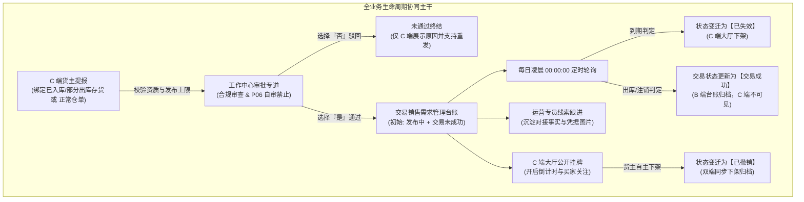
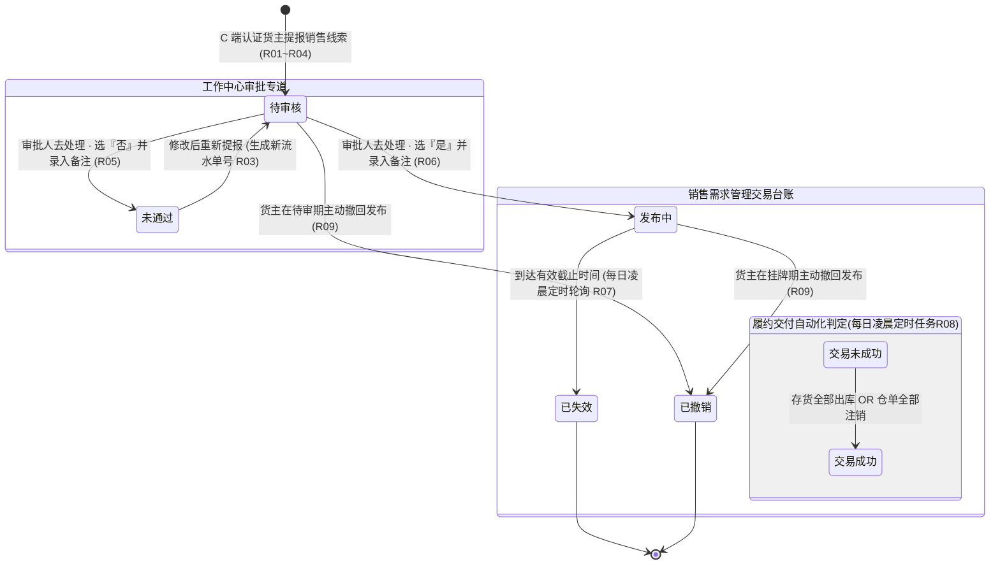
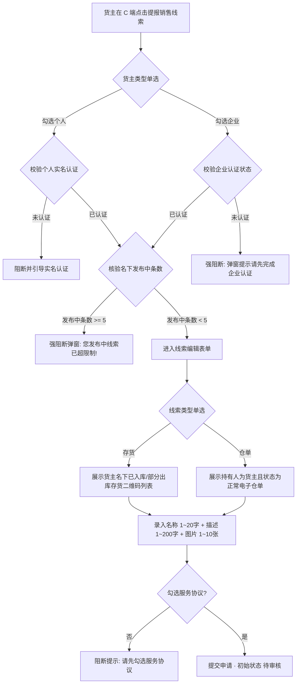
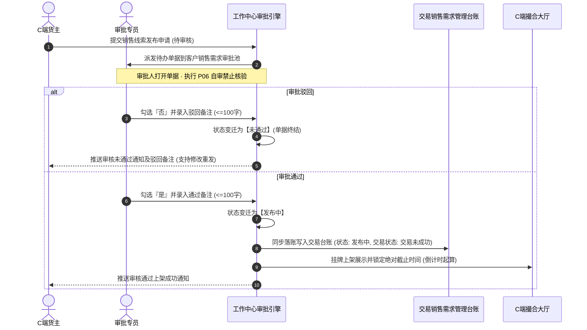
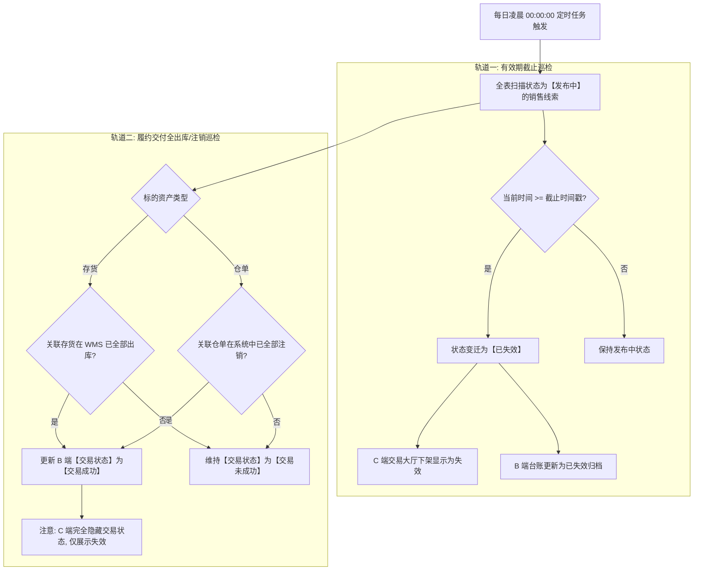
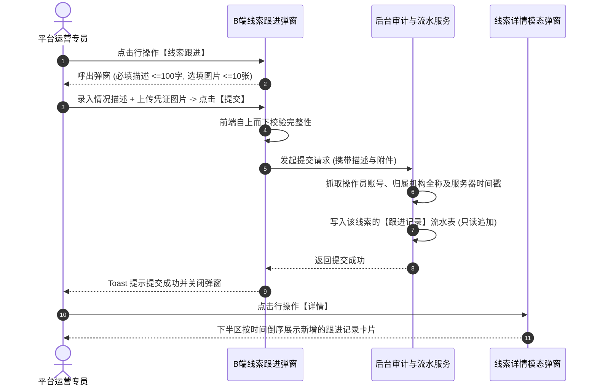

# 销售需求管理业务规则规格

> **文档定位**：交易 / 销售需求管理模块状态机生命周期、业务动作权限矩阵、前置校验规则、跨模块触发驱动机制以及数据合规审计逻辑的**唯一定义真源**。主 PRD、字段清单及端侧原型仅引用本文件规则名称与编号（如 `【规则业务名称】(Rxx)`、`【异常业务名称】(Cxx)`、`【权限业务名称】(Pxx)`），不重复定义规则本体。  
> **模块类型**：交易供需撮合与真实销售线索监管台账类（承接 C 端个人/企业认证货主提报、资产资质准入、工作中心审批通过驱动落账、每日凌晨定时状态轮询、存货全出库/仓单全注销触发交易成功以及运营跟进闭环）。  
> **参考文档**：[《销售需求管理主PRD》](./销售需求管理主PRD.md)、[《销售需求管理字段清单》](./销售需求管理字段清单.md)、[《00-功能与数据权限清单》](../../00-功能与数据权限/功能与数据权限清单.csv)。  
> **版本**：V2.0 | **更新时间**：2026-09-22 | **责任人**：森云科技（Senyun Technology）

---

## 一、单据与能力定位

| 项目 | 内容 |
| :--- | :--- |
| **单据层级** | **【第3层-贸易意向与供需台账层】**（全网真实资产销售线索存证与监控台账） |
| **核心职责** | 集中收录并监管全平台 C 端个人/企业认证货主提报、绑定真实质押或普通仓储资产，并经平台工作中心审核通过的销售意向线索；支撑多维度检索过滤、线索全要素明细穿透、运营跟进记录沉淀、每日凌晨定时任务状态巡检与交易成功履约判定，为后续大宗贸易撮合与销售合同签署提供不可伪造的真实业务依据。 |
| **单据来源** | **跨端审批通过事件驱动落账**： 1. C 端认证货主发起销售线索录入（初始生成【待审核】单据）； 2. B 端审批中心【工作中心 → 审批中心 → 客户需求审批 → 客户销售需求】审核通过； 3. 系统自动同步落入本台账，初始需求状态赋予【发布中】，初始交易状态赋予【交易未成功】。 |
| **上游依赖** | **实名与企业认证中心**：校验货主个人实名身份或企业资质认证合法性； **仓储管理系统（WMS）**：校验关联存货的库内状态（必须为 `已入库` 或 `部分出库`）及出库状态； **电子仓单系统**：校验关联仓单的持有人归属权及正常有效状态； **工作中心审批引擎**：提供前置风控与合规审查结论（【审核意见】弹窗流水）。 |
| **下游影响** | **C 端交易撮合大厅**：对外挂牌展示【发布中】的销售线索，供潜在买家浏览、关注与联系对接； **销售合同管理系统**：买卖双方达成交易意向后，作为生成《销售合同》的前序资产事实依据； **司法审计与风控追溯**：记录挂牌原貌、跟进流水、出库履约状态变迁，防止虚构贸易与重复挂牌。 |
| **归档台账边界** | **【发布中活跃监管与已失效/已撤销终态归档】**：主列表展示所有已审批通过的销售线索流水；状态自然失效或用户撤销后永久只读归档，不可逆恢复。 |
| **入口路径** | PC 列表查询：`交易 → 销售需求管理`（`P-JY-002`）；PC 详情查看：列表操作列【详情】（`P-JY-002-DETAIL`）；线索跟进：列表操作列【线索跟进】（`P-JY-002-FOLLOW`）。 |

---

## 二、数量与计算口径隔离表

| 口径名称 | 存在位置 | 业务含义与计算公式 | 约束与边界条件 |
| :--- | :--- | :--- | :--- |
| **线索名称字数** | C 端发布页 / 列表 / 详情 | 销售意向概括标题字符长度 $L_{\text{title}}$ | 整数范围：$1 \le L_{\text{title}} \le 20$ 字符；必填，禁止全空格 |
| **线索说明/描述字数** | C 端发布页 / 列表 / 详情 | 销售线索补充说明字符长度 $L_{\text{desc}}$ | 整数范围：$1 \le L_{\text{desc}} \le 200$ 字符；必填，暂仅支持纯文本 |
| **用户发布中线索上限** | C 端发布提交拦截 | 单个货主主体在全平台同时处于【发布中】状态的最大线索数量 $N_{\text{pub}}$ | 限制条件：$N_{\text{pub}} < 5$；当 $N_{\text{pub}} \ge 5$ 时强校验阻断提交申请 |
| **线索有效期档位** | C 端发布单选 / 列表 / 详情 | 货主自主指定的线索挂牌生效总自然日历天数 $D_{\text{valid}}$ | 严格单选枚举：$D_{\text{valid}} \in \{7, 15, 30\}$ 天；最长支持 30 天，提交后不可变更 |
| **有效期倒计时绝对截止时间** | 系统服务端计算 / C 端大厅倒计时 | 线索对外公开挂牌的最晚截止时刻： $$T_{\text{expire}} = T_{\text{pass}} + D_{\text{valid}} \times 86400\text{秒}$$ | 以工作中心审批通过时刻 $T_{\text{pass}}$ 为绝对起算点，精确到秒；自然时间届满触发自动下架失效 |
| **线索图片数量与规格** | C 端发布页 / 详情展示 | 随线索提报的存货实物样品、包装、现场照片数量 $N_{\text{img}}$ | 整数范围：$1 \le N_{\text{img}} \le 10$；格式限 JPG/PNG/JPEG；单张大小 $\le 5\text{MB}$ |
| **关注人数** | 列表展示 | C 端其他买家用户在客户端对该销售线索点击“关注/收藏”的去重累计人数 $C_{\text{fav}}$ | 非负整数：$C_{\text{fav}} \ge 0$；同一买家账号多次点击不重复计数 |
| **跟进情况描述字数** | 线索跟进弹窗 / 详情跟进记录 | 运营人员录入的线索对接进展与跟进事实文字长度 $L_{\text{follow}}$ | 整数范围：$1 \le L_{\text{follow}} \le 100$ 字符；必填，超出截断 |
| **跟进其他信息图片规格** | 线索跟进弹窗 / 详情跟进记录 | 运营人员提交的跟进凭据、会话截图文件数量 $N_{\text{follow\_img}}$ | 整数范围：$0 \le N_{\text{follow\_img}} \le 10$；单张 $\le 5\text{MB}$；格式限 JPG/PNG/JPEG |
| **定时任务轮询周期** | 系统后台分布式调度 | 每日凌晨扫描更新【已失效】与【交易成功】状态的定时调度任务 | 每日凌晨 00:00:00 准时触发执行一次，完全幂等执行 |

---

## 三、单据状态机与流转定义

销售需求具备**需求生命周期状态**与**交易履约状态**双轨正交模型：

### 3.1 状态定义

#### 3.1.1 需求生命周期状态 (`demand_status`)
| 状态名称 | 状态编码 | 业务含义 | 是否终态 | B端销售需求管理台账可见性 | 流转与呈现说明 |
| :--- | :--- | :--- | :---: | :---: | :--- |
| **待审核** | `PENDING_AUDIT` | C 端用户提交线索发布申请，等待工作中心审批 | 否 | **不可见** | 仅在 C 端“我的需求”及 B 端工作中心审批池流转 |
| **发布中** | `PUBLISHING` | 工作中心审批通过，线索正式在全网交易大厅挂牌生效，倒计时进行中 | 否 | **可见（台账初始态）** | **【核心活跃态】审批通过后实时落入本台账** |
| **未通过** | `AUDIT_REJECTED` | 工作中心审批驳回，信息不合规或资产不符合要求 | **是** | **不可见** | 终态留痕；仅 C 端可见，支持修改后重新提交 |
| **已失效** | `EXPIRED` | 线索挂牌运行达到有效期天数，系统每日凌晨定时任务或实时判定到期自动下架 | **是** | **可见（终态归档）** | 终态归档；C 端下架并显示为“失效”，B 端台账永久留痕可查 |
| **已撤销** | `REVOKED` | 货主用户在 C 端主动点击下架/撤回已发布的线索 | **是** | **可见（终态归档）** | 终态归档；C 端下架隐藏，B 端台账实时联动更新为已撤销 |

#### 3.1.2 交易履约状态 (`trade_status`) —— B 端独有管理状态
| 状态名称 | 状态编码 | 业务含义 | 判定规则与触发条件 | C 端可见性 |
| :--- | :--- | :--- | :--- | :---: |
| **交易未成功** | `TRADE_FAILED` | 线索标的物尚未全部出库交付，或到期失效/撤销时仍未达成交易履约 | 初始默认值；或线索失效/撤销时底层资产尚未全部出库/注销 | **不可见**（C端无此字段展示） |
| **交易成功** | `TRADE_SUCCESS` | 线索所绑定的存货已全部出库，或仓单已全部注销 | 每日凌晨定时任务自动判定底层资产状态，若存货全出库或仓单全注销，自动更新为此状态 | **不可见**（C端仅看到状态为“失效”） |

### 3.2 复合状态矩阵与流转图

---

## 四、动作能力与流转控制矩阵

| 触发动作 | 操作入口 | 适用角色 | 前置业务校验条件 | 结果状态 | 联动后置影响 | 失败阻断提示 |
| :--- | :--- | :--- | :--- | :--- | :--- | :--- |
| **提报销售线索** | C 端线索发布页【提交申请】按钮 | C 端认证货主 | ① 货主资质认证核验通过（个人已实名 / 企业已认证，R01）； ② 货主名下发布中线索 $< 5$ 条（R03）； ③ 存货状态为已入库/部分出库，或仓单状态正常（R02）； ④ 表单格式及协议勾选强校验（R04）。 | 待审核 | 生成销售线索记录；推送到 B 端工作中心审批池待办。 | 「提交失败：请先完成企业认证」 「您发布中线索已超限制，请您下架部分信息后再重新提交新的线索信息！」 「提交失败：[字段错误]」 |
| **去处理（审批）** | 工作中心【客户销售需求】行操作【去处理】 | 平台审核人员 | 具备客户销售需求审批权限；单据处于【待审核】状态 | - | 呼出【审核意见】模态弹窗。 | 「操作失败：单据已被他人处理或状态已变更」 |
| **提交审核意见（通过）** | 【审核意见】弹窗【确认】按钮 | 平台审核人员 | ① 勾选“是否同意”为【是】； ② 录入备注（必填，$\le 100$ 字）； ③ 严格遵循自审禁止规范。 | 发布中 | ① **首次同步写入 B 端销售需求管理台账**； ② C 端交易大厅上架展示； ③ 锁定有效期绝对截止时间； ④ 交易状态初始化为【交易未成功】。 | 「请选择审核意见」 「请输入备注，长度不超过100个字符」 |
| **提交审核意见（驳回）** | 【审核意见】弹窗【确认】按钮 | 平台审核人员 | ① 勾选“是否同意”为【否】； ② 录入备注（必填，$\le 100$ 字）。 | 未通过 | ① 单据终止，**不流入 B 端销售需求管理台账**； ② C 端展示未通过原因，支持重新修改发布。 | 「请选择审核意见」 「请输入备注，长度不超过100个字符」 |
| **撤销发布** | C 端“我的线索”【撤销发布】按钮 | 线索提报货主本人 | 单据处于待审核或发布中；通过二次确认弹窗 | 已撤销 | ① C 端大厅即刻下架隐藏； ② 若为发布中，B 端台账状态实时刷新为【已撤销】（R09）。 | 「撤销失败：当前状态不允许撤销」 |
| **凌晨定时轮询失效** | 后台分布式定时调度引擎 | 系统服务进程 | 每日凌晨 00:00:00 触发；单据处于发布中且 $\text{Now}() \ge T_{\text{expire}}$ | 已失效 | ① C 端下架显示为“失效”； ② B 端台账状态刷新为【已失效】（R07）。 | - |
| **凌晨定时轮询履约** | 后台分布式定时调度引擎 | 系统服务进程 | 每日凌晨 00:00:00 触发；线索所绑定的存货已全部出库，或仓单已注销 | 交易成功 | 更新 B 端台账【交易状态】为【交易成功】；C 端保持原状（R08）。 | - |
| **线索跟进** | B 端台账列表行操作【线索跟进】链接 | 平台运营人员 | 具备销售需求跟进权限；输入情况描述（必填，$\le 100$ 字） | 维持原状态 | 将跟进事实、提交人（账号+机构）及凭证图片沉淀至详情跟进历史流水（R10）。 | 「请输入情况描述」 「上传图片大小不可超过 5MB」 |
| **查看详情** | B 端台账列表行操作【详情】链接 | 平台运营人员 | 具备销售需求管理查询权限 | 维持原状态 | 弹出居中【线索详情】模态弹窗，展示线索全要素、存货/仓单明细及跟进历史记录（R11）。 | - |
| **切换查看明文电话** | 详情弹窗联系方式旁【👁️ 眼睛图标】 | 平台运营人员 | 具备脱敏数据查看权限 | 维持原状态 | 切换显示明文电话号码，再次点击恢复掩码，后台记录脱敏查阅审计日志（R11b）。 | 「权限不足，无法查看明文联系方式」 |

---

## 五、核心业务规则规格与时序流图

### 5.1 资质准入与提报强校验流程

#### 5.1.1 【C 端发布主体资质核验】(R01)
- **规则编号**：`R01`
- **详细要求**：个人强校验姓名+身份证二要素；企业强校验统一社会信用代码及营业执照，未完成认证弹窗阻断。

#### 5.1.2 【标的资产准入白名单约束】(R02)
- **规则编号**：`R02`
- **详细要求**：存货仅限库内处于 `已入库` 或 `部分出库` 状态；仓单仅限处于 `正常` 状态，质押冻结或已注销资产禁止进入备选池。

#### 5.1.3 【用户发布中线索数量上限控制】(R03)
- **规则编号**：`R03`
- **详细要求**：单个货主账号处于【发布中】状态的最大线索数量限制为 5 条，满 5 条提交时立即弹窗阻断。

#### 5.1.4 【表单录入完整性与服务协议强校验】(R04)
- **规则编号**：`R04`
- **详细要求**：名称 $\le 20$ 字；描述 $\le 200$ 字；图片 $1 \sim 10$ 张（单张 $\le 5\text{MB}$）；强制勾选服务协议。

---

### 5.2 审批裁决与落账驱动时序流

#### 5.2.1 【工作中心审核流转与自审禁止】(R05)
- **规则编号**：`R05`
- **详细要求**：单选是否同意（必选）；备注 1~100 字（必填）；P06 自审禁止拦截本人审批。

#### 5.2.2 【审批通过驱动台账生成与发布起算】(R06)
- **规则编号**：`R06`
- **详细要求**：通过后实时写入本台账，记录发布时间戳，锁定到期时间：$T_{\text{expire}} = T_{\text{pass}} + D_{\text{valid}} \times 86400$ 秒。

---

### 5.3 每日凌晨 00:00:00 分布式定时轮询双轨机制

#### 5.3.1 【每日凌晨定时任务轮询与自动到期失效】(R07)
- **规则编号**：`R07`
- **详细要求**：每日凌晨 00:00:00 巡检，$\text{Now}() \ge T_{\text{expire}}$ 触发变迁为【已失效】并联动 C 端下架。

#### 5.3.2 【存货全出库/仓单全注销驱动交易成功判定】(R08)
- **规则编号**：`R08`
- **详细要求**：存货物理库存全部出库或仓单全部注销时，系统更新为【交易成功】；**C 端严格隐藏该状态**。

#### 5.3.3 【C 端货主自主撤销与跨端实时下架】(R09)
- **规则编号**：`R09`
- **详细要求**：货主在 C 端主动撤销，C 端大厅即刻下架，B 端台账实时联动变迁为【已撤销】。

---

### 5.4 运营线索跟进闭环与审计时序

#### 5.4.1 【线索跟进闭环与结构化记录沉淀】(R10)
- **规则编号**：`R10`
- **详细要求**：情况描述必填（$\le 100$ 字），凭证图片选填（$\le 10$ 张，单张 $\le 5\text{MB}$）；提交固化操作人账号与归属机构，支持多次跟进追加。

#### 5.4.2 【详情全要素穿透与联系方式脱敏显隐】(R11)
- **规则编号**：`R11`
- **详细要求**：手机号默认脱敏；点击【👁️ 眼睛图标】原位切换明文，后台静默记录审计日志。

---

## 六、异常场景与防御性规则

| 异常编号 | 异常场景与触发条件 | 潜在风险 | 系统防御与闭环处理逻辑 | 客户端或前端呈现 |
| :--- | :--- | :--- | :--- | :--- |
| **C01** | 货主选中的存货在审批流转期间已在 WMS 被全部出库或冻结 | 造成挂牌空单，引发买家虚假交易纠纷 | 审批通过前及定时任务轮询时二次校验底层存货库存可用量，若可用量为 0 则强校验拦截发布 | 审批驳回提示“关联存货已被消耗完毕，无法发布” |
| **C02** | 货主选中的仓单在挂牌期间被质押锁定或司法冻结 | 货权权利受限，无法履约交付 | 监听仓单状态变迁事件；一旦仓单状态变为非正常态，系统自动触发线索强制下架并标记失效 | 状态变迁为【已失效】，跟进记录写入系统自动下架原因 |
| **C03** | 用户弱网环境下快速连续点击【提交申请】按钮 | 并发重复生成多条相同的销售线索单据 | 客户端按钮防抖置灰；服务端按 `用户ID + 标的资产ID + 时间戳窗口` 施加 Redis 分布式防重锁 | 提示“请勿重复提交” |
| **C04** | 每日凌晨定时调度任务因服务器重启或异常中断 | 到期线索未能按时失效，交易状态未能按时更新 | 定时任务设计为**完全幂等性**；支持服务恢复后自动补跑，且按日历时间绝对值判定，不依赖累加计时 | 系统后台报警留痕，补跑后状态完全一致 |
| **C05** | 运营人员跟进时上传非图片格式（如 exe/bat）或超大文件 | 系统安全漏洞与服务器存储占满 | 前端严格限制 `accept="image/jpg,image/jpeg,image/png"`；后端提取文件头 Magic Bytes 强校验格式，单张超 5MB 拦截 | 提示“图片格式为 jpg、png、jpeg，大小不超过 5M” |

---

## 七、权限控制规则

| 权限编码 | 权限名称 | 对应页面/动作 | 授权角色 | 业务约束与鉴权边界 |
| :--- | :--- | :--- | :--- | :--- |
| **P-JY-002** | 销售需求管理菜单访问 | 查看主列表、执行多维筛选检索 | 平台运营专员、业务主管、风控合规岗 | 顶级机构数据隔离：仅可查询登录账号所属顶级机构管辖的销售线索流水 |
| **P-JY-002-VIEW** | 线索详情查阅 | 点击操作列【详情】查看模态弹窗 | 平台运营专员、业务主管、风控合规岗 | 只读权限，弹窗内字段全禁止编辑 |
| **P-JY-002-FOLLOW** | 线索跟进提交 | 点击操作列【线索跟进】并提交表单 | 平台业务运营人员、撮合专员 | 必须录入情况描述；提交后固化提交人账号与归属机构 |
| **P-JY-002-UNMASK** | 货主手机号明文查阅 | 点击详情弹窗手机号旁【👁️ 眼睛图标】 | 业务主管、客户经理（普通访客不可见眼睛图标） | 具备该权限方可切换明文，系统全程审计留痕 |
| **P-GZZX-AUDIT-SALE** | 客户销售需求审批裁决 | 工作中心点击【去处理】提交审核意见 | 平台审核岗、风控主管 | 遵循自审禁止约束，不可审批本人发起的线索申请 |

---

## 八、修订记录

| 版本号 | 修订日期 | 修订人 | 修订内容概述 |
| :--- | :--- | :--- | :--- |
| **V1.0** | 2026-09-22 | 森云科技 PM 团队 | 首次初始化《销售需求管理业务规则规格》。 |
| **V2.0** | 2026-09-22 | 森云科技 PM 团队 | **流程可视化全面升级**：补全 6 组核心业务流程 Mermaid 图（全生命周期协同流、双轨正交状态机流、C端提报强校验流、审批落账时序流、每日凌晨双轨轮询流、运营跟进时序流）；全面对齐仓储标杆排版规范。 |
