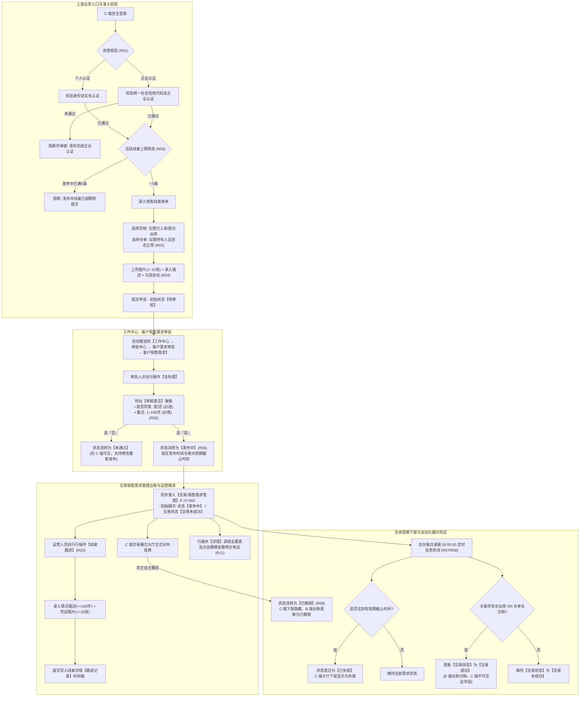
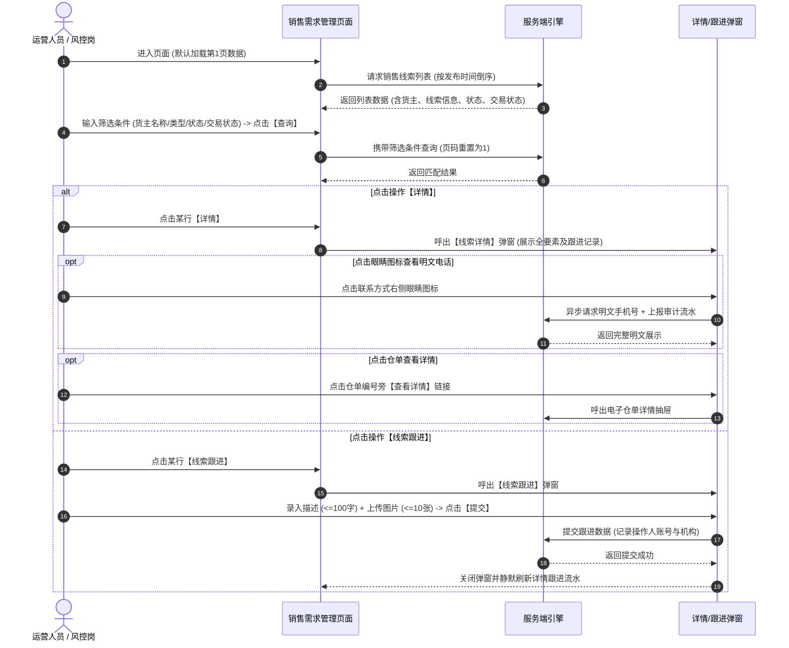
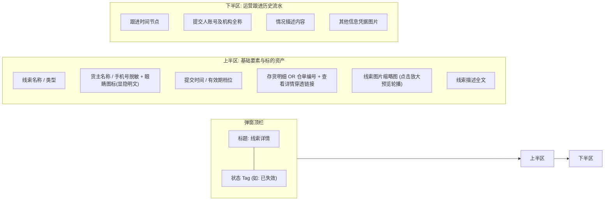
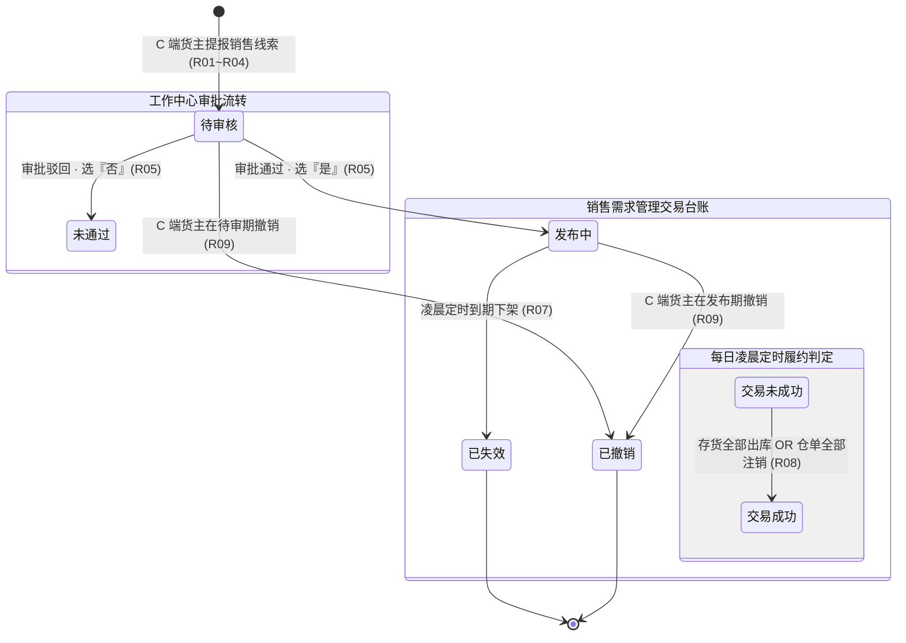

# 销售需求管理主PRD

> **模块定位**：交易 / 销售需求管理是面向大宗商品供应链金融与存货监管体系的“全网销售线索监管、供需撮合与履约监控台账中枢”。本模块承接来自 C 端（个人实名认证或企业认证货主）提报、绑定真实质押或普通在库动产物资/电子仓单，并经平台工作中心审核通过的合规销售意向，提供全网销售需求的多维检索、流转监控、运营线索跟进及履约状态追溯，为下游供需对接、贸易背景真实性核验及后续交易合同生成提供不可伪造的前序业务凭证。  
> **端侧协同与链路说明**：
> - **需求发布端（C 端）**：完成个人实名或企业认证的货主，在客户端选择名下处于【已入库】/【部分出库】的真实存货或【正常】状态仓单，录入销售意向并提交，初始生成【待审核】单据；系统强校验限制单个货主处于【发布中】状态的线索不超过 5 条；
> - **审批中心（B 端）**：单据提交后自动推送到【工作中心 → 审批中心 → 客户需求审批 → 客户销售需求】；审批人员通过【去处理】弹出【审核意见】弹窗（选择是否同意、录入 100 字内备注）进行合规裁决；
> - **交易管理台账（B 端 PC·本模块）**：仅同步展示**审核通过**后的有效销售线索，初始状态为【发布中】，初始交易状态为【交易未成功】；运营人员可执行【线索跟进】沉淀业务进展；
> - **履约自动化判定（系统定时任务）**：每日凌晨定时任务轮询，若线索达到有效期天数则自动变迁为【已失效】并从 C 端下架；若关联存货全部出库或仓单全部注销，则自动将 B 端交易状态更新为【交易成功】（该交易状态为 B 端专有字段，C 端不可见）；
> - **数据权限**：所有数据挂靠顶级机构，登录账号具有对应机构数据权限即可查看全量或所辖销售线索。  
> **版本**：V2.0 | **更新时间**：2026-09-22 | **责任人**：森云科技（Senyun Technology）  
> **编写依据**：[销售需求管理字段清单.md](./销售需求管理字段清单.md) 是本模块所有字段定义、枚举与页面展示的唯一基准；[销售需求管理业务规则规格.md](./销售需求管理业务规则规格.md) 是本模块状态机、校验算法、有效期控制、生命周期流转及数据安全的唯一定义来源；上游审批源头为 [客户销售需求主PRD.md](../../01-工作中心/01-审批中心/04-客户需求审批/05-客户销售需求/客户销售需求主PRD.md)。

---

## 1. 业务背景与业务痛点

### 1.1 业务背景
在供应链金融动产质押与大宗贸易场景中，货主企业往往面临存货周转慢、货权变现渠道窄的难题；而资方与核心企业则需要确保大宗物资在流转过程中的真实性与履约可控性。销售需求（线索）作为动产去化与贸易撮合的关键起点，直接反映了上游货主的现货供应意愿与货权资产状况。

平台通过构建数字化、闭环式的销售需求管理体系：
1. **资质核验与资产强绑定**：严格限定仅通过实名认证（个人）或企业认证的合法主体方可提报，且销售标的必须严格勾选在库真实存货（二维码批次维度）或有效电子仓单，从源头杜绝虚构空单与虚假贸易；
2. **B 端前置合规审批**：所有销售线索提报后统一进入工作中心专业审批，杜绝违规刷单与不实信息上线；
3. **交易大盘统一纳管与运营跟进**：审批通过后自动汇入交易大盘，支持平台撮合专员快速跟进对接并结构化记录跟进详情；
4. **出库履约全自动闭环**：联动底层仓储与仓单系统，通过每日凌晨定时任务自动感知存货出库与仓单注销，精准统计【交易成功】履约情况，为后续签署销售合同提供不可篡改的业务闭环。

### 1.2 核心业务痛点
1. **虚假挂牌与空气单横行**：传统撮合平台允许用户随意填写商品文本，缺乏与底层仓储、仓单系统的强校验，极易产生“货不对板”甚至虚假质押货权倒卖；
2. **缺乏发布数量控制，恶意占坑刷屏**：若无发布上限限制，个别用户批量发布无效线索，挤占大盘展示资源与撮合资源；
3. **撮合跟进缺乏协同，过程黑盒化**：平台线下撮合人员对接买卖双方后，沟通情况散落在聊天记录中，缺乏统一的结构化留痕与凭证管理；
4. **履约转化难以统计，无法准确评估成交**：传统模式下线索发布后是否最终产生真实出库与交收全凭人工上报，系统无法自动度量真实的贸易转化率；
5. **货主敏感隐私泄露风险**：大宗商品货主联系方式极度敏感，若缺乏端到端掩码脱敏与查看审计机制，极易造成客户资源流失与合规风险。

---

## 2. 功能范围

| 包含功能范围 | 不包含功能范围 |
| :--- | :--- |
| - **全网销售线索多维组合筛选**：支持按货主名称（模糊匹配）、类型（全部/存货/仓单）、状态（全部/发布中/已失效/已撤销）、交易状态（全部/交易成功/交易未成功）进行精准查询； - **销售线索主列表规范呈现**：清晰呈现序号、货主（双行：名称/企业+脱敏手机号）、线索名称、线索类型、线索信息（存货明细/仓单编号）、状态、交易状态、线索有效期、线索说明（原表头线索时期）、关注人数、创建时间、发布时间及行操作； - **线索详情模态弹窗穿透（`P-JY-002-DETAIL`）**：居中调阅线索全要素镜像，包括标的存货/仓单动态展示（仓单支持【查看详情】链接穿透）、物证缩略图及下半区【跟进记录】时间轴； - **货主联系方式脱敏显隐切换**：默认中间 4 位掩码脱敏，详情弹窗支持点击眼睛图标原位切换明文，系统全程审计留痕； - **运营线索跟进闭环（`P-JY-002-FOLLOW`）**：支持运营人员随时提交情况描述（必填，$\le 100$ 字）与凭证图片（选填，$\le 10$ 张），提交后固化操作人账号与归属机构； - **每日凌晨定时任务自动化轮询**：每日凌晨自动更新到期线索为【已失效】，自动判定存货全出库/仓单全注销为【交易成功】； - **顶级机构数据权限物理隔离**：严格根据登录账号所属顶级机构进行数据权限过滤。 | - **B 端前台直接新增销售需求**：销售需求唯一入口设于 C 端认证货主发起，B 端管理台账不提供人工物理新增入口； - **B 端前台直接篡改线索内容**：销售意向已挂牌并向买方公开，B 端运营人员不可随意修改商品、价格、数量等核心信息； - **B 端前台物理删除线索记录**：本台账定位于真实业务存证中枢，失效与撤销单据永久逻辑归档，禁止数据库物理删除； - **C 端展示 B 端特有的交易状态**：【交易状态】属于后台管理指标，C 端用户不可见； - **审批中与驳回单据展示**：未通过审批的中间态由工作中心和 C 端承载，不流入本正式台账； - **跨租户/越权数据查询**：严格禁止跨机构越权访问。 |

---

## 3. 模块定位与系统链路

---

## 4. 页面功能说明

### 4.1 PC 端主列表页面（`P-JY-002`）

> 对应系统最新截图图 1，路径：`交易 → 销售需求管理`。

#### 4.1.1 页面操作与交互时序流

#### 4.1.2 页面目标与骨架
- **页面目标**：供平台运营人员、风控管理人员全面掌握全网已发布生效及已归档的销售线索，进行多维检索过滤、查看意向明细与跟进履约进度。
- **页面布局**：
  - **顶部标题区**：左侧展示页面一级标题 `销售需求管理`；
  - **筛选查询区**：横向单行排列四个条件项（货主名称、类型、状态、交易状态）与一个【查询】按钮；
  - **数据表格区**：卡片式表格，横向铺满，表头固定，支持 13 项标准列清晰呈现；
  - **底部统计与分页区**：左侧展示当前数据总条数（如 `共 8 条`）与每页条数选择器（如 `10条/页`），右侧展示翻页按钮与前往指定页码输入框。

#### 4.1.3 筛选查询区规格
1. **货主名称**：单行文本输入框，占位提示“请输入货主名称”，支持输入货主个人姓名或企业名称关键词，前后自动去除空格，执行模糊匹配；
2. **类型**：下拉单选框，选项包含 `全部`、`存货`、`仓单`，默认选中 `全部`；
3. **状态**：下拉单选框，选项包含 `全部`、`发布中`、`已失效`、`已撤销`，默认选中 `全部`；
4. **交易状态**：下拉单选框，选项包含 `全部`、`交易成功`、`交易未成功`，默认选中 `全部`；
5. **【查询】按钮**：金黄色/琥珀色高亮按钮，点击后立即以当前筛选条件刷新列表，当前页码自动重置为第 1 页。

#### 4.1.4 表格数据列呈现与格式化
1. **序号**：正整数序列号（如 1、2、3），切换分页时动态重排；
2. **货主**：双行居左展示，第一行为货主真实姓名（个人）或企业全称（企业），第二行为脱敏联系方式（如 `克格勃` `188****1268`）；
3. **线索名称**：单行文本展示（如 `23423`、`打个广告`、`10000吨苹果寻求买家，诚心卖`），文字过长时省略并支持鼠标悬浮气泡展示完整内容；
4. **线索类型**：文本居中展示（`存货` 或 `仓单`）；
5. **线索信息**：
   - 存货类：展示为 `{大类}-{品类}-{规格}-{数量}{单位}`（如 `饮料-碳酸-可口可乐-50%-33瓶`），若关联多件存货换行并列展示；
   - 仓单类：展示为电子仓单全称编号（如 `CD1961651101066789985`）；
6. **状态**：生命周期状态文本，发布中为正常文本，已失效、已撤销展示为浅灰文字；
7. **交易状态**：履约状态文本，展示为 `交易成功`（表示底层物资已全部出库/仓单已全部注销）或 `交易未成功`（初始或未完成全部交收）；
8. **线索有效期**：居中展示所选有效期天数（如 `7天`、`15天`、`30天`）；
9. **线索说明**：单行展示补充说明内容（如 `24323234`、`很好 很快 有保障`），界面表头原样显示为【线索时期】，超长截断；
10. **关注人数**：居中数值展示（如 `0`、`1`、`2`），反映该线索在 C 端被买家用户收藏关注的热度；
11. **创建时间**：时间戳展示，格式为 `YYYY-MM-DD HH:mm:ss`（如 `2026-03-25 16:42:33`）；
12. **发布时间**：时间戳展示，格式为 `YYYY-MM-DD HH:mm:ss`（如 `2026-03-26 14:10:06`），即工作中心审批通过时间，列表默认按此时间倒序排列；
13. **操作**：包含两项金黄色/琥珀色文字操作链接：
    - **【详情】**：点击居中呼出线索详情模态弹窗；
    - **【线索跟进】**：点击居中呼出线索跟进录入模态弹窗。

---

### 4.2 PC 端线索详情模态弹窗（`P-JY-002-DETAIL`）

> 对应系统最新截图图 2，点击列表操作列【详情】呼出。

#### 4.2.1 弹窗结构与视觉
- **弹窗规格**：居中模态弹窗，宽度约 600px，背景半透明遮罩；顶部居左展示标题 `线索详情`，标题右侧带对应状态浅黄色 Tag（如截图所示 `已失效`），右上角带 “×” 关闭图标；
- **上半区：线索全要素只读明细**：
  - **线索名称**：展示提报标题（如 `23423`）；
  - **线索类型**：展示资产凭证属性（如 `存货`）；
  - **货主名称**：展示货主认证姓名/企业名及默认脱敏手机号（如 `克格勃 188****1268`）；
  - **货主联系方式**：展示默认脱敏手机号（如 `188****1268`），右侧配有【👁️ 眼睛图标】。点击眼睛图标原位切换为 11 位明文手机号（如 `18812341268`），再次点击恢复掩码保护；
  - **提交时间**：展示客户端首次提报入库时间戳（如 `2026-03-25 16:42:33`）；
  - **线索有效期**：展示有效期档位（如 `7天`）；
  - **存货 / 仓单**：动态字段标签。若为存货类型，标签显示为 `存货:`，内容格式为 `{大类}-{品类}-{规格}-{数量}({单位})`（如 `饮料-碳酸-可口可乐-50%-33(瓶)`）；若为仓单类型，标签显示为 `仓单:`，内容展示为仓单编号并附带金色 **【查看详情】** 穿透链接；
  - **线索图片**：展示 C 端上传的存货实物图片缩略图（正方形圆角），点击唤起全屏原图预览轮播；
  - **线索描述**：多行展示线索描述全文（如 `24323234`）。
- **下半区：【跟进记录】时间轴**：
  - 上下半区以浅灰分割线隔开，标题展示 `跟进记录`；
  - 按提交时间倒序呈现时间轴节点：跟进时间、提交人账号及机构全称、情况描述、其他信息凭证图片。

---

### 4.3 PC 端线索跟进模态弹窗（`P-JY-002-FOLLOW`）

> 对应系统最新截图图 3，点击列表操作列【线索跟进】呼出。

#### 4.3.1 表单字段与交互行为
- **弹窗标题**：居中展示 `线索跟进`，右上角带 “×” 关闭图标；
- **情况描述（* 必填）**：多行文本框（textarea），高度自适应；占位提示“请输入情况描述”；右下角计数器 `0/100`；必填项，未填提交提示红字 `请输入情况描述`；
- **其他信息（选填）**：虚线框图片上传控件，中心带 `+ 请上传图片` 图标；辅助说明：“注：图片格式为 jpg、png、jpeg，大小不超过 5M，最多支持上传 10 个文件”；
- **底部操作按钮**：
  - **【取消】按钮**：左侧白底灰边框按钮，点击关闭弹窗，清空录入；
  - **【提交】按钮**：右侧金黄色/琥珀色高亮按钮，强校验必填项后提交，服务端记录操作人账号、归属机构全称与时间戳，提示“提交成功”并关闭弹窗。

---

## 5. 核心业务场景

### 场景一：企业货主提报在库存货销售意向并审批上线
1. **背景**：某大型铝业贸易商在监管仓库中存有一批处于“已入库”状态的铝锭，期望通过平台寻找下游买家；
2. **C 端发起**：货主登录 C 端，选择货主类型为【企业】（系统核验其已完成企业认证），在选择货物弹窗中勾选该批二维码铝锭资产（系统校验货主当前活跃发布中线索为 2 条，$< 5$ 条允许发布），录入线索名称“特级电解铝锭诚心出手”，选择 30 天有效期，上传仓储实物照片 3 张，录入描述并勾选协议后提交；
3. **工作中心审批**：单据状态初始为【待审核】，推送到工作中心审批池；审核员审查贸易资质无误，点击【去处理】呼出弹窗，勾选“是”，录入备注“货物资质完备，同意发布”；
4. **交易台账同步与挂牌**：系统自动将该需求同步写入【销售需求管理】台账，状态显示为【发布中】，交易状态初始化为【交易未成功】，全网大厅同步对外公开展示。

### 场景二：运营撮合专员多维检索与录入跟进进展
1. **背景**：平台运营专员负责华东片区电解铝的供需撮合对接；
2. **检索线索**：运营专员进入 `交易 → 销售需求管理`，在顶部筛选区选择类型为【存货】，状态选择【发布中】，点击【查询】；
3. **调阅明细**：专员点击行操作【详情】，调阅线索详情弹窗，查看铝锭规格、包装照片，并点击货主联系方式旁的【👁️ 眼睛图标】查看明文联系电话；
4. **线下沟通与跟进沉淀**：专员通过电话联系货主与潜在买方对接意向后，关闭详情弹窗，点击该行操作【线索跟进】；在弹窗中录入情况描述“已匹配下游买家江苏某制造企业，双方初步达成每吨定金共识”，上传微信沟通截屏 1 张，点击【提交】；
5. **审计追溯**：提交成功后，该跟进记录固化至详情页时间轴，永久留痕。

### 场景三：关联存货全部出库，系统自动判定【交易成功】
1. **背景**：买卖双方通过平台对接后，在线下签署销售合同并完成了监管仓库提货出库流程；
2. **WMS 出库流转**：该批铝锭在仓储监管系统中完成全部出库审核，对应二维码货物的在库物理库存变为 0；
3. **定时任务自动化处理**：次日凌晨 00:00:00，系统定时任务启动自动巡检，检测到该条销售线索所绑定的铝锭资产已全部完成出库；
4. **状态更新**：系统自动将该销售线索在【销售需求管理】台账中的【交易状态】从【交易未成功】更新为【交易成功】；C 端用户大厅该线索仍自然显示为失效状态，平台成功统计到一笔真实转化闭环。

---

## 6. 状态机摘要

销售需求采用**需求生命周期**与**交易履约状态**双轨管理模型（详见 [销售需求管理业务规则规格.md §三](./销售需求管理业务规则规格.md)）：

---

## 7. 核心业务规则摘要

本模块业务动作与校验规则受 [销售需求管理业务规则规格.md](./销售需求管理业务规则规格.md) 唯一约束，核心要点摘要如下：

1. **发布资质与企业认证强制阻断 (R01)**：个人必须完成实名认证；勾选企业必须完成企业认证，否则强校验拦截并弹出认证提醒；
2. **标的资产真实在库白名单 (R02)**：存货仅限处于 `已入库`、`部分出库` 状态（按二维码维度展示）；仓单仅限处于持有人为当前货主且状态为 `正常` 的有效电子仓单；
3. **发布中线索不超过 5 条上限 (R03)**：单账号处于发布中线索 $\ge 5$ 条时，强校验阻断提交，提示“您发布中线索已超限制，请您下架部分信息后再重新提交新的线索信息！”；
4. **工作中心审批与自审禁止 (R05)**：单据必须经工作中心去处理审核，提报人不可审批本人提交的线索；
5. **审批通过落账与倒计时锁定 (R06)**：审批通过实时写入本台账，记录发布时间，锁定绝对到期时间戳；
6. **每日凌晨定时失效更新 (R07)**：每日凌晨 00:00:00 分布式定时任务扫描到期数据，自动更新为【已失效】并联动 C 端下架；
7. **存货全出库/仓单全注销触发交易成功 (R08)**：每日凌晨定时扫描关联资产状态，若存货全出库或仓单全注销，系统自动将 B 端交易状态标注为【交易成功】；**C 端不可见此字段**；
8. **线索跟进闭环 (R10)**：情况描述必填（$\le 100$ 字），凭证图片选填（$\le 10$ 张，单张 $\le 5\text{MB}$），提交后沉淀到详情时间轴；
9. **脱敏保护与眼睛图标切换明文 (R11)**：货主手机号默认掩码脱敏，点击眼睛图标原位切换明文，后台记录操作审计日志；
10. **防篡改与禁止前台物理删除 (R13)**：只读台账定位，无人工编辑与删除入口，确保司法存证效力。

---

## 8. 权限与数据隔离

### 8.1 RBAC 角色权限矩阵
- **平台审核岗**：负责工作中心【客户销售需求】单据审批裁决（`P-GZZX-AUDIT-SALE`）；
- **平台运营专员 / 撮合专员**：负责本台账查询、查看详情、提交【线索跟进】（`P-JY-002`、`P-JY-002-FOLLOW`）；
- **业务主管 / 风控管理岗**：拥有台账全量查询、详情查阅及联系方式明文切换查看权限（`P-JY-002-UNMASK`）。

### 8.2 顶级机构数据隔离
- 本模块所有销售线索数据均挂靠平台顶级机构；
- 登录账号根据分配的机构数据权限范围进行数据隔离，仅能调阅所辖机构的货主销售线索，防止越权穿透。

---

## 9. 验收标准与测试要点

| 序号 | 测试维度 | 核心验收标准与测试步骤 | 预期结果 |
| :---: | :--- | :--- | :--- |
| **TC01** | C 端线索上限校验 | 货主账号已有 5 条发布中线索，再次尝试提交第 6 条线索 | 提交时阻断并弹窗提示“您发布中线索已超限制，请您下架部分信息后再重新提交新的线索信息！” |
| **TC02** | 企业认证阻断 | 仅完成个人实名但未完成企业认证的账号，货主类型选择【企业】 | 弹出认证提醒弹窗，阻断提报流程 |
| **TC03** | 存货备选池白名单 | 进入选择货物弹窗，查看备选列表 | 仅能查看货主名下处于【已入库】或【部分出库】的二维码货物；待入库或冻结货物不可见 |
| **TC04** | 审批通过同步落账 | 工作中心审批员点击去处理，勾选“是”，录入备注后提交确认 | B 端销售需求管理主列表立即新增该记录，状态为【发布中】，交易状态为【交易未成功】 |
| **TC05** | 列表组合过滤与重置 | 在筛选区输入货主名称，选择类型【存货】、状态【发布中】、交易状态【交易未成功】，点击查询 | 列表精确过滤匹配记录，页码重置为 1 |
| **TC06** | 手机号脱敏与明文显隐 | 点击行操作【详情】，查看货主联系方式，点击右侧【👁️ 眼睛图标】 | 默认显示 `188****1268`；点击眼睛后显示明文 `18812341268`，再次点击恢复掩码；后台生成审计日志 |
| **TC07** | 线索跟进录入与字数校验 | 点击行操作【线索跟进】，不填情况描述直接点击提交；填写 105 字；填写 50 字并上传 2 张图片提交 | ① 为空时提示红字“请输入情况描述”； ② 超过 100 字截断拦截； ③ 50 字及图片提交成功，详情页跟进记录时间轴新增一条记录 |
| **TC08** | 每日凌晨定时失效处理 | 发布一条 7 天有效期的线索，模拟定时任务到达截止时间触发轮询 | 状态自动变迁为【已失效】，C 端大厅同步下架 |
| **TC09** | 存货全出库触发交易成功 | 模拟该线索绑定的存货在 WMS 系统中全部完成出库，触发每日凌晨定时任务 | B 端台账【交易状态】自动更新为【交易成功】；C 端对应界面不可见此字段 |
| **TC10** | C 端主动撤销发布 | 货主在 C 端对处于发布中的线索点击【撤销发布】并确认 | C 端立即下架隐藏，B 端台账状态实时联动变迁为【已撤销】 |

---

## 10. 修订记录

| 版本号 | 修订日期 | 修订人 | 修订内容概述 |
| :--- | :--- | :--- | :--- |
| **V1.0** | 2026-09-22 | 森云科技 PM 团队 | 首次初始化《销售需求管理主PRD》。 |
| **V2.0** | 2026-09-22 | 森云科技 PM 团队 | **排版与流程图升级**：补全主列表交互时序流与详情/跟进弹窗交互架构图；完善仓单穿透与双向互链。 |
