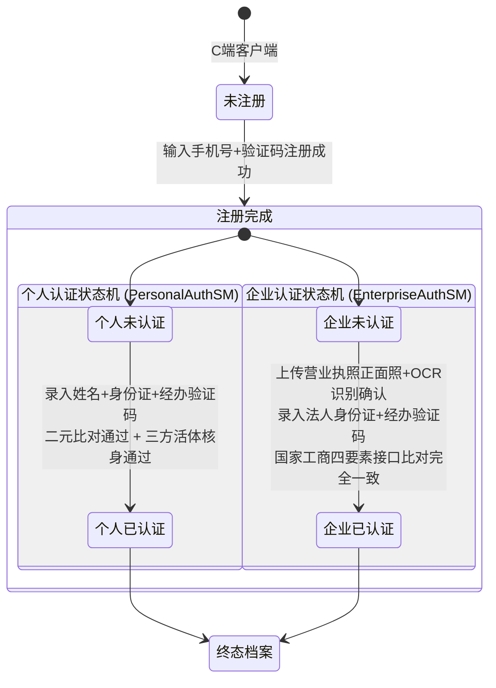
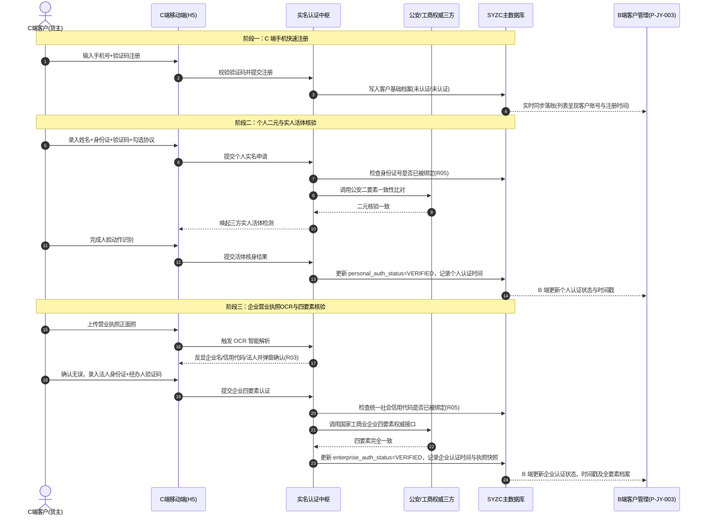
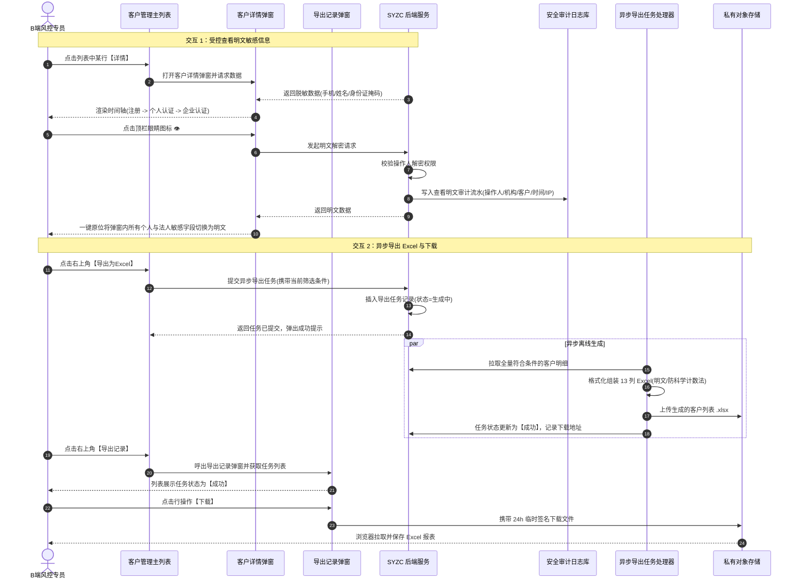

# 客户管理业务规则规格

> **文档定位**：交易 / 客户管理模块双正交状态机、动作控制矩阵、前置校验规则、OCR 防篡改锁定、二元/四要素权威核验、防重唯一性约束、敏感信息解密安全审计及异步导出调度的**唯一定义来源**。主 PRD、字段清单及端侧原型只引用本文件规则名称与编号，不重复定义规则本体。  
>
> **模块类型**：客户主数据 / 资质风控与监控台账（C 端源头注册与实名认证、B 端集中监控与司法级凭据追溯）  
>
> **参考文档**：[《客户管理主PRD》](./客户管理主PRD.md)、[《客户管理字段清单》](./客户管理字段清单.md)、[《00-功能与数据权限清单》](../../00-功能与数据权限/功能与数据权限清单.csv)、[《C端H5 个人实名认证》](../../../C端H5/01-用户认证/01-个人实名认证.md)、[《C端H5 企业实名认证》](../../../C端H5/01-用户认证/02-企业实名认证.md)  
>
> **版本**：V1.5 | **更新时间**：2026-09-22 | **责任人**：森云科技（Senyun Technology）

---

## 一、单据与能力定位

| 项目 | 内容 |
| :--- | :--- |
| **单据层级** | **【第1层-主数据/风控资质准入层】**（全平台客户统一身份与实名认证中枢档案） |
| **核心职责** | 统一纳管全网所有参与现货采购、销售挂牌、仓单质押、动产监管及电子合同签署的主体身份；贯通 C 端移动端与 B 端中台，记录注册、个人二元/活体核验、企业 OCR/四要素核验全流程，固化司法级资质证据链与不可变快照。 |
| **单据来源** | **唯一 C 端源头产生机制**： 1. **账号注册**：用户在 C 端客户端使用手机号码获取短信验证码完成注册，实时生成客户主档案（初始状态：个人未认证、企业未认证）； 2. **个人实名**：用户在 C 端提报姓名与身份证号码，完成公安二要素核验与实人一体活体检测后回写； 3. **企业实名**：用户在 C 端上传营业执照正面照，经 OCR 智能解析并弹窗确认，提交法人身份证号与经办人验证码，通过国家工商业四要素核验后回写。 |
| **上游依赖** | **三方权威核验接口**：公安部二要素身份核查接口、合规三方活体人脸核身 SDK、国家市场监督管理总局/工商业企业四要素数据库、企业营业执照智能 OCR 识别引擎； **短信服务网关**：用于注册及认证经办人手机验证码发送（带 60s 防刷倒计时）。 |
| **下游影响** | **交易模块**：销售意向提报与大宗采购需求提报的主体实名准入门槛； **仓储与仓单**：电子仓单确权、出入库货主主体匹配与提货人核身凭据； **风控与质押**：贷中风控授信主体统一归集、防重复借贷与集中度管控； **合同中心**：大宗买卖合同与监管协议的法定签署方印章与法人主体匹配。 |
| **归档台账边界** | **【B 端只读台账定位】**：客户管理主列表定位于全网注册客户资质监控与合规审查台账，**严禁在 B 端前台提供人工新增、修改、物理删除或密码重置入口**。 |

---

## 二、客户状态机与流转定义

客户在系统中具备自然人与企业法人的双重主体资质可能性。系统采用**独立正交双状态机**（`PersonalAuthSM` 与 `EnterpriseAuthSM`），两套状态机互不互斥、并行演进：

### 2.1 状态枚举定义

| 状态类型 | 状态名称 | 状态编码 | 业务含义 | 是否终态 | 列表展示风格 | 详情展示风格 |
| :--- | :--- | :--- | :--- | :---: | :--- | :--- |
| **个人认证** | **未认证** | `UNVERIFIED` | 客户未发起个人实名，或二元校验/活体核验未通过 | 否 | 常规灰字 | 红色实心圆点 + 标红文本 `未认证`，卡片内无明细 |
| **个人认证** | **已认证** | `VERIFIED` | 客户已通过姓名+身份证公安二要素及实人活体检测 | **是** | 常规黑字 | 绿色实心圆点 + 认证时间 + 展开卡片（姓名/身份证/手机） |
| **企业认证** | **未认证** | `UNVERIFIED` | 客户未发起企业实名，或 OCR/工商四要素比对未通过 | 否 | 常规灰字 | 红色实心圆点 + 标红文本 `未认证`，卡片内无明细 |
| **企业认证** | **已认证** | `VERIFIED` | 客户已通过营业执照 OCR 及国家工商四要素权威核验 | **是** | 常规黑字 | 绿色实心圆点 + 认证时间 + 展开卡片（企业名/税号/法人/经办人/执照） |

---

## 三、动作能力与流转控制矩阵

| 触发动作 | 操作入口 | 适用角色 / 端 | 前置业务校验条件 | 结果状态 | 联动后置影响 | 失败阻断提示 |
| :--- | :--- | :--- | :--- | :--- | :--- | :--- |
| **客户账号注册** | C端注册页面 | 外部任意访客 / C端移动端 | 手机号符合 11 位大陆手机格式；短信验证码正确且在有效期内 | 个人：未认证 企业：未认证 | ① 分布式事件广播注册成功； ② B 端客户管理台账（`P-JY-003`）准实时落账（记录客户账号脱敏值与注册时间）。 | 「验证码错误或已过期」 「该手机号已被注册」 |
| **提交个人实名** | C端个人认证页 | C端已登录用户 / C端移动端 | ① 姓名 $\le 10$ 字； ② 身份证格式合法； ③ 遵循【身份证唯一性防重】(R05)； ④ 勾选授权协议； ⑤ 二元公安比对一致且活体通过。 | 个人：已认证 | ① 固化个人认证时间戳； ② 固化姓名与身份证脱敏快照； ③ B 端台账个人认证列更新为【已认证】并记录时间。 | 「身份证信息已被绑定，无法重复使用！」 「实名认证失败，请再次核对您的身份信息是否填写正确；」 |
| **营业执照 OCR** | C端企业认证步骤一 | C端已登录用户 / C端移动端 | 营业执照正面原件照片清晰、完整、无反光 | 识别成功待确认 | 唤起【企业信息确认】弹窗展示识别的企业名、统一代码、法定代表人 | 「营业执照识别失败，请确保证件平整、字迹清晰」 |
| **提交企业实名** | C端企业认证表单 | C端已登录用户 / C端移动端 | ① 核心字段不可修改（遵循 R03）； ② 法人身份证格式正确； ③ 遵循【企业税号唯一性防重】(R05)； ④ 工商四要素比对完全一致。 | 企业：已认证 | ① 固化企业认证时间戳； ② 固化企业四要素与执照原件快照； ③ B 端台账企业认证列更新为【已认证】并记录时间。 | 「企业信息已被绑定，无法重复使用！」 「企业认证失败，请在此核对企业信息与法人信息是否正确；」 |
| **调阅客户详情** | B端主列表【详情】| 风控/运营专员 / B端PC | 具有客户管理菜单查阅权限 | 打开详情弹窗 | 渲染自底向上时间轴（注册 → 个人认证 → 企业认证），默认掩码脱敏 | 「网络异常，请刷新重试」 |
| **眼睛明文解密** | 详情顶栏眼睛图标 👁️ | 具有解密权限专员 / B端PC | 遵循【明文解密受控审计】(C01) | 明文呈现 | ① 写入安全审计日志流水； ② 弹窗内所有脱敏字段一键原位切为明文。 | 「您暂无敏感信息明文调阅权限」 |
| **发起异步导出** | 主列表【导出为Excel】| 运营专员 / B端PC | 具备导出权限；当前列表非空 | 任务创建成功 | ① 创建异步报表任务写入【导出记录】； ② 触发离线 Worker 组装 13 列 Excel。 | 「导出任务提交失败，请稍后重试」 |
| **下载导出报表** | 导出记录【下载】| 运营专员 / B端PC | 导出任务状态为【成功】 | 触发文件下载 | 动态生成 24 小时有效临时安全签名拉取 `.xlsx` 文件 | 「文件不存在或签名已失效」 |

---

## 四、核心业务规则规格（R / C / P / L）

### 4.1 规则大类 R：业务与核验规则

#### 【R01】C 端数据源头与 B 端只读台账定位规则
1. **源头唯一性**：平台所有客户账号主数据、个人身份认证档案及企业法人营业资质，**100% 取决于用户在客户端（C 端）自主提报与权威认证结果**；
2. **只读审计台账**：B 端【客户管理】（`P-JY-003`）定位于全网资质监控、风控准入审查与凭据追溯台账，**绝对禁止在 B 端提供人工新增客户、前台手工修改认证资料、注销账号或重置密码的物理入口**；
3. **准实时事件同步**：C 端完成注册或通过实名认证后，系统通过底层分布式消息总线异步发布事件，B 端监听并落库，全链路数据同步延迟控制在 $\le 1$ 秒内。

#### 【R02】个人实名二元核验与实人一体活体核身规则
1. **二元权威校验**：C 端用户提报个人认证时，后端对接公安部权威身份认证接口比对【真实姓名 + 18 位身份证号码】。若比对不一致，阻断流程并报错：  
   `实名认证失败，请再次核对您的身份信息是否填写正确；`；
2. **三方实人活体核身**：二元校验成功后，必须调用合规三方人脸识别 SDK 进行活体动作检测（眨眼、张嘴、点头等），杜绝翻拍照片、静态视频骗过验证，确保实名主体与操作主体人证合一；
3. **不可变存证固化**：核验成功后即刻固化认证时间戳与身份凭证，后续不可由用户自行重置。

#### 【R03】企业营业执照智能 OCR 识别与字段锁定规则
1. **智能 OCR 结构化提取**：用户上传营业执照正面照后，OCR 引擎自动提取三大核心字段：`企业名称`、`统一社会信用代码`、`法定代表人姓名`；
2. **弹窗核对机制**：必须弹出【企业信息确认】弹窗展示识别结果，用户确认无误方可进入表单；若识别偏差，用户点击【信息有误重新识别】关闭弹窗重新上传清晰原件；
3. **关键字段防篡改锁定（防PS造假）**：进入表单后，`企业名称`、`统一社会信用编码`、`法人姓名` 必须 100% 取自 OCR 权威解析，**前端与后端均强制锁定置灰，严禁用户手动修改**；
4. **经办人手机强绑定**：表单中 `经办人手机号` 自动带出当前登录手机号码并置灰锁定，严禁用户填写任意第三方号码。

#### 【R04】国家工商企业四要素权威核验规则
1. **四要素权威比对**：系统后端对接国家市场监督管理总局/工商业权威接口比对以下四项：
   $$\text{校验要素} = \{\text{企业名称}, \text{统一社会信用代码}, \text{法定代表人姓名}, \text{法定代表人身份证号}\}$$
2. **核验失败拦截**：若四要素存在任一不匹配（如法人身份证号码录入错误），系统强校验拦截并报错：  
   `企业认证失败，请在此核对企业信息与法人信息是否正确；`。

#### 【R05】全局唯一性防重复绑定规则（2025/3/27 核心风控红线）
为杜绝利用多账号套取授信额度、虚假刷单及多头骗贷，全平台实行严格的“主体-账号 1:1 唯一绑定”：
1. **自然人身份证唯一性**：
   * 同一个自然人（以 18 位身份证号码为唯一判据），在全系统**仅能在唯一一个客户账号下完成个人实名认证**；
   * 提交时若检测到该身份证号已在其他账号认证通过，系统强校验拦截并弹出 Toast：  
     `身份证信息已被绑定，无法重复使用！`；
2. **企业主体唯一性**：
   * 同一家企业法人主体（以 18 位统一社会信用代码为唯一判据），在全系统**仅能在唯一一个客户账号下完成企业实名认证**；
   * 提交时若检测到该统一社会信用代码已在其他账号认证通过，系统强校验拦截并弹出 Toast：  
     `企业信息已被绑定，无法重复使用！`。

---

### 4.2 规则大类 C：界面控制与安全审计规则

#### 【C01】敏感信息掩码脱敏与一键解密审计规则
1. **默认脱敏掩码口径**：
   * **手机号（客户账号 / 经办人手机）**：执行 `前3后4中间4位掩码`（如 `185****8796`）；
   * **姓名（个人姓名 / 法人姓名）**：2字姓名隐后1字（`乒*`），3字及以上姓名隐后2字（`陈**`）；
   * **身份证号（个人身份证 / 法人身份证）**：执行 `前4后4中间10位掩码`（如 `3301**********2033`）；
   * **企业公开信息**：`企业名称` 与 `统一社会信用代码` 属于法定公开信息，**恒为明文展示不脱敏**；
2. **一键明文联动解密**：点击详情顶栏眼睛图标 👁️，**弹窗内所有个人与法人敏感字段同步切换为明文展示**；再次点击恢复掩码；
3. **不可变审计留痕**：每次触发解密请求，后端记录审计流水：`操作人`、`操作机构`、`目标客户账号`、`时间戳`、`客户端IP`。

#### 【C02】营业执照原件存证与全屏大图预览规则
1. **物证原件存证**：C 端上传的营业执照原始图永久保存至平台私有对象存储（OSS），并记录文件指纹（SHA-256）；
2. **大图交互**：详情卡片展示缩略图，点击居中唤起大图预览弹窗，支持 0.5x~3x 缩放、任意平移与 90 度顺逆时针旋转。

#### 【C03】列表空态呈现与默认排序规则
1. **空态展示**：个人或企业认证状态为 `未认证` 时，表格对应的时间列（`个人认证时间`、`企业认证时间`）**必须严格展示为空白字符**，严禁显示 `-`、`--` 或 `null`；
2. **默认排序**：列表初始加载默认按 `注册时间`（`created_at`）倒序排序，最新注册客户排在第一行。

---

### 4.3 规则大类 P：报表异步导出调度规则

#### 【P01】异步 Excel 报表生成与安全下载规则
1. **异步队列机制**：点击【导出为Excel】后，后端生成异步导出任务排队，防止大数据量阻塞前端；
2. **导出数据范围**：按当前前端组合筛选条件全量匹配导出，不设分页上限；
3. **13 列全量明细组装**：生成的 `.xlsx` 报表包含全量 13 列（客户账号、注册时间、个人状态/时间/姓名/身份证、企业状态/时间/企业名/税号/法人姓名/法人身份证/经办手机号）；所有证照与手机号**以文本格式明文导出**，防止 Excel 科学计数法失真；
4. **时效签名下载**：生成的报表上传至私有 OSS，【导出记录】中的下载链接采用 24 小时有效临时安全签名。

---

### 4.4 规则大类 L：下游交易与风控准入联动规则

#### 【L01】下游业务准入强校验规则
1. **采购需求管理**：客户在平台提报大宗采购意向时，系统强校验 `企业认证 = 已认证`，未认证阻断提报；
2. **销售需求管理**：客户提报销售线索挂牌时，系统校验必须具备 `个人认证 = 已认证` 或 `企业认证 = 已认证`；
3. **动产质押与电子合同签署**：生成借款合同、监管协议并调用电子签章时，系统强校验签署主体必须为 `企业认证 = 已认证`，且法人/经办人身份完全核准。

---

## 五、系统核心时序图（Mermaid Sequence Diagram）

### 5.1 C 端双重认证与 B 端台账落账时序图

---

### 5.2 B 端详情调阅、明文解密与异步导出时序图

---

## 六、业务异常与错误码字典

| 业务场景 | 异常错误码 | 交互反馈文案 | 触发原因与系统处理机制 |
| :--- | :--- | :--- | :--- |
| **个人身份已被绑定** | `ERR_AUTH_ID_CARD_OCCUPIED` | Toast: `身份证信息已被绑定，无法重复使用！` | 该身份证号码已在其他账号认证通过；系统严格阻断提交，防止自然人重复注册套利（遵循 R05）。 |
| **企业主体已被绑定** | `ERR_AUTH_CORP_CODE_OCCUPIED` | Toast: `企业信息已被绑定，无法重复使用！` | 该统一社会信用代码已在其他账号认证通过；系统严格阻断提交，防止企业多头开户（遵循 R05）。 |
| **个人二元校验不匹配** | `ERR_AUTH_PERSONAL_MISMATCH` | 提示: `实名认证失败，请再次核对您的身份信息是否填写正确；` | 公安二要素接口比对姓名与身份证号不符；引导用户核实真实姓名与证件号。 |
| **企业四要素比对失败** | `ERR_AUTH_ENTERPRISE_MISMATCH`| 提示: `企业认证失败，请在此核对企业信息与法人信息是否正确；` | 工商四要素比对不符；引导用户核对企业名称、统一代码与法定代表人身份证。 |
| **经办人验证码错误** | `ERR_AUTH_SMS_CODE_INVALID` | Toast: `验证码输入有误或已过期，请重新获取` | 短信验证码超时或不一致；阻断流程并保留已填写表单内容。 |
| **营业执照识别失败** | `ERR_AUTH_OCR_FAILED` | Toast: `营业执照识别失败，请确保证件平整、字迹清晰且无反光反角` | 图片模糊、残缺或格式不支持；停留在拍照步骤引导重新上传。 |
| **无权调阅明文数据** | `ERR_SECURITY_FORBIDDEN` | Toast: `您暂无敏感信息明文调阅权限，请联系管理员分配` | 当前操作人角色未配置敏感信息解密权限；维持掩码展示并阻断解密。 |
| **导出报表生成失败** | `ERR_EXPORT_TASK_FAILED` | 列表标记: `失败`（鼠标悬浮查看详情） | 数据库连接超时或存储服务异常；任务状态置为失败并保留重试机制。 |
