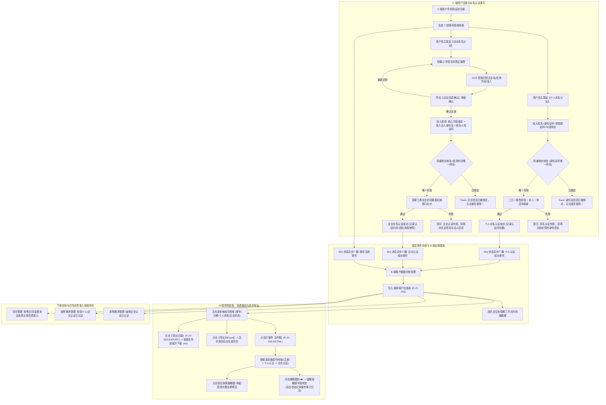
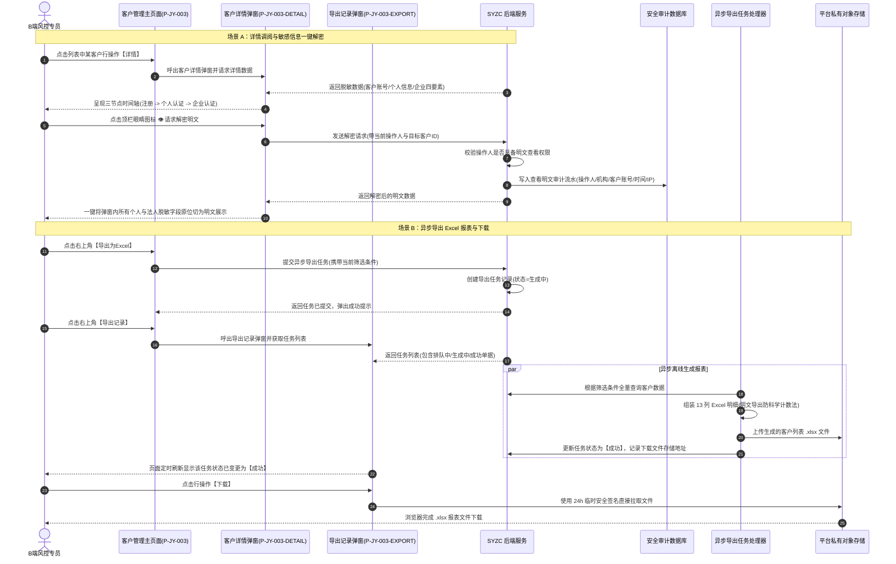

# 客户管理主PRD

> **模块定位**：交易 / 客户管理是面向大宗商品供应链金融与存货监管体系的“全网客户（货主/融资人）数字身份、实名资质与风控准入台账中枢”。本模块承接来自 C 端（个人及企业用户移动端）注册、个人二元与实人活体核验、企业营业执照正面照 OCR 及国家工商业四要素核验生成的客户主数据，提供全网客户档案的多维检索、认证状态实时穿透、司法级资质凭据追溯以及异步报表导出服务，为下游采购需求、销售撮合、动产质押与电子合同签署提供不可伪造的主体准入风控底座。  
>
> **端侧协同与数据链路说明**：
> - **源头数据产生端（C 端）**：用户在客户端录入手机号完成验证码注册，生成客户账号基础档案（初始状态：个人未认证、企业未认证）；用户自主发起个人实名认证（二元核验 + 实人一体活体人脸识别）及企业实名认证（营业执照正面照片 OCR 自动解析 + 国家工商四要素权威核验）；
> - **数据穿透与唯一性防重**：同一自然人身份与同一企业主体全系统严格 1:1 绑定唯一样本，严禁多账号跨绑；认证通过后通过底层分布式消息总线准实时推送到本台账；
> - **B 端交易管理台账（本模块）**：为纯只读展示与风控监管台账，不提供人工物理新增或篡改入口；支持全量客户多维检索、详情时间轴（注册 → 个人认证 → 企业认证）三节点下钻查阅、眼睛图标敏感信息脱敏/明文一键切换、营业执照原件调阅及历史异步导出；
> - **下游业务准入联动**：下游采购需求提报、销售意向发布、抵质押订单准入与销售/监管合同线上盖章签署，强制要求客户必须为【企业认证 = 已认证】或【个人认证 = 已认证】合规主体方可流转。  
>
> **版本**：V1.5 | **更新时间**：2026-09-22 | **责任人**：森云科技（Senyun Technology）  
>
> **编写依据**：[客户管理字段清单.md](./客户管理字段清单.md) 是本模块所有字段定义、枚举与页面展示的唯一基准；[客户管理业务规则规格.md](./客户管理业务规则规格.md) 是本模块状态机、校验算法、脱敏解密审计、生命周期流转及数据安全的唯一定义来源；[C端H5/01-用户认证](../../../C端H5/01-用户认证/) 是 C 端源头实名认证规格真源。

---

## 1. 业务背景与业务痛点

### 1.1 业务背景
在供应链金融动产质押与存货监管业务中，参与大宗商品现货交易与货权质押融资的主体，涵盖上游生产厂、贸易商、仓储监管方及下游采购企业。客户身份的真实性、合法性与防冒用能力，直接决定了仓储监管协议、电子仓单确权以及后续大宗购销合同的法律证据效力。

平台通过打通“C 端自主提报核验 + B 端全网穿透监控”的数字化客户身份体系：
1. **源头实名穿透与权威核验**：C 端接入公安部二元实人一体活体检测接口与国家工商业权威四要素核验接口，辅以营业执照 OCR 智能解析，从源头彻底杜绝冒名冒领、皮包公司挂牌与虚假资质；
2. **唯一性防重与资产安全隔离**：全网严格实行自然人身份证号与企业统一社会信用代码 1:1 账号绑定，彻底封堵利用多小号套取授信、多头质押与交叉虚构贸易的违规漏洞；
3. **B 端集中台账与资质存证闭环**：B 端集中纳管全网所有注册客户，以生命周期时间轴完整记录注册时刻、个人实名认证时刻及企业实名认证时刻，形成具备司法存证效力的电子档案；
4. **敏感信息严密合规脱敏**：默认对客户手机号、个人身份证号、法人身份证号等关键隐私信息执行中间掩码脱敏，提供受控可审计的明文查阅机制，确保平台数据安全合规。

### 1.2 核心业务痛点
1. **虚假身份与冒名开户风险**：传统模式下企业资质多为线下离线人工审核，容易遭遇冒充法定代表人、PS 营业执照骗取贸易资质等重大道德风险；
2. **多账号重复绑定，交易背景混乱**：同一家核心企业或自然人若可在多个账号间重复注册并分别提报需求，将导致风控引擎无法准确归集同一授信主体与集中度风险；
3. **资质凭证离散，贷后与纠纷取证困难**：客户在 C 端提交的工商执照与实人凭证若未在 B 端风控中台形成不可篡改的历史快照，一旦产生买卖纠纷或货物争议，缺乏全链路举证依据；
4. **敏感客户数据泄露风险**：客户手机号与法人身份证号码极度敏感，缺乏脱敏策略与权限防护容易造成客户资源被竞品截流或侵犯公民个人隐私。

---

## 2. 功能范围

| 包含功能范围 | 不包含功能范围 |
| :--- | :--- |
| - **全网客户档案多维组合检索**：支持按客户账号（手机号模糊匹配）、注册时间范围（日期区间）、个人认证状态（全部/未认证/已认证）、企业认证状态（全部/未认证/已认证）进行高效组合检索；<br/>- **客户列表标准规范呈现**：清晰呈现序号、客户账号（脱敏）、个人认证状态、企业认证状态、注册时间、个人认证时间（未认证为空）、企业认证时间（未认证为空）及操作【详情】；<br/>- **客户详情模态弹窗（`P-JY-003-DETAIL`）**：采用垂直时间轴（由下至上推进）清晰呈现【注册】、【个人认证】、【企业认证】三节点，支持卡片【收起/展开】；<br/>- **隐私信息脱敏与受控解密**：弹窗头部集成眼睛图标，点击可一键将弹窗内所有脱敏字段切换为明文展示，系统全程记录敏感数据查看审计日志；<br/>- **营业执照原件全屏预览**：详情弹窗展示企业认证营业执照缩略图，点击居中唤起大图预览，支持缩放、旋转查看原件细节；<br/>- **异步导出为 Excel**：点击【导出为Excel】异步生成当前筛选条件下的全量客户明细报表（包含企业名、税号、法人及经办人明细）；<br/>- **导出记录模态弹窗（`P-JY-003-EXPORT`）**：集中调阅历史导出任务进度、操作人、生成时间，并提供 `.xlsx` 文件下载。 | - **B 端前台直接新增客户账号**：所有客户必须由用户在 C 端自主使用手机号验证码完成注册，B 端管理台账不提供人工物理录入新增账号入口；<br/>- **B 端前台人工篡改客户认证资质**：客户实名信息经过公安及工商第三方权威接口核验固化，B 端运营人员不可人工直接篡改企业名称、统一社会信用代码等法定信息；<br/>- **B 端物理删除客户档案**：本台账定位于真实主体与司法存证中枢，禁止物理删除客户记录；<br/>- **跨租户越权查阅**：严格遵循机构与租户数据隔离规范，禁止未授权跨机构拉取客户明细。 |

---

## 3. 模块定位与系统全链路流程（Mermaid）

### 3.1 业务端到端协同链路全景图



---

### 3.2 C 端移动端认证详细流转逻辑图

```mermaid
flowchart TD
    subgraph PersonalAuth[个人实名认证流转 (C端H5)]
        P1["进入【个人认证】页面"] --> P2["自动反显当前登录手机号(脱敏置灰不可改)"]
        P2 --> P3["录入真实姓名(<=10字) + 真实身份证号"]
        P3 --> P4["点击【获取验证码】并在 60s 内输入短信验证码"]
        P4 --> P5["点击并阅读《用户信息授权协议》并手动勾选"]
        P5 --> P6["点击【提交实名认证】"]
        P6 --> P7{"字段非空与格式校验"}
        P7 -->|校验不通过| P8["前端标红报错提示"]
        P7 -->|校验通过| P9{"身份证号唯一性校验 (R05)"}
        P9 -->|已被他人绑定| P10["Toast: 身份证信息已被绑定，无法重复使用！"]
        P9 -->|唯一样本| P11{"短信验证码核对"}
        P11 -->|错误/失效| P12["Toast: 验证码错误或已失效"]
        P11 -->|通过| P13{"公安二要素一致性接口比对"}
        P13 -->|不一致| P14["提示: 实名认证失败，请再次核对您的身份信息是否填写正确；"]
        P13 -->|一致| P15["唤起实人一体三方人脸活体检测"]
        P15 -->|活体不通过| P16["提示核身未通过，支持重试"]
        P15 -->|活体通过| P17["实名认证成功！跳转成功页，记录个人认证时间"]
        P17 --> P18["后续进入页面直接展示实名信息查看卡片(脱敏置灰)"]
    end

    subgraph CorpAuth[企业实名认证流转 (C端H5)]
        C_Start["进入【企业认证】步骤一"] --> C_Upload["拍摄/从相册选择营业执照正面清晰照片"]
        C_Upload --> C_Next["点击【下一步】调用 OCR 识别服务"]
        C_Next --> C_Dialog["弹出【企业信息确认】弹窗<br/>展示: 企业名称、信用代码、法定代表人"]
        C_Dialog -->|信息有误| C_Retry["点击【信息有误重新识别】关闭弹窗重传"]
        C_Dialog -->|核对无误| C_Form["点击【确认并继续】进入步骤三信息录入表单"]
        C_Form --> C_Fields["自动反显 OCR 字段并锁定不可修改:<br/>• 企业名称<br/>• 统一社会信用编码<br/>• 法人姓名"]
        C_Fields --> C_Input["手动录入: 法人身份证号(格式校验)"]
        C_Input --> C_Phone["自动反显经办人手机号(当前登录手机号，脱敏锁定)"]
        C_Phone --> C_Sms["点击获取经办人验证码(带60s倒计时)并输入"]
        C_Sms --> C_Agree["勾选《用户信息授权协议》并点击【提交实名认证】"]
        C_Agree --> C_Check{"四要素权威工商业接口核对"}
        C_Check -->|税号已被其他账号绑定| C_Occupy["Toast: 企业信息已被绑定，无法重复使用！"]
        C_Check -->|四要素比对失败| C_Fail["提示: 企业认证失败，请在此核对企业信息与法人信息是否正确；"]
        C_Check -->|四要素完全一致| C_Pass["企业认证成功！记录企业认证时间与存证营业执照"]
        C_Pass --> C_View["后续进入页面直接展示企业实名信息查看卡片(带营业执照预览)"]
    end
```

---

### 3.3 B 端受控解密与异步导出处理时序图



---

## 4. 页面功能说明

### 4.1 PC 端主列表页面（`P-JY-003`）

> 对应系统最新截图图 1，路径：`交易 → 客户管理`。

#### 4.1.1 页面目标与布局骨架
- **页面目标**：供风控合规专员、运营管理人员全面掌握全网注册客户的规模走势、个人认证与企业资质完备度，进行高效组合排查并支持明细报表导出。
- **页面布局骨架**：
  - **顶部标题与动作栏**：左侧展示页面标题 `客户管理`；右侧水平排列两个功能按钮：`【导出为Excel】` 与 `【导出记录】`。
  - **筛选查询区**：水平排列 4 个筛选控件与 1 个操作按钮：
    - `客户账号`：单行文本框，占位符 `请输入客户账号`；
    - `注册时间`：日期范围选择器，带日历图标，展示 `开始日期 至 结束日期`；
    - `个人认证状态`：下拉选择器，默认选中 `全部`（选项：`全部`、`未认证`、`已认证`）；
    - `企业认证状态`：下拉选择器，默认选中 `全部`（选项：`全部`、`未认证`、`已认证`）；
    - `【查询】` 按钮：主题色（金黄/琥珀色）实心按钮，点击触发条件过滤。
  - **主数据表格区**：展示 8 列核心数据：
    - 序号、客户账号（中间 4 位掩码）、个人认证、企业认证、注册时间、个人认证时间（未认证显示为空）、企业认证时间（未认证显示为空）、操作列（`详情`）。
  - **底部分页器**：左侧展示总条数（如 `共 24 条`）、每页条数选择器（默认 `10条/页`）；右侧展示翻页按钮组及页码直达输入框（`前往 [ ] 页`）。

#### 4.1.2 列表交互与展示规范
- **默认排序规则**：列表初始加载默认按 `注册时间` 倒序排列（新注册客户排在最前）；
- **空态展示规则**：未认证状态在对应的时间列（`个人认证时间`、`企业认证时间`）严格保持空白，严禁展示连字符 `-` 或 `null`；
- **重置与检索**：点击【查询】自动重置分页至第一页；点击右上角【导出为Excel】触发全局吐司提示：*“导出任务已提交，请在【导出记录】中查看并下载”*。

---

### 4.2 客户详情模态弹窗（`P-JY-003-DETAIL`）

> 对应系统最新截图图 2 与图 3，点击主列表行操作【详情】呼出。

#### 4.2.1 头部信息与受控解密
- **顶栏标题**：左侧固定纯文本 `客户详情`，右侧带 `×` 关闭退出按钮；
- **客户账号与眼睛图标**：
  - 呈现形式：`客户账号：185****8796` 右侧紧跟小眼睛图标 👁️；
  - **解密交互**：默认掩码显示；点击眼睛图标切换为明文（如 `18512348796`），**同时弹窗内所有个人与企业法人敏感字段（个人姓名、身份证号、经办手机号、法人姓名、法人身份证号）同步切换为明文显示**；再次点击眼睛图标，全部恢复为掩码脱敏状态；
  - **安全审计**：每一次明文解密动作均由后端记录独立的安全审计日志（记录操作人账号、租户机构、客户账号 ID、操作 IP 及精确时间戳）。

#### 4.2.2 垂直时间轴三节点结构（自底向上推进）
页面采用直观的生命周期时间轴呈现，节点按业务演进顺序由下至上排列：

1. **底层节点：【注册】（基础起始节点）**
   - **状态圆点**：恒为绿色实心圆点（代表已完成）；
   - **时间标签**：圆点右上方清晰标注完整注册时间戳（如 `2025-12-24 15:04:50`）；
   - **卡片内容**：浅灰底色矩形卡片，内部居中展示纯文本 `注册`。

2. **中层节点：【个人认证】**
   - **分支一：已认证（绿点）**
     - 状态圆点为绿色；右上方展示个人认证通过时间戳（如 `2025-10-17 16:18:22`）；
     - 卡片首行左侧标题 `个人认证`，右侧展示金色操作链接【收起】/【展开】（默认展开）；
     - 展开卡片内部展示三项明细：
       - `姓名：`（脱敏展示如 `乒*`，解密展示明文）；
       - `身份证号：`（脱敏展示如 `3301***********2033`，解密展示明文）；
       - `手机号：`（脱敏展示如 `188****1267`，解密展示明文）。
   - **分支二：未认证（红点）**
     - 状态圆点为红色；无上方时间标签；
     - 卡片内容极简：左侧标题 `个人认证`，右侧标红展示状态文本 `未认证`；卡片内无展开字段。

3. **顶层节点：【企业认证】**
   - **分支一：已认证（绿点）**
     - 状态圆点为绿色；右上方展示企业认证通过时间戳（如 `2025-10-17 16:31:47`）；
     - 卡片首行左侧标题 `企业认证`，右侧展示金色操作链接【收起】/【展开】（默认展开）；
     - 展开卡片内部展示全要素明细：
       - `企业名称：`（工商法定全称，完整明文展示，如 `成都赚钱体育文化有限公司`）；
       - `统一社会信用编码：`（标准 18 位大写字母与数字，完整明文展示，如 `49769001LU8C3PQA7N`）；
       - `法人姓名：`（脱敏展示如 `陈**`，解密展示明文）；
       - `法人身份证号：`（脱敏展示如 `3301***********0951`，解密展示明文）；
       - `经办人手机号：`（脱敏展示如 `188****1267`，解密展示明文）；
       - `营业执照：`（展示证照矩形缩略图，点击支持全屏放大、高保真查验营业执照原件细节）。
   - **分支二：未认证（红点）**
     - 状态圆点为红色；无上方时间标签；
     - 卡片内容极简：左侧标题 `企业认证`，右侧标红展示状态文本 `未认证`；卡片内无展开字段。

---

### 4.3 导出记录模态弹窗（`P-JY-003-EXPORT`）

> 对应系统最新截图图 4，点击主列表右上角【导出记录】按钮呼出。

- **弹窗目标**：提供后台异步报表任务的执行监控中心，防止大批量导出引起前端页面卡死，支持断点重试与历史报表永久追溯。
- **列表要素**：展示序号、文件名（如 `客户列表2025-10-27.xlsx`）、操作人（用户名+所属机构，如 `卡皮巴拉(四川享宇科技有限公司)`）、时间（任务创建时间）、状态（成功/生成中/失败）、操作列（【下载】）。
- **下载操作**：任务状态为 `成功` 时，操作列显示可点击文字【下载】，点击后直接触发浏览器下载 `.xlsx` 文件；状态为非成功态时置灰不可点击。

---

## 5. 业务场景与用户故事

### 5.1 典型业务场景

#### 场景 1：新用户仅完成手机注册（未认证画像）
1. 某粮油贸易公司经办人在 C 端小程序录入手机号，获取验证码后完成注册；
2. B 端【客户管理】列表秒级同步生成该记录：客户账号显示 `185****8796`，个人认证显示 `未认证`，企业认证显示 `未认证`，注册时间记录，两列认证时间均为空；
3. 风控专员点击【详情】，时间轴展示：底部【注册】为绿点，中间【个人认证】为红点且标注未认证，顶部【企业认证】为红点且标注未认证；
4. 该客户由于缺乏认证资质，在 C 端发起采购/销售需求或电子合同时，系统统一拦截并引导其完成认证。

#### 场景 2：完成个人认证后进阶完成企业认证（双全画像）
1. 用户在 C 端上传身份证并通过实人一体人脸活体核验，B 端档案自动更新 `个人认证 = 已认证` 并打上个人认证时间戳；
2. 随后用户在 C 端拍摄上传公司营业执照，经 OCR 解析确认企业四要素后，系统自动反显当前手机号并校验法人身份证通过，企业认证完成；
3. B 端档案自动更新 `企业认证 = 已认证` 并记录企业认证时间戳；
4. 风控专员在详情弹窗调阅该客户，时间轴三大节点全绿，企业全称、税号、法人、营业执照一览无余，资质完备准入合规。

---

## 6. 权限与安全控制

| 角色 / 权限编码 | 页面访问 | 条件查询 | 详情调阅 | 眼睛明文解密 | 导出为Excel | 导出记录与下载 |
| :--- | :---: | :---: | :---: | :---: | :---: | :---: |
| **超级管理员 / 平台运营总监** | ✅ 允许 | ✅ 允许 | ✅ 允许 | ✅ 允许（记录审计） | ✅ 允许 | ✅ 允许 |
| **风控审核专员 (`R-RISK-AUDIT`)** | ✅ 允许 | ✅ 允许 | ✅ 允许 | ✅ 允许（记录审计） | ✅ 允许 | ✅ 允许 |
| **交易撮合专员 (`R-TRADE-MGR`)** | ✅ 允许 | ✅ 允许 | ✅ 允许 | ❌ 阻断（仅脱敏） | ✅ 允许 | ✅ 允许 |
| **普通访客 / 外部机构** | ❌ 阻断 | ❌ 阻断 | ❌ 阻断 | ❌ 阻断 | ❌ 阻断 | ❌ 阻断 |

---

## 7. 验收标准（Checklist）

1. **列表呈现验收**：
   - 客户账号默认严格执行中间 4 位掩码脱敏（`185****8796`）；
   - 个人认证时间与企业认证时间在未认证状态下严格保持空白展示，不得展示 `null` 或 `-`；
   - 组合筛选（账号模糊、注册日期区间、个人状态下拉、企业状态下拉）匹配准确，点击【查询】回到第 1 页。
2. **详情弹窗验收**：
   - 弹窗居中展示，自底向上严格呈现注册、个人认证、企业认证三节点；
   - 绿点（已认证/已注册）与红点（未认证）状态准确，红点状态卡片简洁仅展示“未认证”标红文案；
   - 点击眼睛图标，弹窗内所有脱敏字段（客户账号、个人姓名、身份证号、法人姓名、法人身份证号、经办手机号）统一切换为明文，再次点击恢复掩码，后台安全审计日志正常落库；
   - 点击营业执照缩略图能够正常呼出大图弹窗，原件字迹清晰可辨。
3. **导出功能验收**：
   - 点击【导出为Excel】后正常生成后台异步任务并出现友好提示；
   - 【导出记录】弹窗正常展示任务列表，生成的 `.xlsx` 文件能正常下载且字段完整无乱码。
