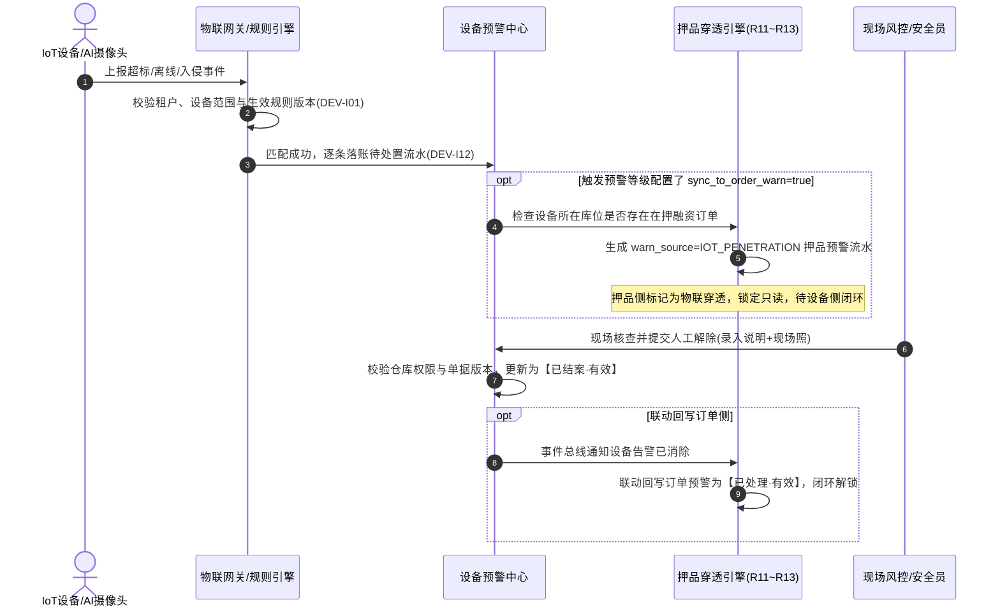

# 设备预警信息 业务规则规格

> **文档定位**：设备预警信息的查询、触发、未处理去重、状态变更、自动/人工解除、抓拍、图片加载、配置版本和审计规则的**唯一定义真源**。字段定义引用 [设备预警信息字段清单](./设备预警信息字段清单.md)，预警类型和配置规则引用 [设备预警配置业务规则规格](../../08-配置管理/20-风险管理-设备预警配置/设备预警配置业务规则规格.md)。
> **版本**：V1.3 | **更新时间**：2026-09-16 | **责任人**：森云科技（Senyun Technology）

---

## 一、术语定义与三态展示词表

| 核心术语 | 业务定义与系统处理口径 |
| :--- | :--- |
| **设备预警信息** | 物联或安防监控设备命中有效预警配置后产生的一条独立风险记录，包含触发事件、设备位置、配置版本、现场抓拍和处置状态快照。遵从 **逐条独立落账** 规则，一事件一记录，不进行频次累加。 |
| **待处置 · 有效 (`PENDING`)** | 处理状态为“未处理”且记录有效的预警信息，参与系统提醒、升级和未处理分类去重；同一分类键仅保留一条有效未处理记录。 |
| **已结案 · 有效 (`RESOLVED`)** | 处理状态为“已处理”且记录有效的预警信息（经人工核查解除或系统自动恢复结案）；不参与去重，全量历史快照永久保留供追溯与审计。 |
| **已作废 / 未处理无效 (`INVALID`)** | 记录有效性为“无效”的历史记录，页面显示为“未处理（已作废）”；保留在默认列表并计入总数和分页，但不再执行提醒、升级任务或允许人工解除。 |
| **当前有效配置** | 规则引擎中最新启用的设备预警配置版本；旧配置版本不再展示为当前配置，也不再作为触发新预警的依据。 |

---

## 二、权限隔离与数据范围控制

### 【操作权限三维隔离校验规则】(DEV-I05)
- 用户账号必须具备设备预警信息菜单查看权限（`R-WARN-VIEW`）；
- 详情查看、人工核查解除（`R-WARN-RESOLVE`）和现场抓拍大图查看分别独立校验细粒度操作权限，无权限时对应操作按钮隐藏或置灰。

### 【仓库数据权限严格过滤规则】(DEV-I06)
- 列表查询、详情展示和解除处置接口强制按当前登录账号绑定的实体监管仓库数据权限进行行级过滤；
- 设备绑定了仓库、库房或具体分区位置时，仅返回账号数据权限覆盖范围内的数据，严格防止跨仓库越权查看。

### 【未绑定位置设备全员可见规则】(DEV-I07)
- 移动设备或尚未绑定实体仓库位置的设备产生预警时，对所有已登录且具备本模块菜单权限的账号可见，但严格受租户物理隔离约束；该可见例外不赋予对该设备的配置编辑权限。

### 【写接口服务端二次鉴权与防篡改规则】(DEV-I08)
- 现场图片临时安全访问令牌（Token）换取、人工核查解除等写操作接口，服务端必须重新鉴权，校验租户标识、菜单权限、仓库数据权限和单据版本号，严禁以客户端上报参数或列表视图作为鉴权依据。

---

## 三、配置版本与生效边界

### 【配置失效与版本递增生效规则】(DEV-I01)
- 设备预警配置被修改保存后，配置版本号（`version`）递增生效；原配置版本不再作为当前配置展示，也不再依据旧规则推送新预警；后续设备厂商回调严格按最新版本匹配并固化快照。

### 【历史预警快照固化与不回写规则】(DEV-I02)
- 规则配置的编辑、等级权重调整或阈值修改，**严格不回写**既有未处理或已处理的存量预警流水；历史预警快照固化事件发生时的触发值、阈值、规则名称及当时版本，保障司法存证不可变性。

### 【规则版本关联与追溯留痕规则】(DEV-I03)
- 预警流水表必须持久化关联命中时的规则配置版本 ID；配置修改、设备范围绑定变更、通知对象调整及阈值变动均保留审计快照，满足穿透审计追溯要求。

### 【配置删除未处理转无效规则】(DEV-I04)
- 设备预警规则被停用或删除后，不再匹配新事件；该规则历史关联的存量未处理预警系统自动置为“未处理（已作废）”，即刻停止推送提醒和告警升级任务。

### 【设备解绑或权限撤销预警置无效规则】(DEV-I15)
- 当设备从规则中移除、或设备发生解绑、物理拆除、数据权限被撤销时，该设备关联的所有存量未处理预警统一置为“未处理（已作废）”，停止升级调度；存量已结案记录保留只读。设备后续重新绑定时不回溯恢复历史记录，需等待新事件生成新轮次。

---

## 四、预警触发与事件落账

### 【三方事件来源幂等落账规则】(DEV-I11)
- 接收第三方安防图像事件、物联网传感器遥测、门禁/挂锁及全球定位系统（GPS）事件时，系统基于 `租户ID + 设备ID + 子类型/算法模板ID + 事件唯一标识(UUID)` 执行严格幂等校验，重复回调直接放行但不重复生成流水。

### 【命中配置快照持久化规则】(DEV-I12)
- 事件命中最新生效规则后，生成初始状态为“待处置 · 有效”的流水，持久化固化设备基本信息、三级空间位置（仓库/库房/分区/货位）、规则名称、规则版本、实际触发采集值、告警阈值、算法模板 ID 及毫秒级触发时间戳。

### 【未命中配置静默丢弃规则】(DEV-I13)
- 事件未命中租户内最新有效配置时，系统静默丢弃，不生成、不推送任何预警流水；禁止因历史配置曾经命中而产生幽灵推送。

### 【多子类型独立处置与已处理保护规则】(DEV-I14)
- 同一设备的不同预警子类型（如同时触发高温与烟感）按独立流水分别处理；已结案的历史记录绝不被新的未处理事件覆盖或合并。

---

## 五、未处理预警分类去重与防抖

### 5.1 分类去重规则矩阵

| 预警大类 | 包含子类型 | 分类去重键与处理策略 |
| :--- | :--- | :--- |
| **设备图像识别预警** | 行人入侵检测、车辆入侵检测、物品形态异常、安防球机离线 | 以 `设备ID + 算法模板ID` 为分类键；同一设备不同算法模板同时独立展示；同一设备同一模板只保留最新一条有效未处理记录，覆盖时旧记录置为已作废。 |
| **设备物联预警** | 温度过高/过低、湿度超标、氧气浓度、二氧化碳浓度、烟感报警 | 遵循传感器指标维度去重，同一指标每台设备仅保留一条有效未处理记录；新越界事件到达时旧记录置为已作废，新流水独立落账。 |
| **智能挂锁预警** | 锁体拆壳、锁舌被卡、锁杆被剪、非法撬箱、拆卡报警、密码连续错误、关锁超时、电量低于20% | 同一子类型每台挂锁仅保留一条有效未处理记录；新告警覆盖旧记录（旧记录标记为已作废）。 |
| **人脸门禁预警** | 门禁设备离线、门未关超时、密码防拆报警 | 同一子类型每台门禁仅保留一条有效未处理记录；新告警覆盖旧记录。 |
| **设备 GPS 预警** | 设备离线、越界入栏、违规出栏、超速报警、异常停留、偏离航线、非法剪线拆除 | 同一子类型每台车载/货运终端仅保留一条有效未处理记录。 |

### 5.2 物联离线轮次特殊处理机制
- 物联设备离线遵循“离线轮次”模型：在同一离线轮次内重复收到离线心跳丢失事件时，仅更新当前未处理记录的事件时间戳快照，不新建记录、不开启新轮次；
- 人工解除离线预警后，在设备收到有效重新上线事件前，后续重复离线事件直接忽略，避免离线风暴；设备上线后再次离线，开启全新预警轮次。

---

## 六、处置策略与闭环解除机制

遵循处置策略三档规范（`AUTO_CLOSE_ON_TRIGGER`、`MANUAL_RELEASE`、`AUTO_CLOSE_ON_RECOVERY`）：

| 预警子类型分类 | 解除与结案策略 | 是否支持人工解除 | 联动回写与系统行为 |
| :--- | :--- | :---: | :--- |
| **环境传感器超标** (温湿度、二氧化碳、氧气) | **恢复自动结案** (`AUTO_CLOSE_ON_RECOVERY`)：遥测值恢复至配置区间内时，系统自动更新状态为“已结案 · 有效” | 否 | 遥测采集值恢复即自动结案，处理人记录为“系统自动处理” |
| **消防安全** (烟雾传感器报警) | **恢复自动结案**：收到设备恢复正常遥测或三方复位事件后自动更新为“已结案 · 有效” | 否 | 系统自动化核销 |
| **GPS 行车安全类** | **恢复自动结案**：收到终端回传的恢复正常状态（如车速降至限速内、回到规划路线）自动结案 | 否 | 系统自动化核销 |
| **物联设备离线** | **双轨解除**：支持收到设备重新上线事件自动结案；亦支持有权限人员现场核实后人工解除 | 是 | 人工解除后未上线期间屏蔽离线重复告警 |
| **非物联设备离线** (摄像头、门禁) | **恢复自动结案**：检测到设备网络心跳恢复且重新上线后自动解除结案 | 否 | 自动化上线结案 |
| **安防图像、挂锁防拆、人脸门禁异常** | **人工解除结案** (`MANUAL_RELEASE`)：禁止自动恢复，必须由被授权人员现场核查并人工录入情况说明方可结案 | 是 | 强制录入 $\le 200$ 字情况说明，现场照片选填（最多 10 张且每张 $\le 5\text{MB}$） |

---

## 七、现场抓拍联动与图片加载安全

### 7.1 三级空间抓拍范围模型
抓拍范围基于设备关联的“仓库 $\rightarrow$ 库房 $\rightarrow$ 分区”三级空间拓扑严格计算：

| 设备绑定位置级别 | 联动抓拍球机覆盖范围 |
| :--- | :--- |
| **仅绑定仓库** | 触发该仓库全域、下属全部库房及全部分区的关联安防球机抓拍 |
| **绑定库房且未绑定分区** | 触发该库房本身及该库房下属所有分区的安防球机抓拍 |
| **绑定到具体分区/货位** | 严格仅触发覆盖该具体物理分区单元的安防球机抓拍 |

> 设备多选绑定位置时取并集，严禁跨物理仓库违规联动抓拍。无覆盖监控设备展示“无抓拍图”；抓拍超时展示“抓拍失败”，杜绝伪造图片。

### 7.2 私有对象存储（OSS）安全签名加载
- 列表初始加载时默认渲染统一缩略占位图，禁止前端并发大批量请求真实图片；
- 用户点击缩略图放大查看时，前端向网关申请带临时时效签名（有效期 60 秒）的私有 OSS 动态 URL；
- 图片换取、访问失败及鉴权拦截动作全程记录审计日志。

---

## 八、异常阻断与权限矩阵

### 8.1 异常阻断规则（DEV-C 系列）
- **【重复回调幂等防并发冲突阻断】(DEV-C01)**：毫秒级并发到达的相同事件 UUID，由 Redis 分布式互斥锁拦截，确保仅单笔落账；
- **【跨仓库越权解除异常阻断】(DEV-C02)**：用户账号未被授予该预警流水所在仓库数据权限时，服务端阻断人工解除请求并抛出越权异常。

### 8.2 权限控制矩阵（DEV-P 系列）
- **【设备预警信息查看与详情权限】(DEV-P01)**：具备列表浏览、组合筛选及详情抽屉查看权限（`R-WARN-VIEW`）；
- **【设备预警人工解除处置权限】(DEV-P02)**：具备人工核查解除、录入情况说明及上传现场整改照片权限（`R-WARN-RESOLVE`），严格受仓库数据范围隔离。

---

## 九、业务流程时序与物联穿透闭环

---

## 十、修订记录

| 日期 | 版本 | 变更内容 | 责任人 |
| :--- | :---: | :--- | :--- |
| 2026-08-18 | V1.1 | 初始建立设备预警信息业务规则规格 | 森云科技 |
| 2026-08-20 | V1.2 | 合并设备预警信息业务流程至规则规格说明书 | 森云科技 |
| 2026-09-16 | V1.3 | 全面重构为规则语义自解释编码、汉化交互术语并对齐AGENTS.md物联穿透闭环规范 | 森云科技 |
