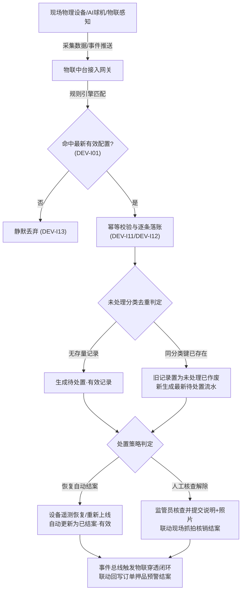
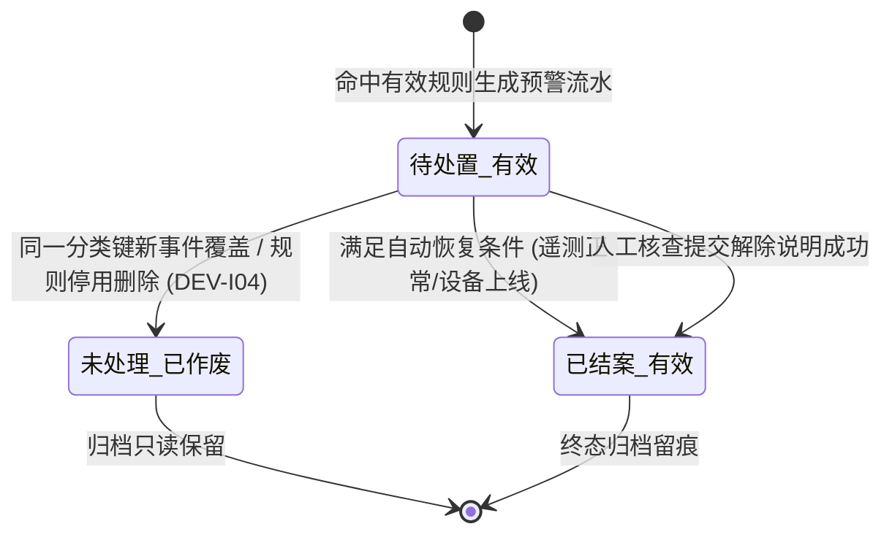

# 设备预警信息 主PRD

> **版本**：V2.0 | **更新时间**：2026-09-16 | **责任人**：森云科技（Senyun Technology）
> **读者对象**：研发工程师、测试工程师、物联网风控产品经理、现场监管员
> **编写依据**：[设备预警信息字段清单](./设备预警信息字段清单.md)、[设备预警信息业务规则规格](./设备预警信息业务规则规格.md)
> **字段真源**：`设备预警信息字段清单.md` 是本模块所有业务字段与系统字段的唯一定义来源；本主 PRD 负责页面功能交互、业务场景规范、状态机流转与跨系统物联穿透闭环。

---

## 1. 业务背景与监管目的

**设备预警信息**是仓储监管现场所有物理硬件资产（监控摄像头、温湿度/烟感传感器、智能门锁、人脸门禁、GPS等）异常告警事件的集中承接与处置台账。
当三方平台推送设备离线、物联指标越界或图像 AI 算法事件并命中 [02设备预警配置](../../08-配置管理/20-风险管理-设备预警配置/设备预警配置主PRD.md) 时，系统立即生成设备预警流水。本模块提供预警分类去重、现场抓拍时效展示、自动恢复解除与人工核查解除闭环，确保仓库物理安全风险实时可控、全路径留痕，并作为底层物联底座向押品预警执行穿透联动。

---

## 2. 功能范围 (Scope)

### 2.1 包含功能 (In Scope)
- **预警信息列表与多维检索**：支持按预警类型、设备名称、设备编码、处理状态（未处理/已处理/全部）、仓库位置、触发时间范围多维度检索；
- **未处理分类去重与展示**：按“设备+子类型/算法模板”自动去重，同一分类键仅保留一条有效未处理记录；新事件覆盖时旧记录置为“未处理（已作废）”；
- **设备离线独立轮次管理**：物联设备离线按轮次处理，同一轮次重复离线仅更新快照，收到有效上线事件后结束当前轮次；
- **自动解除与人工解除双机制**：
  - **自动解除**：温湿度恢复正常范围、烟感/GPS恢复正常、非物联设备重新上线时，系统自动更新为“已结案 · 有效”；
  - **人工解除**：图像识别、门禁门锁异常行为及物联离线支持人工提交处理（情况说明必填、现场照片选填、联动现场解除抓拍）；
- **图片安全与时效签名**：列表默认展示统一缩略占位图，用户点击后通过后端权限接口换取时效签名统一资源定位符（URL）查看现场抓拍大图；
- **物联穿透与订单联动闭环**：触发高危预警且命中穿透配置时，联动向押品预警写入关联流水，现场核销解除后自动回写订单侧结案。

### 2.2 不包含功能 (Out of Scope)
- 设备维度的规则与阈值配置维护（归属 [02设备预警配置](../../08-配置管理/20-风险管理-设备预警配置/设备预警配置主PRD.md)）；
- 抵质押/监管订单维度的押品风险与单据处置（归属 [06-风险信息-押品预警信息](../06-风险信息-押品预警信息/押品预警信息主PRD.md)）；
- 摄像头底层流媒体播放与云台控制（归属 [02-仓储/16-设备管理-监控设备](../../02-仓储/16-设备管理-监控设备/监控设备主PRD.md)）。

---

## 3. 模块定位与业务流向

### 3.1 总体业务架构图

### 3.2 预警状态机三态词表

| 状态展示名称 | 业务含义 | 提醒与升级行为 | 人工操作权限 |
| :--- | :--- | :--- | :--- |
| **待处置 · 有效 (`PENDING`)** | 当前生效且正在告警中的风险实例 | 参与站内通知、短信提醒，触发超时升级任务 | 允许人工核查解除（针对支持人工类型） |
| **未处理 · 已作废 (`INVALID`)** | 被新事件覆盖或规则失效的旧未处理记录 | **即刻停止**定时提醒与升级任务 | 不允许人工操作，列表只读展示历史快照 |
| **已结案 · 有效 (`RESOLVED`)** | 已经成功解除（自动恢复或人工核销）的风险记录 | **停止**提醒与升级任务 | 终态，只读查看处理人与现场核销材料 |

---

## 4. 业务场景定义

### 场景 1【图像入侵与异常行为实时预警】(DEV-S01)
- **触发入口**：AI 摄像头检测到禁区出现未经授权的人员或车辆入侵，向系统上报图像算法事件；
- **业务操作**：系统捕获抓拍大图与目标坐标，命中生效配置后生成预警流水，向现场值班监管员推送高优先级告警；
- **系统校验**：触发【三方事件来源幂等落账规则】(DEV-I11) 与【命中配置快照持久化规则】(DEV-I12)；
- **流转结果**：生成“待处置 · 有效”流水，监管员现场排查确认安全后，通过模态弹窗录入核查说明完成人工解除。

### 场景 2【温湿度环境遥测超标与自动恢复】(DEV-S02)
- **触发入口**：大宗农产品冷库温湿度传感器遥测数据超过最高预警温度阈值；
- **业务操作**：系统生成环境超温预警流水并触发三级联动抓拍；冷库通风降温后，传感器重新上报正常温度；
- **系统校验**：触发【处置策略三档规范】之“恢复自动结案”；
- **流转结果**：遥测值恢复瞬间，系统无需人工干预，自动将流水状态变更为“已结案 · 有效”，处理人标明“系统自动处理”。

### 3【智能挂锁异常防拆与现场核查】(DEV-S03)
- **触发入口**：大宗钢材监管仓智能挂锁检测到锁壳异常震动拆卸；
- **业务操作**：系统生成挂锁防拆严重预警，并按照【多仓联动抓拍模型】触发该分区全景球机录像抓拍；
- **系统校验**：触发【多子类型独立处置与已处理保护规则】(DEV-I14)；
- **流转结果**：现场监管员持移动端前往实地验核锁体完整性，拍摄现场锁具照片并上传情况说明提交解除。

### 场景 4【物联设备离线轮次核验与人工解除】(DEV-S04)
- **触发入口**：仓库温湿度传感器网络中断，连续上报心跳丢失事件；
- **业务操作**：系统开启离线轮次，生成离线预警记录；同一轮次内的重复离线事件仅刷新快照时间戳；
- **系统校验**：触发【物联设备离线轮次处理规则】；
- **流转结果**：经办人确认供电线路检修后提交人工解除，解除后在设备未正式通电上线前，系统屏蔽后续重复离线告警。

### 场景 5【高危设备预警物联穿透回写押品】(DEV-S05)
- **触发入口**：在押现货库区内的火焰探测器触发烟雾火警，且规则配置了 `sync_to_order_warn=true`；
- **业务操作**：系统不仅生成设备预警流水，同时检查该库区存在的有效抵质押订单，自动派生 `warn_source=IOT_PENETRATION` 押品高危预警；
- **系统校验**：触发【物联穿透闭环机制规则】；
- **流转结果**：押品侧预警只读锁定；现场消防隐患排查并在设备侧核销结案后，系统自动联动回写订单预警为“已处理 · 有效”。

---

## 5. 核心业务规则追溯索引表

| 规则类型 | 规则编码与业务名称 | 规则核心逻辑摘要 | 关联场景 | 交互表现与异常反馈 |
| :--- | :--- | :--- | :--- | :--- |
| **业务规则** | 【配置失效与版本递增生效规则】(DEV-I01) | 规则编辑保存后版本递增生效，旧版本不回写存量告警，后续事件按最新版本匹配 | DEV-S01 | 详情页展示事件发生时命中的历史规则版本号 |
| **业务规则** | 【历史预警快照固化与不回写规则】(DEV-I02) | 预警快照固化当时的触发值、阈值与位置，后续配置修改不重新计算历史数据 | DEV-S01~S05 | 保证司法存证不可篡改与不可抗辩性 |
| **业务规则** | 【规则版本关联与追溯留痕规则】(DEV-I03) | 预警流水表必须持久化关联规则版本 ID，供穿透审计回溯 | DEV-S01 | 详情抽屉提供完整规则版本参数快照卡片 |
| **业务规则** | 【配置删除未处理转无效规则】(DEV-I04) | 规则被停用或删除后，关联的未处理流水自动转为“未处理 · 已作废”，停止升级 | DEV-S01 | 列表状态显示为灰标，禁用人工解除按钮 |
| **业务规则** | 【操作权限三维隔离校验规则】(DEV-I05) | 查看、详情、人工解除和抓拍大图查看分别校验独立权限 | DEV-S01~S05 | 无权限用户对应按钮置灰禁用或隐藏 |
| **业务规则** | 【仓库数据权限严格过滤规则】(DEV-I06) | 列表与详情强制按账号绑定的实体仓库数据范围行级过滤 | DEV-S01~S05 | 杜绝跨仓库越权查看其他库区敏感预警 |
| **业务规则** | 【未绑定位置设备全员可见规则】(DEV-I07) | 未绑定具体仓库位置的设备预警对具备菜单权限全员可见，受租户隔离约束 | DEV-S04 | 列表展示无位置标识，仅授权管理员可处理 |
| **业务规则** | 【写接口服务端二次鉴权与防篡改规则】(DEV-I08) | 图片临时签名换取与人工解除服务端二次鉴权，防客户端参数伪造 | DEV-S01, S03 | 接口抛出 403 越权或 409 版本冲突错误 |
| **业务规则** | 【三方事件来源幂等落账规则】(DEV-I11) | 基于事件 UUID 与分类键执行分布式防重校验，重复回调不重复创建 | DEV-S01~S04 | 保证底层告警流水账实强一致性 |
| **业务规则** | 【命中配置快照持久化规则】(DEV-I12) | 命中规则后固化设备、位置、触发值、阈值、算法模板及抓拍快照 | DEV-S01~S05 | 保证单据详情信息完整不可变 |
| **业务规则** | 【未命中配置静默丢弃规则】(DEV-I13) | 未命中租户最新有效配置时静默丢弃，不生成也不推送幽灵预警 | — | 后台网关日志记录过滤丢弃原因 |
| **业务规则** | 【多子类型独立处置与已处理保护规则】(DEV-I14) | 同一设备不同子类型流水独立落账，已结案历史记录绝不被覆盖 | DEV-S01~S05 | 保证各告警事件全链路独立闭环 |
| **业务规则** | 【设备解绑或权限撤销预警置无效规则】(DEV-I15) | 设备解绑或报废后，存量未处理预警自动转为已作废，停止调度 | DEV-S04 | 状态显示为未处理（已作废），保留只读 |
| **异常阻断** | 【重复回调幂等防并发冲突阻断】(DEV-C01) | 并发到达的相同事件触发分布式互斥锁拦截 | DEV-S01 | 拦截并发请求，返回首笔处理结果 |
| **异常阻断** | 【跨仓库越权解除异常阻断】(DEV-C02) | 无仓库权限账号尝试提交人工解除，服务端拦截报错 | DEV-S01, S03 | 浮窗提示：“越权操作：无权处置该仓库预警” |
| **权限控制** | 【设备预警信息查看与详情权限】(DEV-P01) | 具备设备预警流水列表查询与详情查看权限（`R-WARN-VIEW`） | DEV-S01~S05 | 基础浏览权限 |
| **权限控制** | 【设备预警人工解除处置权限】(DEV-P02) | 具备现场核查、录入说明并提交解除结案权限（`R-WARN-RESOLVE`） | DEV-S01, S03, S04 | 写入与结案高危权限 |

---

## 6. 页面功能说明与交互规范

### 6.1 PC 端列表与筛选区
1. **筛选区域**：
   - 包含：`预警类型`（下拉单选框）、`处理状态`（下拉单选框：全部/待处置/已结案/已作废）、`设备名称/编码`（单行文本输入框）、`所属仓库`（级联下拉单选框）、`预警时间`（日期范围选择器）；
   - 操作按钮：【查询】（主色调高亮按钮）、【重置】（次级平白按钮）、【批量解除】（支持对符合条件的记录批量录入说明解除）。
2. **列表展示列定义**：
   - 包含：序号、预警编号、设备名称、设备类型、所属仓库/库房/货位、预警子类型、触发值/阈值、现场抓拍缩略图（点击弹出时效签名大图）、预警时间、处理状态、处理人/时间、操作列。
   - 状态展示词表：
     - `待处置 · 有效`：琥珀橙 Badge 徽章；
     - `已结案 · 有效`：森林绿 Badge 徽章；
     - `未处理 · 已作废`：冷灰 Neutral Badge 徽章。
3. **行级操作列规范**：
   - 处于“待处置 · 有效”且属于支持人工解除类型：展示【解除预警】（高亮文字按钮）与【详情】；
   - 处于“已结案 · 有效”或“已作废”：仅展示【详情】。

### 6.2 人工解除预警模态弹窗
- **弹窗标题**：`解除设备预警`；
- **表单内容**：
  - `情况说明`：多行文本输入框，必填，限制 $10 \sim 200$ 个汉字；
  - `现场照片`：文件上传组件，选填，支持 JPG/PNG，最多上传 10 张且单张 $\le 5\text{MB}$；
  - `联动抓拍`：系统自动向预警发生位置所属监控发起联动抓拍，作为现场核销佐证；
- **操作按钮**：【取消】（关闭弹窗）、【确认解除】（防抖提交，成功后弹出浮窗提示并刷新列表）。

---

## 7. 非功能性需求（NFR）

1. **并发落账与响应时延**：设备事件回调接收并完成规则匹配落账耗时 $\le 200\text{ms}$；预警列表查询响应时间 $\le 400\text{ms}$；
2. **时效签名防盗链安全**：所有私有 OSS 现场抓拍图片必须动态申请时效安全签名，链接有效时长 $\le 60\text{秒}$，严禁明文公网暴露；
3. **高可用与消息削峰**：支持在设备发生断网重连、雷击等突发海量并发离线时，通过 Kafka 消息队列异步削峰缓冲，保障系统不宕机；
4. **全审计追溯**：记录人工解除操作人、客户端 IP、处理说明、前后状态及现场照片 SHA-256 哈希存证，永久归档。

---

## 8. 验收标准与交付清单

1. **分类去重验收**：验证同一设备同一算法模板重复触发时，旧记录自动置为“未处理 · 已作废”，仅保留最新一条“待处置 · 有效”；
2. **自动与人工结案验收**：
   - 验证冷库温湿度在采集值恢复正常后，状态自动变更为“已结案 · 有效”，处理人标明“系统自动处理”；
   - 验证安防图像预警人工录入情况说明并上传照片后成功结案；
3. **物联穿透闭环验收**：验证配置了穿透的设备预警触发后，在押品预警台账正确生成关联流水，设备解除后订单侧联动结案；
4. **权限与越权阻断验收**：验证无当前仓库数据权限的账号发起人工解除时，系统准确拦截并报错。

---

## 9. 修订记录

| 日期 | 版本 | 修订内容 | 责任人 |
| :--- | :---: | :--- | :--- |
| 2026-08-18 | V1.0 | 初版发布 | 森云科技 |
| 2026-08-19 | V1.8 | 深度对齐 6.1 主 PRD 标准，细化未处理去重矩阵与抓拍签名 | 森云科技 |
| 2026-09-16 | V2.0 | 全面升级规则语义自解释编码、建立业务规则追溯表、汉化所有交互控件并补齐物联穿透验收标准 | 森云科技 |
