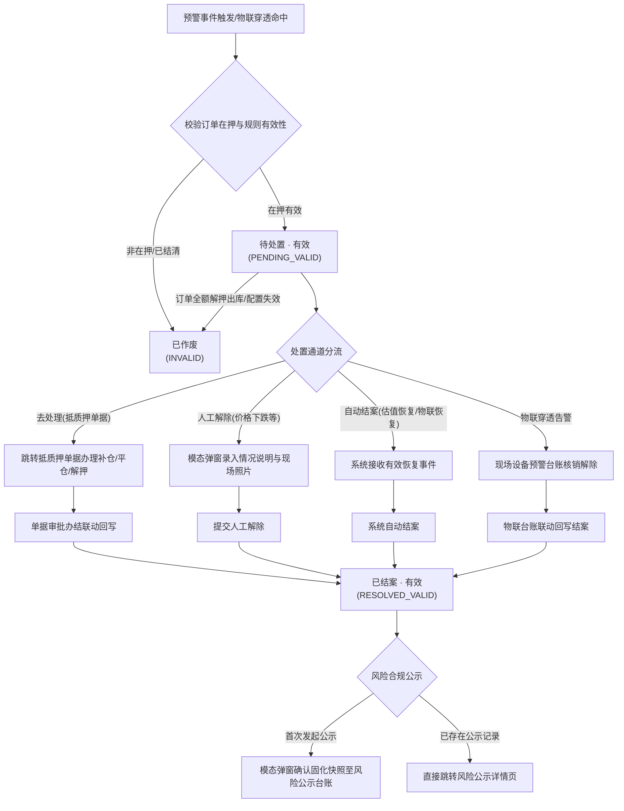

# 押品预警信息业务规则规格

> **版本**：V2.1 | 2026-09-16  
> **编写依据**：[押品预警信息主PRD](./押品预警信息主PRD.md)、[押品预警信息字段清单](./押品预警信息字段清单.md)、[订单预警配置业务规则规格](../../08-配置管理/19-风险管理-订单预警配置/订单预警配置业务规则规格.md)、[设备预警信息业务规则规格](../05-风险信息-设备预警信息/设备预警信息业务规则规格.md)  
> **真源声明**：本规格书是押品预警信息状态机、数据权限、预警生成与去重、单据处置联动及异常阻断的**唯一业务逻辑与技术规则真源（SSOT）**。所有涉及交互控件的表述已完成全面汉化规范。

---

## 1. 业务场景与当前订单范围

### 1.1 业务定位
在供应链金融动产质押业务中，质押物价值下跌、质押率突破警戒线、解押超时、盘点巡检缺失或风控模型预警，直接威胁资金方贷款安全。押品预警信息是订单级与押品级风险流水的承接中枢与处置工作台。当前承接由订单预警配置与携带有效抵押/质押订单上下文的物联设备事件触发的 7 类预警，并对历史监管预警进行只读兼容存档。

### 1.2 当前订单范围与历史兼容原则
1. **监管订单当前关闭**：当前新预警生成、订单去处理、人工核销解除和风险公示**仅适用于有效抵押/质押订单**；
2. **历史监管预警只读保留**：历史监管预警仅支持按权限查询、详情查看、审计追溯和资料下载，**严禁提供解除、去处理、公示或其他业务写操作**。

---

## 2. 状态机与生命周期流转

### 2.1 状态定义

押品预警流水采用“处理状态 + 记录有效性”组合三态词表：

| 组合状态编码 | 页面展示名称 | 业务含义 | 适用操作与行为边界 |
| :--- | :--- | :--- | :--- |
| `PENDING_VALID` | **待处置 · 有效**（未处理有效） | 预警事件已生效且订单有效，尚未完成业务处置或核查解除 | 支持【去处理】跳转单据、支持允许类型的【解除预警】、作为超时升级计时起点 |
| `RESOLVED_VALID` | **已结案 · 有效**（已处理有效） | 预警已通过业务单据办理办结或人工现场核查解除，事实成立已闭环 | 支持发起单条/批量【风险公示】、支持详情与审计查看、禁止再次处置 |
| `PENDING_INVALID` / `RESOLVED_INVALID` | **已作废**（未处理/已处理无效） | 关联订单全额解押出库、规则删除或配置失效置为无效 | 仅供历史追溯与审计归档，停止升级通知，禁止任何写操作与公示流转 |

### 2.2 状态变迁流程图（Mermaid）

---

## 3. 核心业务规则规格

### 3.1 权限控制与安全隔离规则 (COL-P 系列)

#### 【押品预警菜单与细粒度操作权限规则】(COL-P01)
* **规则描述**：进入【押品预警信息】菜单必须具备 `R-RISK-WARN-VIEW` 权限代码。行级【查看详情】需具备查看权限，行级【去处理】需具备项目管理权限，【解除预警】需具备 `R-RISK-WARN-RESOLVE` 权限，【公示风险】与【批量公示】需具备 `R-RISK-PUBLICIZE` 权限。
* **判定逻辑**：用户请求对应接口时，服务端网关执行 RBAC 细粒度校验，无权限统一阻断并返回 `403 Forbidden`。

#### 【订单数据权限行级隔离过滤规则】(COL-P02)
* **规则描述**：押品预警列表及详情查询强制执行基于登录账号所属机构/角色的**订单数据权限行级隔离**。
* **判定逻辑**：服务端 SQL 查询必须隐式注入当前用户的项目与订单可见范围（如机构 ID、归属业务员 ID、受托监管仓等），禁止展示用户权限外订单的任何预警流水。

#### 【权限失效动态屏蔽与服务端鉴权规则】(COL-P03)
* **规则描述**：前端界面应根据用户当前上下文动态禁用或隐藏无权操作的按钮。
* **判定逻辑**：当用户丢失对应功能或数据权限时，操作列按钮置灰并提供鼠标悬浮气泡提示（如“暂无此操作权限”）；服务端接口必须执行强鉴权，严禁仅依赖前端状态过滤。

#### 【订单跳转唯一标识与防越权校验规则】(COL-P04)
* **规则描述**：从押品预警列表点击【预警订单号】跳转至订单详情页时，前端必须通过路由参数携带 `order_id` 唯一标识。
* **判定逻辑**：目标订单详情页在加载时，服务端重新执行该订单的数据归属权限校验，严禁客户端通过篡改浏览器地址栏参数越权查看未授权订单。

#### 【主体设备与空间位置快照固化规则】(COL-P05)
* **规则描述**：当预警由物联设备穿透或包含位置监控信息时，预警触发瞬间必须固化订单编号、货物批次、所属仓库、库房、分区、关联设备唯一标识及设备名称快照。
* **判定逻辑**：后续即使物理设备发生重命名、解绑、移库或报废，预警流水详情中的位置与设备信息仍严格展示触发时历史快照。

#### 【现场抓拍图片私有OSS时效签名规则】(COL-P06)
* **规则描述**：预警触发抓拍图与解除抓拍图存储于私有对象存储（OSS），数据库仅持久化安全对象键（Object Key）。
* **判定逻辑**：列表展示使用懒加载默认占位图；用户点击查看或详情展示时，前端通过专属安全接口动态申请带过期时间（默认 15 分钟）的临时访问安全签名 URL，杜绝静态公开外链泄漏风险。

#### 【去处理跳转项目管理权限强校验规则】(COL-P07)
* **规则描述**：用户在列表或详情点击【去处理】操作时，必须强校验当前登录人是否具备【项目管理/抵质押单据】菜单权限。
* **判定逻辑**：
  1. 若用户不具备该菜单权限，**阻断页面跳转**，弹出轻量警告浮窗提示：`“您暂无相关权限，请联系相关负责人开通项目管理功能权限！”`；
  2. 若用户具备权限，携带 `order_no` 参数通过内部路由平滑跳转至【抵质押单据】列表页，并自动以该订单号执行精确筛选高亮展示。

#### 【历史监管预警只读禁止写操作规则】(COL-P08)
* **规则描述**：对于历史遗留的监管类预警流水，系统仅提供查看详情与审计快照权限。
* **判定逻辑**：列表中历史监管记录的操作列仅保留【查看详情】，**绝对隐藏或禁用【去处理】、【解除预警】及【公示风险】**；若通过 API 尝试提交写操作，服务端强校验订单类型，若为监管订单统一拦截并报错：`“历史监管预警不支持在线处置或公示！”`。

#### 【解除预警与公示风险权限校验规则】(COL-P09)
* **规则描述**：人工解除预警仅限状态为 `待处置 · 有效` 且属于允许人工核查大类（如价格下跌）的流水；公示风险仅限状态为 `已结案 · 有效` 的流水。
* **判定逻辑**：服务端在接收处理请求时，校验用户是否具备对应操作权限代码，并比对单据当前状态机与版本号，杜绝越权处理。

#### 【批量风险公示权限与单据副本规则】(COL-P10)
* **规则描述**：执行批量风险公示必须具备 `R-RISK-PUBLICIZE-BATCH` 权限，且批量操作仅向风险公示模块写入不可变公示初始副本，不修改原预警状态机。

---

### 3.2 预警生成、落账与去重规则 (COL-T 系列)

#### 【多源预警事件分布式防重幂等规则】(COL-T01)
* **规则描述**：风控引擎承接多源预警事件（定时扫描、跌价计算、物联设备回调、智风控模型回调）时，采用 `租户ID + 订单ID + 预警大类 + 事件业务唯一键` 构建分布式排他锁。
* **判定逻辑**：在 5 秒防抖窗口内，相同键值的重复事件直接丢弃并记录幂等日志，防止多节点并发导致同一次风险重复生成多条流水。

#### 【有效订单关联合格预警落账规则】(COL-T02)
* **规则描述**：预警事件落账时，系统实时校验关联订单状态。
* **判定逻辑**：
  1. 关联抵质押订单处于在押/存续状态（未结清、未完全解押出库），落账状态初始化为 `待处置 · 有效` (PENDING_VALID)；
  2. 若落账瞬间订单已全额解押出库或失效，直接标记为 `已作废` (INVALID) 并归档。

#### 【指标缺失与空值防伪预警阻断规则】(COL-T03)
* **规则描述**：严禁在核心风险指标缺失时生成伪预警。
* **判定逻辑**：
  1. 抵/质押率预警必须同时具备质押率实际值、贷款余额与质物价值快照；若某项计算返回 `null`，阻断入库并抛出风控计算异常告警；
  2. 贷中风控预警若智风控平台未返回模型分数，前端固定展示占位符 `--`，底层字段保留 `null`，严禁硬编码默认分值。

#### 【配置变更旧版本不回写与置无效规则】(COL-T04)
* **规则描述**：当管理员修改或删除 [订单预警配置](../../08-配置管理/19-风险管理-订单预警配置/订单预警配置主PRD.md) 时，遵循**快照不回写原则**。
* **判定逻辑**：
  1. 配置保存递增 Version，既有已生成的历史预警流水（无论是待处置还是已结案）**不回写、不重新计算**，固化触发当时规则版本快照；
  2. 若某项预警策略在配置中被明确关闭（Switch=OFF）或整单解绑，对于该策略历史遗留的未处理有效预警，系统触发异步任务将其置为 `已作废` (PENDING_INVALID)，并记录“配置关闭失效”系统审计日志。

#### 【订单出库解押关联预警最高级失效规则】(COL-T05)
* **规则描述**：订单货物全额解押出库是风险终结的最高级业务事件。
* **判定逻辑**：当抵质押业务办理完成全额解押出库审批并归档时，风控系统订阅该领域事件，将该订单下所有处于 `待处置 · 有效` 的押品预警自动原子更新为 `已作废` (PENDING_INVALID)，同时停止后续所有超时升级通知。

#### 【重复事件幂等放行与通知独立留痕规则】(COL-T06)
* **规则描述**：对于未结案的同类风险，周期性扫描再次触发时，不新增独立流水，但在原始预警下追加通知轮次与升级计时记录，保障列表整洁与审计完整。

---

### 3.3 交互与业务阻断规则 (COL-C 系列)

#### 【去处理跳转单据唯一标识与状态回写阻断规则】(COL-C01)
* **规则描述**：点击【去处理】必须验证订单单据处于可办理业务状态。
* **判定逻辑**：若订单已被业务锁定（如存在正在审批中的解押单），跳转后抵质押页面展示占用中提示；当业务端审批办结后，通过分布式消息回写押品预警状态为 `已结案 · 有效` (RESOLVED_VALID)，若回写失败抛出死信报警并支持风控后台重试。

#### 【解除预警情况说明与现场照片必填阻断规则】(COL-C02)
* **规则描述**：人工点击【解除预警】弹出解除核查模态弹窗时，执行强表单校验。
* **判定逻辑**：
  1. **情况说明**：必填，多行文本输入框限制 1~200 个汉字/字符，为空或仅含空格时提交按钮置灰阻断；
  2. **现场照片**：选填，支持 JPG/PNG/JPEG 格式，单个图片不超过 5MB，最多上传 10 张；
  3. **解除抓拍**：提交瞬间后台自动异步向关联监控摄像头下发抓拍指令，抓拍成功关联本流水，抓拍超时或无设备记录状态为“无抓拍图/抓拍失败”，不阻断业务正常解除。

#### 【未结案或无效流水发起公示阻断规则】(COL-C03)
* **规则描述**：严禁将未经处置核实的风险对外披露公示。
* **判定逻辑**：
  1. 仅允许状态为 `已结案 · 有效` (RESOLVED_VALID) 的记录发起单条或批量风险公示；
  2. 若记录状态为 `待处置 · 有效` 或 `已作废`，【公示风险】按钮绝对置灰或隐藏；若通过接口绕过提交，服务端强校验拦截并报错：`“仅已结案有效的预警流水支持发起风险公示！”`；
  3. 若流水在风险公示模块中已存在有效公示记录，点击【公示风险】直接跳转该条公示的详情页面，阻断重复创建初始副本。

---

### 3.4 预警固定模板与列表展示去重规则

#### 1. 固定模板内容装配规则

系统在预警生成瞬间，根据预警大类严格按以下标准模板组装 `warn_content`，模板变量必须从触发快照中提取：

| 预警大类 | 标准展示模板 | 变量提取与容错规则 |
| :--- | :--- | :--- |
| **解抵/质押超时** | `当前抵/质押物 {品类}-{规格}（{数量}{单位}）未在 {YYYY年MM月DD日} 完成解抵/质押！（预警阈值{阈值}天）` | 取触发时二维码/押品批次快照；规格或品类缺失填 `--` |
| **历史解监管超时** | `当前监管物 {品类}-{规格}（{数量}{单位}）未在 {YYYY年MM月DD日} 完成解监管！（预警阈值{阈值}天）` | 仅供历史归档记录只读展示，严禁触发新流水 |
| **价格下跌** | `抵/质押物价值下跌！当前订单货物价值已下跌超过{跌幅}%（预警阈值 {阈值}%）` | 跌幅与阈值保留 2 位小数，百分比展示 |
| **盘点异常** | `盘点异常！经盘点发现货物异常，请及时核查处理！` | 固定标准文案 |
| **巡检异常** | `巡检异常！{巡检人}未按时巡检盘点，请及时核查处理！` | 巡检人为空时展示 `相关巡检责任人` |
| **抵/质押率异常** | `订单抵/质押率异常！本次触发{命中线}，发生预警时订单抵/质押率为{实际率}%，贷款余额为{贷款余额}元，质物价值为{质物价值}元（预警阈值{阈值}%）` | 命中线枚举为“补仓线”或“平仓线”；金额格式化千分位展示（如 `1,250,000.00`） |
| **贷中风控预警** | `模型名称：{模型名称}；模型分数：{模型分数}；预警描述：{预警描述}` | 模型分数为空时展示 `--`，不得为 `null`；描述取智风控接口返回文本 |
| **物联穿透告警** | `【现场设备联动告警】所在库区监管设备[{设备名称}]触发[{事件类型}]预警，请核查现场押品安全！` | 设备名称与事件类型取设备侧触发快照 |

#### 2. 列表展示去重规则（Projection）
展示去重仅作用于列表查询结果，不物理删除原始流水。

| 范围 | 展示去重键 | 口径说明 |
| :--- | :--- | :--- |
| **待处置预警** | `设备唯一标识/订单号 + 预警大类 + 预警内容` | 列表按该键聚合，默认仅展示最新发生的一条未结案流水 |
| **已结案预警** | `订单号 + 预警大类 + 处理时间` | 相同订单同一批次核销解除的记录合并展示，详情内支持展开完整处理时间轴 |

---

## 4. 字段级校验与业务约束矩阵

| 字段名称 | 校验规则 | 错误提示/异常行为 |
| :--- | :--- | :--- |
| **预警订单号** (`order_no`) | 必须为系统已立项且在押的有效抵押/质押订单编号 | 模糊/精确匹配无结果时展示空态，点击跳转带参校验 |
| **预警类型** (`warn_type`) | 当前合法枚举为 7 大类（历史监管类型仅限历史兼容查询） | 下拉单选框提供 7 大类筛选，非法类型服务端拒绝 |
| **情况说明** (`resolve_desc`) | 限制 1~200 个汉字/字符，禁止全为空格 | 模态弹窗表单校验提示：`“请输入1~200字的情况说明”` |
| **现场照片** (`resolve_photos`) | 最多 10 张，支持 JPG/PNG/JPEG，单张最大 5MB | 超出提示：`“图片不能超过10张且单张不可超过5MB”` |
| **处理状态** (`warn_status`) | 三态枚举：待处置有效、已结案有效、已作废 | 严格依据状态机变迁，禁止客户端直接修改 |
| **是否公示** (`is_publicized`) | 三态枚举：未公示、已公示、已取消 | 仅已结案有效且未公示记录可勾选批量公示 |

---

## 5. 跨系统协同与物联穿透闭环

### 5.1 物联穿透告警闭环流转 (R11~R13)
1. **穿透生成**：当设备预警配置勾选 `sync_to_order_warn=true` 且该设备所在库区绑定有效在押订单时，系统自动派生 `warn_source=IOT_PENETRATION` 押品预警流水，状态为 `待处置 · 有效`；
2. **押品侧只读锁定**：在押品预警信息页面，此类流水操作列**不提供直接【解除预警】按钮**，操作列展示气泡提示：`“物联穿透预警须在现场设备台账完成核查结案”`；
3. **闭环回写**：当监管员在 [01设备预警信息](../05-风险信息-设备预警信息/设备预警信息主PRD.md) 完成现场核验并解除告警后，设备侧触发领域事件，系统联动将押品侧对应预警流水更新为 `已结案 · 有效` (RESOLVED_VALID)，实现“货-仓-金”全链路穿透闭环。

---

## 6. 修订记录

| 版本 | 修订日期 | 修订人 | 修订内容 |
| :---: | :---: | :---: | :--- |
| **V1.0** | 2026-08-18 | 产品团队 | 初版创建，定义 7 类押品预警流水与处置机制。 |
| **V2.0** | 2026-09-11 | 产品团队 | 关闭监管订单当前运营链路，明确历史监管预警只读归档；强化物联穿透与去处理跳转权限。 |
| **V2.1** | 2026-09-16 | 产品团队 | 全面重构业务规则体系，升级为 `【规则业务名称】(编码)` 语义自解释编号（COL-P01~10、COL-T01~06、COL-C01~03）；全面汉化交互控件术语；强化物联穿透只读锁定与闭环回写机制。 |
