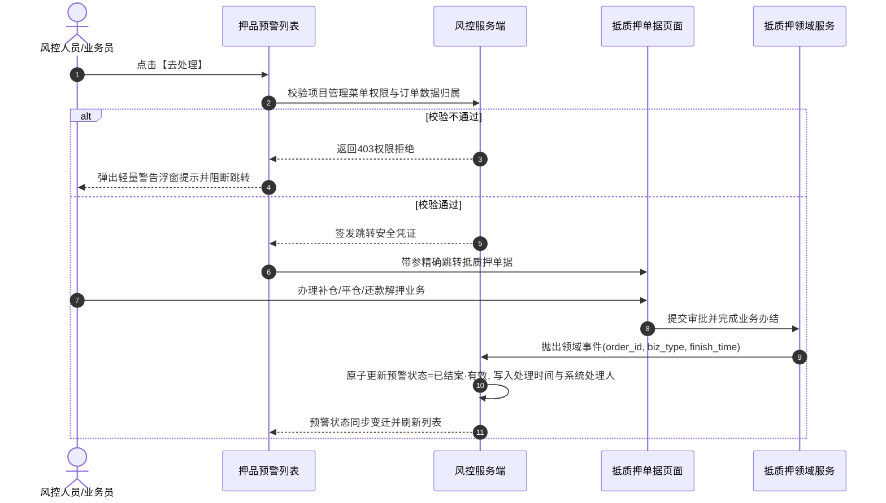

# 押品预警信息主需求文档 (PRD)

> **版本**：V2.1 | 2026-09-16  
> **读者**：研发工程师、测试工程师、风控经理、信贷审批员、系统架构师  
> **编写依据**：[押品预警信息字段清单](./押品预警信息字段清单.md)、[押品预警信息业务规则规格](./押品预警信息业务规则规格.md)、[订单预警配置主PRD](../../08-配置管理/19-风险管理-订单预警配置/订单预警配置主PRD.md)  
> **真源声明**：本主 PRD 负责业务场景、页面交互布局、用户路径、操作行为与状态机协同。字段标准引自字段清单，底层状态机与校验规则以业务规则规格为唯一真源。所有交互控件术语均已规范汉化。  
> **当前订单范围**：监管订单当前关闭。当前新预警生成、订单处置和风险公示仅适用于有效抵押/质押订单；历史监管预警仅支持按权限查询、详情、审计和资料查看，严禁提供解除、公示或其他业务写操作。

---

## 1. 业务背景与业务目标

### 1.1 业务背景
在供应链金融动产质押与存货监管业务中，质押物价值下跌、质押率突破警戒线、解押超时、盘点巡检缺失或风控模型预警，直接威胁资金方贷款安全。  
**押品预警信息**是订单级与押品级风险流水的承接中枢与处置工作台。当前承接由 [01订单预警配置](../../08-配置管理/19-风险管理-订单预警配置/订单预警配置主PRD.md) 与携带有效抵押/质押订单上下文的物联设备事件触发的 7 类预警；历史监管预警保留为只读档案。系统提供**固定模板风险描述生成、列表展示去重、跳转单据处理（补仓/平仓/部分结清）、超时升级及发起风险公示**的全流程闭环。

### 1.2 核心业务目标
1. **风险实时透视**：汇聚订单价格、质押率、时效、线下巡检盘点及现场物联告警，实现“货-仓-金”穿透式监控；
2. **处置闭环流转**：通过标准业务跳转（去处理）精准联动抵质押单据办理补仓平仓，或通过人工现场核查解除预警，确保风险处置 100% 留痕闭环；
3. **司法证据保全**：预警发生时固化不可变快照，关联私有对象存储（OSS）现场抓拍图，为风险公示与后续司法维权提供合规证据链。

---

## 2. 页面功能说明与交互布局

### 2.1 页面骨架与分区设计

押品预警信息页面采用典型的 B 端后台管理标准布局，由三大核心工作区构成：

```
+----------------------------------------------------------------------------------------------------+
| 顶部标题栏：押品预警信息  [批量风险公示]                                                             |
+----------------------------------------------------------------------------------------------------+
| 筛选工作区（展开/收起）：                                                                          |
| 预警订单号 [单行文本输入框]  预警类型 [下拉单选框 (7大类)]  是否公示 [下拉单选框]  预警状态 [下拉单选框]  |
| [查询]  [重置]                                                                                     |
+----------------------------------------------------------------------------------------------------+
| 预警流水表格工作区（支持展示去重与批量复选）：                                                      |
| [ ] 序号 | 预警订单号 | 预警类型 | 预警内容（固定模板） | 现场抓拍图 | 预警时间 | 处理时间 | 是否公示 | 处理人 | 状态 | 行操作 |
| [ ]  1  | DZY2026.. | 价格下跌 | 抵/质押物价值下跌... | [缩略图]   | 2026-... | 2026-... | 已公示   | 张三   |已结案| 详情   |
| [ ]  2  | DZY2026.. | 质押率   | 订单抵/质押率异常... | [缩略图]   | 2026-... |    --    | 未公示   |  --    |待处置|去处理 解除 详情|
+----------------------------------------------------------------------------------------------------+
| 底部固定栏：分页控件（每页条数选择、总条数统计、页码跳转）                                            |
+----------------------------------------------------------------------------------------------------+
```

### 2.2 核心交互控件规格与操作规范

1. **筛选工作区**：
   - **预警订单号**：单行文本输入框（Input），支持模糊输入，回车或点击【查询】触发检索；
   - **预警类型**：下拉单选框（Select），当前枚举支持：解抵/质押超时、价格下跌、盘点异常、巡检异常、抵/质押率异常、贷中风控预警、物联穿透告警；
   - **是否公示**：下拉单选框，选项：全部、未公示、已公示、已取消；
   - **预警状态**：下拉单选框，选项：全部、待处置 · 有效（未处理有效）、已结案 · 有效（已处理有效）、已作废；
   - **操作按钮**：主色【查询】按钮、次色【重置】按钮。
2. **列表与行级交互列**：
   - **复选框**：仅对状态为 `已结案 · 有效` 且 `未公示` 的流水允许勾选（用于顶部【批量风险公示】），其余状态行复选框禁用置灰并提供鼠标悬浮气泡提示；
   - **预警订单号跳转**：高亮文字超链接，点击后携带唯一标识跳转订单详情，受 `【订单跳转唯一标识与防越权校验规则】(COL-P04)` 约束；
   - **现场抓拍图**：表格内默认展示安全缩略图占位，点击弹出全屏大图预览模态弹窗，受 `【现场抓拍图片私有OSS时效签名规则】(COL-P06)` 约束；
   - **行级操作按钮组**：
     - **【去处理】**：仅在 `待处置 · 有效` 且当前抵质押订单允许单据流转时呈现；受 `【去处理跳转项目管理权限强校验规则】(COL-P07)` 约束；
     - **【解除预警】**：仅在 `待处置 · 有效` 且属于允许人工核销大类时呈现，点击弹出解除核查模态弹窗；
     - **【公示风险】**：仅在 `已结案 · 有效` 行呈现；
     - **【详情】**：所有流水常态展示，点击从右侧滑出预警详情抽屉面板。

---

## 3. 核心业务场景与用户旅程

### 场景 1【复合筛选与展示去重检索】(COL-S01)
* **主业务旅程**：风控人员进入工作台，输入订单编号或选择预警类型进行筛选。系统依据 `【订单数据权限行级隔离过滤规则】(COL-P02)` 注入租户与组织数据权限，并对同设备同类型的待处置流水执行展示去重，分页展示最新鲜的风险暴露事实。

### 场景 2【去处理跳转抵质押单据闭环流转】(COL-S02)
* **主业务旅程**：
  1. 风控人员在一条抵/质押率超标或超期预警行点击【去处理】；
  2. 系统触发 `【去处理跳转项目管理权限强校验规则】(COL-P07)`，校验用户具备项目管理权限；
  3. 页面平滑跳转至【抵质押单据】模块，并在列表中自动精准高亮过滤出该单据；
  4. 业务员办理完成补仓审批或部分提前还款归档；
  5. 抵质押领域服务向风控系统发送审批办结领域事件，系统依据 `【去处理跳转单据唯一标识与状态回写阻断规则】(COL-C01)` 自动将该预警更新为 `已结案 · 有效` (RESOLVED_VALID)，完成无缝闭环。



### 场景 3【现场人工核查并解除预警】(COL-S03)
* **主业务旅程**：针对价格下跌或盘点异常预警，风控经理与现场仓管核实后，点击【解除预警】，弹出模态弹窗；风控经理录入核查情况说明（限制 1~200 字）并上传现场证明照片；提交时系统触发实时抓拍指令并校验 `【解除预警情况说明与现场照片必填阻断规则】(COL-C02)`，成功后单据变为 `已结案 · 有效`。

### 场景 4【已结案风险合规公示流转】(COL-S04)
* **主业务旅程**：针对已结案的重大违约或违规风险，风控专员点击【公示风险】或顶部【批量风险公示】。系统校验 `【未结案或无效流水发起公示阻断规则】(COL-C03)`，若为首次公示，弹出确认模态弹窗，生成不可变公示副本投递至 [05风险公示](../09-风险信息-风险公示/风险公示主PRD.md)；若已有公示记录，直接带参跳转至风险公示详情页面查看公示历史。

### 场景 5【历史监管预警只读合规归档】(COL-S05)
* **主业务旅程**：由于监管订单业务当前已关闭，风控专员查询历史监管预警时，系统依据 `【历史监管预警只读禁止写操作规则】(COL-P08)`，仅提供详情与审计查看，严禁任何在线处置、解除或公示写操作。

---

## 4. 业务规则映射与追溯矩阵

| 规则编码 | 规则业务全称 | 规格章节 | 对应场景 | 交互表现与系统行为 |
| :--- | :--- | :--- | :--- | :--- |
| **COL-P01** | 【押品预警菜单与细粒度操作权限规则】 | 业务规则 §3.1 | 全场景 | 无菜单权限直接重定向，无按钮权限置灰或隐藏 |
| **COL-P02** | 【订单数据权限行级隔离过滤规则】 | 业务规则 §3.1 | COL-S01 | 查询接口强制注入机构与项目数据范围 |
| **COL-P03** | 【权限失效动态屏蔽与服务端鉴权规则】 | 业务规则 §3.1 | 全场景 | 按钮动态失效，悬浮展示中文气泡提示 |
| **COL-P04** | 【订单跳转唯一标识与防越权校验规则】 | 业务规则 §3.1 | COL-S02 | 点击订单号使用 order_id 传参，禁止篡改参数越权 |
| **COL-P05** | 【主体设备与空间位置快照固化规则】 | 业务规则 §3.1 | 全场景 | 详情页展示触发瞬间固化数据，不受后续物理变更影响 |
| **COL-P06** | 【现场抓拍图片私有OSS时效签名规则】 | 业务规则 §3.1 | COL-S01/S03 | 私有 OSS 动态换取 15 分钟临时访问安全凭据 |
| **COL-P07** | 【去处理跳转项目管理权限强校验规则】 | 业务规则 §3.1 | COL-S02 | 无权限弹出警告浮窗提示并阻断跳转 |
| **COL-P08** | 【历史监管预警只读禁止写操作规则】 | 业务规则 §3.1 | COL-S05 | 历史监管记录仅保留详情，绝对隐藏处置与公示操作 |
| **COL-P09** | 【解除预警与公示风险权限校验规则】 | 业务规则 §3.1 | COL-S03/S04 | 服务端二次比对操作人角色与流水状态机 |
| **COL-P10** | 【批量风险公示权限与单据副本规则】 | 业务规则 §3.1 | COL-S04 | 批量写入独立公示台账，不破坏原流水数据 |
| **COL-T01** | 【多源预警事件分布式防重幂等规则】 | 业务规则 §3.2 | 全场景 | 5 秒分布式防抖锁，相同事件直接丢弃幂等放行 |
| **COL-T02** | 【有效订单关联合格预警落账规则】 | 业务规则 §3.2 | 全场景 | 非在押订单触发预警直接记为已作废 |
| **COL-T03** | 【指标缺失与空值防伪预警阻断规则】 | 业务规则 §3.2 | 全场景 | 质押率缺失阻断落账，模型分缺失展示 `--` |
| **COL-T04** | 【配置变更旧版本不回写与置无效规则】 | 业务规则 §3.2 | COL-S01 | 配置变更版本递增，不回写存量未结案流水 |
| **COL-T05** | 【订单出库解押关联预警最高级失效规则】 | 业务规则 §3.2 | COL-S02 | 全额出库解押自动将未结案预警更新为已作废 |
| **COL-T06** | 【重复事件幂等放行与通知独立留痕规则】 | 业务规则 §3.2 | COL-S01 | 重复触发累加升级轮次，不增加多余列表流水 |
| **COL-C01** | 【去处理跳转单据唯一标识与状态回写阻断规则】 | 业务规则 §3.3 | COL-S02 | 单据办结异步领域事件回写预警结案 |
| **COL-C02** | 【解除预警情况说明与现场照片必填阻断规则】 | 业务规则 §3.3 | COL-S03 | 说明 1~200 字强校验，照片最多 10 张，自动联动抓拍 |
| **COL-C03** | 【未结案或无效流水发起公示阻断规则】 | 业务规则 §3.3 | COL-S04 | 仅已结案有效流水可发起公示，存在记录直接跳详情 |

---

## 5. 验收标准与测试用例

| 用例编号 | 对应场景 | 关联规则 | 测试输入与前置条件 | 预期输出与验收标准 |
| :---: | :---: | :---: | :--- | :--- |
| **COL-TC01** | COL-S01 | COL-T03 | 模拟质押率达到平仓线触发告警，质物价值为空 | 系统判定指标缺失阻断入库，控制台抛出计算告警，不生成错误流水 |
| **COL-TC02** | COL-S02 | COL-P07 | 登录用户无“项目管理”菜单权限，点击列表【去处理】 | 页面阻断跳转，弹出浮窗提示：`“您暂无相关权限，请联系相关负责人开通项目管理功能权限！”` |
| **COL-TC03** | COL-S02 | COL-C01 | 用户跳转至抵质押单据办理完成补仓审批并归档 | 押品预警状态自动联动更新为 `已结案 · 有效`，处理人显示实际审批人账号/姓名 |
| **COL-TC04** | COL-S03 | COL-C02 | 点击【解除预警】，情况说明输入全空格字符 | 模态弹窗提交按钮置灰阻断，红字提示：`“请输入1~200字的情况说明”` |
| **COL-TC05** | COL-S04 | COL-C03 | 尝试对 `待处置 · 有效` 的流水发起批量风险公示 | 列表行级复选框置灰无法勾选，悬浮提示：`“仅已结案且未公示的记录可参与公示”` |
| **COL-TC06** | COL-S05 | COL-P08 | 查询历史监管预警记录并查看操作列 | 操作列仅展示【详情】，不显示【去处理】、【解除预警】和【公示风险】 |

---

## 6. 修订记录

| 版本 | 修订日期 | 修订人 | 修订内容 |
| :---: | :---: | :---: | :--- |
| **V1.0** | 2026-08-18 | 产品团队 | 初版发布，定义押品预警信息 7 类风险流水。 |
| **V2.0** | 2026-09-11 | 产品团队 | 关闭监管订单当前运营链路，明确历史监管预警只读归档；规范单据跳转与公示机制。 |
| **V2.1** | 2026-09-16 | 产品团队 | 场景编号全面升级为自解释语义命名 `场景 N【...】(COL-Sxx)`；全面汉化交互控件；建立与业务规则规格 `(COL-P/T/C)` 的全量双向追溯表与验收测试矩阵。 |
