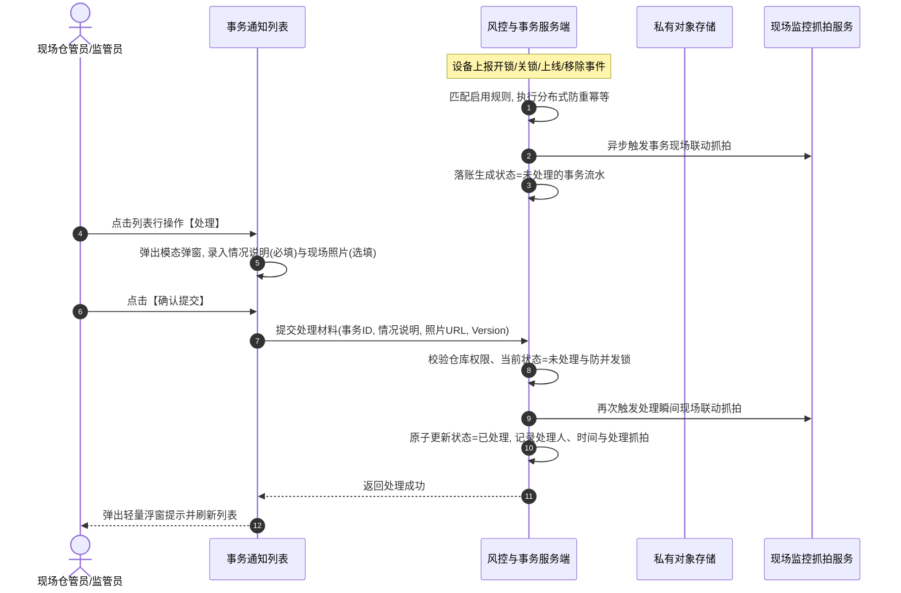

# 设备事务通知信息业务规则规格

> **版本**：V2.0 | 2026-09-16  
> **编写依据**：[设备事务通知信息主PRD](./设备事务通知信息主PRD.md)、[设备事务通知信息字段清单](./设备事务通知信息字段清单.md)、[设备事务通知配置业务规则规格](../../08-配置管理/21-风险管理-设备事务通知配置/设备事务通知配置业务规则规格.md)、[门禁设备字段清单](../../02-仓储/17-设备管理-门禁设备/门禁设备字段清单.md)  
> **真源声明**：本规格书是设备事务通知信息状态机、数据权限、事件触发接入、快照固化、人工核查处理、图片时效安全及异常阻断的**唯一业务逻辑与技术规则真源（SSOT）**。所有涉及交互控件的表述已完成全面汉化规范。

---

## 1. 业务对象与能力边界

### 1.1 业务对象定义
设备事务通知信息记录的是物联设备（门禁、智能挂锁、监控摄像头等）在日常作业中产生的**瞬时操作事件**（如刷卡开锁、机械关锁、设备上线、主动移除等）。当事件命中已启用的事务通知配置规则时，系统自动生成一条设备事务通知流水。

### 1.2 与风险预警的能力边界区分

| 对比维度 | 设备预警信息 / 押品预警信息 | 设备事务通知信息 |
| :--- | :--- | :--- |
| **业务性质** | 持续性或异常风险事实（告警/隐患） | 正常或合规日常作业事件（操作/通知） |
| **状态机模型** | 组合三态（待处置有效、已结案有效、已作废） | **纯二态模型**：`未处理` (PENDING) $\rightarrow$ `已处理` (RESOLVED) |
| **处理与结案** | 支持系统自动恢复、现场核验结案、物联穿透闭环 | **全量人工核查结案**（情况说明 + 现场照片 + 联动抓拍） |
| **超时与升级** | 支持超时未处理升级通知、多轮提醒 | **不设升级任务**，不设多轮定时催办 |
| **风险合规公示** | 已结案有效流水可推送至风险公示台账 | **绝对不推送风险公示**，仅作内部作业审计追溯 |
| **状态独立性** | 预警状态由风险处置流转决定 | 事务处理仅改变本记录状态，**严禁交叉回写任何预警记录状态** |

---

## 2. 状态机与生命周期流转

### 2.1 状态定义

| 状态编码 | 页面展示名称 | 业务含义 | 适用操作与行为边界 |
| :--- | :--- | :--- | :--- |
| `PENDING` | **未处理** | 事务事件已触发落账，现场仓管员尚未提交核查处理 | 允许提交【处理】操作，展示待办状态 |
| `RESOLVED` | **已处理** | 仓管员已完成现场核实，提交情况说明与现场照片，已闭环 | **单向终态**；仅支持【查看详情】，禁止重复编辑或撤销 |

### 2.2 状态流转时序图（Mermaid）

---

## 3. 核心业务规则规格

### 3.1 权限与数据可见性规则 (EVT-I 系列)

#### 【事务通知菜单访问与细粒度鉴权规则】(EVT-I01)
* **规则描述**：进入【设备事务通知信息】菜单必须具备 `R-DEVICE-NOTIFY-VIEW` 权限代码。行级【查看详情】需具备查看权限，图片预览需具备 `R-DEVICE-NOTIFY-IMG` 权限，行级【处理】需具备 `R-DEVICE-NOTIFY-HANDLE` 权限。
* **判定逻辑**：用户发起请求时，网关强校验功能权限，无权限拦截并返回 `403 Forbidden`。

#### 【配置规则设备关联多对多可见性过滤规则】(EVT-I02)
* **规则描述**：配置端的规则可见性按绑定设备过滤；若规则绑定的设备均未绑定仓库，则对具备配置查看权限的账号均可见。

#### 【事务通知仓库数据权限行级过滤规则】(EVT-I03)
* **规则描述**：事务通知信息列表与详情查询，强制按**实际触发设备所属的仓库数据权限**执行行级隔离。
* **判定逻辑**：
  1. 触发设备已绑定所属仓库时，当前登录账号管辖仓库列表必须包含该设备所属仓库，否则不得展示；
  2. 若触发设备属于租户内未绑定具体仓库的新设备或在途设备，对本租户内具备菜单查看权限的所有账号可见。

#### 【全员可见受限租户隔离与功能鉴权规则】(EVT-I04)
* **规则描述**：“所有人可见”仅指不受仓库绑定维度的过滤，依然受到系统租户物理隔离、菜单权限、按钮权限和数据安全鉴权的严格约束。

#### 【物理设备变更历史事务快照固化规则】(EVT-I05)
* **规则描述**：当物理设备在设备管理模块中被解绑、重命名、移库、停用、逻辑删除或物理移除时，已生成的历史事务通知记录**绝对不随之删除**。
* **判定逻辑**：历史记录详情与列表展示始终严格沿用触发瞬间固化的设备名称、编码、类型及仓库/库房/分区位置快照。

#### 【敏感接口服务端鉴权与防越权校验规则】(EVT-I06)
* **规则描述**：列表查询、详情加载、图片时效签名换取及处理提交等所有 API，必须由服务端重新校验当前用户的租户、菜单、仓库数据权限及单据版本号。
* **判定逻辑**：严禁信任客户端传入的分页参数、设备 ID 或自拟权限标志，杜绝水平越权与垂直越权。

#### 【订单类型扩展预留与隔离兼容规则】(EVT-I07)
* **规则描述**：当前版本不实施订单类型分页；未来扩展多类型订单时，采用可扩展枚举，严格按同类型订单数据权限隔离。

#### 【设备移除唯一来源领域事件触发规则】(EVT-I08)
* **规则描述**：设备移除通知**仅由设备管理服务在用户主动发起移除操作并返回成功后抛出的正式领域事件触发**。
* **判定逻辑**：设备权限撤销、逻辑删除、网络离线或移除失败，绝对不自动推断为设备移除事务通知。

---

### 3.2 事务事件接入与快照固化规则 (EVT-T 系列)

#### 【门禁门锁事务事件合法接入与规则匹配规则】(EVT-T01)
* **规则描述**：开锁/关锁事务由门禁系统或智能挂锁专有协议接口上报。
* **判定逻辑**：事件接入网关校验数据包签名合法后，匹配当前租户下针对该设备已启用的事务通知配置规则；未匹配到启用规则时仅留存系统通信日志，不生成页面事务流水。

#### 【设备首次同步与离线重上线判定规则】(EVT-T02)
* **规则描述**：设备上线事务涵盖新设备首次入网同步，以及既有设备由离线变为在线的瞬间状态跳变。
* **判定逻辑**：物联中台检测到心跳恢复或注册事件时，校验设备上一状态，仅由“未注册/离线”跃迁至“在线”瞬间触发一次，运行过程中的持续心跳不重复触发上线通知。

#### 【设备管理服务移除成功领域事件联动规则】(EVT-T03)
* **规则描述**：管理员在 [设备管理](../../02-仓储/17-设备管理-门禁设备/门禁设备字段清单.md) 提交移除设备并经审批通过后，设备管理服务向 MQ 抛出 `DEVICE_REMOVED_EVENT`。事务通知模块订阅该事件并生成一条设备移除事务通知。

#### 【规则命中服务端设备范围二次校验规则】(EVT-T04)
* **规则描述**：事件接入时，服务端根据租户 ID、事务类型和设备唯一标识，实时复核规则启禁用状态与绑定范围，防止并发修改配置导致作废规则误触发。

#### 【停用删除规则不回溯影响历史流水规则】(EVT-T05)
* **规则描述**：规则被停用或删除后，立即停止匹配新事件；**历史已产生的事务通知流水全部完整保留**，不回溯删除，不回溯更新发送状态。

#### 【关键要素缺失与异常事件审计阻断规则】(EVT-T06)
* **规则描述**：事件若缺少租户 ID、设备唯一标识、事务类型或时间戳，视为畸形报文，系统阻断落账并记录安全审计异常日志。

#### 【全维度设备与空间位置快照固化规则】(EVT-T11)
* **规则描述**：事务落账瞬间，必须固化如下快照：事务流水 ID、来源事件 ID、设备 ID、设备原名称、系统内名称、设备编码、设备类型、所属仓库名称、库房编号、分区编号、具体点位、事务类型、事务内容组合文案及触发时间戳。

#### 【后续主数据变更不回写历史快照规则】(EVT-T12)
* **规则描述**：严禁在列表或详情查询时通过动态关联主表覆盖历史快照；即使仓库更名或设备迁移，历史快照保持不可变。

#### 【事务标准内容动态装配与空值占位规则】(EVT-T13)
* **规则描述**：事务内容字段按标准结构装配：`位置：{仓库名称}+{库房/分区}；设备名称：{系统内名称}；事务：{具体动作描述}`。若某项属性缺失，以 `-` 占位，严禁展示 `null` 或 `undefined`。

---

### 3.3 幂等防重与消息下发规则 (EVT-U 系列)

#### 【多源事务事件分布式防重幂等规则】(EVT-U01)
* **规则描述**：采用 `租户ID + 设备ID + 事务类型 + 来源事件ID` 构建分布式排他防重锁与数据库唯一索引。
* **判定逻辑**：第三方未提供事件 ID 时，由服务端根据 `设备ID + 事务类型 + 毫秒时间戳` 生成确定性哈希幂等键；5 秒内重复接入的相同事件直接幂等忽略。

#### 【幂等键与事务流水同事务一致性落库规则】(EVT-U02)
* **规则描述**：幂等键与事务通知流水必须在本地数据库事务中强一致落库，确保高并发消费下不产生双胞胎流水。

#### 【事务通知独立落账禁止去重合并规则】(EVT-U03)
* **规则描述**：事务通知记录属于离散操作流水，**绝对不执行同设备、同类型的未处理合并去重**；每次合法的独立开锁或上线操作均应完整体现为一条独立行。

#### 【并发消费排他锁与初始状态防重规则】(EVT-U04)
* **规则描述**：新记录写入时初始状态强制赋值为 `未处理` (PENDING)，并通过行锁保证初始状态不可篡改。

#### 【站内信默认推送与多渠道下发规则】(EVT-U05)
* **规则描述**：命中启用规则后，系统默认向配置的接收人发送系统站内信；若规则勾选了邮件或短信，异步投递至对应通信中台。

#### 【通知发送失败隔离与重试结果更新规则】(EVT-U06)
* **规则描述**：短信或邮件由于通道欠费、网络超时发送失败时，**绝对不回滚事务通知流水本体**；后台记录失败原因并支持定时补偿重试，重试成功仅更新发送日志。

#### 【接收人状态有效性校验与停用跳过规则】(EVT-U07)
* **规则描述**：下发通知前实时校验接收人账号状态；若账号已被停用或离职，系统自动跳过该接收人并记录审计说明。

#### 【免升级免公示纯事务通知定位规则】(EVT-U08)
* **规则描述**：设备事务通知信息**不设升级通知机制、不设定时催办提醒、不具备推送到风险公示模块的链路**，严格恪守仓储作业操作台账的定位。

---

### 3.4 列表展示与详情查询规则 (EVT-D 系列)

#### 【列表标准字段序列与展示规范规则】(EVT-D01)
* **规则描述**：列表字段展示顺序固定为：`序号`、`事务通知规则名称`、`事务类型`、`事务内容`、`创建时间`（实际触发时间）、`处理时间`、`处理人`、`状态`、`操作`。

#### 【筛选复合参数校验与模糊精准规范规则】(EVT-D02)
* **规则描述**：
  1. **事务规则名称**：单行文本输入框，支持前后模糊匹配；
  2. **事务类型**：下拉多选框，提供开锁通知、关锁通知、设备上线、设备移除 4 项，精确匹配；
  3. **状态**：下拉单选框，提供未处理、已处理 2 项，精确匹配。

#### 【触发时间倒序排列与服务端分页规则】(EVT-D03)
* **规则描述**：列表默认按创建时间（触发时间）降序排列（最新发生的排在最前）；分页参数由服务端严格校验，禁止越界。

#### 【主键定位详情与禁止序号作为索引规则】(EVT-D04)
* **规则描述**：查看详情必须以全局唯一标识 `notify_id` 进行请求，禁止使用前端当前页行序号作为接口索引。

#### 【已处理状态只读与未处理处理入口规则】(EVT-D05)
* **规则描述**：状态为 `未处理` 时，若操作人具备处理权限，操作列提供【处理】和【详情】按钮；状态为 `已处理` 时，操作列**仅展示【详情】按钮**，杜绝重复处理。

#### 【列表图片占位与点击动态验签规则】(EVT-D06)
* **规则描述**：列表表格内不直接加载 OSS 高清原图，展示安全缩略图占位；用户点击预览时，前端调用服务端接口动态换取 15 分钟临时安全签名 URL。

#### 【监控状态无图与失败标准占位规则】(EVT-D07)
* **规则描述**：现场无关联监控设备时，抓拍图固定展示 `无抓拍图`；三方抓拍超时或异常时展示 `抓拍失败`，严禁加载破损图标或拼接无效链接。

#### 【触发抓拍与处理抓拍独立固化防覆盖规则】(EVT-D08)
* **规则描述**：事务触发时的现场抓拍（`trigger_image_url`）与人工提交处理时的现场抓拍（`handle_image_url`）在底层独立字段分开存储；**处理提交的新抓拍绝对禁止覆盖触发抓拍**，详情页按双图并列展示。

---

### 3.5 人工处理与阻断校验规则 (EVT-H 系列)

#### 【事务全量人工核查与预警状态隔离规则】(EVT-H01)
* **规则描述**：四类事务通知均需人工在 PC 端或移动端提交核查处理；处理成功仅更新本流水状态为 `已处理`，**绝对不改变任何设备预警或押品预警状态**。

#### 【未处理状态前置校验与认证身份绑定规则】(EVT-H02)
* **规则描述**：提交处理时，系统前置校验当前记录状态必须为 `未处理` (PENDING)；处理人字段严格取自当前登录会话上下文，客户端不可伪造。

#### 【人工核查情况说明与现场照片必填阻断规则】(EVT-H03)
* **规则描述**：在处理模态弹窗中提交时执行强表单校验：
  1. **情况说明**：必填，多行文本输入框限制 1~200 个汉字/字符，为空或仅含空格时提交按钮置灰阻断；
  2. **现场照片**：选填，支持 JPG/PNG/JPEG 格式，单个图片不超过 5MB，最多上传 10 张；
  3. 表单校验不通过时，弹出警告浮窗提示相应错误信息。

#### 【处理提交联动监控异步抓拍规则】(EVT-H04)
* **规则描述**：用户提交处理表单瞬间，服务端后台自动向触发设备所在区域的关联监控发起一次异步抓拍请求，并将返回的图片对象键关联至本流水的 `handle_image_url` 字段。若抓拍超时，记录 `抓拍失败`，不阻断处理正常提交。

#### 【状态变迁原子回写与全链路审计规则】(EVT-H05)
* **规则描述**：处理提交成功后，系统在单个数据库事务内原子更新：状态=`已处理`、处理时间=当前服务器时间、处理人=`账号/姓名(机构)`、情况说明、现场照片、处理抓拍图及全量操作审计日志。

#### 【处理提交异常回滚与版本冲突阻断规则】(EVT-H06)
* **规则描述**：若在提交过程中发生网络异常、乐观锁版本冲突（其他仓管员已抢先处理完成），系统回滚事务并弹出浮窗提示：`“该事务通知已被其他人员处理，页面已刷新”`。

#### 【已结案单据幂等返回防重复提交规则】(EVT-H07)
* **规则描述**：已处理记录再次收到处理请求时，服务端直接返回处理成功及首次处理快照，绝不二次写入或篡改首次处理时间与说明。

#### 【纯二态模型与杜绝预警有效性混淆规则】(EVT-H08)
* **规则描述**：本模块流水仅有 `未处理` 和 `已处理` 两种状态，**严禁引入设备预警的“未处理（无效）”或“已作废”状态概念**。

---

### 3.6 抓拍安全与图片生命周期规则 (EVT-PH 系列)

#### 【触发设备空间范围监控设备去重规则】(EVT-PH01)
* **规则描述**：系统依据触发设备所在仓库、库房、分区空间拓扑，查找该区域绑定的枪机/球机监控；若命中多个监控设备，按配置的优先级选择主监控抓拍，不跨区域抓拍。

#### 【重试抓拍独立关联防生成重复流水规则】(EVT-PH02)
* **规则描述**：监控抓拍若因网络抖动触发重试，重试仅更新图片状态字段，严禁派生新的事务流水。

#### 【图片要素完整持久化与私网隔离规则】(EVT-PH03)
* **规则描述**：数据库持久化存储抓拍记录时，必须包含图片唯一键、关联事务流水 ID、监控设备 ID、抓拍时间戳与 OSS 对象键；原始真实 OSS 存储路径与密钥严禁下发前端。

#### 【现场抓拍图片私有OSS时效签名规则】(EVT-PH04)
* **规则描述**：所有图片资源均受私有 OSS 保护，前端查看必须通过专属安全接口动态换取 15 分钟临时安全签名 URL，签名过期后自动失效。

#### 【抓拍异常容错与主流程免阻断机制】(EVT-PH05)
* **规则描述**：监控离线、镜头遮挡或抓拍超时属于外设异常，系统记录抓拍失败状态，**绝对不影响事务通知流水的正常生成与人工处理的正常提交**。

---

## 4. 字段级校验与业务约束矩阵

| 字段名称 | 校验规则 | 错误提示/异常行为 |
| :--- | :--- | :--- |
| **事务规则名称** (`rule_name`) | 单行文本输入框，支持 1~50 字符模糊查询 | 无匹配时展示空态表格 |
| **事务类型** (`event_type`) | 下拉多选框，仅限：开锁通知、关锁通知、设备上线、设备移除 | 传入非法枚举服务端返回 400 参数错误 |
| **状态** (`handle_status`) | 下拉单选框，枚举：未处理 (PENDING)、已处理 (RESOLVED) | 必须为合法二态枚举 |
| **情况说明** (`handle_desc`) | 多行文本输入框，限制 1~200 个汉字/字符，禁止全为空格 | 模态弹窗拦截并红字提示：`“请输入1~200字的情况说明”` |
| **现场照片** (`handle_photos`) | 文件上传控件，最多 10 张，JPG/PNG/JPEG，单张最大 5MB | 超限提示：`“图片不能超过10张且单张不可超过5MB”` |

---

## 5. 修订记录

| 版本 | 修订日期 | 修订人 | 修订内容 |
| :---: | :---: | :---: | :--- |
| **V1.0** | 2026-08-18 | 产品团队 | 初版创建，定义开锁/关锁/上线/移除四类设备事务通知信息规格。 |
| **V1.1** | 2026-08-19 | 产品团队 | 明确信息页按实际触发设备位置过滤，补充时效签名与图片安全规范。 |
| **V2.0** | 2026-09-16 | 产品团队 | 全面重构业务规则体系，升级为 `【规则业务名称】(编码)` 语义自解释编号（EVT-I01~08、EVT-T01~13、EVT-U01~08、EVT-D01~08、EVT-H01~08、EVT-PH01~05）；全面汉化所有交互控件术语；严格界定纯二态模型、双抓拍防覆盖机制与免公示属性。 |
