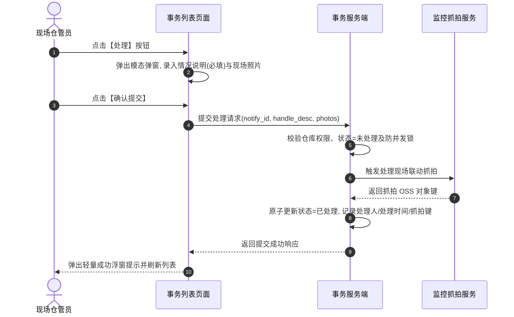

# 设备事务通知信息主需求文档 (PRD)

> **版本**：V2.0 | 2026-09-16  
> **读者**：研发工程师、测试工程师、物联网产品经理、仓储管理员、风控审计师  
> **编写依据**：[设备事务通知信息字段清单](./设备事务通知信息字段清单.md)、[设备事务通知信息业务规则规格](./设备事务通知信息业务规则规格.md)、[设备事务通知配置主PRD](../../08-配置管理/21-风险管理-设备事务通知配置/设备事务通知配置主PRD.md)  
> **真源声明**：本主 PRD 负责业务场景、页面交互布局、用户路径、操作行为与状态机协同。字段标准引自字段清单，底层状态机与校验规则以业务规则规格为唯一真源。所有交互控件术语均已规范汉化。

---

## 1. 业务背景与业务目标

### 1.1 业务背景
在仓储日常作业与监管流程中，门禁刷卡、挂锁开闭、新设备入网同步及设备主动移除属于高频且瞬时发生的**日常作业操作事件**。  
**设备事务通知信息**作为仓储日常操作与运维消息的明细流水台账，记录所有命中 [03设备事务通知配置](../../08-配置管理/21-风险管理-设备事务通知配置/设备事务通知配置主PRD.md) 的即时事件。区别于风险预警的持续告警、跌价计算与升级机制，设备事务通知属于即时到达的消息记录，提供**人工核查处理（情况说明、现场照片、联动处理抓拍）与消息推送审计**，支撑仓储日常作业溯源与责任界定。

### 1.2 核心业务目标
1. **作业即时留痕**：实时记录开锁、关锁、设备上线与移除流水，固化触发瞬间的设备与库房位置快照；
2. **人工核查闭环**：提供标准的人工核验处置流，支持录入情况说明、上传现场照片并自动联动摄像头抓拍；
3. **安全证据追溯**：采用私有对象存储（OSS）时效签名保护现场照片，记录完整推送与操作审计日志。

---

## 2. 页面功能说明与交互布局

### 2.1 页面骨架与分区设计

设备事务通知信息页面采用标准的 B 端后台管理界面架构，由三大核心区域构成：

```
+----------------------------------------------------------------------------------------------------+
| 顶部标题栏：设备事务通知信息                                                                         |
+----------------------------------------------------------------------------------------------------+
| 筛选工作区（支持展开/收起）：                                                                        |
| 事务规则名称 [单行文本输入框]  事务类型 [下拉多选框 (4类)]  状态 [下拉单选框 (未处理/已处理)]        |
| [查询]  [重置]                                                                                     |
+----------------------------------------------------------------------------------------------------+
| 事务流水表格工作区（默认按触发时间降序）：                                                          |
| 序号 | 事务通知规则名称 | 事务类型 | 事务内容（标准文案） | 创建时间 | 处理时间 | 处理人 | 状态 | 操作   |
|  1   | 1号库门禁开锁通知 | 开锁通知 | 位置：1号库-A区...  | 2026-... | 2026-... | 张三  |已处理| [详情] |
|  2   | 智能挂锁异动规则 | 关锁通知 | 位置：2号库-B区...  | 2026-... |    --    |  --   |未处理|[处理][详情]|
+----------------------------------------------------------------------------------------------------+
| 底部固定栏：分页控件（每页条数选择、总条数统计、页码跳转）                                            |
+----------------------------------------------------------------------------------------------------+
```

### 2.2 核心交互控件规格与操作规范

1. **筛选工作区**：
   - **事务规则名称**：单行文本输入框（Input），支持模糊匹配，回车或点击【查询】发起检索；
   - **事务类型**：下拉多选框（Select），选项：开锁通知、关锁通知、设备上线、设备移除；
   - **状态**：下拉单选框（Select），选项：全部、未处理（PENDING）、已处理（RESOLVED）；
   - **操作按钮**：主色【查询】按钮、次色【重置】按钮。
2. **表格工作区与行级操作列**：
   - **序号**：当前页行展示编号，从 1 开始递增；
   - **状态徽章**：`未处理` 显示橙黄色警告徽章；`已处理` 显示绿色成功徽章；
   - **行级操作按钮组**：
     - **【处理】**：仅在状态为 `未处理` 时呈现；点击弹出处理核查模态弹窗；
     - **【详情】**：常态呈现，点击从页面右侧滑出事务详情抽屉面板，展示触发快照、通知推送结果、双抓拍图及现场照片。

---

## 3. 核心业务场景与用户旅程

### 场景 1【复合筛选与多类型事务流水检索】(EVT-S01)
* **主业务旅程**：仓管主管进入工作台，输入规则名称或在下拉多选框中勾选“开锁通知”与“关锁通知”，选择状态为“未处理”。系统依据 `【事务通知仓库数据权限行级过滤规则】(EVT-I03)` 注入管辖仓库数据权限，服务端返回按时间倒序排列的待办事务列表。

### 场景 2【现场人工核查与处理提交闭环】(EVT-S02)
* **主业务旅程**：
  1. 现场仓管员针对一条状态为 `未处理` 的开锁通知点击行操作【处理】；
  2. 页面弹出核查模态弹窗，仓管员在多行文本输入框中录入情况说明（限制 1~200 字），并点击文件上传控件上传现场照片（选填，最多 10 张）；
  3. 仓管员点击【确认提交】；
  4. 系统执行 `【人工核查情况说明与现场照片必填阻断规则】(EVT-H03)` 校验，后台自动向关联监控摄像头下发抓拍指令 `【处理提交联动监控异步抓拍规则】(EVT-H04)`；
  5. 服务端原子更新状态为 `已处理`，记录当前处理人账号与处理时间；
  6. 模态弹窗关闭，弹出轻量成功浮窗提示，列表自动刷新为已结案状态。



### 场景 3【双抓拍现场证据查看与图片安全验签】(EVT-S03)
* **主业务旅程**：风控审计员在详情抽屉中查看一条已处理的开锁通知。系统根据 `【触发抓拍与处理抓拍独立固化防覆盖规则】(EVT-D08)` 分别展示“事务触发抓拍图”与“事务处理抓拍图”；前端调用安全接口换取 15 分钟临时安全签名 URL `【现场抓拍图片私有OSS时效签名规则】(EVT-PH04)`，审计员点击图片缩略图弹出全屏大图预览进行比对核验。

### 场景 4【设备移除领域事件自动落账】(EVT-S04)
* **主业务旅程**：系统管理员在设备管理模块完成某台故障摄像头的报废移除审批。设备管理微服务抛出 `DEVICE_REMOVED_EVENT` 领域事件，事务通知模块捕获该事件并依据 `【设备管理服务移除成功领域事件联动规则】(EVT-T03)` 自动生成一条 `设备移除` 事务通知，供仓库现场复核确认。

### 场景 5【物理设备删除历史记录安全追溯】(EVT-S05)
* **主业务旅程**：某智能挂锁在物理损坏后被管理员从设备台账中彻底移除。风控人员随后在事务通知列表中依然能准确检索到该挂锁三个月前产生的开锁流水，依据 `【物理设备变更历史事务快照固化规则】(EVT-I05)`，系统完整展示历史快照，杜绝数据断链。

---

## 4. 业务规则映射与追溯矩阵

| 规则编码 | 规则业务全称 | 规格章节 | 对应场景 | 交互表现与系统行为 |
| :--- | :--- | :--- | :--- | :--- |
| **EVT-I01** | 【事务通知菜单访问与细粒度鉴权规则】 | 业务规则 §3.1 | 全场景 | 无菜单权限直接拦截，无按钮权限置灰或隐藏 |
| **EVT-I03** | 【事务通知仓库数据权限行级过滤规则】 | 业务规则 §3.1 | EVT-S01 | 列表查询强制注入当前账号管辖仓库数据权限 |
| **EVT-I05** | 【物理设备变更历史事务快照固化规则】 | 业务规则 §3.1 | EVT-S05 | 设备删除后历史事务流水绝对不被级联删除 |
| **EVT-I06** | 【敏感接口服务端鉴权与防越权校验规则】 | 业务规则 §3.1 | 全场景 | 接口端强校验，禁止客户端通过伪造参数越权 |
| **EVT-I08** | 【设备移除唯一来源领域事件触发规则】 | 业务规则 §3.1 | EVT-S04 | 仅设备管理正式移除成功事件触发移除通知 |
| **EVT-T01** | 【门禁门锁事务事件合法接入与规则匹配规则】 | 业务规则 §3.2 | EVT-S01 | 校验事件签名并匹配启用规则，未启用不落账 |
| **EVT-T02** | 【设备首次同步与离线重上线判定规则】 | 业务规则 §3.2 | EVT-S01 | 设备由离线跳变为在线瞬间仅触发一次上线流水 |
| **EVT-T03** | 【设备管理服务移除成功领域事件联动规则】 | 业务规则 §3.2 | EVT-S04 | 订阅设备移除 MQ 领域事件生成通知流水 |
| **EVT-T05** | 【停用删除规则不回溯影响历史流水规则】 | 业务规则 §3.2 | EVT-S01 | 规则停用或删除不回溯影响已生成的历史流水 |
| **EVT-T11** | 【全维度设备与空间位置快照固化规则】 | 业务规则 §3.2 | EVT-S03 | 落账瞬间固化设备名称、编码、仓库及具体位置 |
| **EVT-T13** | 【事务标准内容动态装配与空值占位规则】 | 业务规则 §3.2 | EVT-S01 | 缺失项以 `-` 占位，按标准三段式组装文案 |
| **EVT-U01** | 【多源事务事件分布式防重幂等规则】 | 业务规则 §3.3 | 全场景 | 5 秒防抖锁，相同事件直接忽略不重复生成流水 |
| **EVT-U03** | 【事务通知独立落账禁止去重合并规则】 | 业务规则 §3.3 | EVT-S01 | 独立操作分别记账，不合并同设备未处理记录 |
| **EVT-U05** | 【站内信默认推送与多渠道下发规则】 | 业务规则 §3.3 | EVT-S01 | 默认下发站内信，按配置异步发送短信/邮件 |
| **EVT-U06** | 【通知发送失败隔离与重试结果更新规则】 | 业务规则 §3.3 | EVT-S01 | 短信发送失败不回滚流水本体，记录失败日志 |
| **EVT-U08** | 【免升级免公示纯事务通知定位规则】 | 业务规则 §3.3 | 全场景 | 不设升级通知，绝对不推送到风险公示模块 |
| **EVT-D01** | 【列表标准字段序列与展示规范规则】 | 业务规则 §3.4 | EVT-S01 | 严格按 9 列标准序列展示，操作列不作业务字段 |
| **EVT-D02** | 【筛选复合参数校验与模糊精准规范规则】 | 业务规则 §3.4 | EVT-S01 | 规则名模糊，事务类型多选精准，状态单选精准 |
| **EVT-D05** | 【已处理状态只读与未处理处理入口规则】 | 业务规则 §3.4 | EVT-S02 | 已处理行隐藏【处理】按钮，仅保留【详情】 |
| **EVT-D08** | 【触发抓拍与处理抓拍独立固化防覆盖规则】 | 业务规则 §3.4 | EVT-S03 | 触发抓拍与处理抓拍分别存储，详情并列展示 |
| **EVT-H01** | 【事务全量人工核查与预警状态隔离规则】 | 业务规则 §3.5 | EVT-S02 | 事务处理仅变迁自身状态，不交叉影响预警 |
| **EVT-H03** | 【人工核查情况说明与现场照片必填阻断规则】 | 业务规则 §3.5 | EVT-S02 | 说明必填 1~200 字，照片最多 10 张，阻断空提交 |
| **EVT-H04** | 【处理提交联动监控异步抓拍规则】 | 业务规则 §3.5 | EVT-S02 | 提交瞬间后台自动向现场监控下发异步抓拍指令 |
| **EVT-H05** | 【状态变迁原子回写与全链路审计规则】 | 业务规则 §3.5 | EVT-S02 | 单个数据库事务内原子更新状态、时间、处理人 |
| **EVT-H06** | 【处理提交异常回滚与版本冲突阻断规则】 | 业务规则 §3.5 | EVT-S02 | 乐观锁版本冲突阻断并提示已被他人处理 |
| **EVT-H08** | 【纯二态模型与杜绝预警有效性混淆规则】 | 业务规则 §3.5 | 全场景 | 仅未处理和已处理两态，严禁引入无效/作废概念 |
| **EVT-PH04**| 【现场抓拍图片私有OSS时效签名规则】 | 业务规则 §3.6 | EVT-S03 | 私有 OSS 动态换取 15 分钟临时安全访问凭据 |

---

## 5. 验收标准与测试用例

| 用例编号 | 对应场景 | 关联规则 | 测试输入与前置条件 | 预期输出与验收标准 |
| :---: | :---: | :---: | :--- | :--- |
| **EVT-TC01** | EVT-S01 | EVT-U01 | 门锁硬件故障在 2 秒内连续重发 3 次完全相同的开锁报文 | 仅生成 1 条开锁事务通知流水，其余 2 次被幂等拦截 |
| **EVT-TC02** | EVT-S02 | EVT-H03 | 打开未处理记录处理弹窗，情况说明不输入任何文字点击提交 | 弹窗阻断提交，多行文本输入框下方红字提示：`“请输入1~200字的情况说明”` |
| **EVT-TC03** | EVT-S02 | EVT-H06 | 仓管员 A 与 B 同时打开同一条未处理流水，A 先提交成功，B 随后点击提交 | B 提交被拦截，弹出浮窗提示：`“该事务通知已被其他人员处理，页面已刷新”` |
| **EVT-TC04** | EVT-S03 | EVT-D08 | 查看已完成处理的开锁通知详情 | 详情页同时展示“事务触发抓拍图”与“事务处理抓拍图”，两者互不覆盖 |
| **EVT-TC05** | EVT-S04 | EVT-T03 | 设备管理模块完成摄像头主动移除审批 | 事务通知列表即时新增一条“设备移除”流水，状态为未处理 |
| **EVT-TC06** | EVT-S05 | EVT-I05 | 逻辑删除某智能门锁 | 事务通知列表中该门锁的历史开锁/关锁通知完好保留，点击详情正常展示历史位置快照 |

---

## 6. 修订记录

| 版本 | 修订日期 | 修订人 | 修订内容 |
| :---: | :---: | :---: | :--- |
| **V1.0** | 2026-08-18 | 产品团队 | 初版发布。 |
| **V1.8** | 2026-08-19 | 产品团队 | 补充时效签名、双抓拍与设备移除领域事件机制。 |
| **V2.0** | 2026-09-16 | 产品团队 | 场景编号全面升级为自解释语义命名 `场景 N【...】(EVT-Sxx)`；交互控件术语全面汉化；建立与业务规则规格 `(EVT-I/T/U/D/H/PH)` 的全量双向追溯表与验收测试矩阵。 |
