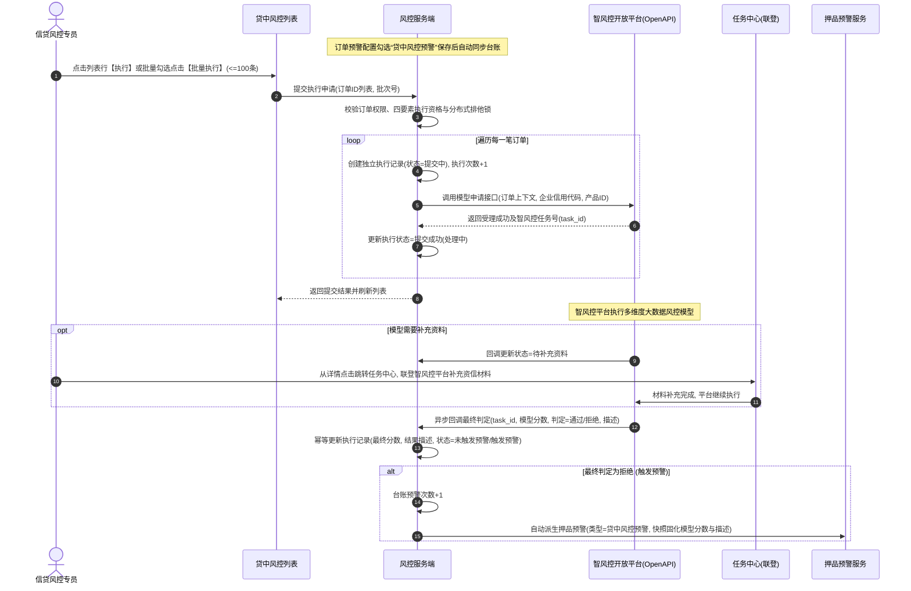

# 贷中风控管理业务规则规格

> **版本**：V2.0 | 2026-09-16  
> **编写依据**：[贷中风控管理主PRD](./贷中风控管理主PRD.md)、[贷中风控管理字段清单](./贷中风控管理字段清单.md)、[订单预警配置主PRD](../../08-配置管理/19-风险管理-订单预警配置/订单预警配置主PRD.md)、[押品预警信息业务规则规格](../06-风险信息-押品预警信息/押品预警信息业务规则规格.md)  
> **真源声明**：本规格书是贷中风控管理台账生命周期、执行资格判定、单条与批量提交、智风控平台异步回调、押品预警自动联动及任务中心联登的**唯一业务逻辑与技术规则真源（SSOT）**。所有涉及交互控件的表述已完成全面汉化规范。

---

## 1. 业务对象与能力边界

### 1.1 业务对象定义
贷中风控管理是针对已在 [订单预警配置](../../08-配置管理/19-风险管理-订单预警配置/订单预警配置主PRD.md) 中启用“贷中风控预警”策略的抵押或质押订单，面向智风控外部算法模型平台的**调用调度、执行监控与预警承接中枢**。

### 1.2 核心能力边界
1. **单订单唯一台账**：以订单唯一标识为主键，1 笔抵质押订单在贷中风控管理中有且仅有 1 条管理汇总台账；
2. **执行独立记录**：每次向智风控平台发起调用（无论是单条提交还是批量勾选），均在详情中产生一条独立的执行记录，并向智风控平台生成一个唯一的受理任务号；
3. **最终结果两分法**：智风控返回贷款产品模型最终判定为“通过”时，记为 `未触发预警`；最终判定为“拒绝”时，记为 `触发预警`，并自动向押品预警模块推送一条高危预警流水；
4. **补充资料联登通道**：当智风控模型运算需要借款人或信贷经理补充材料时，通过专网专道联登至 `任务中心—其他审批—贷中风控受理` 办理，办理过程不提前推断最终通过或拒绝。

---

## 2. 状态机与生命周期流转

### 2.1 执行状态定义

| 执行状态编码 | 页面展示名称 | 业务含义 | 再次执行资格 |
| :--- | :--- | :--- | :---: |
| `SUBMITTING` | **提交中** | 服务端正在向智风控平台发送调用请求或等待受理响应 | 否 |
| `PROCESSING` | **提交成功（处理中）** | 智风控平台已成功受理并生成任务号，模型异步运算中 | 否 |
| `SUBMIT_FAILED`| **提交失败** | 智风控接口鉴权失败、超时或入参校验未通过 | 是（仍需满足订单与配置有效） |
| `PASS` | **未触发预警** | 智风控模型运算完毕，返回最终结果为“通过”，资信正常 | 是（周期性监控可再次发起） |
| `REJECT` | **触发预警** | 智风控模型返回最终结果为“拒绝”，自动派生押品预警 | 是（补充材料或重新复核可再次发起） |

### 2.2 状态流转时序图（Mermaid）

---

## 3. 核心业务规则规格

### 3.1 权限与数据隔离规则 (MID-P 系列)

#### 【贷中风控管理菜单与数据隔离规则】(MID-P01)
* **规则描述**：进入【贷中风控管理】菜单必须具备 `R-RISK-MID-VIEW` 权限代码。列表与详情强制执行**基于登录账号所属机构/角色的订单数据权限行级隔离**，仅可见当前用户管辖范围内的抵质押订单。

#### 【订单详情与执行记录防越权校验规则】(MID-P02)
* **规则描述**：点击订单号跳转订单详情、查看历史执行记录、模型分数及结果描述时，服务端强制复核操作人订单数据权限，杜绝客户端篡改参数越权查看未授权企业的敏感资信数据。

#### 【模型执行与批量提交细粒度鉴权规则】(MID-P03)
* **规则描述**：单条执行操作需具备 `R-RISK-MID-EXEC` 权限，批量执行需具备 `R-RISK-MID-BATCH` 权限。服务端对提交的每笔订单分别执行订单状态、配置状态与版本校验，前端按钮状态不得作为免审依据。

#### 【任务中心联登补充材料鉴权保护规则】(MID-P04)
* **规则描述**：当执行记录处于“待补充资料”状态时，用户点击跳转任务中心必须具备对应审批权限与订单权限。系统生成携带短期（5 分钟）时效签名的安全免登令牌（SSO Token），严禁明文传递账号密码或使用长期静态令牌。

#### 【货主押品信息脱敏与分数权限展示规则】(MID-P05)
* **规则描述**：货主个人身份证号按前三后四原则脱敏；模型得分按风控规则精确保留原始位数展示，若智风控平台未返回分数，固定展示占位符 `--`，底层保留为空，严禁前端硬编码默认值。

---

## 4. 2 台账生成与唯一性规则 (MID-D 系列)

#### 【预警配置保存自动同步管理台账规则】(MID-D01)
* **规则描述**：当管理员在 [订单预警配置](../../08-配置管理/19-风险管理-订单预警配置/订单预警配置主PRD.md) 中勾选策略【贷中风控预警】并成功保存时，系统异步订阅配置生效事件，以该订单唯一标识为键自动在贷中风控管理中新增或激活一条台账记录。

#### 【单订单唯一管理台账幂等维护规则】(MID-D02)
* **规则描述**：数据库在 `租户ID + 订单唯一标识` 上建立唯一物理索引。重复保存配置或并发同步时，系统执行 `UPSERT` 幂等操作，仅更新当前绑定的风控模型产品与规则版本，**严禁物理插入重复行**。

#### 【基础信息初始化与配置增量同步规则】(MID-D03)
* **规则描述**：首次生成台账时，固化订单编号、货主名称、货主标识、押品信息、订单生成时间及订单类型；配置后续编辑模型时仅更新关联模型字段，**历史已累计的执行次数、预警次数及历史执行记录绝不被清零**。

#### 【配置失效与订单解押自动不可执行规则】(MID-D04)
* **规则描述**：当订单预警配置被停用、失效、删除，或订单发生全额解押出库不再处于抵/质押中时，该台账记录保留用于历史审计，但系统计算“是否可执行”字段时立即判定为 `不可执行`，阻断后续调用。

#### 【平台产品停用配置失效阻断提交规则】(MID-D05)
* **规则描述**：当智风控平台下架或停用了某款贷款风控产品时，订单预警配置对应策略自动进入失效状态；贷中风控管理台账同步标记并立即阻断提交，操作列展示感叹号提醒图标。

#### 【历史执行记录模型快照防篡改规则】(MID-D06)
* **规则描述**：每次提交执行产生的历史执行记录中，必须固化执行当时使用的模型产品标识、模型产品名称、规则版本号及提交人快照。后续即使用户修改了配置绑定的新模型，历史执行流水保持不可变。

---

## 3.3 执行资格与批量提交规则 (MID-E 系列)

#### 【单条执行四要素准入实时复核规则】(MID-E01)
* **规则描述**：用户在列表操作列点击【执行】时，系统实时复核**四要素准入规则**，必须同时满足：
  1. **订单在押**：当前订单状态为 `抵押中` 或 `质押中`；
  2. **配置生效**：关联的贷中风控预警策略处于 `启用` 状态；
  3. **无在途申请**：当前不存在处于 `提交中` 或 `提交成功（处理中）` 的未完结申请；
  4. **最近状态可重试**：无历史记录，或最近一次执行状态为 `提交失败`、`未触发预警`、`触发预警`。
* **判定逻辑**：任一条件不满足时，判定为“不可执行”，执行按钮置灰并在鼠标悬浮时展示具体原因气泡提示。

#### 【批量执行上限阻断与服务端资格复核规则】(MID-E02)
* **规则描述**：
  1. 列表顶部【批量执行】仅对复选框勾选的订单生效；
  2. **批量上限强阻断**：单次最多勾选 **100 条**订单，若通过前端脚本突破 100 条，服务端抛出参数异常拦截并弹出警告浮窗提示：`“单次批量执行最多支持 100 条订单！”`；
  3. 服务端逐单重新复核四要素准入资格，严禁信任客户端勾选状态。

#### 【批量执行单单独立申请与记录生成规则】(MID-E03)
* **规则描述**：批量提交时系统生成一个统一的 `batch_no` 批次号用于操作审计，但**每笔订单分别生成一条独立的执行记录，并分别向智风控发起一次独立的 HTTP 申请**。选择 N 笔订单即产生 N 个智风控任务号与最多 N 条独立结果。

#### 【批量提交部分成功结果独立固化规则】(MID-E04)
* **规则描述**：批量调用智风控接口时，若出现部分订单成功受理、部分订单网络超时或参数失败，系统独立记录每笔订单的实际提交状态，**严禁用批次整体失败覆盖已成功的记录**，提交完成后弹出汇总结果提示：`“成功受理 X 条，失败 Y 条”`。

#### 【在途冲突跳过与有效单据继续提交规则】(MID-E05)
* **规则描述**：批量提交时若发现某笔订单在勾选后瞬间由其他人员发起了单条执行（版本冲突或已有在途申请），系统自动跳过该冲突订单并记录原因，批次中其余合规订单正常继续提交。

#### 【提交防重复点击与分布式排他锁规则】(MID-E06)
* **规则描述**：用户点击提交按钮后，前端立即置灰防重复点击；服务端采用 `租户ID + 订单ID + MODEL_EXEC_LOCK` 构建分布式排他锁（默认过期 10 秒），防止并发场景下同一订单产生双胞胎申请。

#### 【执行次数与拒绝预警次数独立计数规则】(MID-E07)
* **规则描述**：
  1. **执行次数**：每向智风控成功发起一次提交请求（无论后续受理成功或失败），该订单台账的 `执行次数` 自动累加 1；
  2. **预警次数**：仅当智风控平台返回最终判定为“拒绝”并成功生成押品预警时，该订单台账的 `预警次数` 才累加 1；提交失败、判定通过或结果未知均不增加预警次数。

---

### 3.4 异步回调与押品预警联动规则 (MID-C 系列)

#### 【异步回调幂等与任务号关联回写规则】(MID-C01)
* **规则描述**：智风控平台通过 Webhook 异步回调风控系统时，接口采用 `智风控任务号(task_id) + 执行记录号(exec_id)` 作为联合幂等主键。
* **判定逻辑**：重复接收到相同任务号的回调时，系统校验结果版本号；若已完成落账，直接返回 HTTP 200 成功响应，严禁二次触发押品预警或重复累加计数。

#### 【模型拒绝自动联动生成押品预警规则】(MID-C02)
* **规则描述**：当智风控回调返回最终结果为“拒绝”时，系统在同一事务内完成两项核心动作：
  1. 执行记录状态变更为 `触发预警` (REJECT)，台账预警次数 +1；
  2. 自动调用 [押品预警信息](../06-风险信息-押品预警信息/押品预警信息业务规则规格.md) 内部领域接口，生成一条 `warn_type=贷中风控预警` 的高危风险流水，内容严格按固定模板固化：`模型名称：{模型名称}；模型分数：{模型分数或--}；预警描述：{结果描述}`，并作为超时升级计时起点。

#### 【未知超时状态保护与禁止误判通过规则】(MID-C03)
* **规则描述**：若智风控平台回调返回未知状态码、结果描述包含空值，或调用超过 48 小时未返回结果，执行记录保持为 `提交成功（处理中）` 并打上超时异常标记；**绝对禁止将超时、未知或异常中断误判为“通过/未触发预警”**。

---

## 4. 字段级校验与业务约束矩阵

| 字段名称 | 校验规则 | 错误提示/异常行为 |
| :--- | :--- | :--- |
| **订单号** (`order_no`) | 单行文本输入框，支持模糊匹配 | 无结果展示空态表格 |
| **风控模型** (`model_name`) | 下拉多选框，取自当前启用的智风控已上架模型字典 | 非法模型拒绝入参 |
| **是否可执行** (`is_executable`) | 服务端四要素动态计算，单选筛选 | 前端无法直接更改其值 |
| **批量执行条数** | 列表复选框勾选数量，限制 1~100 条 | 超出 100 条弹出轻量警告：`“单次批量执行最多支持 100 条”` |
| **模型分数** (`model_score`) | 浮点数，模型返回缺失时展示 `--` | 不抛异常，底层为 null |

---

## 5. 修订记录

| 版本 | 修订日期 | 修订人 | 修订内容 |
| :---: | :---: | :---: | :--- |
| **V1.0** | 2026-08-18 | 产品团队 | 初版创建，定义贷中风控执行与模型对接规格。 |
| **V2.0** | 2026-09-16 | 产品团队 | 全面重构业务规则体系，升级为 `【规则业务名称】(编码)` 语义自解释编号（MID-P01~05、MID-D01~06、MID-E01~07、MID-C01~03）；全面汉化所有交互控件术语；强化四要素准入规则、100条批量强阻断及智风控异步回调押品预警闭环。 |
