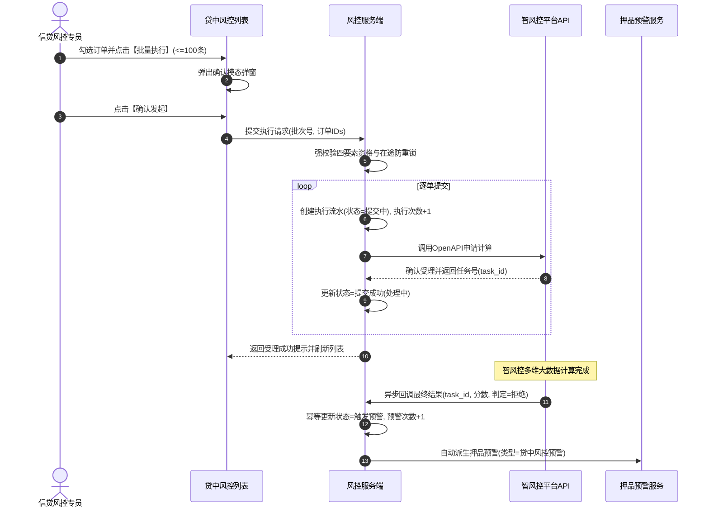

# 贷中风控管理主需求文档 (PRD)

> **版本**：V2.0 | 2026-09-16  
> **读者**：研发工程师、测试工程师、信贷风控产品经理、系统架构师  
> **编写依据**：[贷中风控管理字段清单](./贷中风控管理字段清单.md)、[贷中风控管理业务规则规格](./贷中风控管理业务规则规格.md)、[订单预警配置主PRD](../../08-配置管理/19-风险管理-订单预警配置/订单预警配置主PRD.md)、[押品预警信息主PRD](../06-风险信息-押品预警信息/押品预警信息主PRD.md)  
> **真源声明**：本主 PRD 负责业务场景、页面交互布局、用户路径、操作行为与状态机协同。字段标准引自字段清单，底层状态机与校验规则以业务规则规格为唯一真源。所有交互控件术语均已规范汉化。

---

## 1. 业务背景与业务目标

### 1.1 业务背景
在动产质押与仓储监管业务存续期内，借款企业经营恶化、司法涉诉、征信恶化或上下游核心客户资信暴雷，直接威胁授信资产本息偿还。  
**贷中风控管理**面向已在 [01订单预警配置](../../08-配置管理/19-风险管理-订单预警配置/订单预警配置主PRD.md) 中启用“贷中风控预警”的有效抵/质押订单，提供智风控平台大数据模型的调用调度与全生命周期管理中枢。系统通过**动态计算模型执行资格、发起单条/批量执行申请、跟踪智风控平台异步计算进度、联登任务中心处理补充资料，并在模型最终判定拒绝时自动联动生成押品预警**，实现贷中资信风控与动产监管的深度融合。

### 1.2 核心业务目标
1. **资信动态监控**：将传统静态风控升级为存续期动态模型调度，实现按需执行与批处理执行；
2. **异步平滑承接**：与智风控外部 OpenAPI 建立高可靠异步回调与补偿机制，任务进度透明可查；
3. **高危穿透联动**：模型拒绝时自动派生押品预警流水，驱动线下核验与补仓平仓业务处置闭环。

---

## 2. 页面功能说明与交互布局

### 2.1 页面骨架与分区设计

贷中风控管理页面采用标准的 B 端后台管理工作台布局，由三大核心区域构成：

```
+----------------------------------------------------------------------------------------------------+
| 顶部标题栏：贷中风控管理  [批量执行风控模型 (已选 0 项)]                                            |
+----------------------------------------------------------------------------------------------------+
| 筛选工作区（支持展开/收起）：                                                                        |
| 订单号 [单行文本输入框]  货主名称 [单行文本输入框]  风控模型 [下拉多选框]  是否可执行 [下拉单选框]    |
| 是否已执行 [下拉单选框]  订单生成时间 [日期范围选择器]                                               |
| [查询]  [重置]                                                                                     |
+----------------------------------------------------------------------------------------------------+
| 贷中风控管理台账表格工作区：                                                                        |
| [ ] 序号 | 订单号 | 货主名称 | 押品信息 | 订单类型 | 风控模型 | 是否可执行 | 执行次数 | 预警次数 | 最近状态 | 行操作 |
| [ ]  1  | DZY2026.. | 某某实业 | 电解铜.. | 质押     | 企业资信 |    是      |    3     |    1     | 未触发预警|[执行][详情]|
| [-]  2  | DZY2026.. | 某某贸易 | 铝锭..   | 抵押     | 供应链评 |  否 (解押) |    1     |    0     | 触发预警  |[详情]      |
+----------------------------------------------------------------------------------------------------+
| 底部固定栏：分页控件（每页条数选择、总条数统计、页码跳转）                                            |
+----------------------------------------------------------------------------------------------------+
```

### 2.2 核心交互控件规格与操作规范

1. **筛选工作区**：
   - **订单号**：单行文本输入框（Input），支持模糊匹配；
   - **货主名称**：单行文本输入框（Input），支持模糊匹配企业或个人货主名称；
   - **风控模型**：下拉多选框（Select），选项来源于智风控平台已上架产品字典；
   - **是否可执行**：下拉单选框，选项：全部、可执行（默认）、不可执行；
   - **是否已执行**：下拉单选框，选项：全部（默认）、已执行、未执行；
   - **订单生成时间**：日期范围选择器，限制最大查询跨度 1 年；
   - **操作按钮**：主色【查询】按钮、次色【重置】按钮。
2. **表格工作区与行级操作列**：
   - **复选框**：仅对计算为 `可执行` 的订单行允许勾选；不可执行行复选框禁用，鼠标悬浮气泡提示具体不可执行原因；
   - **是否可执行列**：展示绿色“可执行”徽章或灰色“不可执行”徽章，不可执行时展示问号图标，悬浮展示四要素缺失详情；
   - **行级操作按钮组**：
     - **【执行】**：仅在 `可执行` 时呈现高亮状态；点击弹出确认模态弹窗；不可执行时置灰禁用；受 `【单条执行四要素准入实时复核规则】(MID-E01)` 约束；
     - **【详情】**：常态呈现，点击从右侧滑出详情抽屉面板，展示订单基础快照及全量历史执行记录表格。

---

## 3. 核心业务场景与用户旅程

### 场景 1【复合筛选与执行资格动态判定】(MID-S01)
* **主业务旅程**：信贷风控专员进入工作台，系统默认筛选“是否可执行=可执行”。系统依据 `【单条执行四要素准入实时复核规则】(MID-E01)` 实时复核当前用户订单管辖权限，并对每笔订单评估：①订单在押、②配置启用、③无在途申请、④最近状态可重试。专员可一目了然筛选出当前允许发起模型调用的目标单据。

### 场景 2【单条或批量执行模型调用】(MID-S02)
* **主业务旅程**：
  1. 风控专员勾选 5 笔待监控的质押订单（不超过 100 条限制），点击顶部【批量执行风控模型】；
  2. 页面居中弹出执行确认模态弹窗，提示：`“确认对选中的 5 笔订单发起风控模型调用申请？”`；
  3. 专员点击确认，前端按钮置灰防重复提交 `【提交防重复点击与分布式排他锁规则】(MID-E06)`；
  4. 服务端生成批次号，并为每笔订单生成一条 `提交中` 执行记录，分别向智风控平台发起调用 `【批量执行单单独立申请与记录生成规则】(MID-E03)`；
  5. 智风控返回受理成功及任务号，执行状态变迁为 `提交成功（处理中）`，列表自动刷新。



### 场景 3【智风控异步回调与高危预警自动派生】(MID-S03)
* **主业务旅程**：智风控模型针对某笔大额质押订单运算完毕，判定借款人涉案诉讼执行金额巨大，返回最终结果为“拒绝”。风控系统接收 Webhook 异步回调，依据 `【模型拒绝自动联动生成押品预警规则】(MID-C02)`，该台账执行状态更新为 `触发预警`，预警次数 +1，同时自动向押品预警模块推送一条高危预警流水，固化模型名称、模型分数及拒绝原因描述。

### 场景 4【任务中心联登补充材料】(MID-S04)
* **主业务旅程**：智风控模型返回该企业需要补充近半年银行流水，执行状态更新为 `待补充资料`。风控专员打开详情抽屉，点击执行记录中的【去补充资料】按钮。系统依据 `【任务中心联登补充材料鉴权保护规则】(MID-P04)` 校验权限后，签发短期安全 SSO 令牌，页面新开标签页免密登录至 `任务中心—其他审批—贷中风控受理`，专员在线补录材料并提交。

---

## 4. 业务规则映射与追溯矩阵

| 规则编码 | 规则业务全称 | 规格章节 | 对应场景 | 交互表现与系统行为 |
| :--- | :--- | :--- | :--- | :--- |
| **MID-P01** | 【贷中风控管理菜单与数据隔离规则】 | 业务规则 §3.1 | 全场景 | 无菜单权限重定向，列表严格按用户管辖订单隔离 |
| **MID-P02** | 【订单详情与执行记录防越权校验规则】 | 业务规则 §3.1 | MID-S01 | 点击订单号使用订单唯一标识传参，禁止越权请求 |
| **MID-P03** | 【模型执行与批量提交细粒度鉴权规则】 | 业务规则 §3.1 | MID-S02 | 执行接口强鉴权，无权限返回 403 阻断 |
| **MID-P04** | 【任务中心联登补充材料鉴权保护规则】 | 业务规则 §3.1 | MID-S04 | 签发 5 分钟安全免登令牌跳转任务中心 |
| **MID-P05** | 【货主押品信息脱敏与分数权限展示规则】 | 业务规则 §3.1 | 全场景 | 身份证前三后四脱敏，模型分缺失固定展示 `--` |
| **MID-D01** | 【预警配置保存自动同步管理台账规则】 | 业务规则 §3.2 | 全场景 | 预警配置启用策略后自动新增或激活管理台账 |
| **MID-D02** | 【单订单唯一管理台账幂等维护规则】 | 业务规则 §3.2 | 全场景 | 订单唯一定位 1 条台账，重复保存执行幂等更新 |
| **MID-D03** | 【基础信息初始化与配置增量同步规则】 | 业务规则 §3.2 | 全场景 | 基础信息落账固化，修改模型不重置历史统计 |
| **MID-D04** | 【配置失效与订单解押自动不可执行规则】 | 业务规则 §3.2 | MID-S01 | 解押或配置失效时自动计算为不可执行，置灰按钮 |
| **MID-D05** | 【平台产品停用配置失效阻断提交规则】 | 业务规则 §3.2 | MID-S01 | 平台停用模型同步失效台账并展示感叹号提醒 |
| **MID-D06** | 【历史执行记录模型快照防篡改规则】 | 业务规则 §3.2 | MID-S04 | 详情历史记录固化执行时模型标识与版本，不可篡改 |
| **MID-E01** | 【单条执行四要素准入实时复核规则】 | 业务规则 §3.3 | MID-S01/S02 | 四要素必须全部满足方可执行，不满足悬浮提示原因 |
| **MID-E02** | 【批量执行上限阻断与服务端资格复核规则】 | 业务规则 §3.3 | MID-S02 | 超过 100 条强拦截并弹出轻量警告浮窗提示 |
| **MID-E03** | 【批量执行单单独立申请与记录生成规则】 | 业务规则 §3.3 | MID-S02 | 批量生成批次号，每单独立向外部提交并独立记账 |
| **MID-E04** | 【批量提交部分成功结果独立固化规则】 | 业务规则 §3.3 | MID-S02 | 部分成功独立记账，弹出实际成功/失败数量汇总 |
| **MID-E05** | 【在途冲突跳过与有效单据继续提交规则】 | 业务规则 §3.3 | MID-S02 | 批次中在途冲突单据自动跳过，其余合规单继续提交 |
| **MID-E06** | 【提交防重复点击与分布式排他锁规则】 | 业务规则 §3.3 | MID-S02 | 前端点击立即置灰，服务端 10 秒排他防重锁 |
| **MID-E07** | 【执行次数与拒绝预警次数独立计数规则】 | 业务规则 §3.3 | MID-S02/S03 | 提交一次执行次数+1，仅判定拒绝时预警次数+1 |
| **MID-C01** | 【异步回调幂等与任务号关联回写规则】 | 业务规则 §3.4 | MID-S03 | 任务号与记录号联合幂等，重复回调幂等响应 200 |
| **MID-C02** | 【模型拒绝自动联动生成押品预警规则】 | 业务规则 §3.4 | MID-S03 | 判定拒绝自动派生押品预警流水，固化模型快照 |
| **MID-C03** | 【未知超时状态保护与禁止误判通过规则】 | 业务规则 §3.4 | 全场景 | 超时保持处理中并打标异常，严禁误判为通过 |

---

## 5. 验收标准与测试用例

| 用例编号 | 对应场景 | 关联规则 | 测试输入与前置条件 | 预期输出与验收标准 |
| :---: | :---: | :---: | :--- | :--- |
| **MID-TC01** | MID-S01 | MID-E01 | 订单已在业务系统完成全额解押归档 | 台账状态显示“不可执行”，操作列【执行】按钮置灰，悬浮提示：`“订单已解押，不可执行”` |
| **MID-TC02** | MID-S02 | MID-E02 | 尝试勾选 101 笔订单点击【批量执行】 | 系统阻断弹出警告浮窗提示：`“单次批量执行最多支持 100 条订单！”`，不产生任何执行申请 |
| **MID-TC03** | MID-S02 | MID-E06 | 专员连续快速双击【确认发起】按钮 | 仅产生 1 次服务端请求，防止分布式锁拦截并发重复提交 |
| **MID-TC04** | MID-S03 | MID-C02 | 智风控异步回调某订单任务返回判定为“拒绝” | 执行记录更新为“触发预警”，预警次数+1，押品预警信息列表即时生成一条对应预警流水 |
| **MID-TC05** | MID-S03 | MID-C01 | 智风控平台对同一拒绝任务连续重发 2 次回调 | 仅首次处理并生成押品预警，第 2 次回调幂等响应，押品预警流水不重复增加 |
| **MID-TC06** | MID-S04 | MID-P04 | 点击“待补充资料”行的【去补充资料】 | 校验通过后新开标签页跳转至 `任务中心—其他审批—贷中风控受理` |

---

## 6. 修订记录

| 版本 | 修订日期 | 修订人 | 修订内容 |
| :---: | :---: | :---: | :--- |
| **V1.0** | 2026-08-18 | 产品团队 | 初版发布。 |
| **V1.8** | 2026-08-19 | 产品团队 | 统一规范命名为贷中，细化异步回调闭环与联登机制。 |
| **V2.0** | 2026-09-16 | 产品团队 | 场景编号全面升级为自解释语义命名 `场景 N【...】(MID-Sxx)`；交互控件术语全面汉化；建立与业务规则规格 `(MID-P/D/E/C)` 的全量双向追溯表与验收测试矩阵。 |
