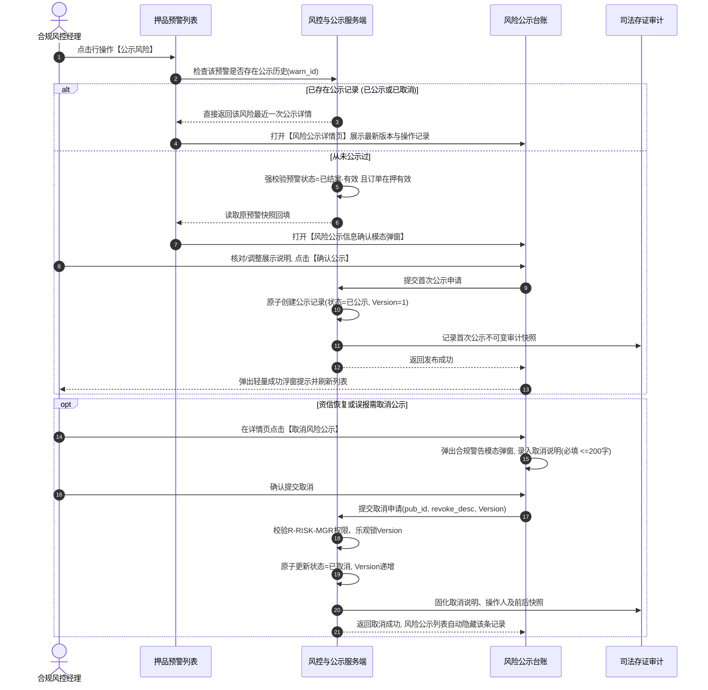

# 风险公示业务规则规格

> **版本**：V2.1 | 2026-09-16  
> **编写依据**：[风险公示主PRD](./风险公示主PRD.md)、[风险公示字段清单](./风险公示字段清单.md)、[押品预警信息业务规则规格](../06-风险信息-押品预警信息/押品预警信息业务规则规格.md)  
> **真源声明**：本规格书是风险公示状态机、单条分流、首次确认、快照解耦、批量提交、取消公示核查、权限隔离与不可变审计的**唯一业务逻辑与技术规则真源（SSOT）**。所有涉及交互控件的表述已完成全面汉化规范。  
> **当前订单范围**：监管订单当前关闭。新增、编辑、批量提交和取消公示等写操作仅适用于有效抵押/质押订单；历史监管公示仅支持查询、详情和审计。

---

## 1. 核心定义与数据边界

### 1.1 术语定义

| 术语 | 业务定义与系统边界 |
| :--- | :--- |
| **原预警** | [押品预警信息](../06-风险信息-押品预警信息/押品预警信息主PRD.md) 中已生成的押品预警流水事实，包含触发快照、核销解除结果和原始抓拍图。 |
| **公示记录** | 由原预警发起、在风险公示模块中**独立持久化保存**的对外展示单据，包含公示标题、公示快照、公示状态、版本号及完整操作审计链。 |
| **公示快照** | 首次公示确认时从原预警读取并复制生成的初始副本；后续公示侧的所有编辑仅修改公示副本，**绝对不回写原预警原始触发事实**。 |
| **未公示** | 本条原预警流水从未产生过任何公示记录；取消公示后**绝对不回到该状态**。 |
| **已公示** | 本条原预警已成功提交公示，当前最新公示状态为 `已公示` (PUBLICIZED)，对外合规公开展示。 |
| **已取消** | 本条原预警存在公示历史，且最近一次公示操作已被取消公示（已隐藏对外展示），保留历史版本供司法追溯。 |

### 1.2 快照完全解耦原则
原预警与风险公示记录通过 `warn_id` 与 `order_id` 建立只读引用关系，但不共用可变字段、不相互覆盖状态。原预警后续若发生变更，不自动改写已固化的公示快照；公示侧的编辑、发布或取消，也绝对不改写原预警的状态、处理人、处理时间或现场照片。

---

## 2. 状态机与生命周期流转

### 2.1 状态定义

| 状态编码 | 页面展示名称 | 业务含义 | 列表展示与操作边界 |
| :--- | :--- | :--- | :--- |
| `UNPUBLICIZED` | **未公示** | 原预警从未发起过公示 | 仅存在于押品预警侧，不展示于风险公示列表；符合条件时允许发起首次公示 |
| `PUBLICIZED` | **已公示** | 风险信息已公开披露，处于生效公示期 | **在风险公示列表公开展示**；详情页提供【取消风险公示】操作入口 |
| `REVOKED` | **已取消** | 公示已被合规撤回取消 | **在风险公示列表自动隐藏**；仅有权限人员可在详情抽屉及历史审计中追溯，禁止重新进入批量候选 |

### 2.2 状态流转时序图（Mermaid）

---

## 3. 核心业务规则规格

### 3.1 权限与数据隔离规则 (RISK-PUB-P 系列)

#### 【风险公示功能权限与操作细粒度鉴权规则】(RISK-PUB-P01)
* **规则描述**：进入【风险公示】菜单必须具备 `R-RISK-PUB-VIEW` 权限代码。单条【公示风险】需具备 `R-RISK-PUBLICIZE` 权限，批量【公示风险】需具备 `R-RISK-PUBLICIZE-BATCH` 权限，【取消风险公示】受高管风控合规权限 `R-RISK-MGR` 严格约束。
* **判定逻辑**：所有写操作接口服务端执行细粒度校验，无权限统一拦截并返回 `403 Forbidden`。

#### 【订单数据权限与租户行级隔离过滤规则】(RISK-PUB-P02)
* **规则描述**：来源预警、订单编号、现场抓拍图、公示内容及公示详情查询，强制按当前登录账号的所属租户与订单数据权限执行行级隔离。

#### 【数据权限失效动态屏蔽与越权阻断规则】(RISK-PUB-P03)
* **规则描述**：当用户失去某笔订单的数据权限后，严禁通过浏览器历史 URL、本地缓存或直接调用接口查询或操作该公示单据。

#### 【公示Tab查看控制与免选机构免通知规则】(RISK-PUB-P04)
* **规则描述**：风险公示面向全行或入驻资方公开展现，发布时不选择目标机构、不向借款企业发送短信或通知、不按机构复制副本，拥有公示查看权限的机构登录后统一可见。

#### 【服务端二次鉴权与防篡改信任保护规则】(RISK-PUB-P05)
* **规则描述**：所有首次提交、批量提交与取消公示接口，必须由服务端重新校验用户身份、数据归属与版本号，严禁信任客户端传入的操作人或机构名称。

---

### 3.2 单条公示入口分流规则 (RISK-PUB-S 系列)

#### 【单条入口分流查询与唯一标识关联规则】(RISK-PUB-S01)
* **规则描述**：在 [押品预警信息](../06-风险信息-押品预警信息/押品预警信息主PRD.md) 列表点击行操作【公示风险】时，前端必须通过路由参数携带 `warn_id` 唯一标识发起。服务端首先查询该预警在公示模块中是否已存在记录。

#### 【已有公示记录直接跳转详情视图规则】(RISK-PUB-S02)
* **规则描述**：若服务端查询到该预警已存在公示记录（无论当前处于 `已公示` 还是 `已取消`），**阻断打开首次确认弹窗，直接平滑跳转至该条公示记录的详情抽屉/详情页**，展示最新公示内容、当前状态及全部操作审计时间轴。

#### 【首次公示已结案有效准入阻断规则】(RISK-PUB-S03)
* **规则描述**：若查询无公示记录，进入首次公示前必须同时满足**准入三要素**：
  1. 原预警状态必须为 `已结案 · 有效`（已处理有效）；
  2. 关联订单必须为当前有效的抵押或质押订单（历史监管预警绝对阻断）；
  3. 操作人具备公示操作权限且未发生并发占用。
* **判定逻辑**：任一条件不满足时，阻断进入确认页，并弹出轻量警告浮窗提示具体原因（如：`“仅已结案有效的抵质押预警支持发起风险公示！”`）。

#### 【原预警快照解耦复制与独立编辑规则】(RISK-PUB-S04)
* **规则描述**：首次确认模态弹窗打开时，服务端读取原预警触发快照与核验解除结果生成公示初始副本回填展示。用户允许对公示展示说明进行合规化补充，保存的内容仅写入公示单据，严禁改写原预警流水。

#### 【首次发布版本固化与禁止重复创建规则】(RISK-PUB-S05)
* **规则描述**：首次确认提交成功后，系统原子创建一条风险公示记录，初始状态为 `已公示`，版本号初始化为 `V1`。后续重复点击【公示风险】仅触发 S02 跳转详情，绝不重复生成单据。

#### 【确认取消与提交异常原预警免影响规则】(RISK-PUB-S06)
* **规则描述**：用户在首次确认模态弹窗中点击【取消】、直接关闭弹窗、表单校验失败或提交接口报错，均不产生任何公示记录，且原预警流水保持原样不变。

---

### 3.3 批量公示提交规则 (RISK-PUB-B 系列)

#### 【批量公示已结案且从未公示四要素准入规则】(RISK-PUB-B01)
* **规则描述**：批量公示候选数据必须由服务端严格把关，必须同时满足：
  1. 原预警状态为 `已结案 · 有效`；
  2. 关联订单为有效的抵押/质押订单；
  3. **从未产生过任何公示记录**（`is_publicized=UNPUBLICIZED`）；
  4. 当前登录人具备该订单数据权限与批量操作权限。
* **判定逻辑**：历史监管预警或已被其他人员发起公示的记录，绝对不得进入批量候选。

#### 【已取消记录禁止再次批量公示阻断规则】(RISK-PUB-B02)
* **规则描述**：已取消公示的记录已被标记为“已公示过”，其公示历史永久留存，**严禁再次进入批量公示候选勾选池**。

#### 【批量提交服务端逐条资格强复核规则】(RISK-PUB-B03)
* **规则描述**：用户勾选多条记录点击【批量公示】时，前端勾选状态仅作为请求参数，服务端在落库前必须逐条重新执行准入资格复核与防重锁校验。

#### 【批量单单独立落库与禁止事实合并规则】(RISK-PUB-B04)
* **规则描述**：批量提交以每笔原预警为独立事务单元，逐条生成独立的公示记录、初始版本与操作日志，**绝对禁止将多笔预警合并归入同一条公示单据**。

#### 【批量部分失败独立固化与原因回传规则】(RISK-PUB-B05)
* **规则描述**：批量提交过程中若出现部分订单因网络超时或并发冲突失败，已成功的单据正常保持为 `已公示`，失败单据保持无记录，服务端向前端回传详细结果明细：`“成功公示 X 笔，失败 Y 笔”`。

---

### 3.4 取消风险公示核查规则 (RISK-PUB-C 系列)

#### 【取消公示已公示状态与权限强校验规则】(RISK-PUB-C01)
* **规则描述**：【取消风险公示】操作**仅允许在最新状态为 `已公示` 的公示详情页中发起**，且操作人必须具备 `R-RISK-MGR` 风控合规高管权限；若记录已处于 `已取消` 状态，操作按钮绝对隐藏。

#### 【取消公示固定合规二次确认文案规则】(RISK-PUB-C02)
* **规则描述**：点击【取消风险公示】时，页面必须弹出二次确认模态弹窗，弹窗内**强制固定展示不可篡改的合规文案**：
  > `“您正在操作取消风险公示，确认后风险公示列表将取消显示当前操作的风险内容，点击确认按钮后生效。”`

#### 【取消公示说明必填与字数超限阻断规则】(RISK-PUB-C03)
* **规则描述**：
  1. 用户点击确认后，必须录入【取消公示说明】；
  2. 多行文本输入框限制 **1~200 个汉字/字符**，为空或仅包含空格字符时，提交按钮置灰阻断，红字提示：`“请输入1~200字的取消公示说明”`。

#### 【取消成功列表隐藏与详情归档保留规则】(RISK-PUB-C04)
* **规则描述**：取消提交成功后：
  1. 公示单据最新状态变更为 `已取消` (REVOKED)，版本号递增；
  2. **风险公示列表立即隐藏该条记录，不再对外公开展示**；
  3. 该记录在详情抽屉及全生命周期操作记录中完整归档保留，具备权限人员仍可调阅。

#### 【取消公示绝不改写原预警底层事实规则】(RISK-PUB-C05)
* **规则描述**：取消公示属于对外披露行为的合规撤回，**绝对不改变原押品预警的“已结案·有效”状态、处理人、处理时间、情况说明、现场照片及抓拍图**，确保存货监管事实全流程闭环可追溯。

#### 【取消后永久标记已公示过防重复规则】(RISK-PUB-C06)
* **规则描述**：记录取消公示后，在押品预警信息侧其公示状态同步更新为 `已取消`，后续再次点击【公示风险】直接进入已取消详情，禁止重新进入首次公示或批量公示流程。

---

### 3.5 状态流转与多版本审计规则 (RISK-PUB-ST 系列)

#### 【公示三态单向演进与不可逆未公示规则】(RISK-PUB-ST01)
* **规则描述**：公示状态机采用 `未公示` $\rightarrow$ `已公示` $\leftrightarrow$ `已取消` 架构。一旦产生公示记录，该单据永久不可逆回到 `未公示` 状态。

#### 【公开列表仅展示最新已公示记录规则】(RISK-PUB-ST02)
* **规则描述**：【风险公示】菜单主列表，在默认查询条件下**仅展示当前最新状态为 `已公示` 的记录**；已取消记录不占列表主视图，仅支持通过显式勾选状态筛选或从详情深入查看。

#### 【公示内容取最新发布版本快照规则】(RISK-PUB-ST03)
* **规则描述**：对外展示的公示内容必须严格从最新审核发布的公示版本快照中读取，严禁在前端动态拼接原预警当前实时字段。

#### 【最新操作人服务端认证身份绑定规则】(RISK-PUB-ST04)
* **规则描述**：公示记录中的 `最新操作人`、`最新操作时间`，严格取自当前成功提交发布或成功提交取消的操作人会话上下文，格式统一为 `账号/姓名(机构)`，客户端禁止自行传参覆盖。

#### 【操作审计记录时间倒序只增不改规则】(RISK-PUB-ST05)
* **规则描述**：详情中的操作记录列表，按时间倒序（最新操作在最上）展示首次公示、再次修改、取消公示等全部流转日志，数据**物理只增不改**，作为司法存证与审计追溯的坚实凭据。

---

## 4. 字段级校验与业务约束矩阵

| 字段名称 | 校验规则 | 错误提示/异常行为 |
| :--- | :--- | :--- |
| **原预警标识** (`warn_id`) | UUID 字符串，必须关联有效在押订单原预警 | 非法标识拒绝响应 |
| **公示状态** (`pub_status`) | 枚举：未公示 (UNPUBLICIZED)、已公示 (PUBLICIZED)、已取消 (REVOKED) | 严格受状态机流转控制 |
| **取消公示说明** (`revoke_desc`) | 多行文本输入框，限制 1~200 个汉字/字符，禁止全为空格 | 模态弹窗拦截提示：`“请输入1~200字的取消公示说明”` |
| **现场抓拍图签名** | 私有 OSS 存储键，专属安全接口动态验签换取 15 分钟访问凭证 | 凭证过期禁止访问 |
| **版本号** (`version`) | 正整数，首次提交为 1，每次取消或变更递增 1 | 乐观锁比对失败提示：`“版本已冲突，请刷新详情重试”` |

---

## 5. 修订记录

| 版本 | 修订日期 | 修订人 | 修订内容 |
| :---: | :---: | :---: | :--- |
| **V1.0** | 2026-08-18 | 产品团队 | 初版创建，定义原预警快照解耦与公示流转。 |
| **V1.1** | 2026-08-18 | 产品团队 | 明确单条分流规则、批量候选条件与取消公示 200 字说明限制。 |
| **V2.0** | 2026-09-11 | 产品团队 | 关闭监管订单当前运营链路，强化历史监管公示只读归档。 |
| **V2.1** | 2026-09-16 | 产品团队 | 全面重构业务规则体系，升级为 `【规则业务名称】(编码)` 语义自解释编号（RISK-PUB-P01~05、RISK-PUB-S01~06、RISK-PUB-B01~05、RISK-PUB-C01~06、RISK-PUB-ST01~05）；全面汉化所有交互控件术语；严格落实取消公示 R-RISK-MGR 权限约束与固定二次确认合规文案。 |
