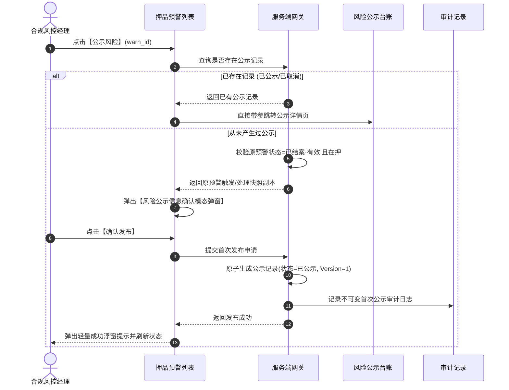

# 风险公示主需求文档 (PRD)

> **版本**：V2.1 | 2026-09-16  
> **读者**：研发工程师、测试工程师、信贷合规经理、风控总监、系统架构师  
> **编写依据**：[风险公示字段清单](./风险公示字段清单.md)、[风险公示业务规则规格](./风险公示业务规则规格.md)、[押品预警信息主PRD](../06-风险信息-押品预警信息/押品预警信息主PRD.md)  
> **真源声明**：本主 PRD 负责业务场景、页面交互布局、用户路径、操作行为与状态机协同。字段标准引自字段清单，底层状态机与校验规则以业务规则规格为唯一真源。所有交互控件术语均已规范汉化。  
> **当前订单范围**：监管订单当前关闭。当前新增、编辑、批量提交和取消公示等写操作仅适用于有效抵押/质押订单；历史监管公示仅支持查询、详情和审计。

---

## 1. 业务背景与业务目标

### 1.1 业务背景
在动产质押与仓储监管业务中，对已核实解除的历史重大风险进行适度、合规的信息公开披露（风险公示），有助于提升质押存货真实性与透明度、满足商业银行与资金方的合规审计要求，并对失信与恶意违约行为形成强有力的司法震慑。  
**风险公示**面向 [02押品预警信息](../06-风险信息-押品预警信息/押品预警信息主PRD.md) 中处于“已结案 · 有效”（已处理有效）的重大抵押/质押押品风险，提供对外信息披露的发布与管理中枢。系统建立**原预警与公示记录完全解耦的独立快照机制**，支持单条入口智能分流（未公示进入确认页、已公示进入详情页）、批量快速公示、多版本状态管理以及**取消公示（R-RISK-MGR 权限约束、固定合规文案提示、200 字说明必填、操作记录只增不改）**。

### 1.2 核心业务目标
1. **合规信息穿透**：向具备权限的资方和银行统一公开披露真实的押品重大违约或违规风险处置结果；
2. **快照安全解耦**：公示侧的展示文案调整或取消公示，绝对不改写原预警现场核查事实与处理材料；
3. **司法证据留痕**：基于私有对象存储（OSS）时效签名保全现场抓拍图，全生命周期操作记录永久归档。

---

## 2. 页面功能说明与交互布局

### 2.1 页面骨架与分区设计

风险公示页面采用典型的 B 端后台管理工作台架构，由三大核心工作区构成：

```
+----------------------------------------------------------------------------------------------------+
| 顶部标题栏：风险公示                                                                                 |
+----------------------------------------------------------------------------------------------------+
| 筛选工作区（支持展开/收起）：                                                                        |
| 预警订单号 [单行文本输入框]  预警类型 [单行文本输入框·模糊匹配]  货主名称 [单行文本输入框]            |
| 公示状态 [下拉单选框 (默认:已公示)]  最近一次公示时间 [日期范围选择器]                                |
| [查询]  [重置]                                                                                     |
+----------------------------------------------------------------------------------------------------+
| 风险公示台账表格工作区（默认展示最新已公示记录）：                                                  |
| 序号 | 预警订单号 | 预警类型 | 公示标题与内容摘要 | 现场抓拍图 | 最近一次公示时间 | 最新操作人 | 状态 | 行操作 |
|  1   | DZY2026.. | 价格下跌 | 抵/质押物价值下跌... | [缩略图]   | 2026-09-...    | 张三(机构) |已公示| [详情] |
|  2   | DZY2026.. | 质押率   | 订单抵/质押率超平... | [缩略图]   | 2026-09-...    | 李四(机构) |已公示| [详情] |
+----------------------------------------------------------------------------------------------------+
| 底部固定栏：分页控件（每页条数选择、总条数统计、页码跳转）                                            |
+----------------------------------------------------------------------------------------------------+
```

### 2.2 核心交互控件规格与操作规范

1. **筛选工作区**：
   - **预警订单号**：单行文本输入框（Input），支持模糊输入，回车触发查询；
   - **预警类型**：单行文本输入框（Input），模糊匹配；默认继承 7 大类枚举快照，但公示确认页允许编辑，故列表筛选用模糊检索而非下拉枚举；
   - **货主名称**：单行文本输入框（Input），支持借款企业名称模糊检索；
   - **公示状态**：下拉单选框（Select），选项：已公示（默认选中）、已取消、全部；
   - **最近一次公示时间**：日期范围选择器，限制最大跨度 1 年；
   - **操作按钮**：主色【查询】按钮、次色【重置】按钮。
2. **表格工作区与行级操作列**：
   - **现场抓拍图**：表格内默认展示占位缩略图，点击弹出全屏大图预览模态弹窗，受 `【现场抓拍图片私有OSS时效签名规则】` 约束；
   - **行级操作按钮**：
     - **【详情】**：常态呈现，点击从右侧滑出详情抽屉面板，展示公示最新内容、原始触发事实、历史版本及全生命周期操作记录；
     - **【取消风险公示】**：在详情抽屉内展示，受 `【取消公示已公示状态与权限强校验规则】(RISK-PUB-C01)` 严格约束。

---

## 3. 核心业务场景与用户旅程

### 场景 1【复合检索与公开公示列表浏览】(PUB-S01)
* **主业务旅程**：合规审计员进入工作台，系统依据 `【公开列表仅展示最新已公示记录规则】(RISK-PUB-ST02)` 默认筛选“公示状态=已公示”，并结合当前用户的订单数据权限，分页呈现对外公开披露的风险事实。

### 场景 2【单条公示分流与首次确认发布】(PUB-S02)
* **主业务旅程**：
  1. 风控经理在 [押品预警信息](../06-风险信息-押品预警信息/押品预警信息主PRD.md) 列表点击某笔已结案流水的【公示风险】；
  2. 系统触发 `【单条入口分流查询与唯一标识关联规则】(RISK-PUB-S01)`，若已存在公示记录直接跳至详情；若从未公示过，系统校验 `【首次公示已结案有效准入阻断规则】(RISK-PUB-S03)`；
  3. 页面居中弹出【风险公示信息确认模态弹窗】，读取原预警快照回填副本；
  4. 经理核对无误后点击【确认发布】；
  5. 系统依据 `【原预警快照解耦复制与独立编辑规则】(RISK-PUB-S04)` 生成独立的公示单据（Version=1），该风险正式进入风险公示列表公开展示。



### 场景 3【批量勾选快速公示流转】(PUB-S03)
* **主业务旅程**：风控专员在押品预警列表勾选多笔已结案且从未公示的流水，点击顶部【批量风险公示】。系统依据 `【批量公示已结案且从未公示四要素准入规则】(RISK-PUB-B01)` 与 `【批量单单独立落库与禁止事实合并规则】(RISK-PUB-B04)`，逐单独立校验并生成公示记录，提交完成后弹出汇总提示：`“成功公示 X 笔，失败 Y 笔”`。

### 场景 4【已公示记录合规取消公示】(PUB-S04)
* **主业务旅程**：
  1. 借款企业恢复履约或证明预警属于误报，风控总监进入公示详情抽屉，点击【取消风险公示】；
  2. 系统校验操作人具备 `R-RISK-MGR` 权限；
  3. 页面弹出二次确认模态弹窗，展示固定合规文案 `【取消公示固定合规二次确认文案规则】(RISK-PUB-C02)`；
  4. 总监在多行文本输入框中录入取消原因（1~200 字，必填）；
  5. 提交成功后，公示状态更新为 `已取消`，系统依据 `【取消成功列表隐藏与详情归档保留规则】(RISK-PUB-C04)` 将其从公示列表中隐藏，但详情与审计日志永久归档保留。

### 场景 5【历史监管公示只读合规归档】(PUB-S05)
* **主业务旅程**：风控人员查询存量监管订单相关的历史公示时，系统仅提供详情查看与历史审计流水追溯，严禁提供任何在线编辑、新增或取消公示的写操作。

---

## 4. 业务规则映射与追溯矩阵

| 规则编码 | 规则业务全称 | 规格章节 | 对应场景 | 交互表现与系统行为 |
| :--- | :--- | :--- | :--- | :--- |
| **RISK-PUB-P01** | 【风险公示功能权限与操作细粒度鉴权规则】 | 业务规则 §3.1 | 全场景 | 无菜单权限直接拦截，取消公示强校验 R-RISK-MGR |
| **RISK-PUB-P02** | 【订单数据权限与租户行级隔离过滤规则】 | 业务规则 §3.1 | PUB-S01 | 列表强制按管辖订单行级隔离，禁止跨租户访问 |
| **RISK-PUB-P03** | 【数据权限失效动态屏蔽与越权阻断规则】 | 业务规则 §3.1 | 全场景 | 权限失效时按钮置灰，禁止通过篡改参数越权 |
| **RISK-PUB-P04** | 【公示Tab查看控制与免选机构免通知规则】 | 业务规则 §3.1 | PUB-S01 | 全行及入驻资方公开展现，不发送短信或通知 |
| **RISK-PUB-P05** | 【服务端二次鉴权与防篡改信任保护规则】 | 业务规则 §3.1 | PUB-S02/S04 | 接口端强校验身份，严禁信任客户端传入的操作人 |
| **RISK-PUB-S01** | 【单条入口分流查询与唯一标识关联规则】 | 业务规则 §3.2 | PUB-S02 | 根据 warn_id 查询记录，自动分流至详情或确认页 |
| **RISK-PUB-S02** | 【已有公示记录直接跳转详情视图规则】 | 业务规则 §3.2 | PUB-S02 | 已存在记录直接进入详情抽屉，展示最新审计日志 |
| **RISK-PUB-S03** | 【首次公示已结案有效准入阻断规则】 | 业务规则 §3.2 | PUB-S02 | 未结案流水阻断进入确认页，弹出警告浮窗提示 |
| **RISK-PUB-S04** | 【原预警快照解耦复制与独立编辑规则】 | 业务规则 §3.2 | PUB-S02 | 读取快照生成独立副本，公示修改不反写原预警 |
| **RISK-PUB-S05** | 【首次发布版本固化与禁止重复创建规则】 | 业务规则 §3.2 | PUB-S02 | 首次提交生成 V1 版本，重复点击绝不创建多余单据 |
| **RISK-PUB-S06** | 【确认取消与提交异常原预警免影响规则】 | 业务规则 §3.2 | PUB-S02 | 弹窗取消或异常报错不产生单据，原预警无变化 |
| **RISK-PUB-B01** | 【批量公示已结案且从未公示四要素准入规则】 | 业务规则 §3.3 | PUB-S03 | 严格过滤已结案且从未产生过公示的记录 |
| **RISK-PUB-B02** | 【已取消记录禁止再次批量公示阻断规则】 | 业务规则 §3.3 | PUB-S03 | 已取消记录永久排除在批量候选之外 |
| **RISK-PUB-B03** | 【批量提交服务端逐条资格强复核规则】 | 业务规则 §3.3 | PUB-S03 | 服务端落库前逐单复核资格，防并发越权 |
| **RISK-PUB-B04** | 【批量单单独立落库与禁止事实合并规则】 | 业务规则 §3.3 | PUB-S03 | 每笔预警独立生成公示单据，绝不合并归档 |
| **RISK-PUB-B05** | 【批量部分失败独立固化与原因回传规则】 | 业务规则 §3.3 | PUB-S03 | 成功单据正常落账，失败单据回传具体报错原因 |
| **RISK-PUB-C01** | 【取消公示已公示状态与权限强校验规则】 | 业务规则 §3.4 | PUB-S04 | 仅已公示状态详情展示取消按钮，已取消行隐藏 |
| **RISK-PUB-C02** | 【取消公示固定合规二次确认文案规则】 | 业务规则 §3.4 | PUB-S04 | 模态弹窗强制展示不可篡改的标准合规文案 |
| **RISK-PUB-C03** | 【取消公示说明必填与字数超限阻断规则】 | 业务规则 §3.4 | PUB-S04 | 说明限制 1~200 字，为空或空格阻断提交 |
| **RISK-PUB-C04** | 【取消成功列表隐藏与详情归档保留规则】 | 业务规则 §3.4 | PUB-S04 | 取消成功后列表立即隐藏，详情与审计永久保留 |
| **RISK-PUB-C05** | 【取消公示绝不改写原预警底层事实规则】 | 业务规则 §3.4 | PUB-S04 | 取消公示不改变原预警结案状态、照片或抓拍图 |
| **RISK-PUB-C06** | 【取消后永久标记已公示过防重复规则】 | 业务规则 §3.4 | PUB-S04 | 标记为已取消，后续点击直接进详情，防重复发布 |
| **RISK-PUB-ST01**| 【公示三态单向演进与不可逆未公示规则】 | 业务规则 §3.5 | 全场景 | 状态机单向演进，产生记录后绝不回到未公示 |
| **RISK-PUB-ST02**| 【公开列表仅展示最新已公示记录规则】 | 业务规则 §3.5 | PUB-S01 | 默认仅展示状态为“已公示”项，已取消记录隐藏 |
| **RISK-PUB-ST03**| 【公示内容取最新发布版本快照规则】 | 业务规则 §3.5 | 全场景 | 严格取最新版本快照，禁止前端拼接原预警数据 |
| **RISK-PUB-ST04**| 【最新操作人服务端认证身份绑定规则】 | 业务规则 §3.5 | 全场景 | 操作人自动取认证上下文，客户端禁止自行传参 |
| **RISK-PUB-ST05**| 【操作审计记录时间倒序只增不改规则】 | 业务规则 §3.5 | 全场景 | 详情操作记录倒序展示，物理只增不改永久留痕 |

---

## 5. 验收标准与测试用例

| 用例编号 | 对应场景 | 关联规则 | 测试输入与前置条件 | 预期输出与验收标准 |
| :---: | :---: | :---: | :--- | :--- |
| **PUB-TC01** | PUB-S02 | RISK-PUB-S01 | 对已取消公示的预警流水点击【公示风险】 | 系统直接打开公示详情抽屉，展示“已取消”状态与取消操作人，不打开首次确认弹窗 |
| **PUB-TC02** | PUB-S02 | RISK-PUB-S04 | 某预警首次公示成功后，仓管员修改该预警核验情况说明 | 风险公示侧公示内容保持不变，快照未被反向篡改 |
| **PUB-TC03** | PUB-S03 | RISK-PUB-B02 | 勾选包含已取消公示记录的列表发起批量公示 | 候选池自动排除已取消项，仅已结案有效且从未公示项成功进入批量提交 |
| **PUB-TC04** | PUB-S04 | RISK-PUB-C03 | 打开取消公示弹窗，取消说明输入全空格字符点击提交 | 模态弹窗拦截提交，多行文本输入框红字提示：`“请输入1~200字的取消公示说明”` |
| **PUB-TC05** | PUB-S04 | RISK-PUB-C01 | 非 R-RISK-MGR 权限角色打开已公示记录详情 | 详情抽屉内不展示【取消风险公示】按钮，杜绝越权撤回公示 |
| **PUB-TC06** | PUB-S04 | RISK-PUB-C04 | 成功提交取消公示（录入 60 字合规原因） | 风险公示列表自动隐藏该记录；在详情抽屉操作记录中，新增一条“取消公示”审计日志 |

---

## 6. 修订记录

| 版本 | 修订日期 | 修订人 | 修订内容 |
| :---: | :---: | :---: | :--- |
| **V1.0** | 2026-08-18 | 产品团队 | 初版发布。 |
| **V1.8** | 2026-08-19 | 产品团队 | 补充原预警解耦机制、单条分流与取消公示 200 字核查。 |
| **V2.0** | 2026-09-11 | 产品团队 | 关闭监管订单当前运营链路，明确历史监管公示只读归档。 |
| **V2.1** | 2026-09-16 | 产品团队 | 场景编号全面升级为自解释语义命名 `场景 N【...】(PUB-Sxx)`；交互控件术语全面汉化；建立与业务规则规格 `(RISK-PUB-P/S/B/C/ST)` 的全量双向追溯表与验收测试矩阵。 |
