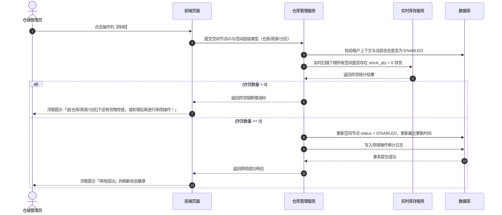
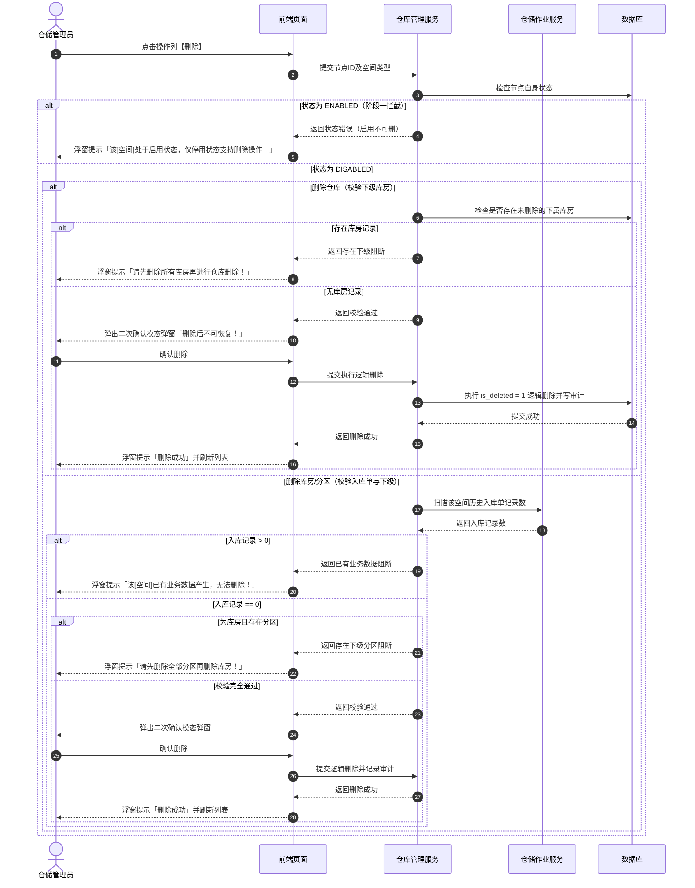

# 仓库管理业务规则规格

> **文档定位**：仓库管理（10-仓库管理-仓库管理）空间三级架构、状态机模型、管理方主体与中仓登资质准入互斥规则、空间节点（仓库/库房/分区）停用存货强校验、两阶段删除控制、出入库审核联动以及下游不可变快照机制的唯一定义真源（SSOT）。  
> **参考文档**：[仓库管理主PRD.md](./仓库管理主PRD.md)、[仓库管理字段清单.md](./仓库管理字段清单.md)  
> **版本**：V2.0 基准版 | 更新时间：2026-09-16 | 责任人：森云科技（Senyun Technology）

---

## 一、模块与空间架构定位

| 项目 | 内容 |
| :--- | :--- |
| **层级定位** | **【基础空间层 - 物理仓储与管理主体主档】**（货-仓-金空间架构底座） |
| **核心职责** | 维护“仓库（1） $\rightarrow$ 库房（N） $\rightarrow$ 分区（N）”三级物理空间架构，绑定仓储管理方主体资质，记录中仓登准入资质与现场附件，管理挂载的设备设施；向仓储作业、实时库存、数字仓单、动产质押与物联监控提供真实空间主档。 |
| **实体映射** | `wms_warehouse`（仓库主表）、`wms_storeroom`（库房表）、`wms_partition`（分区表）、`wms_equipment`（设备设施表）、`wms_zhongcangdeng`（中仓登资质扩展表） |
| **上下游关系** | **上游**：租户中心、组织架构人员中心（监管员/片区经理）； **下游**：入库单/出库单（空间校验与出入库审核）、实时库存（货位绑定）、数字仓单与动产质押（中仓登准入资质与仓库风险评估）、设备管理（摄像头/智能挂锁/门禁物理空间挂载）。 |
| **数据隔离约束** | 所有空间节点与设施必须带 `tenant_id` 强隔离；下辖库房与分区严格依赖上级仓库，禁止孤立节点存在。 |

---

## 二、状态定义与流转模型

### 2.1 状态定义

| 状态维度 | 字段与枚举 (`status`) | 是否允许人工切换 | 含义说明 | 下游影响与生效范围 |
| :--- | :--- | :---: | :--- | :--- |
| **自身状态 (`status`)** | `ENABLED` (启用) `DISABLED` (停用) | 是 | 空间节点当前是否允许接纳新业务单据 | 列表默认展示有效启用数据；停用后下游单据禁止选择该空间节点。 |
| **逻辑删除状态 (`is_deleted`)** | `0` (未删除) `1` (已删除) | 否 | 逻辑删除标记，前台界面全局不可见 | 仅当空间节点处于停用状态且满足无存货、无业务单据及无下级节点强校验时触发；不可物理恢复。 |
| **中仓登准入状态 (`is_zhongcangdeng`)** | `YES` (是) `NO` (否) | 是 | 仓库是否通过中国仓单登记有限责任公司（中仓登）线下资质准入 | 仅企业管理方允许选“是”；控制押品风控准入与中仓登 4 项扩展表单项呈现。 |

### 2.2 状态流转矩阵

| 起始状态 | 触发动作 | 前置校验条件 | 目标状态 | 二次确认与交互组件 | 后置级联影响 | 失败与阻断提示 |
| :--- | :--- | :--- | :--- | :--- | :--- | :--- |
| **未创建** | 新建仓库/库房/分区 | ① 必填项完整 ② 格式校验通过 ③ 同级名称唯一 | `ENABLED` | 新建模态弹窗（Modal） | 默认启用，生成持久化空间 ID 并写入审计日志 | 浮窗提示（Toast）阻断： 「空间名称已存在 / 格式错误」 |
| **启用** | 停用仓库 | 服务端强校验：该仓库下辖所有库房及分区均无“存货中”货物 | `DISABLED` | 确认模态弹窗 | 阻止下游新增业务单据选择该仓库；更新更新时间戳 | 浮窗提示（Toast）阻断： 「该仓库下还有货物存放，请处理后再进行停用操作！」 |
| **启用** | 停用库房 | 服务端强校验：该库房下辖所有分区均无“存货中”货物 | `DISABLED` | 确认模态弹窗 | 阻止下游新增业务单据选择该库房；更新更新时间戳 | 浮窗提示（Toast）阻断： 「该库房下还有货物存放，请处理后再进行停用操作！」 |
| **启用** | 停用分区 | 服务端强校验：该分区无“存货中”货物 | `DISABLED` | 确认模态弹窗 | 阻止下游新增业务单据选择该分区；更新更新时间戳 | 浮窗提示（Toast）阻断： 「该分区下还有货物存放，请处理后再进行停用操作！」 |
| **停用** | 启用仓库/库房/分区 | 具备配置维护或管理员权限 | `ENABLED` | 确认模态弹窗 | 恢复下游业务单据引用选择资格；更新更新时间戳 | 浮窗提示（Toast）： 「操作失败，数据已被修改」 |
| **停用** | 删除仓库 | ① 仓库已停用； ② 该仓库下无任何库房（库房需先全量删除） | `is_deleted = 1` | 风险警告模态弹窗 | 逻辑删除仓库记录；前台全局隐藏；下游历史单据保留快照 | 浮窗提示（Toast）阻断： ① 未停用：「该仓库处于启用状态，仅停用状态支持删除操作！」 ② 有库房：「请先删除所有库房再进行仓库删除！」 |
| **停用** | 删除库房 | ① 库房已停用； ② 无历史入库业务记录； ③ 该库房下无任何分区（分区需先全量删除） | `is_deleted = 1` | 风险警告模态弹窗 | 逻辑删除库房记录；前台全局隐藏 | 浮窗提示（Toast）阻断： ① 未停用：「该库房处于启用状态，仅停用状态支持删除操作！」 ② 有入库：「该库房已有业务数据产生，无法删除！」 ③ 有分区：「请先删除全部分区再删除库房！」 |
| **停用** | 删除分区 | ① 分区已停用； ② 无历史入库业务记录 | `is_deleted = 1` | 风险警告模态弹窗 | 逻辑删除分区记录；前台全局隐藏 | 浮窗提示（Toast）阻断： ① 未停用：「该分区处于启用状态，仅停用状态支持删除操作！」 ② 有入库：「该分区已有业务数据产生，无法删除！」 |

---

## 三、核心业务规则

### 【租户数据严格隔离规则】(WH-F01)
- 仓库、库房、分区、设备设施及中仓登资质主档严格基于 `tenant_id` 物理数据隔离；
- 前端所有查询接口必须由网关层透传认证租户上下文，数据库查询强制注入租户条件，严禁跨租户越权。

### 【三级物理空间架构约束规则】(WH-F02)
- 仓储物理空间严格遵循“仓库（1） $\rightarrow$ 库房（N） $\rightarrow$ 分区（N）”三级树状拓扑关系；
- 分区必须从属于唯一的有效库房，库房必须从属于唯一的有效仓库，严禁创建或迁移产生无上级归属的孤立空间节点。

### 【空间节点逐级名称唯一性规则】(WH-F03)
- 同一租户下，**仓库名称**严格唯一（长度 1~50 字符，前后去空格），编辑时排除自身比对；
- 同一仓库下，**库房名称**严格唯一（长度 1~50 字符）；
- 同一库房下，**分区名称**严格唯一（长度 1~50 字符）；
- 数据库底层在对应租户或父节点外键范围建立组合唯一索引。

### 【管理方主体类型与中仓登互斥规则】(WH-F04)
- 仓库管理方类型分为 `1企业` 与 `2个人`；
- 当管理方类型为 `2个人` 时，系统强制禁止启用中仓登准入（`is_zhongcangdeng` 强制置为“否”且置灰禁用切换）；
- 编辑仓库时，若将管理方由“企业”切换为“个人”，且当前中仓登准入为“是”，后端强行阻断保存并提示必须先关闭中仓登准入。

### 【中仓登准入资质与材料完整性规则】(WH-F05)
- 当“是否中仓登准入仓”选“是”时，以下 4 项资质材料联动变更为**条件必填**，缺一不可提交保存：
  1. `zcd_warehouse_id`（中仓登仓库ID号）：文本输入，由中仓登线下审核提供；
  2. `zcd_map_file`（仓库库区图或库位图）：支持 JPG/PNG/JPEG，大小 $\le 5\text{MB}$，限 1 张；
  3. `zcd_reg_form_pdf`（仓库信息登记表）：仅限 PDF 格式，限 1 份，需完成仓储方与平台方双公章盖章；
  4. `zcd_site_images`（仓库现场图片）：支持 JPG/PNG/JPEG，大小 $\le 5\text{MB}$，最多 8 张。

### 【中仓登状态切换与字段自动清空规则】(WH-F06)
- 当编辑仓库将“是否中仓登准入仓”由“是”切换为“否”并保存时，系统在同一数据库本地事务内自动清空已保存的 4 项中仓登字段数据及对象存储（OSS）关联引用，防止残留脏数据影响风控判断。

### 【仓库停用存货强校验拦截规则】(WH-F07)
- 点击仓库操作列【停用】时，服务端实时查询实时库存中心：
  - 查询条件：`SELECT COUNT(1) FROM wms_inventory WHERE warehouse_id = :warehouseId AND stock_qty > 0`；
  - 若库存数量 $> 0$，立即强阻断停用操作，并以浮窗提示（Toast）呈现标准阻断文案：「该仓库下还有货物存放，请处理后再进行停用操作！」。

### 【库房停用存货强校验拦截规则】(WH-F08)
- 点击库房操作列【停用】时，服务端实时扫描该库房下所有分区的实时在库库存：
  - 查询条件：`SELECT COUNT(1) FROM wms_inventory WHERE storeroom_id = :storeroomId AND stock_qty > 0`；
  - 若库存数量 $> 0$，立即强阻断停用，并以浮窗提示（Toast）呈现标准阻断文案：「该库房下还有货物存放，请处理后再进行停用操作！」。

### 【分区停用存货强校验拦截规则】(WH-F09)
- 点击分区操作列【停用】时，服务端实时扫描该分区的实时在库库存：
  - 查询条件：`SELECT COUNT(1) FROM wms_inventory WHERE partition_id = :partitionId AND stock_qty > 0`；
  - 若库存数量 $> 0$，立即强阻断停用，并以浮窗提示（Toast）呈现标准阻断文案：「该分区下还有货物存放，请处理后再进行停用操作！」。

### 【仓库两阶段安全删除控制规则】(WH-F10)
- **阶段一（自身状态校验）**：若仓库当前处于启用状态，直接阻断删除并提示：「该仓库处于启用状态，仅停用状态支持删除操作！」；
- **阶段二（下级节点校验）**：若仓库已停用，系统检查其下是否存在库房节点（包含启用和停用状态）：
  - 若存在库房记录（计数 $> 0$），强制阻断删除并提示：「请先删除所有库房再进行仓库删除！」；
  - 若库房数量 $= 0$，唤起风险二次确认模态弹窗，确认后执行逻辑删除（`is_deleted = 1`）。

### 【库房两阶段安全删除控制规则】(WH-F11)
- **阶段一（自身状态校验）**：库房处于启用状态直接阻断并提示先停用；
- **阶段二（业务数据与下级校验）**：库房处于停用状态时执行双重校验：
  - 校验入库记录：若历史上产生过仓储入库单明细（`COUNT(wms_inbound_detail) > 0`），强制阻断删除并提示：「该库房已有业务数据产生，无法删除！」；
  - 校验下级分区：若存在下属分区节点（计数 $> 0$），强制阻断删除并提示：「请先删除全部分区再删除库房！」；
  - 双重校验均通过，经用户二次确认后执行逻辑删除（`is_deleted = 1`）。

### 【分区两阶段安全删除控制规则】(WH-F12)
- **阶段一（自身状态校验）**：分区处于启用状态直接阻断并提示先停用；
- **阶段二（业务记录扫描）**：分区处于停用状态时，服务端扫描历史入库单明细：
  - 若历史上产生过仓储入库单明细，强制阻断删除并提示：「该分区已有业务数据产生，无法删除！」；
  - 完全无入库单记录，经二次确认后执行逻辑删除（`is_deleted = 1`）。

### 【库房出入库审核控制联动规则】(WH-F13)
- 库房支持配置【出入库审核】（`inbound_outbound_audit`，枚举：是/否，默认“否”）；
- 当配置为“是”时，下游仓储普通货物出库单与货权转让流程必须强制追加库房出入库审核岗审批节点，未经审批禁止下发电子出库凭证。

### 【设备设施独立维护与快速删除规则】(WH-F14)
- 在仓库详情页【设备设施配置】标签页中维护设施记录（设施名称、数量、单位、有效期）；
- 设备设施仅作仓储现场物理设施档案台账，不与库存强挂钩，删除设施时弹出二次确认模态弹窗确认后直接物理或逻辑删除，不阻断存货。

### 【持久化唯一主键与层级关联规则】(WH-F15)
- 空间层级关联及下游单据引用必须保存持久化全局唯一 ID（`warehouse_id`, `storeroom_id`, `partition_id`），严禁仅凭名称文本做外键关联。

### 【下游业务单据历史快照不可变规则】(WH-F16)
- 仓储作业单据（入库单、出库单、盘点单、移库单）、加工单、数字仓单与质押单在生成时刻，必须冗余固化记录当时的仓库名称、地址、管理方及库房分区名称快照；
- 空间主档后续的任何名称修改、地址微调或停用操作，绝不改写历史单据的存证快照。

### 【并发控制乐观锁与幂等规则】(WH-F17)
- 仓库、库房、分区及设备设施的增删改启停采用基于版本号（`version`）或更新时间戳的乐观锁机制；
- 停用与删除操作部署业务幂等防护，防止多用户并发点击引发脏读与重复操作。

---

## 四、权限与安全规范

### 【角色与数据权限隔离规则】(WH-P01)

| 角色代码 | 角色名称 | 查看仓库列表/详情 | 新建/编辑仓库 | 仓库启用/停用 | 仓库逻辑删除 | 维护库房/分区 | 库房/分区停用与删除 | 维护设备设施 | 数据范围 |
| :--- | :--- | :---: | :---: | :---: | :---: | :---: | :---: | :---: | :--- |
| `R-SYS-ADMIN` | 系统管理员 | ✅ | ✅ | ✅（无存货） | ✅（无库房） | ✅ | ✅（遵从校验） | ✅ | 当前租户全量 |
| `R-RISK-MGR` | 风控管理员 | ✅ | ✅ | ✅（无存货） | ✅（无库房） | ✅ | ✅（遵从校验） | ✅ | 所属机构及下辖仓库 |
| `R-AREA-MGR` | 片区经理 | ✅ | ✅ | ✅（无存货） | ❌ | ✅ | ✅（遵从校验） | ✅ | 个人授权片区仓库 |
| `R-WH-SUPER` | 仓库监管员 | ✅ | ✅ | ✅（无存货） | ❌ | ✅ | ✅（遵从校验） | ✅ | 个人授权管辖仓库 |

- **敏感信息脱敏规范**：统一社会信用代码、身份证号及联系电话，对非管理员角色必须执行掩码脱敏展示（身份证保留前 6 后 4，手机号保留前 3 后 4）。

---

## 五、核心业务时序图

### 1. 空间节点（仓库/库房/分区）停用校验时序

### 2. 空间两阶段删除控制时序

---

## 六、修订记录

| 日期 | 版本 | 变更摘要 | 变更人 |
| :--- | :---: | :--- | :--- |
| 2026-08-11 | V1.0 | 初版仓库管理业务规则口径。 | 产品团队 |
| **2026-09-16** | **V2.0 规范化升级** | 1. 核心三件套真源确立：独立编写本业务规则规格本体，确立 SSOT 地位； 2. 编号语义自解释：全量升级为 `【规则业务名称】(WH-F01~17/P01)` 格式； 3. 交互术语全面汉化：Toast/Modal/Alert 全面汉化为浮窗提示、模态弹窗、风险警告模态弹窗； 4. 强化两阶段删除与存货强拦截逻辑闭环。 | 森云科技规范化升级工作组 |
