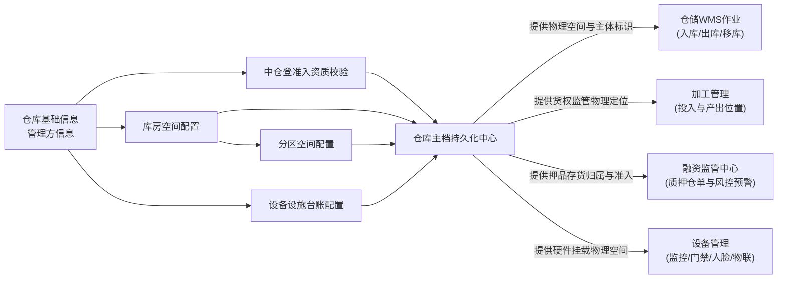

# 仓库管理主PRD

> **模块定位**：基础配置层物理仓储空间与管理主体主档核心入口，维护“仓库（1） $\rightarrow$ 库房（N） $\rightarrow$ 分区（N）”三级物理架构，绑定管理方主体资质、中仓登准入资质与设备设施配置，实现空间节点停用存货强校验与两阶段安全删除闭环。  
> **版本**：V2.0 基准版 | 更新时间：2026-09-16 | 责任人：森云科技（Senyun Technology）  
> **编写依据**：[仓库管理字段清单.md](./仓库管理字段清单.md) 是本模块所有字段编码、格式、枚举与页面展示的唯一定义真源；[仓库管理业务规则规格.md](./仓库管理业务规则规格.md) 是本模块状态机、三级空间约束、两阶段删除与存货强校验的唯一定义来源。

---

## 1. 业务背景

仓库管理是 SYZC 供应链金融存货监管系统的空间与管理主体主档入口，维护“仓库 $\rightarrow$ 库房 $\rightarrow$ 分区”三级空间架构，并记录管理方主体、中国仓单登记有限责任公司（中仓登）准入资质与设备设施配置。

缺少统一且严格闭环的仓库管理会导致：
- **账实悬空风险**：仓库、库房或分区被随意停用或删除，导致在库质押存货失去明确的物理归属；
- **法律合规冲突**：管理方类型或中仓登准入资质随意变更，导致线上质押数据与线下监管备案冲突；
- **追溯链路断裂**：下游单据若仅按名称关联空间，空间同名修改时引发历史追溯数据断裂；
- **物联监控盲区**：摄像头、智能门锁等传感器缺乏明确的空间挂载点，无法实现动静结合的实时风控预警。

本模块通过三级空间树、管理方资质校验、中仓登联动及停用/删除强校验拦截，保障仓储主档严密与货权资金安全。

---

## 2. 功能范围

| 包含功能 (In Scope) | 不包含功能 (Out of Scope) |
| :--- | :--- |
| - 仓库主档的新建、编辑、列表查询、启用/停用与逻辑删除； - 管理方主体类型（企业/个人）、证件号及权属关系规则校验； - 中仓登准入标记与 4 项附件资料联动（准入ID、库区图、登记表PDF、现场图片）； - 库房主档的新建、编辑、出入库审核标记、启用/停用与逻辑删除； - 分区主档的新建、编辑、所属库房关联、启用/停用与逻辑删除； - 仓库详情页设备设施列表的新增、编辑与删除维护； - 仓库/库房/分区停用时“无存货存放”的服务端强校验拦截； - 仓库/库房/分区删除时“两阶段强校验（无存货/无入库记录/无下级节点）”； - 租户数据隔离、数据权限过滤、操作审计日志、并发乐观锁与幂等校验。 | - 仓储作业（入库、出库、移库、盘点）的具体业务单据办理； - 仓储租金、保管费等财务结算与商务合同履约管理； - 中仓登官方应用程序编程接口（API）线上自动联网同步； - 监控、门禁、物联网设备的硬件底层通信协议配置； - 已逻辑删除仓库/库房/分区/设备设施主档的前台恢复功能。 |

---

## 3. 模块定位与系统链路

---

## 4. 业务场景

| 场景序号与编码 | 场景名称 | 场景类型 | 核心业务流程与约束说明 | 关联规则索引 |
| :--- | :--- | :--- | :--- | :--- |
| **场景 1 (WH-S01)** | 【新建与编辑仓库主档】 | 正常主流程 | 录入仓库基础信息与管理方信息，校验同租户名称唯一性、面积数值（>0 且保留 2 位小数）及管理方证件号格式，保存后默认启用。 | 【租户数据严格隔离规则】(WH-F01) 【空间节点逐级名称唯一性规则】(WH-F03) |
| **场景 2 (WH-S02)** | 【中仓登准入配置与材料上传】 | 主流程 | 仅当管理方为“企业”时允许选择准入为“是”，联动展开并强校验中仓登仓库ID号及三项盖章/现场附件。 | 【管理方主体类型与中仓登互斥规则】(WH-F04) 【中仓登准入资质与材料完整性规则】(WH-F05) |
| **场景 3 (WH-S03)** | 【库房与分区空间树配置】 | 主流程 | 仓库下配置库房、库房下配置分区；校验同级名称唯一性，保存持久化唯一主键 ID；配置库房出入库审核开关。 | 【三级物理空间架构约束规则】(WH-F02) 【库房出入库审核控制联动规则】(WH-F13) |
| **场景 4 (WH-S04)** | 【仓库详情设备设施维护】 | 主流程 | 在仓库详情页维护设施名称、数量、单位及有效期，自动绑定当前所在仓库；删除设施确认后直接生效。 | 【设备设施独立维护与快速删除规则】(WH-F14) |
| **场景 5 (WH-S05)** | 【空间节点停用与存货拦截】 | 管控流程 | 仓库、库房或分区在变更停用前，服务端强校验下辖空间是否有“存货中”货物，存在在库货物时强行阻断并浮窗提示。 | 【仓库停用存货强校验拦截规则】(WH-F07) 【库房停用存货强校验拦截规则】(WH-F08) 【分区停用存货强校验拦截规则】(WH-F09) |
| **场景 6 (WH-S06)** | 【空间节点两阶段安全删除】 | 异常拦截/终态流程 | 阶段一校验启用状态（启用直接拦截）；阶段二依次校验是否存在存货、历史入库记录及下级空间节点，完全通过后二次确认逻辑删除。 | 【仓库两阶段安全删除控制规则】(WH-F10) 【库房两阶段安全删除控制规则】(WH-F11) 【分区两阶段安全删除控制规则】(WH-F12) |
| **场景 7 (WH-S07)** | 【个人管理方限制与中仓登互斥】 | 边界控制 | 管理方类型为“个人”时，禁用中仓登准入选项；编辑仓库将管理方切换为个人时，若准入为“是”则直接阻断保存。 | 【管理方主体类型与中仓登互斥规则】(WH-F04) |
| **场景 8 (WH-S08)** | 【中仓登准入切换与数据清空】 | 变更流程 | 准入由“是”切换为“否”并保存时，系统在数据库事务内自动清空已填写的 4 项中仓登字段数据及关联附件。 | 【中仓登状态切换与字段自动清空规则】(WH-F06) |
| **场景 9 (WH-S09)** | 【多用户并发冲突与幂等保护】 | 异常防护 | 多人并发停用、删除或编辑同一空间节点时，基于乐观锁版本号与本地事务锁保障数据最终一致性。 | 【并发控制乐观锁与幂等规则】(WH-F17) |

---

## 5. 状态机与动作能力矩阵

> 状态流转详细规则、前置校验与阻断提示详见 [仓库管理业务规则规格.md §二 状态定义与流转模型](./仓库管理业务规则规格.md#二状态定义与流转模型)。

| 动作名称 | 仓库-启用 | 仓库-停用 | 库房-启用 | 库房-停用 | 分区-启用 | 分区-停用 | 任意-已删除 |
| :--- | :---: | :---: | :---: | :---: | :---: | :---: | :---: |
| **查看列表 / 详情** | ✅ | ✅ | ✅ | ✅ | ✅ | ✅ | ❌ |
| **编辑基本信息** | ✅ | ✅ | ✅ | ✅ | ✅ | ✅ | ❌ |
| **变更中仓登准入** | ✅（企业管理方） | ✅（企业管理方） | — | — | — | — | ❌ |
| **切换管理方为个人** | ✅（非中仓登仓） | ✅（非中仓登仓） | — | — | — | — | ❌ |
| **启用** | ❌ | ✅ | ❌ | ✅ | ❌ | ✅ | ❌ |
| **停用** | ✅（无存货） | ❌ | ✅（无存货） | ❌ | ✅（无存货） | ❌ | ❌ |
| **删除** | ❌ | ✅（无下级库房） | ❌ | ✅（无入库且无分区） | ❌ | ✅（无入库单） | ❌ |
| **下游新建单据引用** | ✅ | ❌ | ✅ | ❌ | ✅ | ❌ | ❌ |
| **维护设备设施** | ✅ | ✅ | — | — | — | — | ❌ |

---

## 6. 页面功能与交互说明

### 6.1 页面布局与骨架
1. **顶部面包屑与标题**：`配置管理 / 仓库管理 / 仓库管理`；
2. **头部操作区**：位于页面右上角，主操作按钮【+ 新增仓库】；
3. **筛选查询区**：
   - 仓库名称：单行文本输入框，支持模糊匹配；
   - 是否中仓登准入仓：下拉单选框，选项：全部 / 是 / 否；
   - 状态：下拉单选框，选项：全部 / 启用 / 停用（已删除数据不返回）；
   - 操作按钮：【查询】与【重置】；
4. **数据表格展示区**：
   - 包含仓库名称（点击下划线文本进入详情页）、管理方名称、是否中仓登准入仓标签、创建人、创建时间、最近更新时间、状态徽章、操作列；
5. **仓库详情页与标签页**：
   - 标签页 1【基础信息】：展示仓库概况、管理方资质与中仓登准入资质；
   - 标签页 2【库房与分区配置】：以树形/级联表格展示库房及下属分区，支持在此直接【+ 新增库房】、【+ 新增分区】；
   - 标签页 3【设备设施配置】：以数据表格形式展示设施台账，支持【+ 新增设施】与行操作【编辑】、【删除】；
6. **交互模态弹窗**：
   - 新增/编辑仓库模态弹窗：包含仓库基础信息、管理方信息、中仓登准入开关与动态资料上传区域；
   - 停用阻断/删除警告模态弹窗：呈现严格的前置校验阻断文案与二次确认。

---

## 7. 核心业务规则索引与追溯表

| 规则编码 | 规则业务名称 | 核心业务口径与约束 | 唯一定义来源 |
| :--- | :--- | :--- | :--- |
| **WH-F01** | 【租户数据严格隔离规则】 | 所有仓库空间数据基于 `tenant_id` 强隔离；接口与数据库强校验 | [业务规则规格 WH-F01](./仓库管理业务规则规格.md#租户数据严格隔离规则wh-f01) |
| **WH-F02** | 【三级物理空间架构约束规则】 | 遵循“仓库（1） $\rightarrow$ 库房（N） $\rightarrow$ 分区（N）”空间树，禁止孤立节点 | [业务规则规格 WH-F02](./仓库管理业务规则规格.md#三级物理空间架构约束规则wh-f02) |
| **WH-F03** | 【空间节点逐级名称唯一性规则】 | 租户内仓库名唯一；同仓内库房名唯一；同库内分区名唯一（1~50 字符） | [业务规则规格 WH-F03](./仓库管理业务规则规格.md#空间节点逐级名称唯一性规则wh-f03) |
| **WH-F04** | 【管理方主体类型与中仓登互斥规则】 | 个人管理方强制禁用中仓登准入；编辑切换为个人时校验中仓登互斥阻断 | [业务规则规格 WH-F04](./仓库管理业务规则规格.md#管理方主体类型与中仓登互斥规则wh-f04) |
| **WH-F05** | 【中仓登准入资质与材料完整性规则】 | 准入选“是”时，中仓登ID、库区图、登记表盖章PDF、现场照片 4 项必传 | [业务规则规格 WH-F05](./仓库管理业务规则规格.md#中仓登准入资质与材料完整性规则wh-f05) |
| **WH-F06** | 【中仓登状态切换与字段自动清空规则】 | 准入由“是”切为“否”时，系统在数据库事务内自动清空 4 项中仓登数据 | [业务规则规格 WH-F06](./仓库管理业务规则规格.md#中仓登状态切换与字段自动清空规则wh-f06) |
| **WH-F07** | 【仓库停用存货强校验拦截规则】 | 停用仓库实时扫描下辖所有空间；存在库存强阻断并浮窗提示 | [业务规则规格 WH-F07](./仓库管理业务规则规格.md#仓库停用存货强校验拦截规则wh-f07) |
| **WH-F08** | 【库房停用存货强校验拦截规则】 | 停用库房实时扫描下辖所有分区；存在库存强阻断并浮窗提示 | [业务规则规格 WH-F08](./仓库管理业务规则规格.md#库房停用存货强校验拦截规则wh-f08) |
| **WH-F09** | 【分区停用存货强校验拦截规则】 | 停用分区实时扫描在库库存；存在库存强阻断并浮窗提示 | [业务规则规格 WH-F09](./仓库管理业务规则规格.md#分区停用存货强校验拦截规则wh-f09) |
| **WH-F10** | 【仓库两阶段安全删除控制规则】 | 阶段一启用拦截；阶段二存在库房强拦截；无库房二次确认逻辑删除 | [业务规则规格 WH-F10](./仓库管理业务规则规格.md#仓库两阶段安全删除控制规则wh-f10) |
| **WH-F11** | 【库房两阶段安全删除控制规则】 | 阶段一启用拦截；阶段二有入库记录或有下辖分区拦截；无记录无分区允许删除 | [业务规则规格 WH-F11](./仓库管理业务规则规格.md#库房两阶段安全删除控制规则wh-f11) |
| **WH-F12** | 【分区两阶段安全删除控制规则】 | 阶段一启用拦截；阶段二有历史入库记录强拦截；无入库记录允许删除 | [业务规则规格 WH-F12](./仓库管理业务规则规格.md#分区两阶段安全删除控制规则wh-f12) |
| **WH-F13** | 【库房出入库审核控制联动规则】 | 库房出入库审核为“是”时，普通货物出库和转让流程强制增加入库审核岗审批 | [业务规则规格 WH-F13](./仓库管理业务规则规格.md#库房出入库审核控制联动规则wh-f13) |
| **WH-F14** | 【设备设施独立维护与快速删除规则】 | 详情页独立配置设施台账；删除设施二次确认后直接删除，不阻断存货 | [业务规则规格 WH-F14](./仓库管理业务规则规格.md#设备设施独立维护与快速删除规则wh-f14) |
| **WH-F15** | 【持久化唯一主键与层级关联规则】 | 空间层级关联与下游单据引用必须使用全局唯一 ID，严禁以名称关联 | [业务规则规格 WH-F15](./仓库管理业务规则规格.md#持久化唯一主键与层级关联规则wh-f15) |
| **WH-F16** | 【下游业务单据历史快照不可变规则】 | 业务单据生成时固化空间名称及地址快照；主档变更不回写历史存证 | [业务规则规格 WH-F16](./仓库管理业务规则规格.md#下游业务单据历史快照不可变规则wh-f16) |
| **WH-F17** | 【并发控制乐观锁与幂等规则】 | 增删改启停采用版本号（`version`）乐观锁；防止多用户并发冲突 | [业务规则规格 WH-F17](./仓库管理业务规则规格.md#并发控制乐观锁与幂等规则wh-f17) |
| **WH-P01** | 【角色与数据权限隔离规则】 | 严格区分系统管理员、风控管理员、片区经理与监管员权限；敏感信息脱敏 | [业务规则规格 WH-P01](./仓库管理业务规则规格.md#角色与数据权限隔离规则wh-p01) |

---

## 8. 权限与风控约束

- **数据隔离**：基于 `tenant_id` 强隔离；
- **操作权限**：系统管理员与风控管理员具备仓库全量管理与删除权限；片区经理与监管员仅具备授权管辖仓库的查看、编辑与启停权限（无仓库删除权限）；
- **信息脱敏**：统一社会信用代码、身份证号及联系电话，对普通权限角色进行前后掩码脱敏。

---

## 9. 异常边界处理

- **并发修改冲突保护**：两人同时编辑同一仓库或切换启停状态，后提交者被拦截并提示「数据已被他人修改，请刷新后重试」；
- **网络抖动防重**：采用客户端唯一流水号，网络超时重试时由服务端实现幂等响应；
- **非法格式强拦截**：仓库面积 $\le 0$ 或小数位数 $> 2$，前端输入阻断，服务端接收强校验抛出异常。

---

## 10. 验收用例与测试标准

| 验收用例编码 | 验收项业务名称 | 前置条件与测试步骤 | 预期结果与阻断交互 |
| :--- | :--- | :--- | :--- |
| **WH-V01** | 【仓库同租户重名拦截测试】 | 在新建模态弹窗中录入当前租户已存在的仓库名称尝试保存 | 保存失败，浮窗提示（Toast）告知「仓库名称已存在，请重新输入」 |
| **WH-V02** | 【个人管理方中仓登互斥测试】 | 管理方类型选择“个人”，观察中仓登准入控件状态 | 中仓登选项强制为“否”且置灰禁用切换，鼠标悬浮显示互斥提示 |
| **WH-V03** | 【中仓登准入材料必传校验测试】 | 选择中仓登准入为“是”，未上传信息登记表 PDF 直接点击保存 | 保存失败，表单定位至未传附件并标红提示「请上传盖章登记表」 |
| **WH-V04** | 【仓库停用存货强阻断测试】 | 仓库下辖任一分区存在库存大于 0 的货物，在列表中点击【停用】 | 阻断操作，浮窗提示（Toast）告知「该仓库下还有货物存放，请处理后再进行停用操作！」 |
| **WH-V05** | 【库房停用存货强阻断测试】 | 库房下辖分区存在库存货物，点击库房操作列【停用】 | 阻断操作，浮窗提示（Toast）告知「该库房下还有货物存放，请处理后再进行停用操作！」 |
| **WH-V06** | 【仓库启用状态删除拦截测试】 | 对处于启用状态的仓库直接点击行操作【删除】 | 阶段一阻断，浮窗提示「该仓库处于启用状态，仅停用状态支持删除操作！」 |
| **WH-V07** | 【仓库存在库房删除拦截测试】 | 仓库已停用，但其下仍包含未删除的库房记录，点击【删除】 | 阶段二阻断，浮窗提示「请先删除所有库房再进行仓库删除！」 |
| **WH-V08** | 【库房存在入库单删除拦截测试】 | 库房已停用，但历史上产生过入库单明细记录，点击【删除】 | 阶段二阻断，浮窗提示「该库房已有业务数据产生，无法删除！」 |
| **WH-V09** | 【分区存在入库单删除拦截测试】 | 分区已停用，但历史上产生过入库单记录，点击【删除】 | 阶段二阻断，浮窗提示「该分区已有业务数据产生，无法删除！」 |
| **WH-V10** | 【无入库数据分区删除成功测试】 | 分区已停用且从未产生入库单记录，点击【删除】并二次确认 | 执行逻辑删除成功，浮窗提示「删除成功」，列表不再展示 |

---

## 修订记录

| 日期 | 版本 | 变更摘要 | 变更人 |
| :--- | :---: | :--- | :--- |
| 2026-08-11 | V1.0 | 初版仓库管理主 PRD | 产品团队 |
| **2026-09-16** | **V2.0 规范化升级** | 1. 编号语义自解释：场景统一命名为 `场景 N【业务场景名称】(WH-S01~S09)`，用例命名为 `【用例业务名称】(WH-V01~V10)`； 2. 交互术语全面汉化：Toast/Modal/Tab 等裸英文全面汉化为浮窗提示、模态弹窗、标签页； 3. 强化三件套真源强对齐：业务规则全面映射《仓库管理业务规则规格.md》与《仓库管理字段清单.md》。 | 森云科技规范化升级工作组 |
