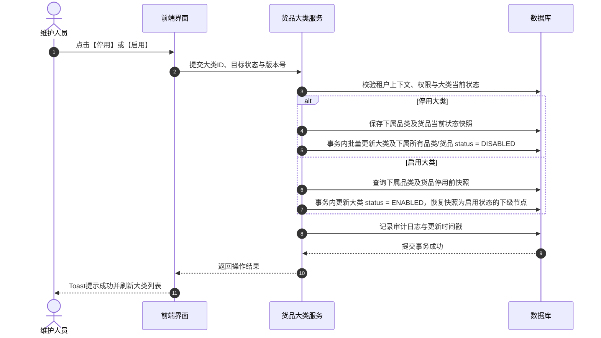
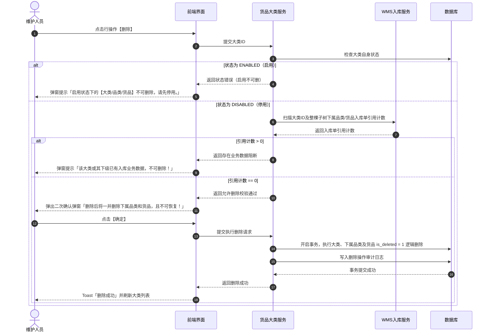

# 大类管理 业务规则规格

> **文档定位**：货品大类（12-货品规格管理-大类管理）状态机、动作约束、父子级联规则、入库强校验、删除两阶段控制及并发幂等规则的唯一定义来源。  
> **参考文档**：[大类管理主PRD.md](./大类管理主PRD.md)、[大类管理字段清单.md](./大类管理字段清单.md)  
> **版本**：V2.0 | 更新时间：2026-09-02 | 责任人：森云科技（Senyun Technology）

---

## 一、模块与单据定位

| 项目 | 内容 |
| :--- | :--- |
| **层级定位** | **【第1层-大类主档】**（货品规格管理顶层分类节点） |
| **核心职责** | 维护大宗存货与货品的基础大类（如：黑色金属、有色金属、农产品、化工品、建材等），作为品类和货品归集顶层实体；管控全树启停与删除边界。 |
| **实体映射** | `sys_goods_category`（大类实体表） |
| **上下游关系** | **上游**：租户体系、权限中心； **下游**：品类管理（1:N 映射）、货品管理（1:N 继承）、入库单与质押品风控大类分类。 |
| **数据约束** | 同一租户下，大类名称唯一；租户间数据物理隔离。 |

---

## 二、状态定义与计算

| 状态名称 | 字段与枚举 (`status`) | 是否可直接修改 | 含义说明 | 影响范围 |
| :--- | :--- | :---: | :--- | :--- |
| **启用** | `ENABLED` | 是 | 大类当前处于正常可用状态 | 允许下级新增品类、货品，下级计算有效状态时满足父级启用条件 |
| **停用** | `DISABLED` | 是 | 大类当前处于停用管控状态 | 级联停用所有下属品类和货品；下游新增业务单据禁止选择该大类及下属货品；历史数据保留 |
| **已删除** | `is_deleted = 1` | 否 | 逻辑删除标记，前台不可见 | 仅停用且整棵子树无入库单时允许触发；不可物理恢复 |

---

## 三、状态流转表（核心规则矩阵）

| 当前状态 | 触发动作 | 前置校验条件 | 结果状态 | 二次确认弹窗 | 后置级联影响 | 失败阻断提示 (Toast/Modal) |
| :--- | :--- | :--- | :--- | :--- | :--- | :--- |
| 未创建 | 新建保存 | ① 大类名称必填（≤20字） ② 租户内大类名称唯一 | 启用 | 无 | 自动留痕创建人、创建时间，生成大类记录 | Toast: 「大类名称已存在，请重新输入」 |
| 启用/停用 | 编辑保存 | ① 大类名称必填且租户内唯一 ② **入库数据强校验**：整棵子树无入库单数据 | 保持原状态 | 无 | 更新大类名称、更新时间戳 | 弹窗阻断: 「该大类已有业务数据产生，不可编辑！」 |
| 启用 | 停用 | 具备配置维护/管理员权限 | 停用 | 弹窗: 「停用后后续新增品类无法选择，但历史已产生数据不受影响」 | ① 当前大类置为停用 ② **保存下级当前状态快照** ③ 事务内级联停用该大类下所有品类和货品 ④ 更新更新时间 | Toast: 「停用失败，请稍后重试」 |
| 停用 | 启用 | 具备配置维护/管理员权限 | 启用 | 无（或标准确认） | ① 当前大类置为启用 ② **按快照恢复下级状态**：仅恢复停用前处于“启用”的品类与货品，不得强制激活原本处于“停用”的下级 ③ 更新更新时间 | Toast: 「启用失败，请稍后重试」 |
| 启用 | 删除 | 无 | 阻断 | 弹窗提示 | 不允许操作，大类保持启用 | 弹窗阻断: 「启用状态下的【大类/品类/货品】不可删除，请先停用。」 |
| 停用 | 删除 | **子树无入库单强校验**：扫描大类及全部下属品类、货品，均不存在入库单数据 | 已删除 (`is_deleted=1`) | 弹窗: 「删除后将一并删除下属品类和货品，且不可恢复！」 | 事务内将该大类及整棵子树的品类、货品全部执行逻辑删除，前台列表与选择器不再可见 | 弹窗阻断: 「该大类或其下级已有入库业务数据，不可删除！」 |

---

## 四、核心业务规则（R01 ~ R06）

### R-CAT-01：租户隔离与名称唯一性
- 大类名称长度限制在 1~20 个字符，去除首尾空格；
- 同一租户下大类名称严格唯一（不区分大小写比较）；不同租户间互不干扰。
- 数据库底层必须建立 `(tenant_id, category_name, is_deleted)` 唯一索引兜底。

### R-CAT-02：父级停用级联下发规则
- 当大类执行停用操作时，系统后台必须在开启事务的同时，生成该大类下属品类和货品的**当前自身状态快照**；
- 级联将该大类及其下所有品类、货品的状态批量更新为 `DISABLED`；
- 必须保证事务一致性，若其中任一子节点更新失败，整体事务回滚，禁止出现“父级停用而部分子级仍为启用”的不一致状态。

### R-CAT-03：父级启用快照恢复规则
- 当停用的大类被重新启用时，系统不得盲目将所有子级置为启用；
- 系统必须读取停用时保存的状态快照，仅将原本处于启用状态的品类和货品恢复为启用；原本主动停用的品类或货品继续保持停用状态。

### R-CAT-04：编辑操作入库单拦截规则
- 编辑大类名称时，服务端必须实时执行入库单数据扫描：
  - 查询条件：`SELECT COUNT(1) FROM wms_inbound_order_detail WHERE category_id = :categoryId AND is_deleted = 0`；
  - 若计数 $> 0$，立即阻断保存并返回特定业务拦截码，前端唤起统一阻断弹窗；
  - 严禁仅依赖前端缓存状态进行判断。

### R-CAT-05：删除两阶段强校验与级联逻辑删除
- **阶段一（状态校验）**：大类状态为 `ENABLED` 时直接拦截，必须先停用；
- **阶段二（入库单扫描）**：大类状态为 `DISABLED` 时，系统扫描整棵子树（大类、品类、货品）是否被任何已提交或草稿状态的入库单引用：
  - 若存在任何入库数据，强阻断删除；
  - 若完全无入库数据，经用户二次确认后，在同一事务内对该大类、下属所有品类、下属所有货品执行逻辑删除更新（`is_deleted = 1`）。
- 系统当前不支持逻辑删除恢复，需在提示中向用户明确说明。

### R-CAT-06：并发控制与幂等性
- 大类的新建、编辑、启停、删除均需采用乐观锁机制（基于 `version` 字段或更新时间戳 `updated_at`）；
- 若两人同时操作导致版本冲突，后提交者请求被拒绝并提示「数据已被他人修改，请刷新后重试」；
- 重复提交的相同请求通过幂等校验机制保障不重复写日志和状态。

---

## 五、权限与风控约束

| 角色 | 查看大类列表 | 新建/编辑大类 | 启用/停用大类 | 删除大类 | 数据范围 |
| :--- | :---: | :---: | :---: | :---: | :--- |
| **系统管理员** | ✅ | ✅ | ✅ | ✅ | 当前租户全量 |
| **配置维护人员** | ✅ | ✅ | ✅ | ✅ | 当前租户全量 |
| **风控管理人员** | ✅ | ❌ | ❌ | ❌ | 当前租户全量（只读） |
| **业务人员/只读用户** | ✅ | ❌ | ❌ | ❌ | 当前租户全量（只读） |

- **接口安全**：所有服务端接口必须强校验租户上下文，禁止任何跨租户越权查询与修改。

---

## 六、核心业务流程图

```mermaid
flowchart TD
    Start([用户操作大类管理]) --> OpType{操作类型}

    %% 1. 新建大类分支
    OpType -- 新建大类 --> InputCat[输入大类名称]
    InputCat --> CheckName{租户内名称唯一?}
    CheckName -- 重名 --> ToastErr1[Toast: 大类名称已存在，请重新输入] --> InputCat
    CheckName -- 唯一 --> SaveCat[保存大类主档<br/>状态默认：启用] --> End([完成])

    %% 2. 编辑大类分支
    OpType -- 编辑大类 --> CheckInboundEdit{后台扫描子树<br/>是否存在入库单?}
    CheckInboundEdit -- 存在入库单 --> ModalBlockEdit[弹出阻断弹窗<br/>该大类已有业务数据产生，不可编辑！] --> End
    CheckInboundEdit -- 无入库单 --> EditCatName[输入新名称并校验唯一性]
    EditCatName --> SaveEdit[更新大类信息并留痕] --> End

    %% 3. 启停用大类分支
    OpType -- 启用/停用大类 --> StatusJudge{当前大类状态}
    StatusJudge -- 当前为启用 --> ConfirmDisable[弹出停用确认提示]
    ConfirmDisable --> DoDisable[保存下级状态快照<br/>事务内级联停用大类及全部品类/货品] --> End
    StatusJudge -- 当前为停用 --> ConfirmEnable[确认启用大类]
    ConfirmEnable --> DoEnable[大类置为启用<br/>按快照级联恢复原启用下级节点] --> End

    %% 4. 删除大类分支
    OpType -- 删除大类 --> Phase1{阶段一: 自身状态校验}
    Phase1 -- 状态为启用 --> BlockEnableDel[弹出提示弹窗<br/>启用状态下的【大类/品类/货品】不可删除，请先停用。] --> End
    Phase1 -- 状态为停用 --> Phase2{阶段二: 后台扫描整棵子树<br/>是否存在入库单?}
    Phase2 -- 存在入库单 --> BlockInboundDel[弹出拦截弹窗<br/>该大类或其下级已有入库业务数据，不可删除！] --> End
    Phase2 -- 无入库单 --> ConfirmDelModal[弹出二次确认删除弹窗<br/>删除后将一并删除下属品类和货品，且不可恢复！]
    ConfirmDelModal -- 点击取消 --> End
    ConfirmDelModal -- 点击确定 --> CascadeDel[事务内执行逻辑删除 is_deleted=1<br/>大类及下属品类货品全部移除] --> End
```

---

## 七、操作时序图

### 1. 大类状态级联启停时序

### 2. 大类两阶段删除时序

---

## 八、修订记录

| 日期 | 版本 | 变更摘要 | 变更人 |
| :--- | :---: | :--- | :--- |
| 2026-08-14 | V1.0 | 初版大类管理业务规则规格 | 产品团队 |
| 2026-09-02 | **V2.0** | **V3.0 标杆架构基准版**：规范状态机、两阶段删除流程图与时序图，作为全模块规则唯一数据源 | AI PM / 森云科技 |
